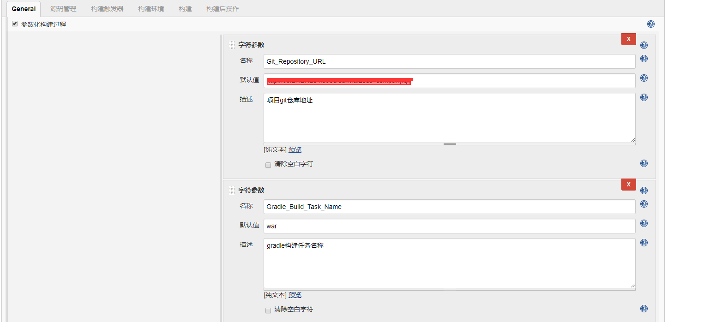
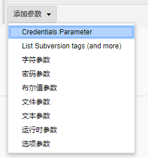

在构建任务中配置

可以设置多个参数项，并且支持不同参数类型：

每个配置好的参数，在下面的构建任务中，都可以通过 `$参数名` 来直接引用参数值，如 `$War_Name` 就表示的是 sunvua-zeus-company-1.0.war

参数化构建的灵活之处在于，在构建项目之前，所有参数都会列出，可以临时更改，这样便能实现构建任务的最大灵活度，后期可以直接copy任务，在构建时动态修改参数值即可：

