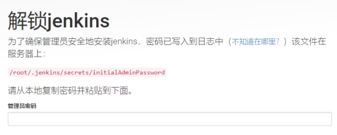

[TOC]


# 1 安装

```
sudo wget -O /etc/yum.repos.d/jenkins.repo https://pkg.jenkins.io/redhat-stable/jenkins.repo 
sudo rpm --import https://pkg.jenkins.io/redhat-stable/jenkins.io.key 
yum install jenkins
```

安装后可以在 /usr/lib/jenkins 目录中找到jenkins.war。


# 2 启动

Jenkins可以直接通过命令启动war包，也可以挂载在tomcat等容器中启动，此处使用tomcat容器启动（这里直接将其解压到tomcat的ROOT目录中，因为我打算将这个tomcat只用于部署jenkins，所以放到了ROOT中）。

```
unzip /usr/lib/jenkins/jenkins.war -d /opt/tomcat-8/webapps/ROOT   #解压war包到tomcat目录中 
/opt/tomcat-8/bin/startup.sh	                                   #启动tomcat
```


# 3 访问jenkins

打开浏览器，访问tomcat端口，出现jenkins初始化界面


# 4 解锁jenkins



Jenkins初次安装默认会在/root目录下生成.jenkins文件夹，用于存放所有jenkins配置信息。

可以通过下面的命令查看密码：

```
cat /root/.jenkins/secrets/initialAdminPassword
```


由于linux默认会将以`.`开头的目录视为隐藏目录，所以在使用ftp工具查看jenkins配置文件目录时，是不能显示`.jenkins`文件夹的，所以建议在首次启动jenkins之前，设置一个自定义的jenkins配置文件目录：

可以通过配置环境变量来实现：

```
vi /etc/profile                                    # 修改环境配置文件 
# 添加 export JENKINS_HOME=/opt/jenkins 到文件结尾 
source /etc/profile                                # 设置立即生效
```

然后启动jenkins，便能够在/opt/jenkins中找到所有配置信息及构建文件、日志、插件等。