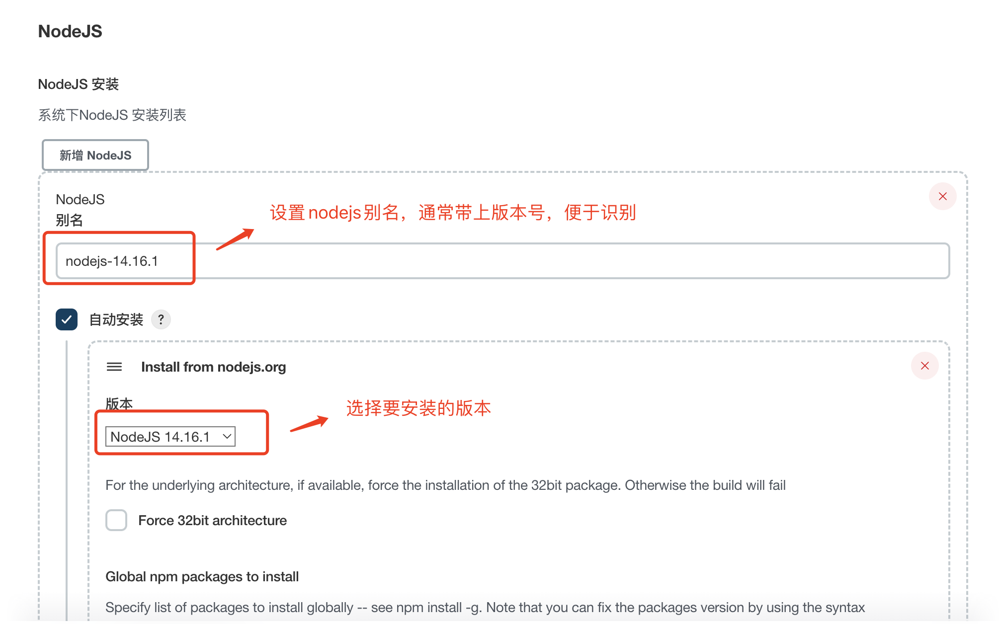
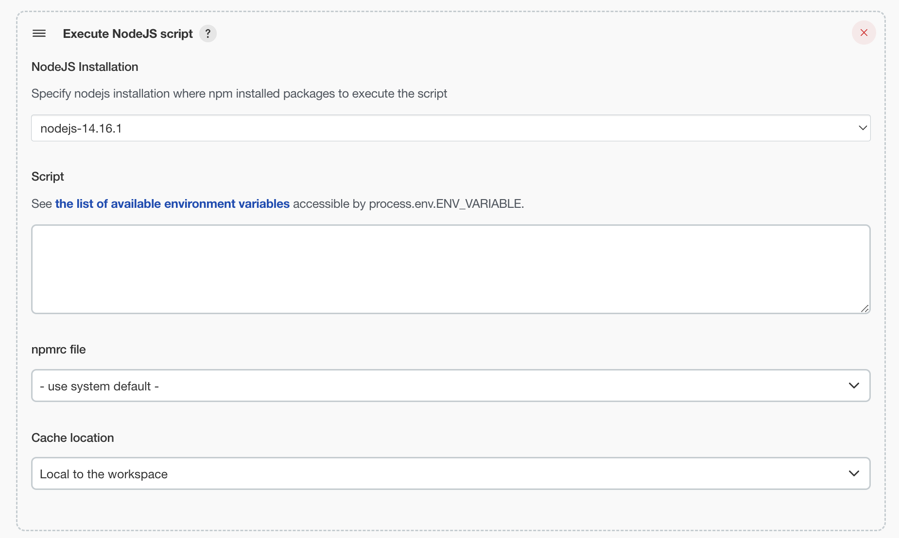
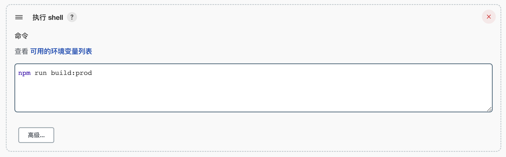
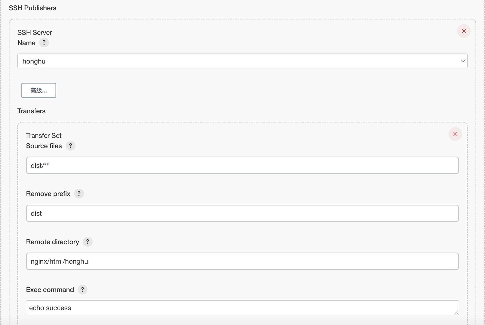

[TOC]

# 1 安装NodeJS

在“系统管理 - 全局工具配置”中安装NodeJS

# 2 添加NodeJS构建步骤

进入构建任务的配置页面，添加 **Execute NodeJS script** 构建步骤

# 3 添加shell命令进行打包

添加shell命令，对应用进行打包

# 4 上传应用包到服务器

添加 ssh 上传任务，将打包后的应用文件上传至服务器

