[TOC]


# 1 注册 sonatype 账号 

注册地址：https://issues.sonatype.org/secure/Signup!default.jspa

注意：邮箱一定要填写正确，因为后续issue有任何变动都会通过邮件来通知。


# 2 创建 sonatype issue

① 打开 https://issues.sonatype.org/，登录第1步中注册好的账号

② 点击导航栏中的“新建”按钮来创建issue


③ 填写表单

- Project

  选择【Community Support - Open Source Project Repository Hosting (OSSRH)】

- Issue Type

  选择【New Project】

- Summary

  自己填，要用英文，一般写要发布的项目名称即可。

- Description

  自己填，要用英文。

- Group Id

  如果使用 github 或者 gitee，那么格式为 `com.github.用户名`  或者 `com.gitee.用户名`  。

  如果有自己的域名和项目地址也可以，官方人员会询问你是否有这个域名的所有权。

  在你项目的pom里一定要使用这个Group Id，最好包路径也使用。

- Project URL
  项目地址

- SCM url
  项目git地址

- Username(s)
  可以不用填,这是能辅助你提交项目的合作人的帐号,前提是他也得在这个Jira注册


下面是我使用gitee项目bedrock-snmp来创建issue填写的表单，仅作参考：

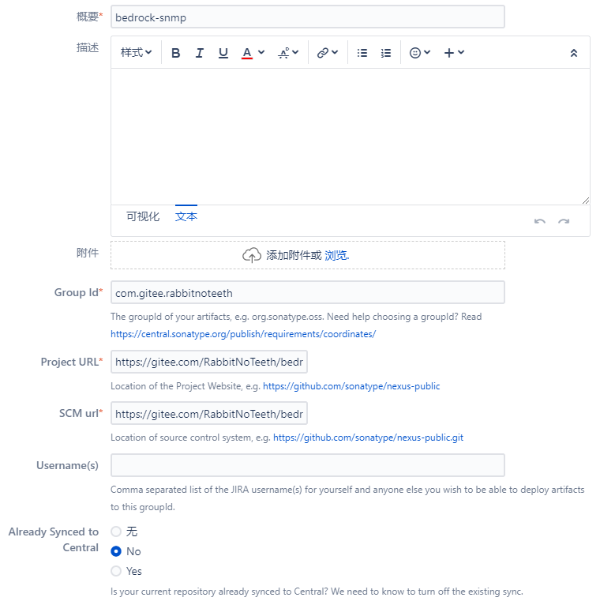


④ issue 创建成功后，找到新创建的issue并进入

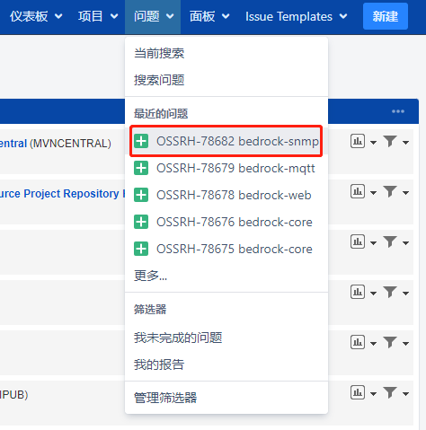

进入issue后，发现当前issue处于开放状态，等待管理员处理

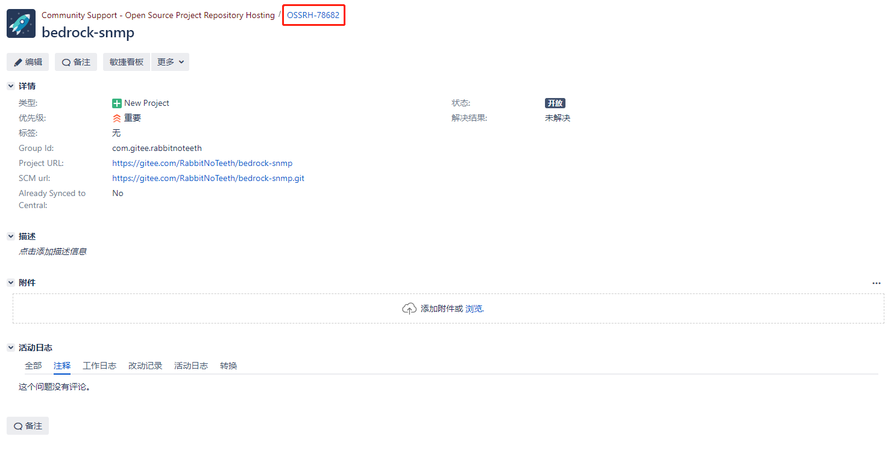

注意上图中红色圈出的【OSSRH-78682】，这个是issue的ID，如果通过github或者gitee来申请，那么需要在github或者gitee上创建名称为 OSSRH-78682 的项目，并且保证项目为public公开状态，以便管理员确认提交issue的用户是否具有对应github或者gitee账号的管理权限。

⑤ 等待一段时间，一般在一小时以内，管理员验证完后，在issue下将收到如下回复（邮件会通知），说明申请成功。

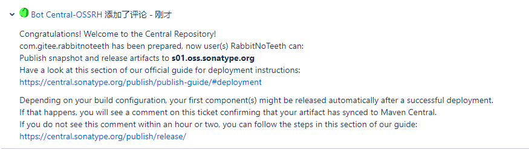


# 3 生成密钥对

① 下载安装 [Gpg4win](https://www.gpg4win.org/download.html) （非windows用户请在 [GunPG](https://www.gnupg.org/) 官网下载自己操作系统对应的程序）。

② 打开命令行

- 生成密钥对

  ```
  $ gpg --gen-key
  ```

  根据提示输入 Real name（用户名） 和 Email address（邮箱），然后输入两次 Passphase（密钥库密码），这个一定要保存起来，后面会用到。

- 查看公钥

  ```
  $ gpg --list-keys
  pub   ed25519 2022-03-03 [SC] [expires: 2024-03-03]
        3F97A47E90BCEA6059B9281D8B125471433FD829
  uid           [ultimate] local <RabbitNoTeeth@163.com>
  sub   cv25519 2022-03-03 [E] [expires: 2024-03-03]
  ```

  3F97A47E90BCEA6059B9281D8B125471433FD829 就是公钥的指纹。

- 将公钥发布到PGP密钥服务器

  ```
  $ gpg --keyserver hkp://keyserver.ubuntu.com/ --send-keys 3F97A47E90BCEA6059B9281D8B125471433FD829 
  ```


**注意：**

上面的操作是针对第一次发布jar到maven中央仓库，如果已经发布过，但是更换了电脑，那么是不需要重新生成密钥对的，只需要从PGP密钥服务器下载即可，具体操作如下：

① 打开浏览器，进入PGP密钥服务器 http://keyserver.ubuntu.com/

② 通过名称搜索之前创建的密钥对，如我的密钥对名称为 RabbitNoTeeth

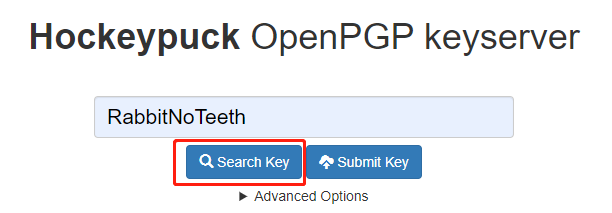


搜索结果如下：

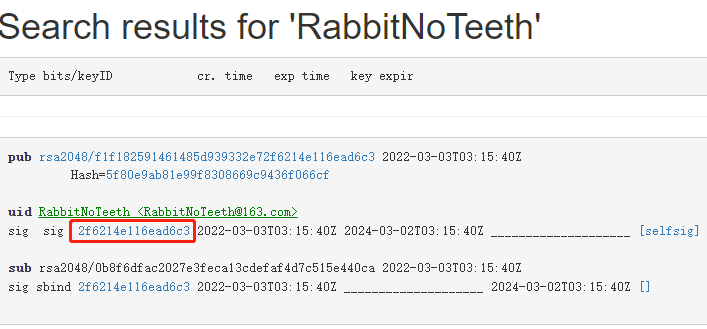

注意上图中红色圈出的【2f6214e116ead6c3】，需要用这个来下载密钥。

③ 打开命令行，执行命令

```
$ gpg --keyserver hkp://keyserver.ubuntu.com/ --recv-keys 2f6214e116ead6c3
```

④ 密钥对下载完成后，可以打开 Kleopatra 软件查看（该软件就是在安装 Gpg4win 时安装的），可以看到，密钥状态为未认证

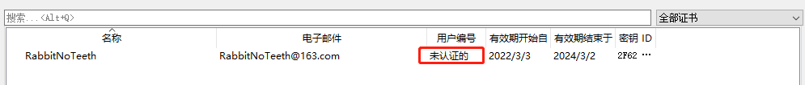

双击打开该密钥，点击认证按钮

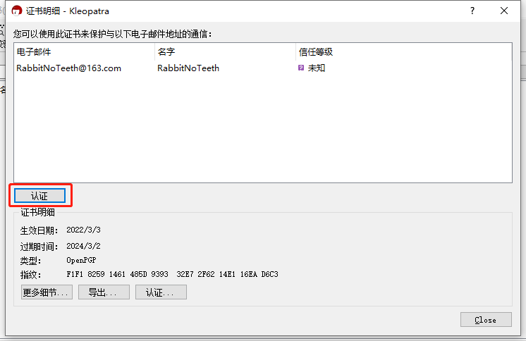

创建一个新的证书来进行认证，选择【是】

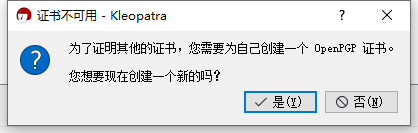

按照指引创建新证书，然后进行认证

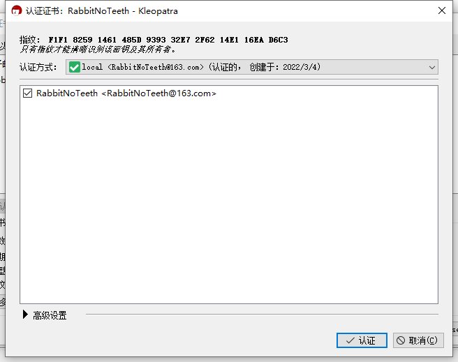

认证成功后，密钥状态为【认证的】

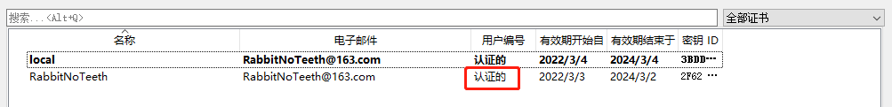


# 4 修改 maven 配置文件

打开文件 `maven安装目录/conf/settings.xml`，在标签 `<servers>...</servers>` 中添加

```xml
<server>
      <id>ossrh</id>
      <username>sonatype用户名</username>
      <password>sonatype密码</password>
</server>
```


# 5 修改项目 pom.xml 文件

```xml
<?xml version="1.0" encoding="UTF-8"?>
<project xmlns="http://maven.apache.org/POM/4.0.0"
         xmlns:xsi="http://www.w3.org/2001/XMLSchema-instance"
         xsi:schemaLocation="http://maven.apache.org/POM/4.0.0 http://maven.apache.org/xsd/maven-4.0.0.xsd">
    <modelVersion>4.0.0</modelVersion>
    <packaging>jar</packaging>

    <groupId>com.gitee.rabbitnoteeth</groupId>
    <artifactId>bedrock-snmp</artifactId>
    <version>0.0.1</version>

    <name>bedrock-snmp</name>
    <description>the snmp module for the bedrock(toolkit for quick development)</description>
    <url>https://gitee.com/RabbitNoTeeth/bedrock-snmp</url>

    <licenses>
        <license>
            <name>The Apache Software License, Version 2.0</name>
            <url>http://www.apache.org/licenses/LICENSE-2.0.txt</url>
        </license>
    </licenses>

    <developers>
        <developer>
            <name>RabbitNoTeeth</name>
            <email>RabbitNoTeeth@163.com</email>
        </developer>
    </developers>

    <scm>
        <connection>scm:git:git@gitee.com:RabbitNoTeeth/bedrock-snmp.git</connection>
        <developerConnection>scm:git:git@gitee.com:RabbitNoTeeth/bedrock-snmp.git</developerConnection>
        <url>git@gitee.com:RabbitNoTeeth/bedrock-snmp.git</url>
    </scm>

    <distributionManagement>
        <snapshotRepository>
            <id>ossrh</id>
            <url>https://s01.oss.sonatype.org/content/repositories/snapshots</url>
        </snapshotRepository>
        <repository>
            <id>ossrh</id>
            <url>https://s01.oss.sonatype.org/service/local/staging/deploy/maven2/</url>
        </repository>
    </distributionManagement>

    <properties>
        <java.version>11</java.version>
        <snmp4j.version>2.8.8</snmp4j.version>
    </properties>

    <dependencies>
        <dependency>
            <groupId>org.snmp4j</groupId>
            <artifactId>snmp4j</artifactId>
            <version>${snmp4j.version}</version>
        </dependency>
    </dependencies>

    <build>
        <plugins>
            <plugin>
                <groupId>org.sonatype.plugins</groupId>
                <artifactId>nexus-staging-maven-plugin</artifactId>
                <version>1.6.7</version>
                <extensions>true</extensions>
                <configuration>
                    <serverId>ossrh</serverId>
                    <nexusUrl>https://s01.oss.sonatype.org/</nexusUrl>
                    <autoReleaseAfterClose>true</autoReleaseAfterClose>
                </configuration>
            </plugin>
            <plugin>
                <groupId>org.apache.maven.plugins</groupId>
                <artifactId>maven-gpg-plugin</artifactId>
                <version>1.5</version>
                <executions>
                    <execution>
                        <id>sign-artifacts</id>
                        <phase>verify</phase>
                        <goals>
                            <goal>sign</goal>
                        </goals>
                    </execution>
                </executions>
            </plugin>
            <plugin>
                <groupId>org.apache.maven.plugins</groupId>
                <artifactId>maven-source-plugin</artifactId>
                <version>2.2.1</version>
                <executions>
                    <execution>
                        <id>attach-sources</id>
                        <goals>
                            <goal>jar-no-fork</goal>
                        </goals>
                    </execution>
                </executions>
            </plugin>
            <plugin>
                <groupId>org.apache.maven.plugins</groupId>
                <artifactId>maven-javadoc-plugin</artifactId>
                <version>3.0.0</version>
                <executions>
                    <execution>
                        <id>attach-javadocs</id>
                        <goals>
                            <goal>jar</goal>
                        </goals>
                    </execution>
                </executions>
            </plugin>
            <plugin>
                <groupId>org.apache.maven.plugins</groupId>
                <artifactId>maven-compiler-plugin</artifactId>
                <version>3.6.1</version>
                <configuration>
                    <source>11</source>
                    <target>11</target>
                </configuration>
            </plugin>
        </plugins>
    </build>

</project>

```


# 6 发布

```
$ mvn clean deploy
```


jar包发布成功后，先到 https://s01.oss.sonatype.org/ 仓库中，如果项目pom文件中 `autoReleaseAfterClose` 属性为 true，那么将自动release。否则，项目将先进入 staging 状态，此时需要使用第1步中注册的账号登录到 https://s01.oss.sonatype.org/ 仓库，找到 **Staging Repositories** 并点击进入，在列表中找到要 release 的项目，手动进行 release。


