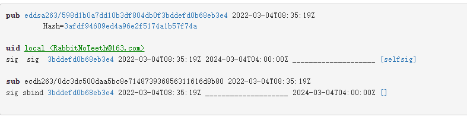

[TOC]

本文将持续总结发布jar到maven中央仓库失败的各种情景及其解决方式。


# 1 找不到公钥

**:boom: 错误信息：**

```
[ERROR] Rule failure while trying to close staging repository with ID "comgiteerabbitnoteeth-1019".
[ERROR]
[ERROR] Nexus Staging Rules Failure Report
[ERROR] ==================================
[ERROR]
[ERROR] Repository "comgiteerabbitnoteeth-1019" failures
[ERROR]   Rule "signature-staging" failures
[ERROR]     * No public key: Key with id: (3bddefd0b68eb3e4) was not able to be located on &lt;a href=http://keyserver.ubuntu.com:11371/&gt;http://keyserver.ubuntu.com:11371/&lt;/a&gt;. Upload your public key and try the operation again.
[ERROR]     * No public key: Key with id: (3bddefd0b68eb3e4) was not able to be located on &lt;a href=https://keys.openpgp.org/&gt;https://keys.openpgp.org/&lt;/a&gt;. Upload your public key and try the operation again.
[ERROR]     * No public key: Key with id: (3bddefd0b68eb3e4) was not able to be located on &lt;a href=http://pgp.mit.edu:11371/&gt;http://pgp.mit.edu:11371/&lt;/a&gt;. Upload your public key and try the operation again.
[ERROR]     * No public key: Key with id: (3bddefd0b68eb3e4) was not able to be located on &lt;a href=http://keyserver.ubuntu.com:11371/&gt;http://keyserver.ubuntu.com:11371/&lt;/a&gt;. Upload your public key and try the operation again.
[ERROR]     * No public key: Key with id: (3bddefd0b68eb3e4) was not able to be located on &lt;a href=https://keys.openpgp.org/&gt;https://keys.openpgp.org/&lt;/a&gt;. Upload your public key and try the operation again.
[ERROR]     * No public key: Key with id: (3bddefd0b68eb3e4) was not able to be located on &lt;a href=http://pgp.mit.edu:11371/&gt;http://pgp.mit.edu:11371/&lt;/a&gt;. Upload your public key and try the operation again.
[ERROR]     * No public key: Key with id: (3bddefd0b68eb3e4) was not able to be located on &lt;a href=http://keyserver.ubuntu.com:11371/&gt;http://keyserver.ubuntu.com:11371/&lt;/a&gt;. Upload your public key and try the operation again.
[ERROR]     * No public key: Key with id: (3bddefd0b68eb3e4) was not able to be located on &lt;a href=https://keys.openpgp.org/&gt;https://keys.openpgp.org/&lt;/a&gt;. Upload your public key and try the operation again.
[ERROR]     * No public key: Key with id: (3bddefd0b68eb3e4) was not able to be located on &lt;a href=http://pgp.mit.edu:11371/&gt;http://pgp.mit.edu:11371/&lt;/a&gt;. Upload your public key and try the operation again.
[ERROR]     * No public key: Key with id: (3bddefd0b68eb3e4) was not able to be located on &lt;a href=http://keyserver.ubuntu.com:11371/&gt;http://keyserver.ubuntu.com:11371/&lt;/a&gt;. Upload your public key and try the operation again.
[ERROR]     * No public key: Key with id: (3bddefd0b68eb3e4) was not able to be located on &lt;a href=https://keys.openpgp.org/&gt;https://keys.openpgp.org/&lt;/a&gt;. Upload your public key and try the operation again.
[ERROR]     * No public key: Key with id: (3bddefd0b68eb3e4) was not able to be located on &lt;a href=http://pgp.mit.edu:11371/&gt;http://pgp.mit.edu:11371/&lt;/a&gt;. Upload your public key and try the operation again.
[ERROR]
[ERROR]
[ERROR] Cleaning up local stage directory after a Rule failure during close of staging repositories: [comgiteerabbitnoteeth-1019]
[ERROR]  * Deleting context 703da981d63604.properties
[ERROR]  * Dropping failed staging repository with ID "comgiteerabbitnoteeth-1019" (Rule failure during close of staging repositories: [comgiteerabbitnoteeth-1019]).

Waiting for operation to complete...
..

[ERROR] Remote staging finished with a failure: Staging rules failure!
```

如上错误信息是一次我在发布项目时报出的，该错误信息的意思是本地使用了id为 `3bddefd0b68eb3e4` 的GPG签名，但是其对应的公钥在公钥服务器中不存在。那么解决思路就明了了：将该签名的公钥上传到公钥服务器即可。


**:white_check_mark: 解决方法：**

1. 打开命令行，执行 `gpg --list-keys`，列出本机GPG签名列表

   ```
   $ gpg --list-keys
   pub   rsa2048 2022-03-03 [SC] [expires: 2024-03-02]
         F1F182591461485D939332E72F6214E116EAD6C3
   uid           [  full  ] RabbitNoTeeth <RabbitNoTeeth@163.com>
   sub   rsa2048 2022-03-03 [E] [expires: 2024-03-02]
   
   pub   ed25519 2022-03-04 [SC] [expires: 2024-03-04]
         598D1B0A7DD10B3DF804DB0F3BDDEFD0B68EB3E4
   uid           [ultimate] local <RabbitNoTeeth@163.com>
   sub   cv25519 2022-03-04 [E] [expires: 2024-03-04]
   ```

   其中，公钥指纹为 `598D1B0A7DD10B3DF804DB0F3BDDEFD0B68EB3E4` 的GPG签名就是上面报错信息中id为 `3bddefd0b68eb3e4` 的签名。

2. 上传公钥指纹到公钥服务器

   ```
   $ gpg --keyserver hkp://keyserver.ubuntu.com/ --send-keys 598D1B0A7DD10B3DF804DB0F3BDDEFD0B68EB3E4
   ```

3. 使用浏览器，打开公钥服务器 http://keyserver.ubuntu.com/，通过GPG签名使用的邮箱搜索公钥指纹，确认已上传成功

   

   

4. 重新发布项目

