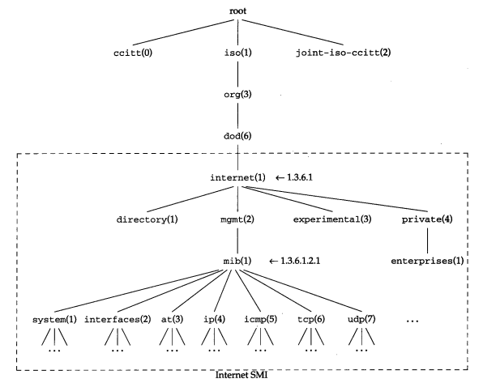
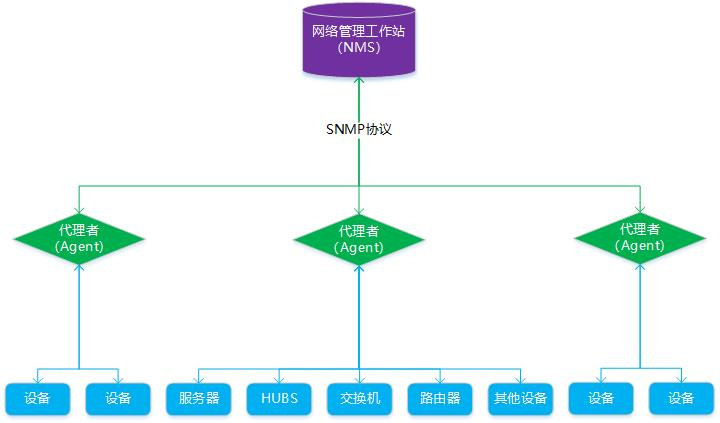
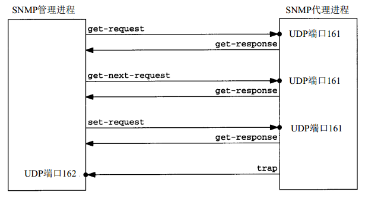
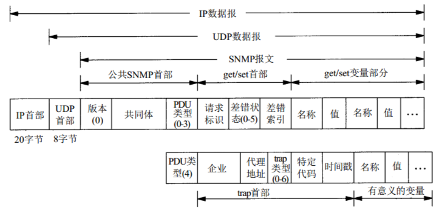
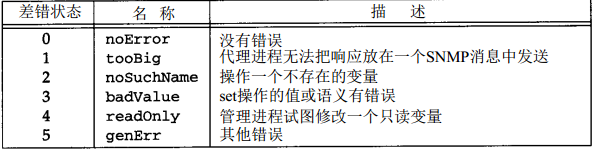

[TOC]

# 1 简介

SNMP是专门设计用于在 IP 网络管理网络节点（服务器、工作站、路由器、交换机及HUBS等）的一种标准协议，它是一种应用层协议。 

SNMP的前身是简单网关监控协议（SGMP），用来对通信线路进行管理。随后，人们对SGMP进行了很大的修改，特别是加入了符合Internet定义的SMI和MIB，改进后的协议就是著名的SNMP。

基于TCP/IP的SNMP网络管理框架是工业上的现行标准，由3个主要部分组成：

- **管理信息结构 SMI**

  SMI定义了SNMP框架所用信息的组织和标识，为MIB定义管理对象及使用管理对象提供模板。

- **管理信息库 MIB**

  MIB定义了可以通过SNMP进行访问的管理对象的集合。

  所谓管理信息库，或者MIB，就是所有代理进程包含的、并且能够被管理进程进行查询和设置的信息的集合。MIB是基于对象标识树的，对象标识是一个整数序列，中间以"."分割，这些整数构成一个树型结构，类似于DNS或Unix的文件系统，如下图：

  

  MIB被划分为若干个组，如system、interfaces、at和ip组等。iso.org.dod.internet.pivate.enterprises（1.3.6.1.4.1）这个标识，是给厂家自定义而预留的，比如华为的为1.3.6.1.4.1.2011，华三的为1.3.6.1.4.1.25506。

  当对MIB变量进行操作，如查询和设置变量的值时，必须对MIB的每个变量进行标识。注意，**只有叶子结点是可操作的**。

  可以通过 [MIB Browser](http://www.ireasoning.com/download.shtml) 进行SNMP调试。

- **管理协议SNMP**

  SNMP协议定义了网络管理者如何对代理进程的MIB对象进行读写操作。

SNMP 为不同种类、厂家、型号的设备定义了一个统一的接口和协议，屏蔽了不同设备的物理差异，从而可以实现对不同设备的统一管理。而其基于TCP/IP传输的特性更是能够使网络管理员可以通过网络对不同物理空间的设备进行管理，大大提高了网络管理的效率。

# 2 版本

SNMP目前共有v1、v2、v3三种版本：

- **v1**

  最初版本，存在较多的安全缺陷，目前使用已经非常少了。

- **v2**

  采用团体名认证，兼容并且扩充了v1版本的功能，包括：数据类型扩展、支持网络分布式管理、大数据量传输、丰富故障处理能力、增加集合处理能力。

- **v3**

  最新版本，在安全性上得到了重要提升，增加了对用户认证和加密传输的支持。

# 3 管理架构

SNMP管理架构由以下三个组件构成：

- **网络管理工作站（NMS）**

  NMS只与代理者通过SNMP协议通信，通过代理者可对被管理设备的信息进行读写。

- **代理者（Agent）**

  代理者是被管理设备和网络管理工作站（NMS）之间的角色，负责两者信息的传递。代理者与NMS直接通过SNMP协议进行交互，接收到NMS下发的查询指令后，代理者将查询对应被管理设备的信息并将结果返回给NMS；代理者接收到NMS下发的设置指令后，将修改对应被管理设备的信息。

  代理者其实就是一个软件服务，一般安装在被管理设备中，如果被管理设备没有对应的代理，那么NMS将无法对其进行直接管理。

- **被管理设备**

  被管理设备是一个网络节点，通过管理信息库MIB收集并存储管理信息，被管理设备只与代理者进行通信，代理者可对被管理设备的信息进行读写。

# 4 报文

**报文种类**

SNMP管理进程与代理进程之前为了交互信息，定义了5种报文：

- **get-request**

  从代理处提取一个或多个参数值。

- **get-next-request**
  从代理处提取一个或多个参数的下一个参数值。

- **set-request**
  设置代理的一个或多个参数值。

- **get-response**
  返回的一个或多个参数值。由代理发出的。

- **trap**
  代理主动发出的报文，通知NMS有某些事情发生。

　　

以上前3个操作是由NMS向代理发出的，后面2个是由代理发给NMS的。

NMS发出的前面3种操作采用UDP的161端口。代理发出的 trap 操作采用UDP的162端口。

**报文格式**

PDU类型的取值范围是0-4，正好表示5种SNMP消息。

差错状态字段是一个整数，它是由代理进程标注的，指明有差错发生。

