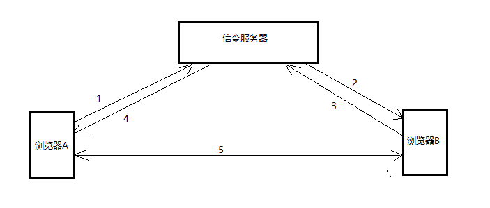
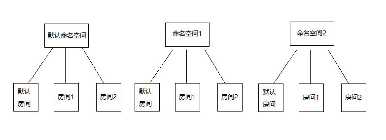

[TOC]


# 1 简介

WebRTC是一个支持网页浏览器进行实时语音对话或视频对话的技术，随着WebRTC的发展，已经不仅仅限于浏览器端的实时语音或者视频通信，可以实现手机端与手机端、手机端与浏览器端等，只要设备支持WebRTC协议，便可以实现双方的实时通信。

WebRTC本质上是p2p的连接，连接打通后，两端的设备直接建立连接，而不需要任何服务器做中转，不仅支持一对一的连接，也支持一对多的连接，但是当一个设备与多个不同的端同时建立p2p连接时，会对机器及带宽的要求比较大，尤其是在各种视频会议的应用中，一个设备需要同时与其他多个设备保持实时通信，此时一般不采用p2p的端到端对等连接，而是通过一个媒体服务器做中转，各个端的设备直连的是媒体服务器，以此来减轻客户端的压力。 当然，接下来的几篇初级入门的文章还不涉及媒体服务器，只是对端到端的p2p连接做简单的介绍。


**WebRTC 建立连接的流程（浏览器A请求与B建立连接）：**



首先保证A与B都和信令服务器建立了连接，从而能够保证信令的传递，A与B在建立连接之前需要交换彼此的信息，这个信息就被称作信令，信令是通过信令服务器来完成传递的，这种信息交换模式被称为”协议/应答”模式，只有当两者信令交换完毕后，才能够建立p2p连接，在WebRTC中的术语成为对等连接。

1. A创建offer类型信令，然后发送给服务器（请求发起连接的一端，先发出offer信令，也就是协议信令）。
2. 信令服务器将A发出的offer信令转发给B。
3. B收到后，创建answer类型信令，也就是应答信令，发送给信令服务器。
4. 信令服务器收到B的answer信令后，转发给A。
5. A收到B的应答后，标示着两者的信令交换完毕，然后创建p2p对等连接进行实时通信，这时两者通信的内容便完全不需要服务器了。


WebRTC中还有必不可少的一环，那就是图中未画出的**穿透服务器**。在实际生活中，大部分情况下，我们的宽带是家庭宽带，而我们的浏览器或者手机都运行在路由器的wifi环境下，这就意味这我们的设备是没有一个单独的公网ip的，如果想要建立对等连接，那么必须借助其他工具打通防火墙，找到内网的对应地址。 而穿透服务器做的就是这项工作，可以使运行在wifi等内网环境下的两个设备实现直连。


此处只对WebRTC做简要介绍，想要详细了解可查看[官方入门教程](https://codelabs.developers.google.com/codelabs/webrtc-web/#0)，写的非常棒。


# 2 环境搭建

## 2.1 信令服务器

在动手实现WebRTC实时通信之前，我们需要先准备好必要的环境：信令服务器和穿透服务器。 

信令服务器其实很简单，它在WebRTC中扮演的角色就只有一个，那就是充当信令交换的中间人。 它只需要做信令的中转，其他的不需要考虑（当然，如果项目中对于WebRTC有一些特殊的需求或者定制化服务，那么可以通过对信令服务器进行扩展）。

在谷歌的官网示例demo中，给出了信令服务器的实现，通过socket.io，示例很简单，我也不再做过多的讲解了。 不过有一点想提一下，就是示例中房间服务器的概念。 其实，示例中房间服务器的概念主要是来自socket.io， 我们知道，在socket.io中，有命名空间和房间的概念，可以通过客户端的连接url来划分不同的命名空间，在每个命名空间下划分不同的房间，如果都不指定，那么全部进入默认的命名空间，默认的房间，如下图：



房间这个概念的好处就在于，在客户端创建连接时，只需要把相互通信的客户端扔到同一个房间，然后通过房间这个模型来发送消息，那么该消息便只限于在这个房间内传输，也就不会影响其他客户端，既容易理解又简化编码。

> 因为公司项目对于信令服务器有一些特殊的要求和附加功能，所以我用websocket实现了一个信令服务器，也实现了命名空间和房间的模型，项目地址：https://github.com/RabbitNoTeeth/signaling-server 。 项目中配有一个web演示页面，同时还做了相关客户端心跳检测及房间人数限制，当然，这些都是属于特殊的功能点了。


在做信令服务器时，最需要考虑的一点就是客户端连接状态的检测。 不管是socket.io还是websocket，对于客户端异常连接状态都是无感知的，也就是说：只有当客户端主动调用close关闭方法时，服务端可以触发回调，但是对于客户端突然断网或者断电引起的连接断开，服务端是感知不到的，所以客户端心跳检测是很有必要的。


## 2.2 穿透服务器

穿透服务器不需要我们自己编写，主需要搭建一套开源的即可。 关于穿透服务器，一般使用的都是开源的Coturn，此处我只是简单搬运一些相关资料。

https://github.com/coturn/coturn/wiki/CoturnConfig         源码项目中给出的搭建教程
https://www.cnblogs.com/idignew/p/7440048.html            网友给出的centos搭建教程

其实源码项目中给出的教程就已经是linux版本的，对于不同的linux发行版本，都是大同小异的。


# 3 创建对等连接

这里对于对等连接的讲解，主要是通过web端的JavaScript API进行讲解。下面的代码示例来自我对原生js api的再封装，主要是公司业务需要，为了简化后期其他项目中webrtc的开发流程，特别写了一版简单的再封装。 


## 3.1 获取本地媒体

```
mediaStreamConstrains: {
    video: true,
    audio: true
}

navigator.mediaDevices.getUserMedia(mediaStreamConstrains)
    .then(mediaStream => {
        // 创建对等连接，将mediaStream媒体流添加到对等连接上
    })
    .catch(error => {
        console.log('本地媒体流获取失败: ', error);
    });
```


## 3.2 创建对等连接

```
let peer = new RTCPeerConnection(iceServersConfig);
// 添加本地媒体流
peer.addStream(mediaStream);
// 添加ice回调
peer.onicecandidate = (e) => {
    if(e.candidate){
        let signaling = {
            type: 'candidate',
            id: e.candidate.sdpMid,
            mlineindex: e.candidate.sdpMLineIndex,
            candidate: e.candidate.candidate
        };
        // 本地ice信息变化时，发送给信令服务器
        websocket.send(JSON.stringify(signaling))
    }
};
// 添加远程媒体流回调
peer.onaddstream = (e) => {
    // 项目中一般将远程媒体流设置到本地video或者audio标签中
};
// 添加连接状态回调
peer.oniceconnectionstatechange = (e) => {
    // 可以从回调参数(e.originalTarget.iceConnectionState)中获取当前连接状态：checking、connected、disconnected、fail中的一种
};
```


其中，iceServersConfig为穿透服务器配置项，格式如下：

```
iceServersConfig: {
    iceServers:[
        { urls:"stun:127.0.0.1:3478" },
        { urls:"turn:127.0.0.1:3478", username:"xxx", credential:"xxx" }
    ]
}
```


## 3.3 呼叫端创建offer协议，发起连接

```
peer.createOffer()
    .then(description => {
        console.log("offer提议信令创建成功");
        // offer协议创建成功后会生成一个描述，也就是信令，先将其设置为本地description
        peer.setLocalDescription(description)
            .then(() => {
                console.log("LocalDescription 设置成功");
                // 发送该offer信令到信令服务器
                websocket.send(JSON.stringify(description));
                console.log("信令发送成功，type=" + description.type)
            })
            .catch(e => {
                console.log("LocalDescription 设置失败", e)
            })
    })
    .catch(error => {
        console.log("offer提议信令创建失败",error)
    });
```


## 3.4 被呼叫端接收到offer信令后，创建answer应答

```
// 将收到的offer信令设置为远程描述
peer.setRemoteDescription(signaling);
// 创建应答
peer.createAnswer()
    .then(description => {
        console.log("answer应答信令创建成功");
        // 应答创建成功后，会生成一个描述，也就是信令，设置为本地description
        peer.setLocalDescription(description)
            .then(() => {
                console.log("LocalDescription 设置成功");
                // 然后将应答发送到信令服务器
                websocket.send(JSON.stringify(description));
                console.log("信令发送成功，type=" + description.type)
            })
            .catch(e => {
                console.log("LocalDescription 设置失败", e)
            })
    })
    .catch(e => {
        console.log("answer应答信令创建失败",e)
    });
```


## 3.5 呼叫端收到answer后，设置远程描述

```
peer.setRemoteDescription(signaling);
```


## 3.6 candidate解析

无论是呼叫端还是被呼叫端，都要做好对candidate类型信令的解析，该类型信令会在双方交换信息时自动生成，收到后要及时处理。

```
peer.addIceCandidate(new RTCIceCandidate({
    sdpMid: candidate.id,
    sdpMLineIndex: candidate.mlineindex,
    candidate: candidate.candidate
}))
    .then(() => {
        console.log("iceCandidate 设置成功")
    })
    .catch(e => {
        console.log("iceCandidate 设置失败",e)
    });
```


至此，双方信令交换完毕，就可以创建对等连接了。

其实，只看上边的代码，会很乱，希望先撸一遍官方示例代码，更加清晰易懂。 这些代码都是从我封装的那一版上面摘抄的，很乱。

关于封装后的api如何使用，可以查看我放在github的示例项目：https://github.com/RabbitNoTeeth/signaling-devices
