[TOC]

参考资料：

- [GAMES101_Lecture_05_Rasterization 1](./resources/GAMES101/GAMES101_Lecture_05_Rasterization 1.pdf)
- [GAMES101_Lecture_06_Rasterization 2](./resources/GAMES101/GAMES101_Lecture_06_Rasterization 2.pdf)
- [GAMES101-现代计算机图形学入门-闫令琪](https://www.bilibili.com/video/BV1X7411F744?p=5)

光栅化就是将三维物体投影形成的二维图像显示在计算机显示器上的过程。

# 1 可视角度与宽高比

在介绍光栅化之前，先来了解两个概念：**可视角度** 与 **宽高比**。

我们知道，在透视投影中，相机点与近平面组成了一个视锥，如下图：

在上图中，**宽高比**很容易理解，即近平面的宽度与高度之比，记作 Aspect ratio 或者 aspect。**可视角度**，从字面意思也不难理解，即视野的角度范围，具体可分为 **垂直方向可视角度** 与 **水平方向可视角度**，图中标出的为垂直方向可视角度，记作 fovY。

从侧面来看这个视锥，很容易得出宽高比和可视角度这些参数的关系，如下图：

根据三角函数，不难得出：
$$
tan\frac{fovY}{2}=\frac{t}{|n|}
$$
以及：
$$
aspect=\frac{r}{t}
$$

我们已经了解到，无论是正交投影还是透视投影，最后都将变换到一个 $[-1,1]^{3}$ 的标准立方体中，光栅化就是将这个立方体绘制到屏幕上的过程，那么屏幕到底是什么呢？

# 2 什么是屏幕？

屏幕是由像素（pixel）组成的阵列，这个阵列的大小称为分辨率，屏幕是一种典型的光栅显示器。

对于像素，我们可能并不陌生，但是实际上它要远比我们想象的复杂得多，但是在这里，我们不需要了解的那么深入，我们只需要知道，**像素是一个拥有特定颜色的小方块，它的颜色由红、绿、蓝混合而成（三者各自占比不同，最终颜色不同）**。

接下来，我们还需要对**屏幕空间**进行一下定义：

- 在由像素组成的阵列（即屏幕）中，其左下角为二维坐标系的原点。
- 像素的长宽为1。
- 像素位置可以用 $(x,y)$ 来表示。
- 像素中心的位置为 $(x+0.5,y+0.5)$。
- 像素位置的范围为 $(0,0)$ 到 $(width-1,height-1)$ 。
- 屏幕的覆盖范围为 $(0,0)$​ 到 $(width,height)$​ 。

好，接下来我们便可以开始尝试将投影的结果（ $[-1,1]^{3}$​ 标准立方体）映射到屏幕中。

# 3 映射 $[-1,1]^{3}$​ 标准立方体

在完成投影变换后，三维物体被变换到一个 $[-1,1]^{3}$ 的标准立方体中，接下来要做的就是将该立方体映射到屏幕上，但是这个立方体是三维的，其存在 $z$ 坐标，而屏幕中是不存在 $z$ 坐标轴的，所以在绘制时，我们先不考虑 $z$ 坐标，这样的话，便将问题简化成将 $[-1,1]^{2}$ 的正方形映射到屏幕上，即将 $[-1,1]^{2}$​ 变换到 $[0,width]\times[0,height]$​​ 大小，这个变换称为视口变换。

变换过程比较简单：先将正方形缩放到屏幕大小，再将其中心平移到指定位置（这是由于屏幕中左下角为坐标系原点），该过程用矩阵表示为：
$$
M_{viewport} = \left(\begin{matrix} \frac{width}{2} & 0 & 0 & \frac{width}{2} \\ 0 & \frac{height}{2} & 0 & \frac{height}{2} \\ 0 & 0 & 1 & 0 \\ 0 & 0 & 0 & 1 \end{matrix}\right)
$$

那么接下来，就需要将实际图形中的各种顶点、多边形等绘制到屏幕中，也就是用像素来表示这些多边形。

# 4 绘制多边形

在图形学中，应用最广泛的多边形就是三角形，三角形不仅可以表示在二维空间中，也可以表示在三维空间中，如下图：

可以看到，三角形的表示能力是非常强的，而这种表示能力也得益于其自身的特点：

- 三角形是最基础的多边形，所有的多边形均可以分解成三角形的组合。
- 三角形一定是一个平面。
- 三角形很容易定义内与外，不会存在歧义。
- 三角形很容易实现渐变的定义。

既然所有的多边形都可以分解成三角形的组合，那么绘制多边形其实就转化成了绘制三角形的问题，也就是用像素来表示三角形，而像素是带有颜色的，我们可以对三角形内外的像素通过不同的着色，来实现三角形的显示。

这样一来，绘制的思路便更加清晰了，就是判断像素与三角形的位置关系，像素是有中心位置的，换言之，就是判断像素的中心与三角形的位置关系。

给定三角形的三个顶点，如何判断哪些像素在三角形内，哪些在三角形外呢？

最简单的方法：**采样法**

# 5 采样法

设定存在一个函数 $f$，对不同的像素点应用函数 $f$​ 求值的过程就称为采样。

如何对下图应用采样来找出所有在三角形内部的像素呢？

首先，我们定义函数 inside，三角形和像素点位置作为其参数，根据返回值不同来表示像素点与三角形的位置关系：
$$
inside(tri,x,y)={\begin{cases}1,  & \text{像素中心点在三角形内} \\
        0, & \text{像素中心点在三角形外}\end{cases}}
$$
计算过程很简单，我们从原点 $(0,0)$ 开始，遍历所有像素点，对每个像素点应用函数 inside，通过向量叉乘可以判断一点是否在三角形内部，完成所有像素点的遍历后，我们可以得到所有位于三角形内部的像素点，如下图：

另外，在遍历像素点过程中，可能会出现像素点恰好位于三角形边上的情况，对于这种情况，要么选择不处理，要么明确定义其是否按位于三角形内处理。

**补充**：对于上面的采样过程，即像素点遍历过程，其实是存在优化的空间的，对于任一三角形，其实我们可以画出一个完全包含该三角形的最小矩形，采样时支队该矩形范围内像素点采样即可，这样就可以加速整个采样过程，如下图：

# 6 走样（锯齿）

好啦，得到了三角形内的所有像素点，那么接下来就对像素点进行着色，不就可以显示出三角形了嘛：

额，结果好像并不是我们想要的，很难把这个和我们想要的三角形划等号呀... 这是为什么呢？ 在采样时，我们是用像素中心点坐标来计算，但是像素本身是一个小方块，所以按照采样结果进行处理，显示出来的图形就不符合我们的预期了，这个现象称之为“锯齿”，也叫“**走样**”。 由于像素本身的特性，“走样”是避免不了的，我们要做的就是不断地优化这个问题，而做不到完全解决这个问题。

从目前掌握的知识来看，走样（锯齿）的问题就是由于像素自身的特性引起的，那如果减小像素的尺寸，或者说增大屏幕的分辨率，走样的问题就可以得到优化，但是对于处理走样问题而言，这并不是我们想要的，不是所有的场景都能通过提高设备分辨率来实现，其实我们还是没有找到问题的本质。那么，走样到底是如何发生的呢？

# 7 为什么会出现走样？

接下来，将一步一步探究走样产生的原因。

## 时域、频域

**时域：**是描述数学函数或物理信号对时间的关系。它是真实存在的，就是我们的真实世界。

**频域：**是描述信号在频率方面特性时用到的一种坐标系。它不是真实的，而是一个数学构造。

## 傅里叶级数展开

假设存在函数 $f(x)$ ，如下图所示：

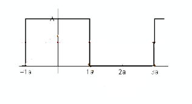

在坐标系中再画出函数 $f_1(x) = \frac{A}{2}$​​ 和 $f_2(x)=\frac{2Acos(tw)}{\pi}$​​ ，如下图中左图所示，将 $f_1(x)$​​ 和  $f_2(x)$​ 相加，得到下图中右图中函数 $F(x)$，是不是相加后的函数与原函数有些相似了？​ 

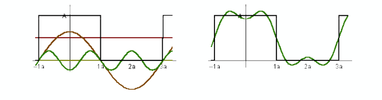

继续上面的操作，在结果函数的基础上继续加权周期函数 $f_3(x)=-\frac{2Acos(3tw)}{3\pi}$：

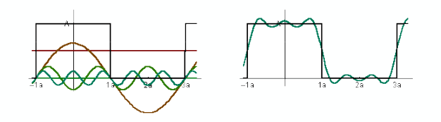

再加权 $f_4(x)=\frac{2Acos(5tw)}{5\pi}$​​：

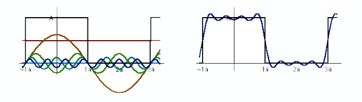

可以发现，通过不断地加权三角函数，加权结果函数 $F(x)$​​ 将越来越逼近函数 $f(x)$​，相当于，$f(x)$​ 函数可以写成：
$$
f(x) = \frac{A}{2} + \frac{2Acos(tw)}{\pi} - \frac{2Acos(3tw)}{3\pi} + \frac{2Acos(5tw)}{5\pi} + ···
$$
这个过程称为傅里叶级数展开，即一个函数可以用三角函数的加权和来表示。

再进一步观察 $f(x)$ 的傅里叶级数展开表示，发现从 $f_1(x)$ 到 $f_4(x)$​​ 以及再往后，加权的三角函数的周期越来越短，频率越来越高。也就是说，对于一个函数 $f(x)$，可以通过傅里叶级数展开成多个不同频率的三角函数。

## 傅里叶变换

对于函数 $f(x)$，可以经过一系列复杂的变换，变换成函数 $F(x)$​​，这个过程称为傅里叶变换。 而将 $F(x)$ 变换回 $f(x)$​ 的过程称为逆傅里叶变换。傅里叶变换可以应用到时域和频域上，如下图：

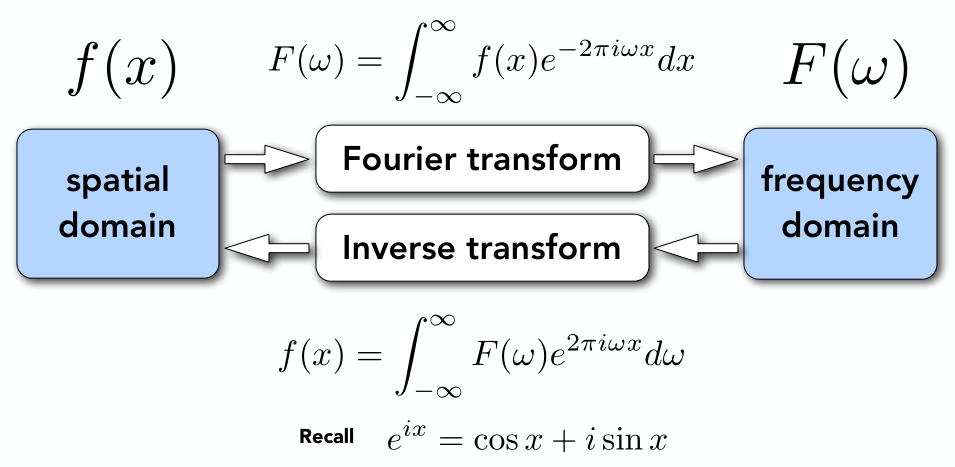

傅里叶级数展开并不等同于傅里叶变换，傅里叶级数展开其实是连续的傅里叶变换。

假设我们有一组时域的信号，通过傅里叶变换，将时域信号变换成频域中不同频率的信号，如下图所示：

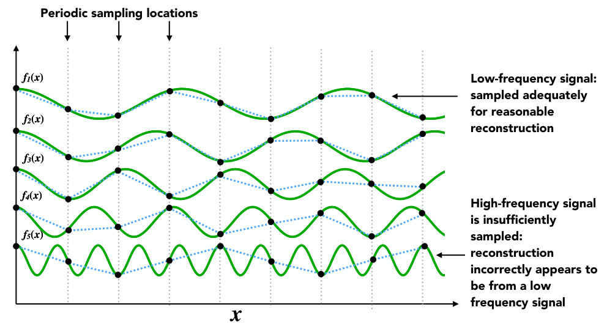

从 $f_1(x)$ 到 $f_5(x)$​​​ ，频率越来越高，对这五个信号以同一周期进行采样，图中黑色圆点表示采样点，将采样点连线，采样点的连线对低频信号的还原度要更好，频率越高，还原度越差。这也就表示，对于高频信号，需要更加小的采样周期（即更高的采样频率）。

再来看一个示例，下图中蓝色线和黑色线表示2个不同频率的信号，空心点表示采样点：

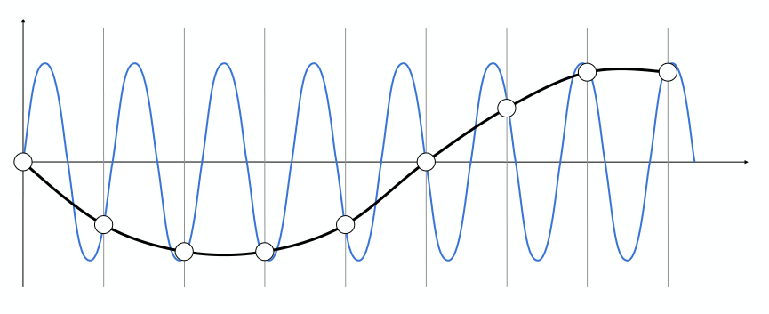

根据空心点进行采样还原，那么还原出的信号是无法区分出是蓝色线信号还是黑色线信号，这个现象就称为**走样**。

好，在这里我们就可以总结出什么是走样：**在给定的采样频率下，无法区分出2个不同频率的信号的现象，就是走样**。

## 滤波

滤波就是删除指定频率的信号。

首先，我们来看这样一组图：

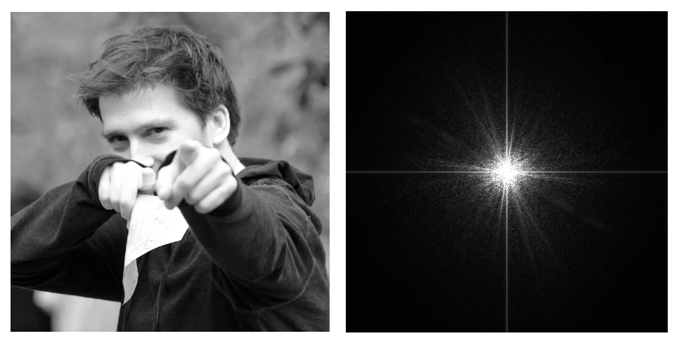

上图中，左图表示一张时域下的图片，其实就是用摄像机拍摄的真实世界的图片；右图表示将左图经过傅里叶变换后的频域图，定义其中心点频率最低，越向外频率越高，亮度越高表示信号量越大。

解释完左右图的含义，我们可以通过频域图看到，左图的低频信号量很大，高频较少，其实自然世界的图像，大多数全是这种情况，主要以低频信号为主。

接下来，我们来做一个操作，将频域图中的低频信号删除，只保留高频信号，然后通过逆傅里叶变换变换成时域图像：

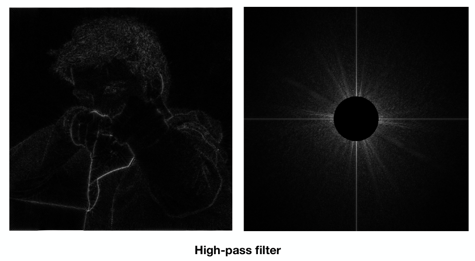

可以看到，变换成时域图像后，得到了原图像的轮廓信息，这也就说明高频信号代表了边界信息，那么这是为什么呢？在生活中，我们之所以能判别出边界，一定是边界两边的信息发生了剧变，这也意味着剧变的信息是高频信号。这种只保留高频信号的操作称为**高通滤波**。

那么，如果只保留低频信号呢？

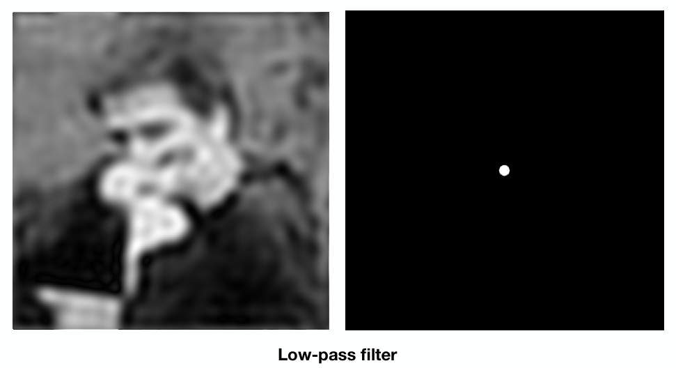

很明显，由于高频信号的丢失，导致时域图像中的边界消失，图像更加模糊，边界更加不明显。这种只保留低频信号的操作称为**低通滤波**。

无论是高通滤波还是低通滤波，滤波后的信号频率分布可以说是更加的**均匀（或者说平均）**了，当然呈现到时域图像中的效果就是更加模糊。

## 卷积

先来理解一下卷积是什么，假设存在一组信号（Signal），以及一个过滤窗口（Filter），如下图：

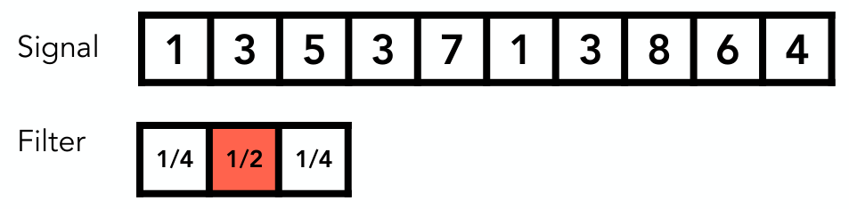

过滤窗口对应部分信号，对这部分信号按照窗口中的权重进行加权，然后将结果作为窗口中心所对应信号的输出，如下图所示：

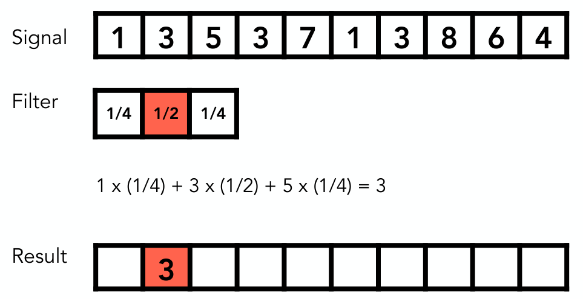

然后向右移动窗口，继续对下一组信号进行加权：

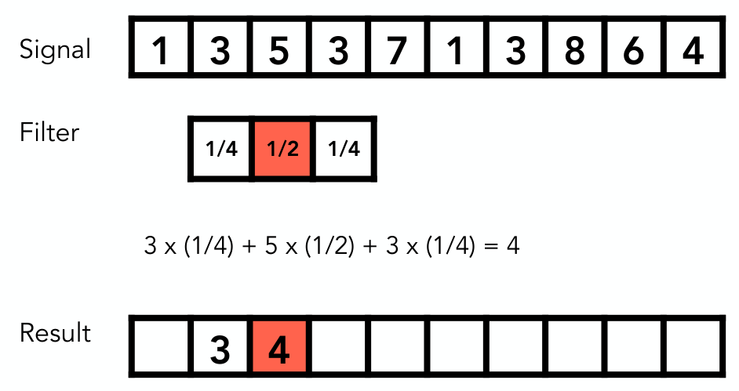

依此类推，直至处理完所有的信号，处理完的信号，由于加权的原因，会更加的**均匀（或者说平均）**，这个过程就叫做卷积（当然，真正卷积的定义不是这样，这里只是说卷积在图形学上的应用）。

**卷积定理：时域上的卷积等于频域上的乘积，反之亦然（时域上的乘积等于频域上的卷积）。**如下图所示，将时域图像与卷积通过傅里叶变换得到频域信息，对两个频域信息进行相乘得到频域结果，再对结果进行逆傅里叶变换便可得到时域图像经过卷积后的效果，当然，这个过程是可逆的。

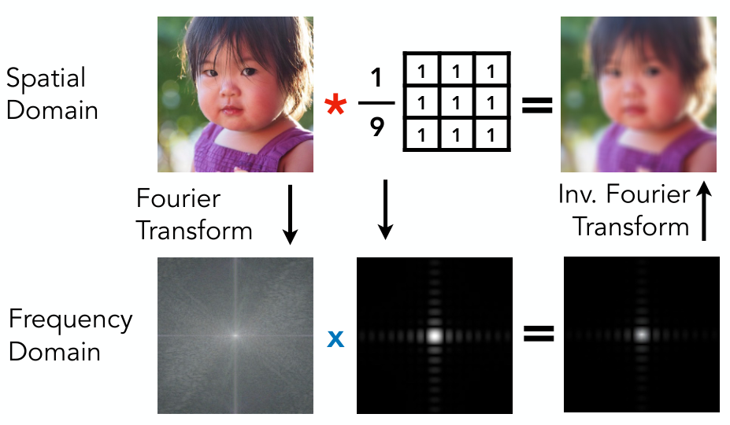

这里，注意一下上图中用到的这个 $3\times3$ 的卷积核：

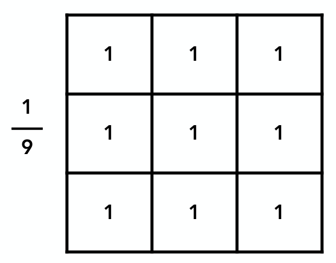

它表示对每个去每个像素周围的8个像素点进行加权求和，每个像素点权重都为1，那么为什么前面要乘上 $\frac{1}{9}$ 呢？这是因为每个像素点权重都为1，对9个像素点进行加权求和后，结果值一定是比较大的，这会导致卷积后图像亮度的增加，为了保证图像亮度不发生变化，就需要对结果乘上 $\frac{1}{9}$ 。

那么，卷积核的大小对结果图像的频域有何影响呢？看下面两幅图：

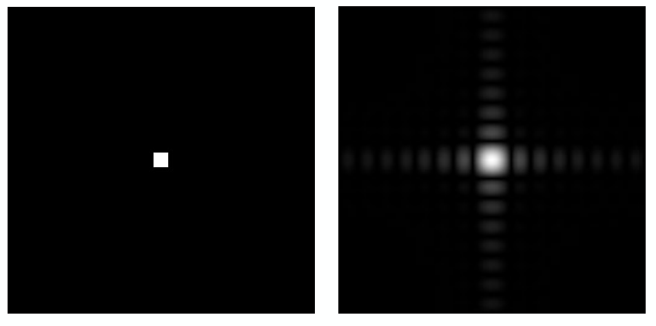

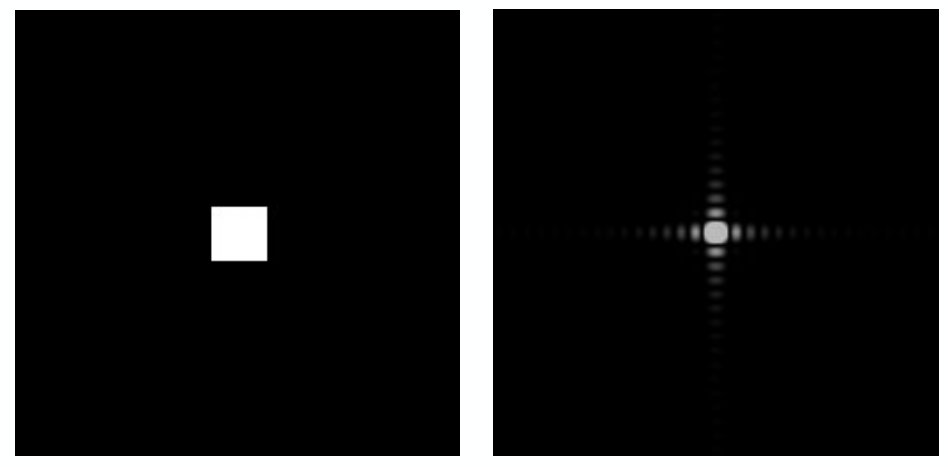

很明显，卷积核越大，高频信号越少，其实很容易理解：从反方向思考，卷积核越小，在对像素加权处理时，涉及到的像素越少，那么处理后的像素的变化也越少，对应到频域上，就是频率的变化越小，更多的频率信号得以保留。

经过上面的分析，可以总结，其实卷积也是使信号的频率更加的**均匀（或者说平均）**的过程，而滤波同样是这样一个过程，所以，我们可以解为，**滤波=卷积**。

## 重新认识采样

假设存在函数 $X_a(t)$，图a所示，图b为其频域：

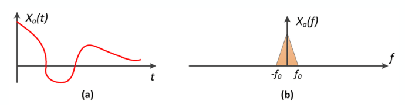

现在以采样函数 $P_\delta(t)$​​ 对其进行采样，图c所示，图d表示其频域：

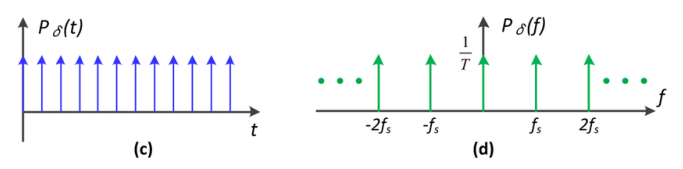

将 $X_a(t)$ 与 $P_\delta(t)$ 相乘，得到函数 $S(t)$（图e），根据卷积定理，我们知道，时域相乘等于频域卷积，那么对 $X_a(t)$ 与 $P_\delta(t)$ 的频域进行卷积得到图f：

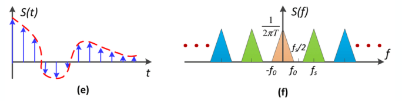

观察卷积后的频域，可以发现其实**采样就是在重复频域上的内容**。

## 重新认识走样

好的，我们了解到采样就是在重复频域上的内容，现在，我们给出密集采样（即采样周期短、频率快）的情况下，频域内容的重复情况：

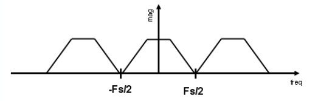

在密集采样时，频域内容的重复比较规整，不会发生交叉重叠。

再来看稀疏采样（即采样周期长、频率慢）的情况下，频域内容的重复情况：

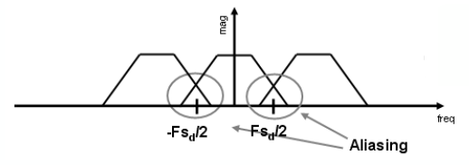

在稀疏采样时，频域内容在重复时会发生交叉重叠，而重叠的这部分，就是走样。换句话说，**走样就是频域内容的混合**。

整理到这里，我们终于可以总结，为什么会出现走样呢？原因有两点：

1. 采样太慢，跟不上信号的频率。
2. 信号的频谱范围大，有限的采样频率无法很好的还原整个频谱范围的信号。

知道了走样的原因，那么优化走样问题（反走样）就有了思路。

# 8 反走样

根据刚刚整理出的产生走样的2个原因，就可以针对性地提供解决方案来反走样。

## 提高采样频率

提高采样率是反走样最直接有效地办法，但是它的问题在于在实际中并不现实，比如说直接提高屏幕分辨率，当然能优化锯齿问题，但这并不通用，实际中也很少会这么做，因为并没有从根本上解决问题。

## 缩小信号的频谱范围

那么在不改变采样频率的情况下，我们还可以从解决信号频谱范围大的角度入手，也就是缩小信号的频谱范围，减小在采样时频域内容的交叉重叠，如下图所示：

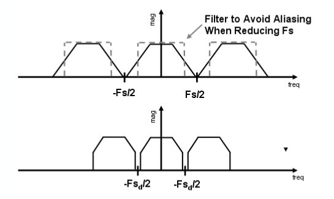

上图表示将信号的频域范围缩小后，使用相对稀疏的采样也没有出现频域内容交叉重复的问题。

那么，什么能缩小信号的频谱范围呢？当然是上面所讲到的滤波，或者说卷积，二者是一回事儿。

话题回到通过采样绘制三角形的问题，如果先对三角形进行一次滤波，然后再进行采样，会发生什么效果呢？

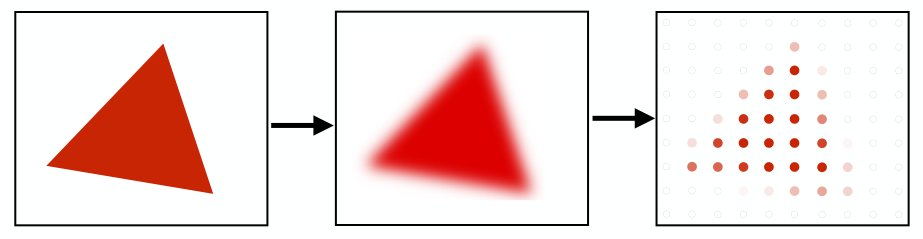

哈，这下采样后的效果好多了，更像一个三角形了，可以看到像素点的颜色并不是一样的，有深有浅，这个颜色深浅又是如何得到的呢？

在光栅化三角形时，可以通过**像素中被三角形覆盖的区域面积 / 像素大小**得到像素的平均值，颜色深浅随平均值变化，如下图：

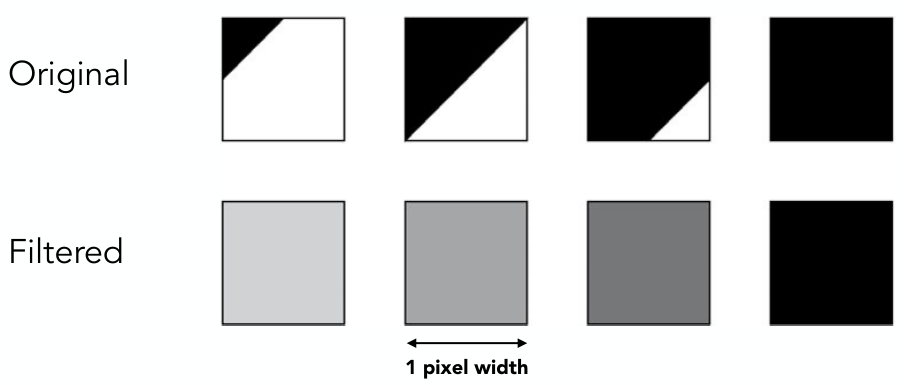

但是，像素本身被三角形覆盖的区域面积同样难以计算，那么实际应用中是如何利用上面的思想来实现反走样呢？

## MSAA

MSAA是就是使用像素平均值的思想，在实际中的一种应用。

MSAA是如何工作的呢？其工作原理就是将一个像素细分为更多的组成部分，对每个部分的中心点进行计算，最后将这些中心点的加权平均值作为整个像素的平均值，下图表示将一个像素细分成 $4\times4$ 的组成：

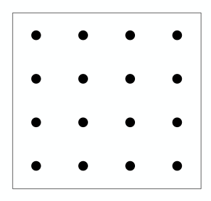

回到光栅化三角形的问题中，利用MSAA进行处理，其像素细分后的效果如下图所示：

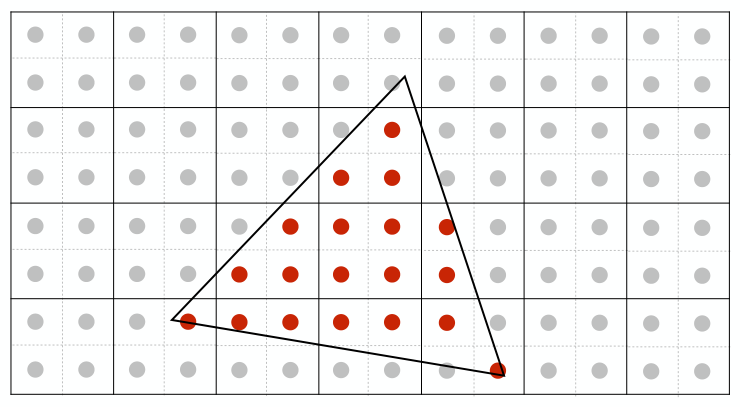

此处是将一个像素分成了 $2\times2$ 的组成，对每个组成的中心点计算，判断其是否在三角形内，最后得到一个像素点的所有组成在三角形内的占比：

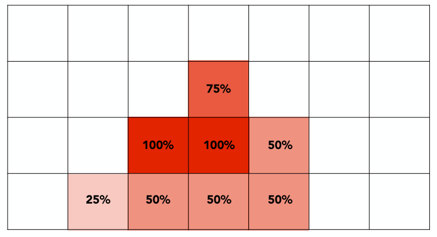

最后进行光栅化处理：

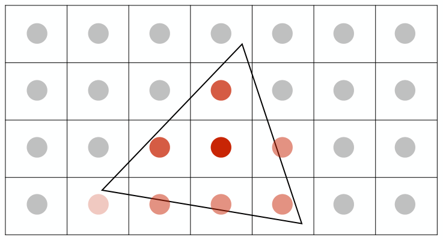

最后来看一个MSAA前后的效果对比示例，效果还是很不错的。

MSAA前：

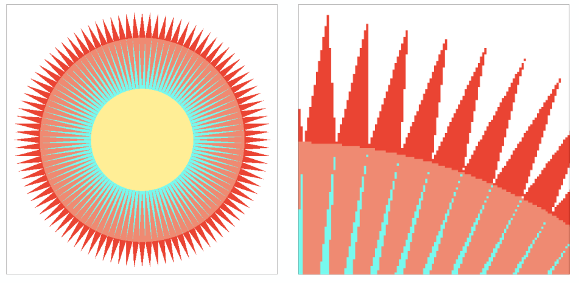

MSAA后：

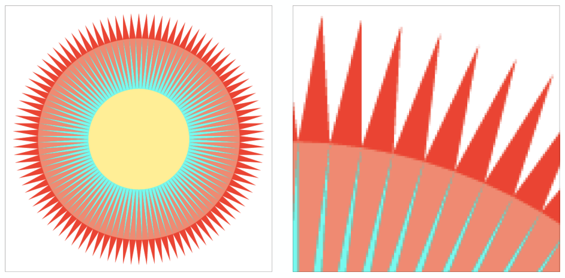

## FXAA

Fast Approximate AA，直接光栅化三角形，光栅化时不考虑任何反走样的处理，光栅化之后利用图像处理技术对走样（锯齿）进行处理。

（目前不是很了解，待以后补充更新）

## TAA

Temporal AA，利用上一时刻（上一帧）来处理反走样问题。

（目前不是很了解，待以后补充更新）
