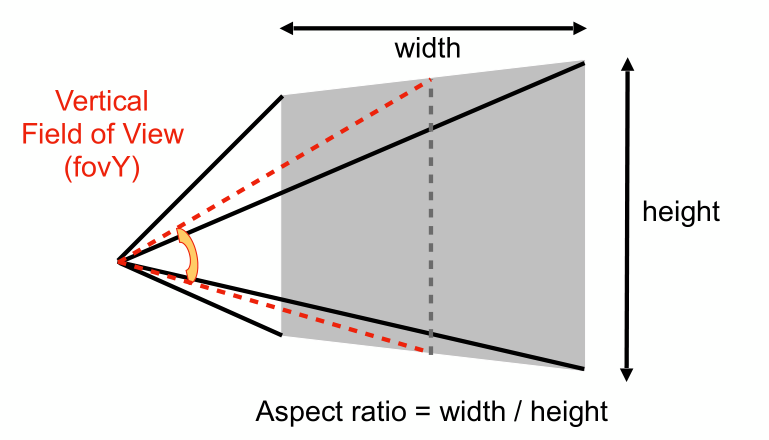
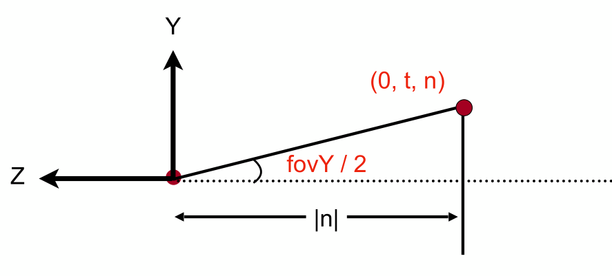
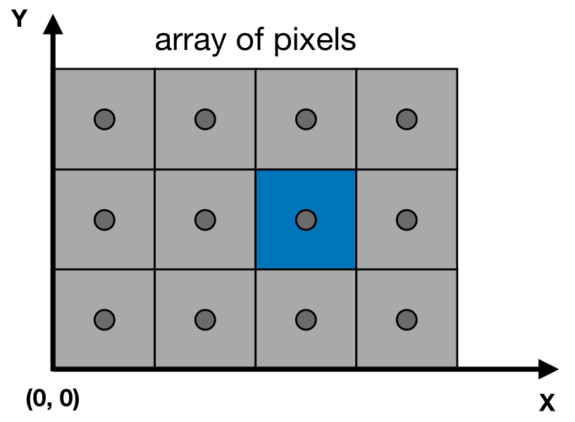
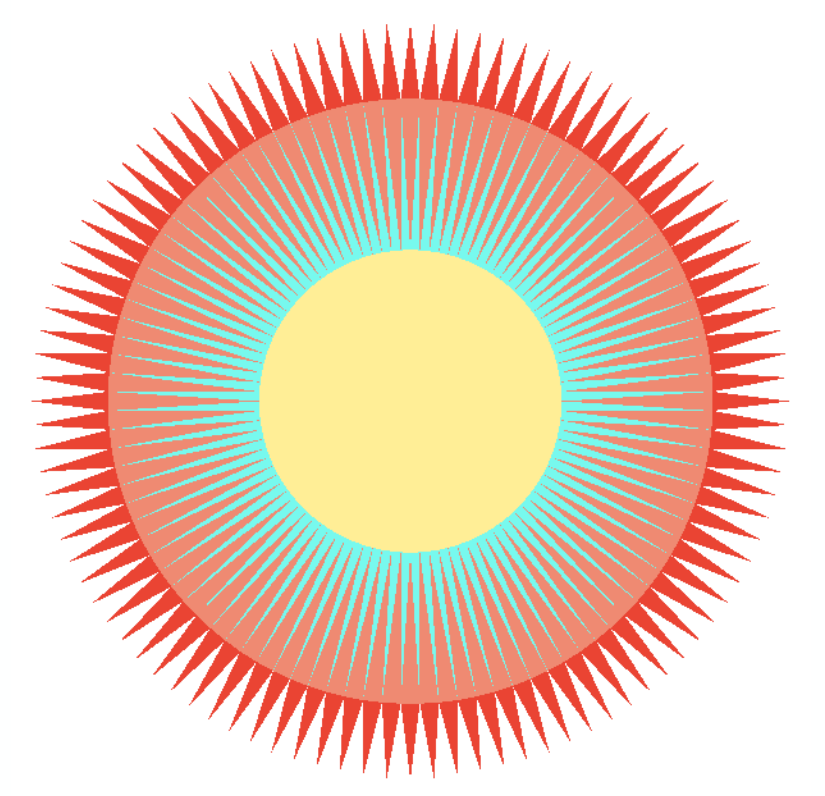
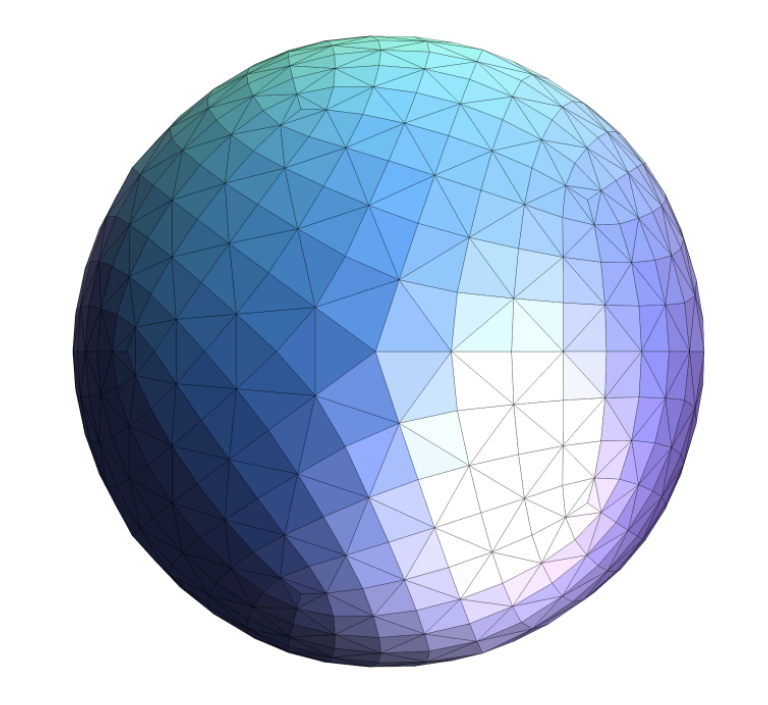
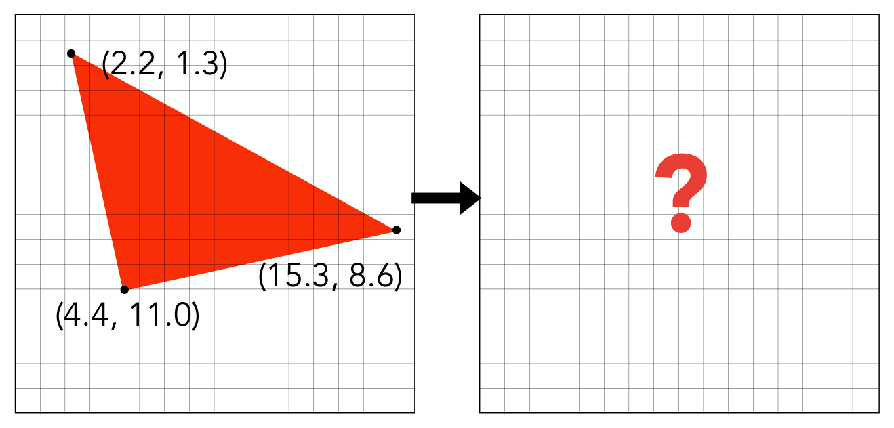
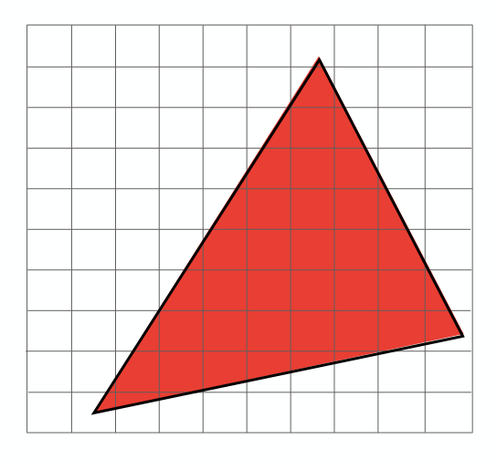
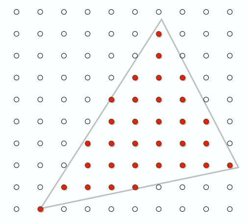
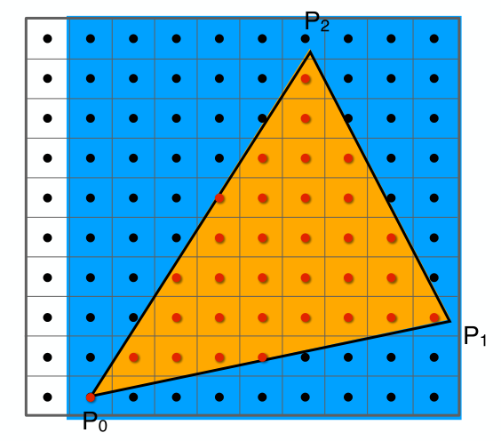
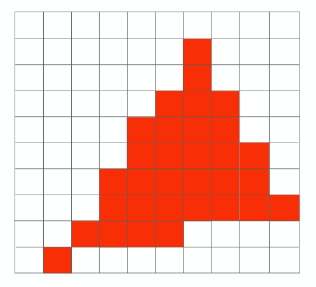

[TOC]

参考资料：

- [GAMES101_Lecture_05_Rasterization 1](./resources/GAMES101/GAMES101_Lecture_05_Rasterization 1.pdf)
- [GAMES101_Lecture_06_Rasterization 2](./resources/GAMES101/GAMES101_Lecture_06_Rasterization 2.pdf)
- [GAMES101-现代计算机图形学入门-闫令琪](https://www.bilibili.com/video/BV1X7411F744?p=5)

光栅化就是将三维物体投影形成的二维图像显示在计算机显示器上的过程。

# 1 可视角度与宽高比

在介绍光栅化之前，先来了解两个概念：**可视角度** 与 **宽高比**。

我们知道，在透视投影中，相机点与近平面组成了一个视锥，如下图：

在上图中，**宽高比**很容易理解，即近平面的宽度与高度之比，记作 Aspect ratio 或者 aspect。**可视角度**，从字面意思也不难理解，即视野的角度范围，具体可分为 **垂直方向可视角度** 与 **水平方向可视角度**，图中标出的为垂直方向可视角度，记作 fovY。

从侧面来看这个视锥，很容易得出宽高比和可视角度这些参数的关系，如下图：

根据三角函数，不难得出：
$$
tan\frac{fovY}{2}=\frac{t}{|n|}
$$
以及：
$$
aspect=\frac{r}{t}
$$

我们已经了解到，无论是正交投影还是透视投影，最后都将变换到一个 $[-1,1]^{3}$ 的标准立方体中，光栅化就是将这个立方体绘制到屏幕上的过程，那么屏幕到底是什么呢？

# 2 什么是屏幕？

屏幕是由像素（pixel）组成的阵列，这个阵列的大小称为分辨率，屏幕是一种典型的光栅显示器。

对于像素，我们可能并不陌生，但是实际上它要远比我们想象的复杂得多，但是在这里，我们不需要了解的那么深入，我们只需要知道，**像素是一个拥有特定颜色的小方块，它的颜色由红、绿、蓝混合而成（三者各自占比不同，最终颜色不同）**。

接下来，我们还需要对**屏幕空间**进行一下定义：

- 在由像素组成的阵列（即屏幕）中，其左下角为二维坐标系的原点。
- 像素的长宽为1。
- 像素位置可以用 $(x,y)$ 来表示。
- 像素中心的位置为 $(x+0.5,y+0.5)$。
- 像素位置的范围为 $(0,0)$ 到 $(width-1,height-1)$ 。
- 屏幕的覆盖范围为 $(0,0)$​ 到 $(width,height)$​ 。

好，接下来我们便可以开始尝试将投影的结果（ $[-1,1]^{3}$​ 标准立方体）映射到屏幕中。

# 3 映射 $[-1,1]^{3}$​ 标准立方体

在完成投影变换后，三维物体被变换到一个 $[-1,1]^{3}$ 的标准立方体中，接下来要做的就是将该立方体映射到屏幕上，但是这个立方体是三维的，其存在 $z$ 坐标，而屏幕中是不存在 $z$ 坐标轴的，所以在绘制时，我们先不考虑 $z$ 坐标，这样的话，便将问题简化成将 $[-1,1]^{2}$ 的正方形映射到屏幕上，即将 $[-1,1]^{2}$​ 变换到 $[0,width]\times[0,height]$​​ 大小，这个变换称为视口变换。

变换过程比较简单：先将正方形缩放到屏幕大小，再将其中心平移到指定位置（这是由于屏幕中左下角为坐标系原点），该过程用矩阵表示为：
$$
M_{viewport} = \left(\begin{matrix} \frac{width}{2} & 0 & 0 & \frac{width}{2} \\ 0 & \frac{height}{2} & 0 & \frac{height}{2} \\ 0 & 0 & 1 & 0 \\ 0 & 0 & 0 & 1 \end{matrix}\right)
$$

那么接下来，就需要将实际图形中的各种顶点、多边形等绘制到屏幕中，也就是用像素来表示这些多边形。

# 4 绘制多边形

在图形学中，应用最广泛的多边形就是三角形，三角形不仅可以表示在二维空间中，也可以表示在三维空间中，如下图：

可以看到，三角形的表示能力是非常强的，而这种表示能力也得益于其自身的特点：

- 三角形是最基础的多边形，所有的多边形均可以分解成三角形的组合。
- 三角形一定是一个平面。
- 三角形很容易定义内与外，不会存在歧义。
- 三角形很容易实现渐变的定义。

既然所有的多边形都可以分解成三角形的组合，那么绘制多边形其实就转化成了绘制三角形的问题，也就是用像素来表示三角形，而像素是带有颜色的，我们可以对三角形内外的像素通过不同的着色，来实现三角形的显示。

这样一来，绘制的思路便更加清晰了，就是判断像素与三角形的位置关系，像素是有中心位置的，换言之，就是判断像素的中心与三角形的位置关系。

给定三角形的三个顶点，如何判断哪些像素在三角形内，哪些在三角形外呢？

最简单的方法：**采样法**

# 5 采样法

设定存在一个函数 $f$，对不同的像素点应用函数 $f$​ 求值的过程就称为采样。

如何对下图应用采样来找出所有在三角形内部的像素呢？

首先，我们定义函数 inside，三角形和像素点位置作为其参数，根据返回值不同来表示像素点与三角形的位置关系：
$$
inside(tri,x,y)={\begin{cases}1,  & \text{像素中心点在三角形内} \\
        0, & \text{像素中心点在三角形外}\end{cases}}
$$
计算过程很简单，我们从原点 $(0,0)$ 开始，遍历所有像素点，对每个像素点应用函数 inside，通过向量叉乘可以判断一点是否在三角形内部，完成所有像素点的遍历后，我们可以得到所有位于三角形内部的像素点，如下图：

另外，在遍历像素点过程中，可能会出现像素点恰好位于三角形边上的情况，对于这种情况，要么选择不处理，要么明确定义其是否按位于三角形内处理。

**补充**：对于上面的采样过程，即像素点遍历过程，其实是存在优化的空间的，对于任一三角形，其实我们可以画出一个完全包含该三角形的最小矩形，采样时支队该矩形范围内像素点采样即可，这样就可以加速整个采样过程，如下图：

# 6 锯齿（走样）

好啦，得到了三角形内的所有像素点，那么接下来就对像素点进行着色，不就可以显示出三角形了嘛：

额，结果好像并不是我们想要的，很难把这个和我们想要的三角形划等号呀... 这是为什么呢？ 在采样时，我们是用像素中心点坐标来计算，但是像素本身是一个小方块，所以按照采样结果进行处理，显示出来的图形就不符合我们的预期了，这个现象称之为“锯齿”，也叫“走样”。 由于像素本身的特性，“走样”是避免不了的，我们要做的就是不断地优化这个问题，而做不到完全解决这个问题。

未完待续...
