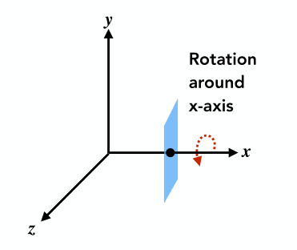
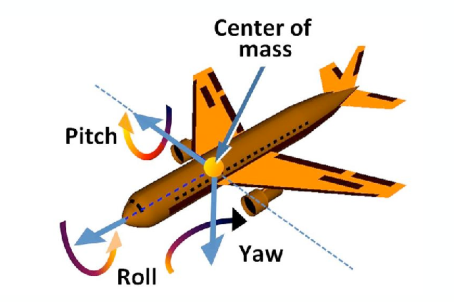

[TOC]

参考资料：

- [GAMES101_Lecture_03_Transformation Cont](./resources/GAMES101/GAMES101_Lecture_04_Transformation Cont.pdf)

- [GAMES101-现代计算机图形学入门-闫令琪](https://www.bilibili.com/video/BV1X7411F744?p=4)

在介绍三维空间的变换前，先来了解一个概念：**正交矩阵**

我们知道，在二维空间中，对图形 $G$​​ 旋转 $\theta$​​ 角度得到图形 $G^\prime$​​，可以用矩阵表示该旋转操作为：
$$
R_\theta = \left(\begin{matrix} cos\theta & -sin\theta \\ sin\theta & cos\theta \end{matrix}\right)
$$
那么，图形 $G^\prime$ 旋转 $-\theta$ 角度得到原图形 $G$，用矩阵表示该操作为：
$$
R_{-\theta} = \left(\begin{matrix} cos(-\theta) & -sin(-\theta) \\ sin(-\theta) & cos(-\theta) \end{matrix}\right)
$$
我们知道：
$$
cos(-\theta) = cos(\theta) \\
sin(-\theta) = -sin(\theta)
$$
从而可以得到：
$$
R_{-\theta} = \left(\begin{matrix} cos\theta & sin\theta \\ -sin\theta & cos\theta \end{matrix}\right)
$$
对比 $R_\theta$​ 与 $R_{-\theta}$​，不难发现 $R_{-\theta}$​ 等于 $R_{\theta}$​ 的转置矩阵，即：
$$
R_{-\theta} = R_{\theta}^T
$$

同时， $R_\theta$ 与 $R_{-\theta}$​ 互为逆变换，那么根据逆变换的定义，可以得到：
$$
R_{-\theta} = R_{\theta}^{-1}
$$
最终可得：
$$
R_{\theta}^T = R_{\theta}^{-1}
$$
**如果一个矩阵的转置矩阵和逆矩阵相同，那么我们称这个矩阵为正交矩阵。**不仅在二维空间中旋转操作为正交矩阵，在三维矩阵中同样如此。

在<a href="./齐次坐标.html" target="_blank">《齐次坐标》</a>中，我们知道齐次坐标同样可用在三维空间中：

- 三维中的点    ：$(x,\ y,\ z,\ 1)^T$
- 三维中的向量：$(x,\ y,\ z,\ 0)^T$

通常，任意 $(x,\ y,\ z,\ w)$，当 $w \neq 0$ 时，都可以表示三维空间中的一个点：$(x/w,\ y/w,\ z/w)$

# 1 缩放

$$
S_{(s_x,\ s_y,\ s_z)} = \left(\begin{matrix} s_x & 0 & 0 & 0 \\ 0 & s_y & 0 & 0 \\ 0 & 0 & s_z & 0 \\ 0 & 0 & 0 & 1 \end{matrix}\right)
$$

# 2 旋转

在三维空间中，旋转可能是沿任意方向的旋转，在这之前，先看一下比较简单的沿 $x$、$y$ 或者 $z$ 轴单一方向的旋转。

上图表示为沿 $x$ 轴方向旋转一定的角度 $\alpha$​，不难写出该旋转的矩阵表示：
$$
R_x(\alpha) = \left(\begin{matrix} 1 & 0 & 0 & 0 \\ 0 & cos(\alpha) & -sin(\alpha) & 0 \\ 0 & sin(\alpha) & cos(\alpha) & 0 \\ 0 & 0 & 0 & 1 \end{matrix}\right)
$$
同样，我们可以写出沿 $z$ 轴旋转的矩阵表示为：
$$
R_z(\alpha) = \left(\begin{matrix} cos(\alpha) & -sin(\alpha) & 0 & 0 \\ sin(\alpha) & cos(\alpha) & 0 & 0 \\ 0 & 0 & 1 & 0 \\ 0 & 0 & 0 & 1 \end{matrix}\right)
$$
沿 $y$ 轴旋转的矩阵表示为：
$$
R_y(\alpha) = \left(\begin{matrix} cos(\alpha) & 0 & sin(\alpha) & 0 \\ 0 & 1 & 0 & 0 \\ -sin(\alpha) & 0 & cos(\alpha) & 0 \\ 0 & 0 & 0 & 1 \end{matrix}\right)
$$
在沿 $y$​ 轴旋转的矩阵表示中，情况与前2者稍有不同，$sin(\alpha)$​ 的正负发生了变化，这是因为根据右手定则，$\vec{x}\times\vec{y} = \vec{z}$​、$\vec{y}\times\vec{z} = \vec{x}$​，但是   $\vec{x}\times\vec{z} = -\vec{y}$​​ ，所以正负号发生了变化。​

在二维空间变换中，沿任意方向旋转，我们可以将该方向向量的起点平移至原点，然后做旋转操作，最后再将该方向向量的原点平移回原位置。

同样，在三维空间中，沿任意方向旋转，我们同样可以先将该方向向量的起点平移至原点，然后做旋转，最后再平移回去。三维空间中的任意向量都可以分解成由 $x$、$y$、$z$ 轴的投影组成，如果能够将任意方向的旋转也能分解成沿 $x$、$y$、$z$ 轴，那么沿任意方向的旋转问题便可以分解成更加简单的组合，这该有多好。

那么沿任意方向的旋转是否能够分解成沿 $x$、$y$、$z$ 轴的旋转组合呢？或者说，三维空间中的任意方向，能够通过沿 $x$、$y$、$z$​ 轴的旋转得到呢？

答案是可以的，我们可以想象飞机的中心为原点，分级通过沿 $x$（上下“点头”）、$y$（左右“摇头”）、$z$（侧向“翻转”） 轴方向的旋转实现机头朝向任意方向，那么三维空间中沿任意方向的旋转可以分解成 $x$、$y$、$z$​ 轴的旋转组合：
$$
R_{xyz}(\alpha,\beta,\gamma) = R_x(\alpha)R_y(\beta)R_z(\gamma)
$$

在三维空间中，沿任意轴 $\pmb{n}$ 旋转 $\alpha$ 角度，有人给出了其对应的旋转公式，即 **罗德里格斯旋转公式（Rodrigues’ Rotation Formula）**：
$$
R(\pmb{n},\alpha) = cos(\alpha)I + (1-cos(\alpha))\pmb{n}\pmb{n}^T + sin(\alpha) \underbrace{\left(\begin{matrix} 0 & -n_z & n_y \\ n_z & 0 & -n_x \\ -n_y & n_x & 0 \end{matrix}\right)}_{N}
$$
[点击此处](./resources/GAMES101/GAMES101_Lecture_04_Transformation Cont supp.pdf) 可查看该公式的推导。

# 3 平移

$$
T_{(t_x,\ t_y,\ t_z)} = \left(\begin{matrix} 1 & 0 & 0 & t_x \\ 0 & 1 & 0 & t_y \\ 0 & 0 & 1 & t_z \\ 0 & 0 & 0 & 1 \end{matrix}\right)
$$

# 4 仿射

$$
\left(\begin{matrix} x^\prime \\ y^\prime \\ z^\prime \\ 1 \end{matrix}\right)
= \left(\begin{matrix} a & b & c & t_x \\ d & e & f & t_y \\ g & h & i & t_z \\ 0 & 0 & 0 & 1 \end{matrix}\right) \cdot 
\left(\begin{matrix} x \\ y \\ z \\ 1 \end{matrix}\right)
$$

