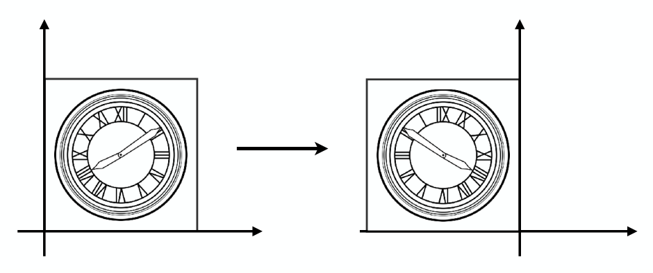

[TOC]

参考资料：

- [GAMES101_Lecture_03_Transformation](./resources/GAMES101/GAMES101_Lecture_03_Transformation.pdf)

- [GAMES101-现代计算机图形学入门-闫令琪](https://www.bilibili.com/video/BV1X7411F744?p=3)

# 1 线性变换

在二维平面中，图形变换后坐标满足以下关系：
$$
\begin{align}
x^\prime = ax + by \\
y^\prime = cx + dy
\end{align}
$$
同时，该关系可以表示为矩阵形式：
$$
\left(\begin{matrix} x^\prime \\ y^\prime \end{matrix}\right) = 
\left(\begin{matrix} a & b \\ c & d \end{matrix}\right)
\left(\begin{matrix} x \\ y \end{matrix}\right)
$$
那么，我们称这种变化为**线性变换**。

线性变换包括缩放、反射、切变、旋转。

## 1.1 缩放

上图表示将左侧图形沿着x和y方向缩放相同的0.5倍（称之为**均匀缩放**），那么缩放后的坐标与原坐标关系为：
$$
\begin{align}
x^\prime = 0.5x \\
y^\prime = 0.5y
\end{align}
$$
我们可以用矩阵来表示这个关系：
$$
\left(\begin{matrix} x^\prime \\ y^\prime \end{matrix}\right) = 
\left(\begin{matrix} 0.5 & 0 \\ 0 & 0.5 \end{matrix}\right)
\left(\begin{matrix} x \\ y \end{matrix}\right)
$$

上图表示将左侧图形沿着x和y方向分别缩放0.5倍和1被（称之为**非均匀缩放**），那么缩放后的坐标与原坐标关系为：
$$
\begin{align}x^\prime = 0.5x \\y^\prime = y\ \ \ \ \ \end{align}
$$
我们可以用矩阵来表示这个关系：
$$
\left(\begin{matrix} x^\prime \\ y^\prime \end{matrix}\right) = \left(\begin{matrix} 0.5 & 0 \\ 0 & 1 \end{matrix}\right)\left(\begin{matrix} x \\ y \end{matrix}\right)
$$

综上两个示例，可以得到在二维平面中，如果沿着x和y方向分别缩放$S_x$和$S_y$倍，那么缩放后的坐标与原坐标关系为：
$$
\begin{align}x^\prime = s_xx \\y^\prime = s_yy\end{align}
$$
用矩阵表示为：
$$
\left(\begin{matrix} x^\prime \\ y^\prime \end{matrix}\right) = \left(\begin{matrix} s_x & 0 \\ 0 & s_y \end{matrix}\right)\left(\begin{matrix} x \\ y \end{matrix}\right)
$$

## 1.2 反射（对称）

上图表示将左侧图形以y方向做对称操作，那么对称后的坐标与原坐标关系为：
$$
\begin{align}x^\prime = -x \\y^\prime = y \ \ \ \end{align}
$$
可以用矩阵来表示为：
$$
\left(\begin{matrix} x^\prime \\ y^\prime \end{matrix}\right) = \left(\begin{matrix} -1 & 0 \\ 0 & 1 \end{matrix}\right)\left(\begin{matrix} x \\ y \end{matrix}\right)
$$

## 1.3 切变

上图表示将左侧图形底部固定，沿着x方向拉伸右上角的点，使其移动a个单位（称之为切变），那么切变后的坐标与原坐标关系为：
$$
\begin{align}x^\prime = x+ay \\y^\prime = y \ \ \ \ \ \ \ \ \ \end{align}
$$
可以用矩阵来表示为：
$$
\left(\begin{matrix} x^\prime \\ y^\prime \end{matrix}\right) = \left(\begin{matrix} 1 & a \\ 0 & 1 \end{matrix}\right)\left(\begin{matrix} x \\ y \end{matrix}\right)
$$

## 1.4 旋转

上图表示将左侧以原点为中心，逆时针旋转 $\theta$ 度，欲求旋转后坐标和原坐标的关系，我们可以选取旋转后的图形中的2个特殊点a个b来进行推导，根据线性变换的矩阵形式
$$
\left(\begin{matrix} x^\prime \\ y^\prime \end{matrix}\right) = 
\left(\begin{matrix} a & b \\ c & d \end{matrix}\right)
\left(\begin{matrix} x \\ y \end{matrix}\right)
$$
我们将 $a$、$a^\prime$ 坐标带入到上面的矩阵中，得到
$$
\left(\begin{matrix} cos\theta \\ sin\theta \end{matrix}\right) = 
\left(\begin{matrix} a & b \\ c & d \end{matrix}\right)
\left(\begin{matrix} 1 \\ 0 \end{matrix}\right)
$$
根据矩阵乘法，得到
$$
cos\theta = 1 \cdot a + 0 \cdot b \\
sin\theta = 1 \cdot c + 0 \cdot d
$$
即
$$
a = cos\theta \\
c = sin\theta
$$
同理，将 $b$、$b^\prime$ 坐标带入到矩阵中可求得
$$
b = -sin\theta \\
d = cos\theta
$$
从而得到旋转变换的矩阵表示为：
$$
\left(\begin{matrix} x^\prime \\ y^\prime \end{matrix}\right) = \left(\begin{matrix} cos\theta & -sin\theta \\ sin\theta & cos\theta \end{matrix}\right)\left(\begin{matrix} x \\ y \end{matrix}\right)
$$
