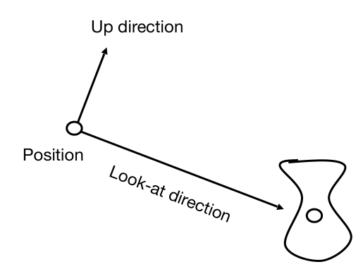
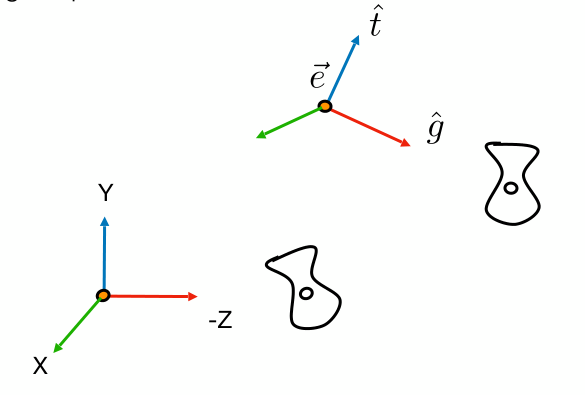
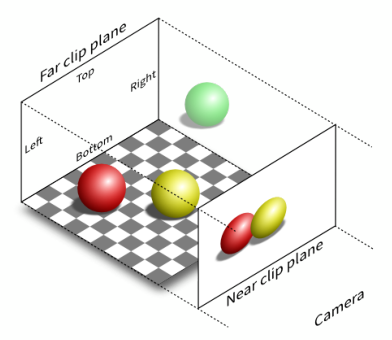
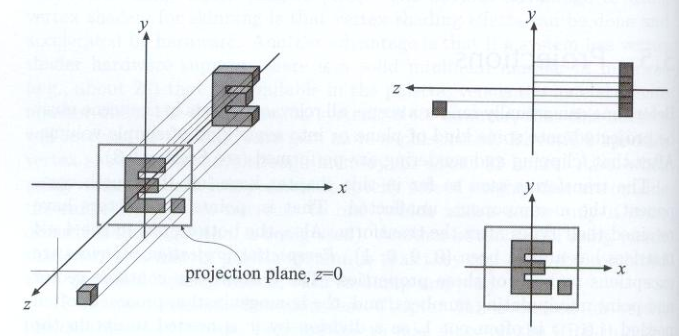
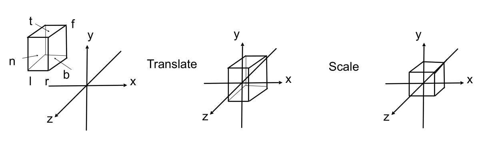
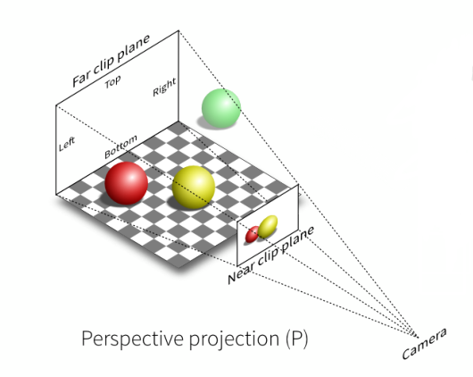
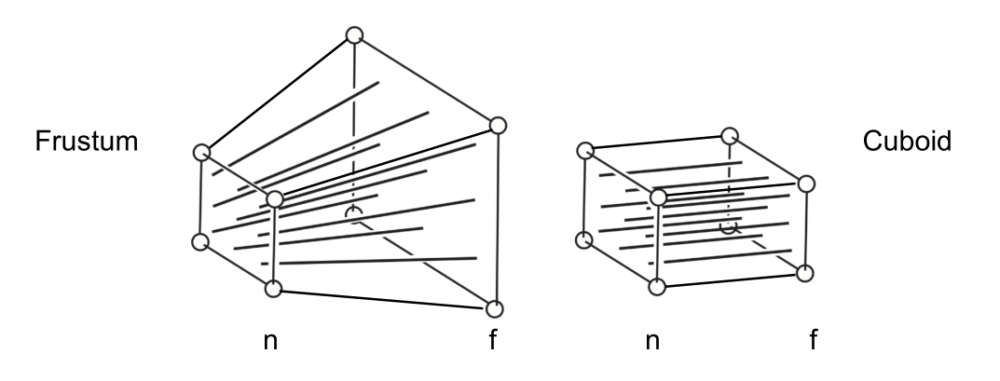
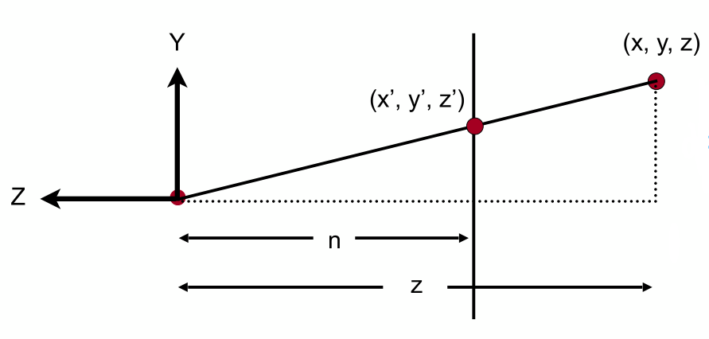

[TOC]

参考资料：

- [GAMES101_Lecture_03_Transformation Cont](./resources/GAMES101/GAMES101_Lecture_04_Transformation Cont.pdf)

- [GAMES101-现代计算机图形学入门-闫令琪](https://www.bilibili.com/video/BV1X7411F744?p=4)

# 1 视图变换

在实际生活中是如何拍照呢？

- 寻找一个漂亮的景色和一群好朋友（模型）
- 将相机摆放到一个位置，调整好角度（视图）
- 茄子！（投影）

**在计算机中，模型是已存在的，那么如何定义相机呢？**

- 定义相机的位置（Position），即 $\vec{e}$
- 定义相机看向的方向，即 $\hat{g}$​
- 定义相机顶部向上的方向，即 $\hat{t}$

好啦，确定好模型，也定义好了相机，如果模型和相机的相对位置不变，那么无论将两者放置在何种环境下，相机拍摄出的模型照片是不会变的。在三维空间中，相机和模型的位置可能是任意位置，那么我们能不能通过相对位置，来使在计算机中“拍照”这个问题更加简化一些呢？在三维空间中，原点的位置的固定的，无论相机位于何处，我们一定可以将相机变换到原点位置，根据相对位置原理，将模型做同样的变化，二者的相对位置不变，“拍照”结果就不会变。

根据上面的思路，我们定义相机的位置永远位于原点，并且看向 $-z$ 方向，相机顶部向上的方向为 $y$​ 方向，接下来，对于任意相机 $M_{view}$，如何将其变换到原点位置呢？

- 移动到原点
- 旋转 $g$ 到 $-z$ 方向
- 旋转 $t$​​ 到 $y$​​​ 方向
- 旋转 $(g \times t)$​ 到 $x$ 方向

该变换过程包含旋转和平移变化，即该变换过程为仿射变换，可以写作：
$$
M_{view} = R_{view}T_{view}
$$
很容易写出平移变换 $T_{view}$​：
$$
T_{view} = \left(\begin{matrix} 1 & 0 & 0 & -x_e \\ 0 & 1 & 0 & -y_e \\ 0 & 0 & 1 & -z_e \\ 0 & 0 & 0 & 1 \end{matrix}\right)
$$
 $g$​​​​​ 到 $-z$​​​​​ 方向、 $t$​​​​​ 到 $y$​​​​​ 方向、 $(g \times t)$​​​​​ 到 $x$​​​​​ 方向的变换不容易得到，尝试从其逆变换的角度思考，即： 旋转 $z$​​​​​ 到 $-g$​​​​​ 方向、旋转 $y$​​​​​ 到 $t$​​​​​ 方向、旋转 $x$ 到 $(g \times t)$​​​​​ 方向，这个逆变换可以写出：
$$
R_{view}^{-1} = \left(\begin{matrix} x_{\hat{g}\times\hat{t}} & x_t & x_{-g} & 0 \\ y_{\hat{g}\times\hat{t}} & y_t & y_{-g} & 0 \\ z_{\hat{g}\times\hat{t}} & z_t & z_{-g} & 0 \\ 0 & 0 & 0 & 1 \end{matrix}\right)
$$
根据正交矩阵特性，可得到 $R_{view}$：
$$
R_{view} = \left(\begin{matrix} x_{\hat{g}\times\hat{t}} & y_{\hat{g}\times\hat{t}} & z_{\hat{g}\times\hat{t}} & 0 \\ x_t & y_t & z_t & 0 \\ x_{-g} & y_{-g} & z_{-g} & 0 \\ 0 & 0 & 0 & 1 \end{matrix}\right)
$$

这个相机变换的过程称为**视图变换**，相机变换完成后，模型只需要做相同变换即可，所以这个过程又称为**视图模型变换**。

模型和视图（相机）已就位，下面就要最后的“拍照”（投影）啦！

# 2 投影变换

投影变换就是将三维物体投影到二维平面中，投影变换分为 **正交投影** 和 **透视投影**。无论是哪一种投影，其实本质都是将三维空间中远平面的点投影到近平面上。

## 2.1 正交投影

在正交投影中，相机摆放位置为无限远，三维物体在二维平面的投影大小不会发生变化，也就是没有远近（近大远小）的概念，如下图所示：

**正交投影的原理**是很容易理解的：

1. 将相机放置于原点，看向 $-z$ 方向，$y$ 方向为向上方向。
2. 丢弃 $z$ 轴坐标。
3. 平移、缩放到 $[-1, 1]^2$ 的正方形中。

在实际的正交投影中，并不是简单的按照上面原理来操作的，而是：

1. 将目标立方体（$[l,r]\times[b,t]\times[f,n]$）的中心点移动到坐标系原点（“$l、r、b、t、f、n$” 分别为立方体的 “左（left）、右（right）、下（bottom）、上（top）、后（far）、前（near）”）。
2. 将原立方体缩放成 $[-1,1]^3$ 的标准立方体（也可称为 正则立方体 或者 规范立方体）。

正交投影的这个移动+缩放操作很容易用矩阵表示：
$$
M_{ortho} = \left(\begin{matrix} \frac{2}{r-l} & 0 & 0 & 0 \\ 0 & \frac{2}{t-b} & 0 & 0 \\ 0 & 0 & \frac{2}{n-f} & 0 \\ 0 & 0 & 0 & 1 \end{matrix}\right)
\left(\begin{matrix} 1 & 0 & 0 & -\frac{r+l}{2} \\ 0 & 1 & 0 & -\frac{t+b}{2} \\ 0 & 0 & 1 & -\frac{n+f}{2} \\ 0 & 0 & 0 & 1 \end{matrix}\right)
$$

## 2.2 透视投影

透视投影的应用要更加广泛，其特点是三维物体在二维平面的投影大小会因离相机的远近发生变化（近大远小），并且，在三维平面中相互平行的先可能不再平行，如下图所示：

在理解透视投影之前，先回顾下齐次坐标，我们知道，对于齐次坐标 $(x,y,z,1)$、$(kx,ky,kz,k)$、$(xz,yz,z^2,z)$，其中 $k\neq0$、$z\neq0$，这三者都表示三维坐标系中的点 $(x,y,z)$，这对于理解透视投影非常有用。

好，下面来介绍**透视投影的原理**：

1. 首先，将由远平面和近平面组成的一个截面体“挤压”成一个长方体（可用矩阵符号表示为 $M_{persp->ortho}$）。

   > 但是，在这里我们要做几个前提定义：一是变换前后近平面不会发生任何变化（即近平面上的点不会发生任何变化），远平面依然是远平面（由于“挤压”，远平面的 $x、y$ 坐标一定发生变化，但 $z$ 坐标不变；二是无论是远平面还是近平面，还是两者之间与二者相平行的任意平面，其中心点在“挤压”前后是不变的。

2. 然后，对立方体做正交投影（$M_{ortho}$）。

到这里，我们知道透视投影需要经历 $M_{persp->ortho}$ 和 $M_{ortho}$ 两个变换，而 $M_{ortho}$ 我们已经在2.1中推导出了，我们只需要推导出 $M_{persp->ortho}$ 即可，下面就来一步一步完成这个推导过程：

1. 首先，我们要找到投影变换前后两个点 $(x,y,z)$ 、$(x^\prime,y^\prime,z^\prime)$ 的关系，如下图：

   

   上图表示从侧面看透视投影，$(x,y,z)$ 为远平面上的原始点，$(x^\prime,y^\prime,z^\prime)$ 为透视到近平面上的点，根据相似三角形原理，很容易得出：
   $$
   y^\prime=\frac{n}{z}y
   $$
   同理可得：
   $$
   x^\prime=\frac{n}{z}x
   $$
   用齐次坐标表示投影前后点的关系为：
   $$
   \left(\begin{matrix} x \\ y \\ z \\ 1 \end{matrix}\right)=>
   \left(\begin{matrix} nx/z \\ ny/z \\ unknown \\ 1 \end{matrix}\right)
   $$
   

   将变换后的齐次坐标乘以 $z$：
   $$
   \left(\begin{matrix} x \\ y \\ z \\ 1 \end{matrix}\right)=>
   \left(\begin{matrix} nx \\ ny \\ unknown \\ z \end{matrix}\right)
   $$
   此时，$z$ 的变化是未知的，用矩阵表示这个变换过程为：
   $$
   M_{persp->ortho}^{4\times4} \left(\begin{matrix} x \\ y \\ z \\ 1 \end{matrix}\right)=\left(\begin{matrix} nx \\ ny \\ unknown \\ z \end{matrix}\right)
   $$

   根据变换前后 $x、y$ 的变化，可以求得 $M_{persp->ortho}$ 的部分位置的值：
   $$
   M_{persp->ortho}=\left(\begin{matrix} n & 0 & 0 & 0 \\ 0 & n & 0 & 0 \\ ? & ? & ? & ? \\ 0 & 0 & 1 & 0 \end{matrix}\right)
   $$

   

2. 好的，通过上一步的推到，我们只剩下 $M_{persp->ortho}$ 的第三行没有得到了，那么还有没有我们可以利用的“特殊情况”呢？在介绍透视投影的原理中的第1步时，我们是做了几点前提定义的，即

   > 变换前后近平面不会发生任何变化（即近平面上的点不会发生任何变化），远平面依然是远平面（由于“挤压”，远平面的 $x、y$ 坐标一定发生变化，但 $z$ 坐标不变；二是无论是远平面还是近平面，还是两者之间与二者相平行的任意平面，其中心点在“挤压”前后是不变的。

   对于远平面和近平面这两个特殊面，我们可以通过其上的点做代入法来进一步求解  $M_{persp->ortho}$ 。

   

   **取近平面上一点 $(x,y,n,1)$，**其变换后不会发生任何变化，变换过程表示为：
   $$
   \left(\begin{matrix} x \\ y \\ n \\ 1 \end{matrix}\right)=>\left(\begin{matrix} x \\ y \\ n \\ 1 \end{matrix}\right)
   $$
   将变换后的齐次坐标乘上 $n$：
   $$
   \left(\begin{matrix} x \\ y \\ n \\ 1 \end{matrix}\right)=>\left(\begin{matrix} nx \\ ny \\ n^2 \\ n \end{matrix}\right)
   $$
   在上面我们推到得出：
   $$
   M_{persp->ortho}^{4\times4} \left(\begin{matrix} x \\ y \\ z \\ 1 \end{matrix}\right)=\left(\begin{matrix} nx \\ ny \\ unknown \\ z \end{matrix}\right)
   $$
   将 $n$ 代入 $z$， $M_{persp->ortho}$ 的第三行一定可以表示为 $(0,0,A,B)$，使其满足：
   $$
   (0,0,A,B)\left(\begin{matrix} x \\ y \\ n \\ 1 \end{matrix}\right)=n^2
   $$
   那么可以得到：
   $$
   An+B=n^2
   $$
   

   **取远平面上中心点 $(0,0,f,1)$，**其变换后 $z$ 坐标不变，变换过程可表示为：
   $$
   \left(\begin{matrix} 0 \\ 0 \\ f \\ 1 \end{matrix}\right)=>\left(\begin{matrix} 0 \\ 0 \\ f \\ 1 \end{matrix}\right)=\left(\begin{matrix} 0 \\ 0 \\ f^2 \\ f \end{matrix}\right)
   $$
   同样重复上面近平面点的代入推导，可得到：
   $$
   Af+B=f^2
   $$
   对 $A、B$ 求解可得到：
   $$
   A=n+f \\
   B=-nf
   $$
   至此，我们得到了：
   $$
   M_{persp->ortho}=\left(\begin{matrix} n & 0 & 0 & 0 \\ 0 & n & 0 & 0 \\ 0 & 0 & n+f & -nf \\ 0 & 0 & 1 & 0 \end{matrix}\right)
   $$

好啦，得到 $M_{persp->ortho}$ 后，再做一次正交变换（$M_{ortho}$）就得到了投影变换的最终结果，整个投影变换用矩阵表示为：
$$
M_{persp}=M_{ortho}M_{persp->ortho}
$$
