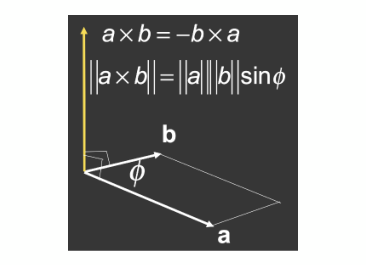
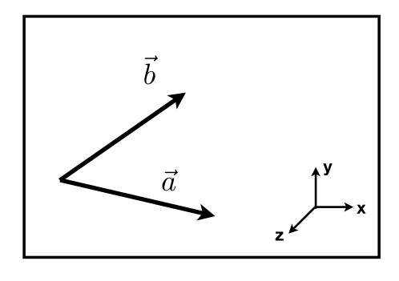
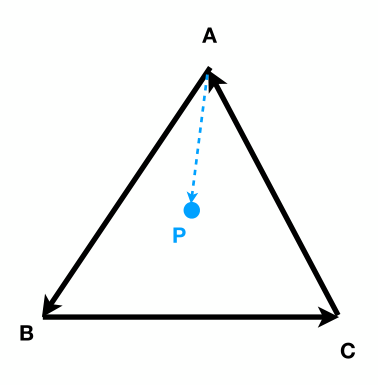

[TOC]

参考资料：

- [GAMES101_Lecture_02_Review of Linear Algebra](./resources/GAMES101/GAMES101_Lecture_02_Review of Linear Algebra.pdf)

- [GAMES101-现代计算机图形学入门-闫令琪](https://www.bilibili.com/video/BV1X7411F744?p=2)

# 1 向量

## 1.1 定义

- 向量通常写作 $\vec{a}$ 或者粗体的 <strong>$a$</strong>，也可以使用起始点来表示 $\vec{AB} = B- A$

- 具有方向和长度，不需要关心绝对的起始点位置

- 向量长度写作 $||\vec{a}||$ 

- 单位向量

  长度为1的向量，由向量 $\vec{a}$ 除以向量长度 $||\vec{a}||$ 得到，写作 â，即 $â = \vec{a} / ||\vec{a}||$，在图形学中，单位向量通常用来标识方向。

- 向量在笛卡尔坐标系中的表示

  

  如上图，X和Y可以是任意向量（两者通常垂直），向量 A 可用坐标表示为（4，3）。

  在图形学中，如果不加特别声明，默认向量的方向是从上到下，称为列向量，表示为 $A = \left(\begin{matrix} x \\ y \end{matrix}\right)$，将列向量的行列互换，得到其转置向量，表示为 $A^T = \left(\begin{matrix} x&y\end{matrix}\right)$，其长度 $||A|| = \sqrt{x^2 + y^2}$

  

## 1.2 向量加法

- 在几何上，可以使用平行四边形法则或者三角形法则
- 在代数上，直接将坐标相加

## 1.3 向量乘法

### 1.3.1 点乘

$$
\vec{a}·\vec{b} = ||\vec{a}||*||\vec{b}||*cos\theta，\ \ \ \ \ \ \ \ \ 
cos\theta = \frac{\vec{a}·\vec{b}}{||\vec{a}||*||\vec{b}||}
$$
向量点乘满足交换律、分配律和结合律，即：

- $\vec{a}·\vec{b} = \vec{b}·\vec{a}$
- $\vec{a}·(\vec{b} + \vec{c})= \vec{a}·\vec{b} + \vec{a}·\vec{c}$
- $(k\vec{a})·\vec{b} = \vec{a}·(k\vec{b}) = k(\vec{a}·\vec{b})$

**笛卡尔坐标系中的点乘**

- 二维中
  $$
  \vec{a}·\vec{b} = \left(\begin{matrix} x_a \\ y_a \end{matrix}\right)·\left(\begin{matrix} x_b \\ y_b \end{matrix}\right) = x_ay_a + x_by_b
  $$
  
- 三维中
  $$
  \vec{a}·\vec{b} = \left(\begin{matrix} x_a \\ y_a \\ z_a \end{matrix}\right)·\left(\begin{matrix} x_b \\ y_b \\ z_b \end{matrix}\right) = x_ax_b + y_ay_b + z_az_b
  $$

**向量点乘在图形学中的应用：**

- 求两个向量的夹角（例如光源与物体表面夹角的余弦值）

- 求一个向量在另一个向量上的投影

  

  如上图，$\vec{b}_\perp$ 表示向量 $\vec{b}$ 在向量 $\vec{a}$ 上的投影，那么 $\vec{b}_\perp$ 一定是沿着 $\vec{a}$ 的方向，可以得到 $\vec{b}_\perp = kâ$ ，从而可得到 $k = ||\vec{b}_\perp|| = ||\vec{b}||·cos\theta$

- 计算两个向量的接近程度

- 向量分解

  

  如上图，向量 $\vec{b}$ 可分解为 $\vec{b}_\perp$ 与 $\vec{b} - \vec{b}_\perp$

- 确定前与后

  

  如上图，有一向量 $\vec{a}$ ，规定从向量 $\vec{a}$ 起点向任意方向看可组成一个圆，虚线部分以上认为与 $\vec{a}$ 同方向或者向前，虚线以下部分认为与 $\vec{a}$ 反方向或者向后，我们知道，锐角的余弦值为正数，钝角的余弦值为负数，那么通过判断 $\vec{a}·\vec{b}$ 的正负即可确定前后。

### 1.3.2 叉乘

- 两个向量叉乘的结果为一个与这两个向量正交的向量，如上图所示

- 叉乘后的向量方向满足右手定则

  所谓右手定则，以 $\vec{a}\times\vec{b}$ 为例，伸出右手，将四指沿着 $\vec{a}$ 到 $\vec{b}$ 的方向弯曲，大拇指所指方向即为叉乘后的向量方向

- 向量叉乘满足分配律和结合律，但是不满足交换律

  - $\vec{a}\times\vec{b} = -\vec{b}\times\vec{a}$
  - $\vec{a}\times(\vec{b} + \vec{c})= \vec{a}\times\vec{b} + \vec{a}\times\vec{c}$
  - $(k\vec{a})\times\vec{b} = \vec{a}\times(k\vec{b}) = k(\vec{a}\times\vec{b})$

**笛卡尔坐标系中的叉乘：**
$$
\vec{a}\times\vec{b} = \left(\begin{matrix} y_az_b-y_bz_a \\ z_ax_b-x_az_b \\ x_ay_b-y_ax_b \end{matrix}\right)
$$

通常，满足 $\vec{x}\times\vec{y} = \vec{z}$ （即右手定则）的坐标系为**右手坐标系**，在OpenGL等API中，会使用**左手坐标系**（满足 $\vec{x}\times\vec{y} = -\vec{z}$ ，即左手定则）

**向量叉乘在图形学中的应用：**

- 判断左和右

  

  假设一个xy平面中存在两个向量 $\vec{a}$ 和 $\vec{b}$ ，根据右手定则，如果 $\vec{a}\times\vec{b}$ 的结果为正，那么说明  $\vec{b}$ 在 $\vec{a}$ 的左侧；反之，如果结果为负，那么说明  $\vec{b}$ 在 $\vec{a}$ 的右侧。

- 判断内和外

  

  假设平面中存在A、B、C三个点，这三个点沿着逆时针方向构成一个三角形，现有一P点，判断P点在三角形外部还是内部？

  首先，利用向量向量叉乘和右手定则，计算 $\vec{AB}\times\vec{AP}$ ，可以得到  $\vec{AP}$ 在 $\vec{AB}$ 的左侧，即点P在AB的左侧，依次计算 $\vec{BP}\times\vec{BC}$ 和  $\vec{CA}\times\vec{CP}$，发现P点也在BC和AC的左侧，那么可以得到P点在三角形内；同样，如果A、B、C三点沿顺时针组成三角形，可以得到P点在AC、CB、BA的右侧，也说明P点在三角形内。**简而言之，无论A、B、C三点的方向如何，只要满足P点总是在任意条边的一侧，便说明P点在三角形内部**。

  

在三维中，如果存在 $\vec{u}$ 、 $\vec{v}$ 、$\vec{w}$ 三个向量，且这三个向量满足：$||\vec{u}||=||\vec{v}||=||\vec{w}||=1$ 、$\vec{u}·\vec{v} = \vec{v}·\vec{w} = \vec{u}·\vec{w} = 0$，那么根据右手定则，可以得到：$\vec{w} = \vec{u}\times\vec{v}$，这三个向量构成了一个三维坐标系。

三维空间中任一向量，都可以分解成投影到 $\vec{u}$ 、 $\vec{v}$ 、$\vec{w}$ 组成的向量：$\vec{p} = (\vec{p}·\vec{u})\vec{u} = (\vec{p}·\vec{v})\vec{v} = (\vec{p}·\vec{w})\vec{w}$

# 2 矩阵

## 2.1 定义

$$
\left(\begin{matrix} 1 & 2 & 3 \\ 3 & 6 & 2 \\ 7 & 8 & 6 \\ 9 & 3 & 5 \end{matrix}\right)
$$

矩阵就是一个排列成m行、n列的数的集合。上面示例为一个 4 x 3 的矩阵。

## 2.2 矩阵相乘

矩阵A与B能够相乘需要必须满足A的列数等于B的行数，即A为 M x N 矩阵，B为 N x P 矩阵，其结果为一个 M x P 矩阵。如下
$$
\left(\begin{matrix} 1 & 2 \\ 3 & 5 \\ 5 & 6 \end{matrix}\right)
\left(\begin{matrix} 1 & 2 & 3 & 4 \\ 5 & 6 & 7 & 8 \end{matrix}\right)
=
\left(\begin{matrix} 11 & 14 & 17 & 20 \\ 28 & 36 & 44 & 52 \\ 35 & 46 & 57 & 68 \end{matrix}\right)
$$
矩阵相乘的简单记法为：矩阵A和B相乘，假如要求计算结果的第一行第一列的数，那么计算方式为A的第一行与B的第一列中的数一一相乘，然后相加求和即为结果。在上面的示例中，求结果矩阵中第一行第一列的数的计算公式式为：$1\times1 + 2\times5 = 11$，依此类推，便可得到整个结果矩阵。

矩阵相乘满足分配律和结合律，但是不满足交换律：

- $AB \neq BA$（通常情况下）

- $(AB)C = A(BC)$
- $A(B+C) = AB+AC$

## 2.3 矩阵转置

$$
A = 
\left(\begin{matrix} 1 & 2 \\ 3 & 4 \\ 5 & 6 \end{matrix}\right), \ \ \ \ \ \ 
A^T =
\left(\begin{matrix} 1 & 3 & 5 \\ 2 & 4 & 5 \end{matrix}\right)
$$

矩阵转置还满足：

- $(AB)^T = B^TA^T$

**单位矩阵：**

对角线元素为1，其余元素都为0的矩阵，表示为 $I$ 如：
$$
I_{3\times3}\ = \left(\begin{matrix} 1 & 0 & 0\\ 0 & 1 & 0 \\ 0 & 0 & 1 \end{matrix}\right)
$$

**逆矩阵：**

与原矩阵 $A$ 相乘结果为单位矩阵的矩阵，表示为 $A^{-1}$，即

- $AA^{-1} = A^{-1}A = I$
- $(AB)^{-1} = B^{-1}A^{-1}$

## 2.4 矩阵形式的向量乘法

在用矩阵形式表示向量乘法时，我们认为向量为列向量，即 $M \times 1$ 矩阵。

### 2.4.1 向量点乘

$$
\begin{align}
\vec{a}\cdot\vec{b} 
& = \vec{a}^T\cdot\vec{b} \\ \\
& = \left(\begin{matrix} x_a & y_a & z_a \end{matrix}\right)
\left(\begin{matrix} x_b \\ y_b \\ z_b \end{matrix}\right) \\ \\
& =(x_ax_b + y_ay_b + z_az_b)
\end{align}
$$

### 2.4.2 向量叉乘

$$
\begin{align}
\vec{a}\times\vec{b} 
& = A^*b \\ \\
& = \left(\begin{matrix} 0 & -z_a & y_a \\ z_a & 0 & -x_a \\ -y_a & x_a & 0 \end{matrix}\right)
\left(\begin{matrix} x_b \\ y_b \\ z_b \end{matrix}\right)
\end{align}
$$

