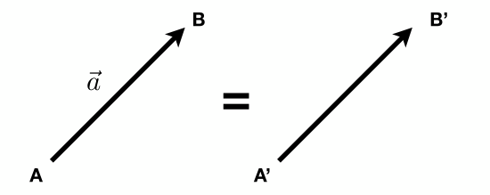
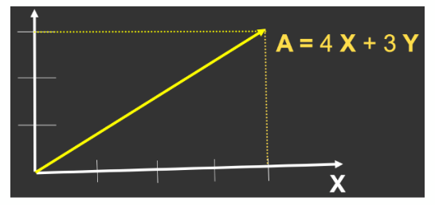
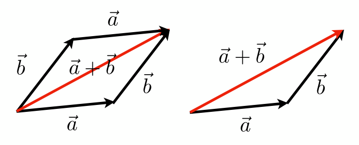
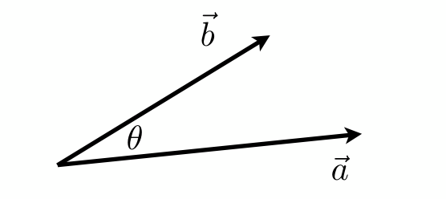
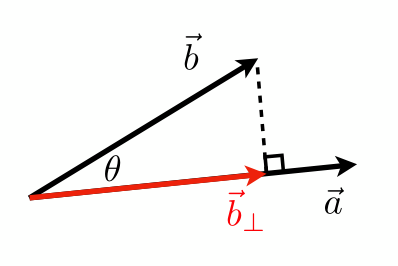
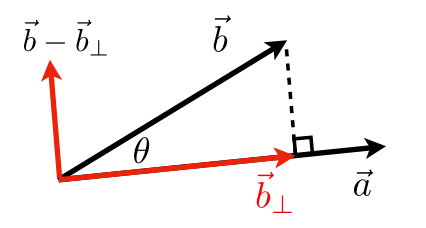
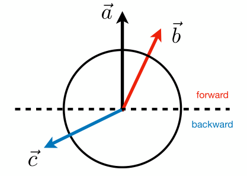

[TOC]

参考资料：

- [GAMES101_Lecture_02_Review of Linear Algebra](./resources/GAMES101/GAMES101_Lecture_02_Review of Linear Algebra.pdf)

- [GAMES101-现代计算机图形学入门-闫令琪](https://www.bilibili.com/video/BV1X7411F744?p=2)

# 1 向量

## 1.1 定义

- 向量通常写作 $\vec{a}$ 或者粗体的 <strong>$a$</strong>，也可以使用起始点来表示 $\vec{AB} = B- A$

- 具有方向和长度，不需要关心绝对的起始点位置

- 向量长度写作 $||\vec{a}||$ 

- 单位向量

  长度为1的向量，由向量 $\vec{a}$ 除以向量长度 $||\vec{a}||$ 得到，写作 â，即 $â = \vec{a} / ||\vec{a}||$，在图形学中，单位向量通常用来标识方向。

- 向量在笛卡尔坐标系中的表示

  

  如上图，X和Y可以是任意向量（两者通常垂直），向量 A 可用坐标表示为（4，3）。

  在图形学中，如果不加特别声明，默认向量的方向是从上到下，称为列向量，表示为 $A = \left(\begin{matrix} x \\ y \end{matrix}\right)$，将列向量的行列互换，得到其转置向量，表示为 $A^T = \left(\begin{matrix} x&y\end{matrix}\right)$，其长度 $||A|| = \sqrt{x^2 + y^2}$

  

## 1.2 向量加法

- 在几何上，可以使用平行四边形法则或者三角形法则
- 在代数上，直接将坐标相加

## 1.3 向量乘法

### 1.3.1 点乘

$$
\vec{a}·\vec{b} = ||\vec{a}||*||\vec{b}||*cos\theta，\ \ \ \ \ \ \ \ \ 
cos\theta = \frac{\vec{a}·\vec{b}}{||\vec{a}||*||\vec{b}||}
$$
向量点乘满足交换律和结合律，即：

- $\vec{a}·\vec{b} = \vec{b}·\vec{a}$
- $\vec{a}·(\vec{b} + \vec{c})= \vec{a}·\vec{b} + \vec{a}·\vec{c}$
- $(k\vec{a})·\vec{b} = \vec{a}·(k\vec{b}) = k(\vec{a}·\vec{b})$

**笛卡尔坐标系中的点乘**

- 二维中
  $$
  \vec{a}·\vec{b} = \left(\begin{matrix} x_a \\ y_a \end{matrix}\right)·\left(\begin{matrix} x_b \\ y_b \end{matrix}\right) = x_ay_a + x_by_b
  $$
  

- 三维中
  $$
  \vec{a}·\vec{b} = \left(\begin{matrix} x_a \\ y_a \\ z_a \end{matrix}\right)·\left(\begin{matrix} x_b \\ y_b \\ z_b \end{matrix}\right) = x_ax_b + y_ay_b + z_az_b
  $$

**向量点乘在图形学中应用：**

- 求两个向量的夹角（例如光源与物体表面夹角的余弦值）

- 求一个向量在另一个向量上的投影

  

  如上图，$\vec{b}_\perp$ 表示向量 $\vec{b}$ 在向量 $\vec{a}$ 上的投影，那么 $\vec{b}_\perp$ 一定是沿着 $\vec{a}$ 的方向，可以得到 $\vec{b}_\perp = kâ$ ，从而可得到 $k = ||\vec{b}_\perp|| = ||\vec{b}||·cos\theta$

- 计算两个向量的接近程度

- 向量分解

  

  如上图，向量 $\vec{b}$ 可分解为 $\vec{b}_\perp$ 与 $\vec{b} - \vec{b}_\perp$

- 确定前与后

  

  如上图，有一向量 $\vec{a}$ ，规定从向量 $\vec{a}$ 起点向任意方向看可组成一个圆，虚线部分以上认为与 $\vec{a}$ 同方向或者向前，虚线以下部分认为与 $\vec{a}$ 反方向或者向后，我们知道，锐角的余弦值为正数，钝角的余弦值为负数，那么通过判断 $\vec{a}·\vec{b}$ 的正负即可确定前后。

# 2 矩阵

...未完待续

