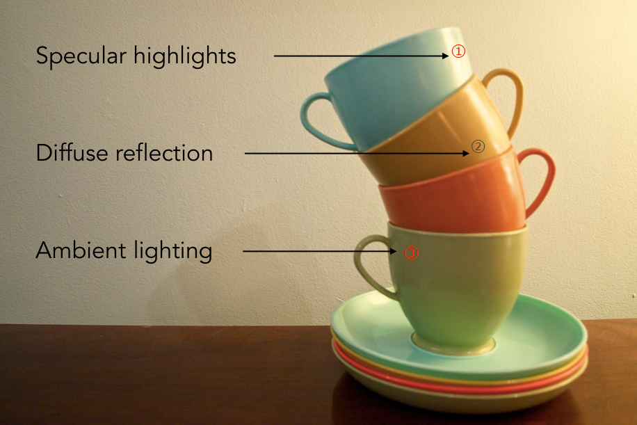
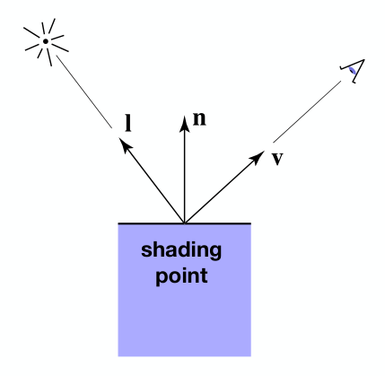

[TOC]

参考资料：

- [GAMES101_Lecture_07_Shading 1](./resources/GAMES101/GAMES101_Lecture_07_Shading 1.pdf)
- [GAMES101_Lecture_07_Shading 2](./resources/GAMES101/GAMES101_Lecture_07_Shading 2.pdf)
- [GAMES101_Lecture_07_Shading 3](./resources/GAMES101/GAMES101_Lecture_07_Shading 3.pdf)
- [GAMES101-现代计算机图形学入门-闫令琪](https://www.bilibili.com/video/BV1X7411F744?p=6)

**在计算机图形学中，着色就是对不同物体应用不同材质的过程。**

# 1 布林冯反射模型

先来看一张照片：

观察上图中的茶杯，不难发现光源在右上侧方向，茶杯在光照下明显有几处特征：

- 在图中①所标记位置，可以观察到高光（Specular highlights）。
- 在茶杯表面其余位置，如②，整个茶杯的明暗是否变化的，学习过物理后我们知道这是光的漫反射（Diffuse reflection）引起的。
- 在茶杯的提手附近位置，按理来讲光源是无法直接照射到的，但是我们依然能够看到，说明还是有光经过这些位置的反射到达了我们的眼中。虽然光源无法直达，但是由于除了茶杯之外的其他物体发生了漫反射，总会有一部分光到达这些位置，然后反射到我们眼中，这部分光称为环境光（Ambient lighting）。

那么，如何将上述经验应用到计算机图形学中，从而达到更加真实的渲染效果呢？

## shading point

我们知道，实际中的物体表面可能是平面，也可能是曲面，但是，在图形学中，我们规定，在一个极小的范围内，物体的表面就是一个平面，这个范围称为 **shading point**。

同时，在 shading point 上做一些其他的定义，如下图：

- 观测方向，**v**
- 物体表面法线，**n**
- 光线方向，**l**
- 物体表面属性，如颜色等

**shading $\ne$​ shadow**

在着色中，只考虑物体表面对光的反射，不考虑物体是否被遮挡，是否在阴影中等问题。

