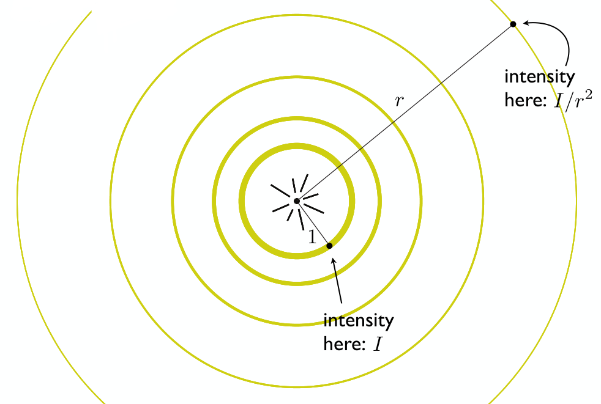

[TOC]

参考资料：

- <a href="./resources/GAMES101/GAMES101_Lecture_07_Shading 1.pdf" target="_blank">GAMES101_Lecture_07_Shading 1</a>
- <a href="./resources/GAMES101/GAMES101_Lecture_07_Shading 2.pdf" target="_blank">GAMES101_Lecture_07_Shading 2</a>
- <a href="./resources/GAMES101/GAMES101_Lecture_07_Shading 3.pdf" target="_blank">GAMES101_Lecture_07_Shading 3</a>
- <a href="https://www.bilibili.com/video/BV1X7411F744?p=6" target="_blank">GAMES101-现代计算机图形学入门-闫令琪]</a>

**在计算机图形学中，着色就是对不同物体应用不同材质的过程。**

先来看一张照片：

观察上图中的茶杯，不难发现光源在右上侧方向，茶杯在光照下明显有几处特征：

- 在图中①所标记位置，可以观察到高光（Specular highlights）。
- 在茶杯表面其余位置，如②，整个茶杯的明暗是否变化的，学习过物理后我们知道这是光的漫反射（Diffuse reflection）引起的。
- 在茶杯的提手附近位置，按理来讲光源是无法直接照射到的，但是我们依然能够看到，说明还是有光经过这些位置的反射到达了我们的眼中。虽然光源无法直达，但是由于除了茶杯之外的其他物体发生了漫反射，总会有一部分光到达这些位置，然后反射到我们眼中，这部分光称为环境光（Ambient lighting）。

在计算机图形学中，通过**布林冯反射模型**来实现着色。

# 1 布林冯反射模型

**布林冯反射模型定义要从三个角度考虑来完成着色：**

- **漫反射**
- **高光**
- **环境光**

**着色点**

我们知道，实际中的物体表面可能是平面，也可能是曲面，但是，在图形学中，我们规定，在一个极小的范围内，物体的表面就是一个平面，这个范围称为**着色点（shading point）**。

同时，在 shading point 上做一些其他的定义，如下图：

- 观测方向，$\vec{v}$
- 物体表面法线，$\vec{n}$
- 光线方向，$\vec{l}$
- 物体表面属性，如颜色等

**shading $\ne$​ shadow**

在着色中，只考虑物体表面对光的反射，不考虑物体是否被遮挡，是否在阴影中等问题。

## 漫反射

首先，来回顾下漫反射的**特点**，如下图：

- 光线向各个方向均匀的散射。
- 在任意方向看到的物体表面颜色都是相同的。

**那么，在上面的茶杯示例中，为什么一个杯子的不同位置有明暗的区别呢？**

假设存在如下这样一束光，垂直照射物体表面，那么着色点可以接收到全部的光线：

如果物体表面倾斜一定角度，那么只能接收到部分光线：

接下来，将着色点的一系列定义应用到这个物体表面：

不难发现，可以直接用光线防线 $\vec{l}$ 和法线方向 $\vec{n}$ 之间的夹角 **$\theta$** 来描述物体表面接收到的光纤多少，**$\theta$** 越大，接收到的光线越少，应用向量点乘，可以得到
$$
cos\theta = \vec{l}·\vec{n}
$$

依然以茶杯为例，如果从距离茶杯10m远的位置和1m远的位置分别看茶杯，茶杯同一位置的亮度肯定是不同的，一定是1m的距离看要更亮一些，生活经验可以给我们这个结论，究其原因，很简单，一定是更远的距离导致进入我们眼睛的光线更少，从而茶杯更暗。 但是只知道原因不够的，在计算机图形学中，需要能够量化接收到的光线才能够进行渲染。

那么，**对于不同位置接收到的光线强度是如何量化的呢？**

来看下面这张图：

上图中，中心点表示光源，光源外一个一个圆表示不同大小的球面（由于在三维空间中），距离光源最近的球面与光源的距离为单位距离1，我们定义，该球面上任一点接收到的光线强度为 $I$，根据能量守恒原理，照射到最外侧球面（距离光源距离为 $r$​）上的光线总强度是不变的，那么该球面上任一点接收到的光线强度为 $I/r^2$​。

这样，我们就可以将不同距离接收到的光线强度进行量化了。

好，通过上面对**物体表面的倾斜角度对接收到的光线强度的影响**和**物体到光源的距离对接收到的光线强度的影响**，可以整理得到计算漫反射光的公式：

- 通过 $I/r^2$ 可以计算得到着色点位置可以接收到的光的强度。

- 通过 $\vec{n}·\vec{l}$​ 可以计算得到由于着色点表面的倾斜，可以接收到的光的强度。这里为什么要用 $max(0, \vec{n}·\vec{l})$​ 呢？我们知道当 $\theta > 90°$ 时，$cos\theta < 0$​​​，​​​光线根本就照射不到着色点表面，没有意义，直接取0即可。

- $k_d$​ 表示漫反射系数，物体对光漫反射后，我们除了可以看到明暗的区别，还能看到物体的颜色，这个颜色就可以用漫反射系数来体现，将其表示成rgb三通道的向量，便可以计算得到漫反射后的颜色。通过下图可直观的看到不同的漫反射系数对结果的影响：

  

- 从公式中可以看到，计算漫反射光与观测方向 $\vec{v}$ 无关，这也符合漫反射的特征。

## 高光

想必大家对这种小镜子并不陌生：

甚至绝大多数人对其都有年少的回忆，在中午的教室窗边，拿出小镜子将阳光反射到墙面上，或者晃一晃同学:satisfied:......  当反射后的光晃到我们的眼睛时，会非常的刺眼，眼中所见全是白茫茫的光亮，我们知道，这是镜面反射。

那么在文章最开始的茶杯例子中，我们看到的那些高光的位置，同样只能看到白色光亮而看不到杯子本身的颜色，这与镜面反射是不是有什么关系呢？答案是肯定的，当我们的**观测方向** $\vec{v}$ **越接近光线的镜面反射反向 $\vec{R}$ (即两者的夹角越小)，高光越明显**，如下图所示：

要计算 $\vec{v}$ 与 $\vec{R}$ 的夹角是比较困难的，布林冯模型巧妙地将引入**半程向量** $\vec{h}$ 来解决这个问题，如下图：

- 所谓半程向量 $\vec{h}$​​​​，就是 $\vec{l}$​​​​ 和 $\vec{v}$​​​​ 的角平分线方向，计算半程向量方向很简单，根据平行四边形法则，只需要将 $\vec{l}$​​​​ 和 $\vec{v}$​​​​ 相加然后再除以二者长度即可。那么为什么引入半程向量呢？观察上面两个图可以发现，观测方向 $\vec{v}$​​​​ 与镜面反射方向 $\vec{R}$​​​​ 的夹角越小，则发现 $\vec{n}$​​​​ 与半程向量 $\vec{h}$​​​​ 的夹角 $\alpha$​​​​​ 越小，那么就可以通过 $\alpha$​ 的大小来判断高光的亮度。

- 高光还需要考虑物体的镜面系数 $k_s$，以及接收到的光线强度 $I/r^2$。

- 在公式的最后部分 $max(0,\vec{n}·\vec{h})^p$，为什么加入一个指数 $p$ 呢？这与余弦函数的特性有关，下面是不同的指数 $p$ 对余弦函数的影响：

  

  当 $p=1$ 时，$\alpha$​ 的角度范围非常大，体现到计算高光的结果中，意味着观测方向与镜面反射方向的夹角比较大时也能看叫高光现象，这显然有很大的误差。通过增大 $p$ 的值，$\alpha$ 的角度范围越来越小，就越来越接近实际的高光效果。

最后，再来直观地看一下 $k_s$ 和 $p$ 对高光渲染的影响：

## 环境光

在文章开遍的茶杯例子中，虽然杯子的有些位置是光源无法直接照射到的，但是我们仍然能看到这些位置，这是因为这些位置接受并反射了各种环境中反射过来的光。

在布林冯反射模型中，**假设**任意位置接收到的环境光照强度为一**固定值** $I_\alpha$​，同样需要考虑物体的环境光系数 $k_\alpha$，那么可以得到环境光的计算公式，如下图：

既然 $I_\alpha$ 和 $k_\alpha$ 都是固定值，那么最后计算出的环境光 $L_\alpha$ 就一定是固定值，考虑到 $k_\alpha$​ 中包含了物体的颜色，其实最后环境光计算出来之后就是一个固定的颜色，主要就是用来提高亮度，保证没有完全黑暗的部分。

**切记：布林冯模型中的环境光是假设的，真实的环境光不是固定值。**

到这里，布林冯反射模型就介绍完毕了，来看一下将漫反射、高光和环境光全部加到一起后的着色效果吧：

# 2 着色频率

首先，来看一组着色效果图：

很明显，从左到右，着色的效果越来越好，左图是对多个三角形组成的平面进行着色；中图是对每个三角形的定点进行着色，三角形内部通过差值法来实现平滑的过度效果；右图是对每个像素进行着色。这三种着色方式，就分别对应下面三种着色频率：

## Flat shading

对每个三角形进行着色，通过三角形的两条边的叉积得到三角形平面的法线方向，然后进行着色。这种着色方式不适合光滑的平面。

## Gouraud shading

对每个三角形的定点进行着色，求出每个定点的法线，然后计算着色。三角形内部通过差值法进行着色。

## Phong shading

对每个像素进行着色。

在对比选择三种着色频率时，需要根据模型的实际情况进行选择：

通过上图可以看到，当模型精细（包含的三角形数量多）到一定程度，Flat shading就能够得到很不错的着色效果，这种情况下，选择Phong shading不但对着色效果的提升有限，而且还会加大计算量，得不偿失。

# 3 图形管线

图形管线（Graphics Pipeline）就是从"场景输入$\Rightarrow$投影变换$\Rightarrow$光栅化$\Rightarrow$着色$\Rightarrow$​​渲染输出" 的一系列过程。如下图：

现在的GPU已经集成好了这一整套过程，我们只需要输入，GPU即可完成渲染输出，只不过，在一些GPU中允许用户都这一过程中的部分环节进行自定义编程（可以通过OpenGL等API），如着色，从而使渲染效果更加灵活。

# 4 纹理映射

先来看下面这样一张图：

在光源照射下，球体的表面（左侧箭头所指）呈现出黄、蓝、红等不同的颜色，地板也呈现出不同的纹理（右侧箭头所指），在了解了布林冯反射模型的漫反射后，根据漫反射公式，我们知道物体表面的颜色是由漫反射系数 $k_d$ 决定的，也就是物体表面的属性，那么在计算机图形学中，如何对物体表面的不同位置定义不同的属性呢？这就是**纹理映射**要解决的问题。

## 什么是纹理映射？

在生活中，我们一定都见过这两种东西：地球仪和世界地图，前者是一个三维的球体，后者是一张二维的平面图。对于地球仪上的任一位置，我们都可以在二维的世界地图上找到其对应的位置，如下图所示：

同样，对于二维的世界地图上的任一位置，也都能在地球仪上找到其对应位置，可以想象可以将二维的世界地图完全包裹住地球仪的表面，这其实就是纹理映射。

约定，三维物体的表面是平面，三维物体表面上的任一点都映射到一个二维平面上的点，这个二位平面就称为**纹理**，而这个映射关系就称为**纹理映射**。

这是一张应用纹理映射前后的渲染效果图：

在上图中：

- 第一排最左侧是没有应用纹理映射，只通过布林冯反射模型渲染的效果图。
- 第一排中间为应用了纹理映射后的效果图。
- 第一排最右侧为应用纹理映射所使用的纹理图。

我们知道，在进行光栅化时使用的是三角形，当三维物体表面的三角形足够小时，其一定可以映射到纹理图中对应的一个三角形上，这个位置的映射关系，也就是纹理图如何得到，暂且不需要考虑，明白原理即可。

三维物体表面三角形的每个顶点映射到纹理图中的位置，我们也用坐标来表示，对纹理图建立坐标系，如下图，其坐标轴名称为 $u$ 和 $v$。纹理图中点的坐标到原点的距离可以用颜色来直观的表示，$u$ 越大，颜色越红，$v$ 越大，颜色越绿。

接下来，来看这样一张渲染效果图：

显示其纹理坐标：

可以看到，在显示纹理坐标的途中，有很多重复的方块，每个方块都是一个纹理，纹理发生了重复，或者说多次使用，这个是没有问题的，**纹理是可以重复的**。

为了使三角形内部点的渲染更加的平滑，在知道了三角形顶点的纹理坐标后，也要想办法能计算出三角形内部任一点对应的纹理坐标，从而得到更加平滑的渲染效果，那么如何计算三角形内部任一点对应的纹理坐标呢？

## 重心坐标

根据三角形的顶点计算三角形内任一点的过程就是在三角形内计算插值，重心坐标就是用来在三角形内计算插值的。

**为什么做插值？**

在上面的内容中，有很多着色相关的操作是对三角形的顶点进行计算的，如果要实现三角形内部的平滑过渡，就需要在三角形内部进行插值。

**插值什么？**

三角形的三个顶点都有对应的纹理坐标，那么经过插值，我们可以得到三角形内的任一点对应的纹理坐标，以及其颜色、法线方向等。

**怎么做插值？**

通过重心坐标。

### 什么是重心坐标？

给定三角形 $\Delta ABC$ 内一点 $(x,y)$，存在 $\alpha、\beta、\gamma$ 满足
$$
(x,y)=\alpha A + \beta B + \gamma C \\
\alpha + \beta + \gamma=1 \\
\alpha\geq0,\beta\geq0,\gamma\geq0
$$
那么 $(\alpha,\beta,\gamma)$ 称为点 $(x,y)$ 在三角形 $\Delta ABC$ 中的重心坐标，如下图：

### 如何计算重心坐标？

给定三角形 $\Delta ABC$ 内任意一点，将该点与三个顶点连线，可以将三角形分为三个小的三角形，将顶点A对面的三角形（即与A点不相邻）称为 $A_A$ ，顶点B对面的三角形称为 $A_B$ ，顶点C对面的三角形称为 $A_C$ ，那么，可以通过 $A_A,B_B,C_C$ 与  $\Delta ABC$  面积的比值求出重心坐标，如下图所示：

根据上面计算重心坐标的方法，我们可以得到一个特殊的重心坐标： $\Delta ABC$ 的重心的重心坐标，如下图所示：

给定三角形 $\Delta ABC$ 内任意一点 $(x,y)$ ，根据面积求重心坐标的方法，可以进一步推导出重心坐标的求解公式为：

### 如何应用重心坐标？

重心坐标可以用来计算三角形内任一点的坐标、纹理坐标、颜色、法线、深度、材质等。

**但是，重心坐标并不是不变的，它在投影后是会发生变化的！**在计算三维空间中三角形的重心坐标时，一定要使用其三维坐标进行计算。

## 纹理放大（Texture Magnification）

纹理可以用来**计算漫反射颜色**，原理很简单：计算每个采样点坐标 $(x,y)$ 对应的纹理坐标 $(u,v)$，得到其纹理坐标的颜色，然后将该颜色设置到采样点上。

虽然纹理的应用原理很简单，但是在实际应用中，也可能会出现下面的各种问题。

### 纹理太小导致

假设屏幕分辨率为4K，纹理分辨力为256，那么在计算屏幕像素点（pixel）的纹理坐标时，就可能会得到非整数的纹理坐标，在获取这个非整数纹理坐标的属性值时，直接取其距离最近的整数纹理坐标的属性，也就是其所在texel（纹理中的像素点）中心点的属性，那么，就可能出现一个texel映射到多个pixel上，如下图所示：

像素点p1、p2、p3、p4分别映射到纹理中的非整数坐标t1、t2、t3、t4，由于就近取整，在渲染时，p1、p2、p3、p4像素点都会渲染t1、t2、t3、t4所在的同一个textel，这时就会出现纹理放大现象，如下图所示效果：

#### 双向线性插值（Bilinear）

简称双线性插值，首先来解释下什么是**双向**。

我们知道，在纹理映射中，如果得到非整数的纹理坐标，直接就近取整可能导致比较严重的纹理放大现象，既然如此，那就不再就近取整，而是通过非整数纹理坐标附近（上下、左右）的四个texel来计算，这就是所谓的双向，如下图：

接下载，再来看一下什么是**线性插值**。

所谓的线性插值，就是定义出来的一种操作，假设 $x$ 为 $v_0$ 和 $v_1$ 间的一点，对 $x$ 进行线性插值：
$$
lerp(x,v_0,v_1) = v_0 + x(v_1 - v_0);
$$

双线性插值就是先对非整数纹理坐标的两个水平方向进行线性插值，然后再对其结果进行竖直方向的线性插值，如下图所示：

对上面的示例应用双线性插值，得到的效果非常明显：

#### 双向三次线性插值（Bicubic）

这是进一步优化的算法，在计算时要用到非整数纹理坐标附近的16个texel来计算，这里就不再详述，其效果当然要比双线性插值要更好，但是需要进行更多的计算。

### 纹理太大导致

再来看下面一个纹理的应用效果图：

上图中，左侧为三维物体经过投影后的图像，右侧为应用纹理后渲染出的效果图，图中出现了很明显的摩尔纹和锯齿，也就是走样。我们知道，引起走样的根本原因是采样频率太低，那么在应用纹理时，如何从采样的角度来解释这个问题呢？

对于上面这个示例，我们很明显可以看到，距离屏幕近处的像素点，所代表的实际区域面积比较小，也就是它在纹理中覆盖的区域比较小；距离屏幕越远，像素点代表的实际区域面积越大，也就是它在纹理中覆盖的区域越大，如下图：

距离屏幕越远的像素点，在纹理中覆盖的区域越大，这块纹理区域内的信息变化的频率也就越大，而仅仅用一个平均值对其采样，当然无法很好的还原，进而引起了走样。

那么，解决走样问题最简单直接的方法当然就是提高采样频率，所以为了解决上面出现的走样问题，当然可以使用更高的采样频率，比如将一个像素点分成512个采样点，得到如下的渲染效果：

效果非常明显，但是这会付出更多的代价。既然如此，那能不能不通过采样，直接计算出纹理区域的平均值（也就是所谓的范围查询）呢？

#### MipMap

MipMap允许对纹理区域进行范围查询，它很**高效**，但是它计算出的是一个**近似值**，并且它只能对**正方形**的区域进行范围查询。

MipMap就是将一张纹理生成更多的纹理，没生成一张纹理，将其分辨率降低一倍，知道最后生成的纹理的分辨率为1x1，如下图所示（随着分辨率的降低，纹理的尺寸是越来越小的，这里只是为了方便对比，将每张纹理都拉伸到了相同大小）：

在上图中，可以看到每张图片都标记了一个 **Level**，也就是层级，原图的层级为0，每生成一张纹理，层级加1，这些不同层级的纹理，组成了一个图像金字塔：

MipMap虽然生成了这么多额外的纹理，但是其**额外消耗的空间仅是原始空间的三分之一**，这些图的生成是可以提前生成的，也就是预生成，这也是MipMap效率高的一个原因。

既然生成了这么多不同层级的纹理，那么是如何应用的呢？

来看下面这个纹理映射的示例：

左图表示屏幕中由像素点组成的三角形，对其中的一个像素点（红色背景标记）进行纹理映射，右图为其对应的纹理坐标，同时找到该像素点临近2个像素点（上面和右面）的纹理坐标，右图中虚线框出的红色多变形为该像素点**实际应该**覆盖的纹理区域，L为该像素点的纹理坐标距离其临近两个像素点的纹理坐标的距离的最大值，即
$$
L = max(\sqrt{(\frac{du}{dx})^2 + (\frac{dv}{dx})^2},\sqrt{(\frac{du}{dy})^2 + (\frac{dv}{dy})^2})
$$
得到L后，我们近似地认为该像素点覆盖地纹理区域为以其纹理坐标为中心，边长为L的正方形：

那好，接下来我们只需要计算出这个边长为L的正方形的平均值即可。如果L的长度为1，那是最好的，不需要计算就可以直接得到，那么能不能实现呢？

这就轮到MipMap生成的那么多层级的纹理上场了，以2为底求L的对数：
$$
D = log_2L
$$
找到MipMap生成的层级为D的纹理，在原图中边长为L的正方形，到了这一层级的纹理上，边长就是1！那么，边长为L的正方形的平均值很容易就得到了。

对下面这张图应用MipMap：

显示其纹理坐标：

可以看到，纹理的变化非常明显，每一个颜色都代表了不同层级的纹理，但是也可以看到纹理之间很明显的界限，也就是说纹理的变化并不是很平滑，尤其是在距离屏幕比较近的位置，如途中用白色矩形标记的位置，这又是什么原因呢？

在应用MipMap时，我们是先计算出L，然后求出纹理层级D，当D为非整数时，就只能取其就近的整数层级，进而导致纹理变化不平滑。如何处理这个问题呢？当然是插值啦！

**三次线性插值（Trilinear）**

简称三线性插值，原理为：计算得到非整数层级后，先在其上下两个层级上做双向线性插值，然后在对这两个结果做一次线性插值。

在应用了三线性插值后，纹理的变化非常的平滑：

好，了解了MipMap后，对我们最初的示例应用MipMap：

额，并没有得到预期的结果呀，远处的图像变得非常的模糊... 这又是为什么呀？

来仔细分析一下，屏幕中的像素点，在纹理中实际覆盖的区域可能是各种形状的，如下图所示：

而**MipMap仅适用于正方形**，如果在纹理中的覆盖区域不是正方形，那么按照MipMap的正方形进行处理，肯定是偏差很大的，恰好，距离屏幕越远的像素点，其覆盖的纹理区域形状越不规则，从而导致了远处的图像变得非常模糊。

各向异性过滤就是来解决这个问题的。

#### 各向异性过滤（Anisotropic Filtering、Ripmaps）

各向异性过滤的工作原理是在MipMap的基础上，新增对单一方向的压缩，如下图：

这样，就具有了处理矩形覆盖区域的能力，同时，也**需要额外3倍的空间**存放这些生成的图像。

在很多游戏中，就会有是否开启各向异性过滤的设置，同时，还可能有响应的设置值，这个设置值其实就是生成的纹理的层数，由于可以预生成，并且运行时计算简单，所以各向异性过滤对GPU的算力要求不高，主要是对显存有要求，只要显存足够，可以设置很高的各向异性过滤。

#### EWA filtering

EWA过滤是针对除了正方形和矩形之外，更加不规则的图形而设计的，这里只是简单提一下，暂时也不了解，就不详细写了。