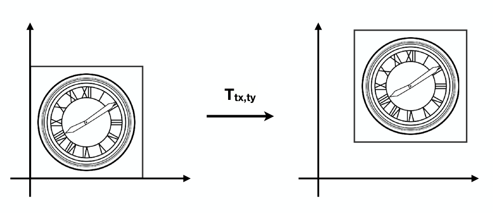

[TOC]

参考资料：

- [GAMES101_Lecture_03_Transformation](./resources/GAMES101/GAMES101_Lecture_03_Transformation.pdf)

- [GAMES101-现代计算机图形学入门-闫令琪](https://www.bilibili.com/video/BV1X7411F744?p=3)

# 1 为什么要有齐次坐标？

在[《变换（二维空间）》](/posts/computergraphics/introduction/变换（二维空间）.html)中，我们知道了二维空间中的线性变换可以表示为矩阵形式：
$$
\left(\begin{matrix} x^\prime \\ y^\prime \end{matrix}\right) = 
\left(\begin{matrix} a & b \\ c & d \end{matrix}\right)
\left(\begin{matrix} x \\ y \end{matrix}\right)
$$
而在平移变换时，例如下图表示将左侧图形沿 $x$ 和 $y$ 方向分别移动 $t_x$ 和 $t_y$ 的距离，

变换后坐标关系为：
$$
\begin{align}
x^\prime = x + t_x \\
y^\prime = y + t_y
\end{align}
$$
该关系表示为矩阵形式为：
$$
\left(\begin{matrix} x^\prime \\ y^\prime \end{matrix}\right) = 
\left(\begin{matrix} a & b \\ c & d \end{matrix}\right)
\left(\begin{matrix} x \\ y \end{matrix}\right) + 
\left(\begin{matrix} t_x \\ t_y \end{matrix}\right)
$$
显然，这在线性变换的表示上引入一个新的矩阵，那么有没有一种方法能够实现将平移变换也用两个矩阵相乘来表示呢？或者说有没有一种方法能够实现所有的二维平面中的变换都能用两个矩阵相乘来表示呢？

答案是存在的，那就是**齐次坐标**。

# 2 什么是齐次坐标？

在二维中，引入一个新的维度来表示点或者向量：

- 二维中的点    ：$(x,\ y,\ 1)^T$
- 二维中的向量：$(x,\ y,\ 0)^T$

新增加的维度为1是表示点，为0是表示向量。

那么我们可以将平移变换用如下的矩阵形式来表示：
$$
\left(\begin{matrix} x^\prime \\ y^\prime \\ w^\prime \end{matrix}\right) = 
\left(\begin{matrix} 1 & 0 & t_x \\ 0 & 1 & t_y \\ 0 & 0 & 1 \end{matrix}\right)
\left(\begin{matrix} x \\ y \\ 1 \end{matrix}\right) = 
\left(\begin{matrix} x + t_x \\ y + t_y \\ 1 \end{matrix}\right)
$$
如此一来，我们通过引入齐次坐标，实现了两个矩阵相乘的表示。那么，同时需要思考是否能同时保证其结果的正确性呢？

在上面的结果矩阵中，第三个维度值为1，表示其为一个点，结果正确。通过齐次坐标第三维度的定义，我们可以计算下面不同的情形，以验证其正确性：

- 向量 + 向量

  不使用齐次坐标，我们知道其结果必为一个向量。用齐次坐标的方式计算，发现第三维度为 $0 + 0 = 0$，表示其结果为向量，正确。

- 点 - 点 

  不使用齐次坐标，我们知道其结果必为一个向量。用齐次坐标的方式计算，发现第三维度为 $1 - 1 = 0$，表示其结果为向量，正确。

- 点 + 向量

  不使用齐次坐标，我们知道 “点 - 点 = 向量”，那么一定有 “点 = 点 + 向量”。用齐次坐标的方式计算，发现第三维度为 $1 + 0 = 1$，表示其结果为点，正确。

- 点 + 点

  这个情况比较特殊，其实实际意义不大，但是我们可以用齐次坐标来得出结论，第三维度为 $1 + 1 = 2$，明显不在齐次坐标的定义范围，但是对于矩阵M，可以对其任意行或者任意列提取公因数 $k$，得到 $M = kM^\prime$，对第三维度所在列提取公因数2，得到1，表示结果为点。

# 3 齐次坐标的应用？

齐次坐标不仅适用于二维空间，在三维空间中，齐次坐标同样适用，即引入一个新的维度来表示点或者向量：

- 三维中的点    ：$(x,\ y,\ z,\ 1)^T$
- 三维中的向量：$(x,\ y,\ z,\ 0)^T$

新增加的维度为1是表示点，为0是表示向量。

关于齐次坐标在二维和三维中的应用，可以跳转[《变换（二维空间）》](/posts/computergraphics/introduction/变换（二维空间）.html)、[《变换（三维空间）》](/posts/computergraphics/introduction/变换（三维空间）.html)。