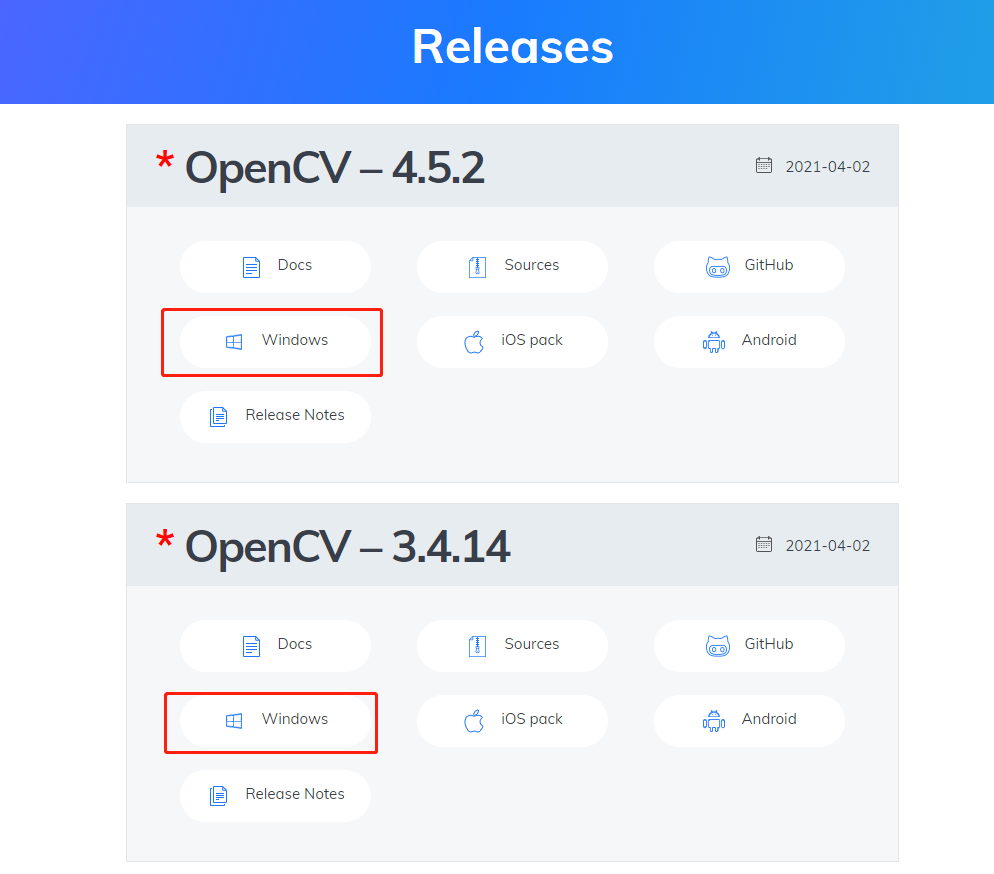
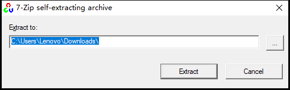
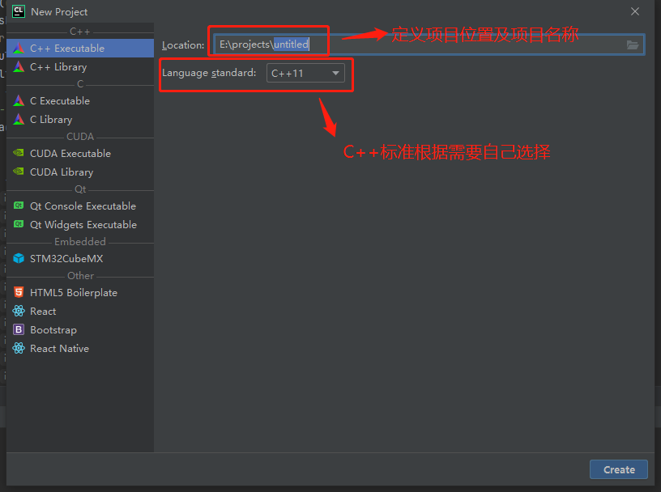
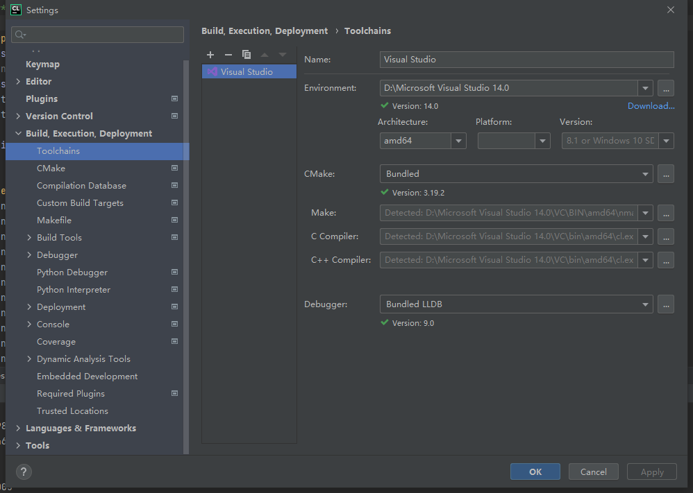
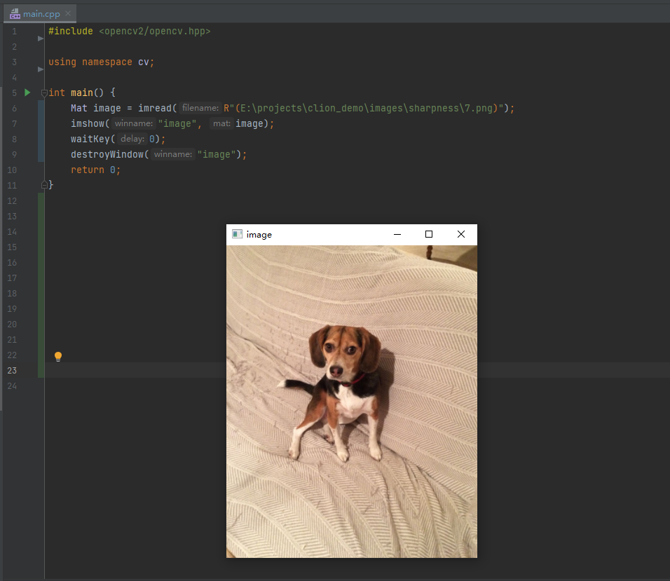

[TOC]


# 1 安装CLion

从[官网](https://www.jetbrains.com/clion/)下载安装Clion。


# 2 安装OpenCV

1. 从官网下载OpenCV，版本根据需要自己选择，下载时选择Windows包。



2. 解压OpenCV到自定义的目录。

   

   

# 3 创建C++项目

1. 在CLion创建C++项目

   

   

2. 设置CLion-Toolchains（建议直接使用Visual Studio的C++工具库，这样便不需要重新编译OpenCV，直接使用其build目录中编译好的库即可）。

   

   

3. 修改 CMakeLists.txt，新增以下设置

   ```
   set(OpenCV_DIR D:/OpenCV-3.4.14/opencv/build/x64/vc14/lib)   # 设置OpenCV解压安装的目录，注意要设置到/build/x64/vc14/lib这一层级
   find_package(OpenCV REQUIRED)                                # 固定设置
   include_directories(${OpenCV_INCLUDE_DIRS})                  # 固定设置
   target_link_libraries(project_name ${OpenCV_LIBS})           # 设置当前项目链接到OpenCV库，project_name为实际项目名称
   ```

   

# 4 验证

1. 编写示例代码

   ```
   #include <opencv2/opencv.hpp>
   
   using namespace cv;
   
   int main() {
       Mat image = imread(R"(E:\projects\clion_demo\images\sharpness\7.png)");
       imshow("image", image);
       waitKey(0);
       destroyWindow("image");
       return 0;
   }
   ```

   

2. 运行

   
