[TOC]

# 1 定义

## 1.1 图

图是由顶点的有穷非空集合和顶点之间边的集合组成，通常表示为G(V,E)，其中，G表示图，V表示图中顶点的集合，E表示图中边的集合。

## 1.2 无向边

若顶点Vi到Vj之间的边没有方向，则称这条边为无向边，用（Vi,Vj）表示。

## 1.3 有向边

若顶点Vi到Vj之间的边有方向，则称这条边为有向边，用 <Vi,Vj> 表示。也可称为弧，Vi为弧尾，Vj为弧头。

## 1.4 简单图

不存在顶点到其自身的边，且同一条边不重复出现，这样的图称为简单图。

## 1.5 无向完全图

任意两个顶点之间都存在边的无向图。

## 1.6 有向完全图

任意两个顶点之间都存在方向互为相反的两条弧的有向图。

## 1.7 稀疏图、稠密图

有很少条边成弧的图称为稀疏图，反之称为稠密图

## 1.8 度

对于无向图，顶点V的度是和V相关联的边的数目。
对于有向图，以顶点V为头的弧的数目称为V的入度；以V为尾的弧的数目称为V的出度。

## 1.9 环

第一个顶点到最后一个顶点相同的路径称为回路或环。序列中顶点不重复出现的路径称为简单路径。除第一个项点和最后一个顶点之外，其余顶点不重复出现的回路，称为简单回路或简单环。

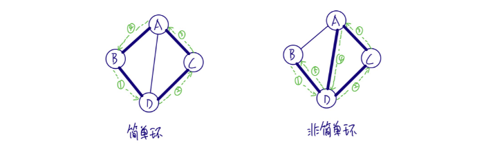

## 1.10 连通图

在无向图中，任意两点都是连通的，则称其为连通图。
在有向图中，任意两点Vi、Vj，从Vi到Vj和从Vj到Vi之都存在路经，则称其为强连通图。

# 2 图的存储结构

## 2.1 邻接矩阵

用两个数组来表示图，一个一维数组存储图中顶点信息，一个二维数组存储图中的边或弧的信息。

### 2.1.1 无向图

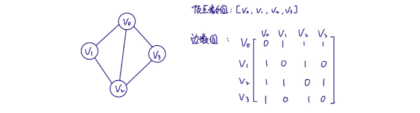

边数组为对称矩阵（Vij=Vji）。
顶点Vi的度即为其所在行或列的元素之和。

### 2.1.2有向图

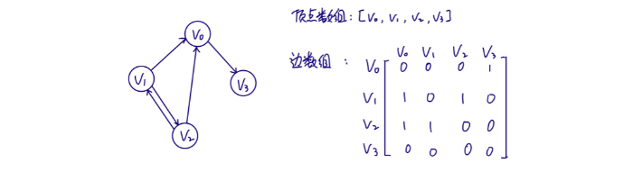
顶点Vi的入度为其所在列元素之和；出度为其所在行元素之和。

### 2.1.3 网

对于边上带有权的网，可以作如下处理：

对于顶点数为n，边数为e的图，构建其邻接矩阵的时间复杂度为O(n+n2+e)，即O(n2)。
对于边数相对顶点数较少的图，邻接矩阵对存储空间有比较大的浪费。

## 2.2 邻接表

用一个一维数组存储所有顶点，每个顶点存储指向第一个邻接点的指针。
每个顶点V的所有邻接点构成一个线性表，用单链表存储，无向图称为顶点Vi的边表，有向图则称为顶点Vi作为孤尾的出边表。

### 2.2.1 无向图

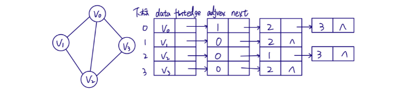

### 2.2.2 有向图

以顶点为孤尾来存储边表时，可以很方便得到顶点的出度，为了同样方便得到顶点的入度，可以再建立一个逆邻接表。

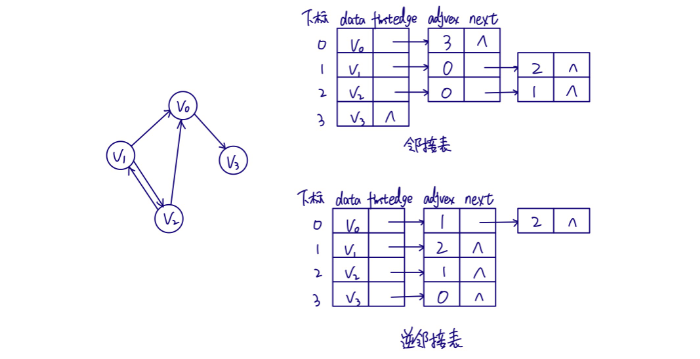

### 2.2.3 网

在边表结点定义中再增加一个weight数据域。
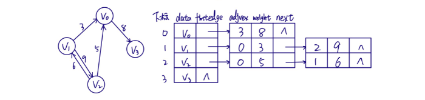

## 2.3 十字链表

将邻接表和邻接矩阵结合起来，定义顶点表结点结构如下：

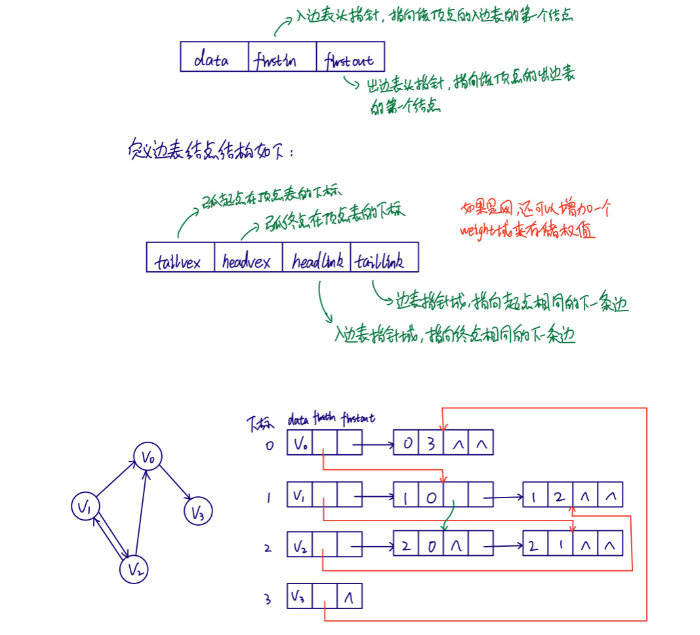

十字链表由于整合了邻接矩阵和邻接表，从而很容易得到顶点的入度和出度，只是结构稍微复杂一些，创建图的时间复杂度和邻接表是一样的。

## 2.4 邻接多重表

十字链表是对有向图的进一步优化，那么对于无向图的邻接表，如果更关注边的操作，如删除边，操作还是比较麻烦的，例如要删除下图中红色标记的边，对链表的处理是比较繁锁的。

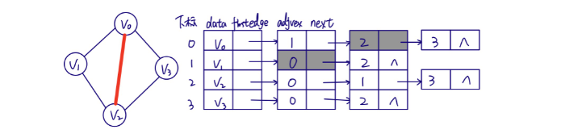

为了解决上面的问题，便出现了邻接多重表，重新定义边表结点结构如下：
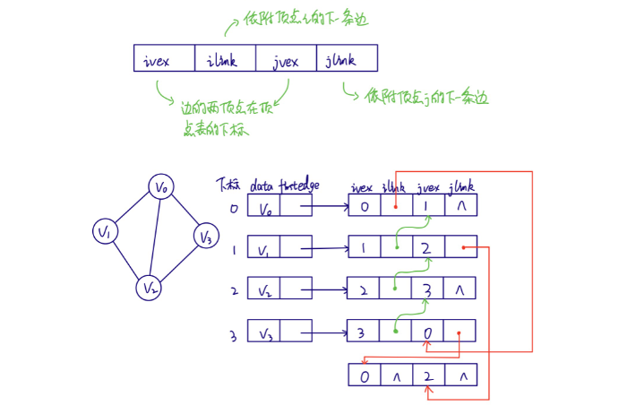

从上图可以看出，邻接表和邻接多重表的差别在于，同一条边在邻接表中要用两个结点表示，而在邻接多重表中只有一个，这样操作边时便方便多了。

## 2.5 边集数组

由两个一维数组构成，一个存储顶点，一个存储边。
定义边数组元素结构如下：

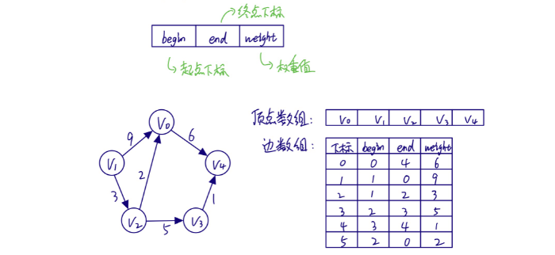

边集数组更适合对边的依序操作，而不适合对顶点相关的操作。

# 3 图的遍历

从图某一顶点出发遍历图中其余顶点，且使每个顶点仅被访问一次。

## 3.1 深度优先遍历

也称为深度优先搜索，简称为DFS。从图中某个顶点V出发，访问此顶点，然后从V的未被访问的邻接点出发深度优先遍历图，直至图中所有和V有路径相通的顶点都被访问到。若图中尚有顶点未被访问，则另选图中一个未被
访问的顶点作起点，重复上述过程，直至图中所有顶点都被访问。

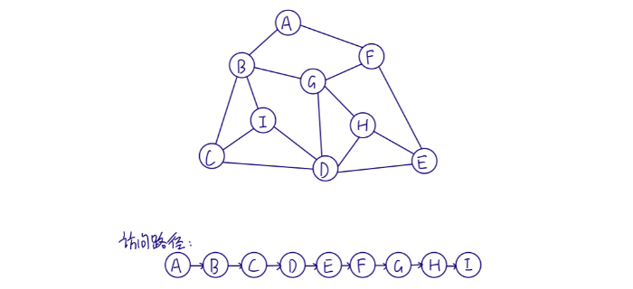

对于n个顶点e条边的图来说，邻接矩阵由于是二维数组，要查找每个顶点的邻接点需要访问矩阵中的所有元素，因此需要O(n)的时间；而对与邻接表，找邻接点的时间取决于顶点和边的数量，所以是O(n+e)。对于点多边少的稀疏图，邻接表结构使算法的时间效率大大提高。

## 3.2 广度优先遍历

也称为广度优先搜索，简称BFS。类似于树的层序遍历。

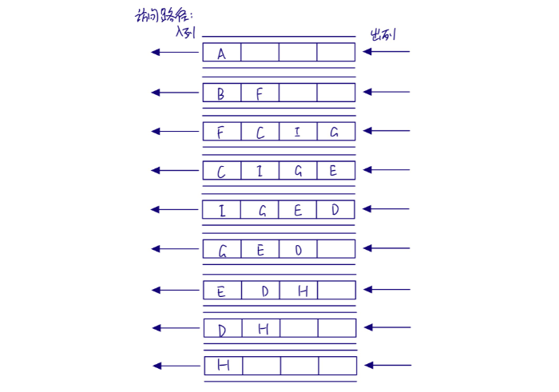

深度优先搜索和广度优先搜索在时间复杂度上是一样的。前者更适合以找到目标为主要目的的情况，后者更适合在不断扩大遍历范围时找到相对最优解的情况。

# 4 最小生成树

下图中标记出任意两点间相互连通所需的成本（即边的权重）。对于由n个顶点组成的图，用n-1条边将图连通，并使其权值的和最小，这就是最小成本。将构造连通网的最小代价生成树称为最小生成树。

## 4.1 普里姆（Prim）算法

也称为贪心算法，在实现算法时，我们定义一维数组marked[]，来标记顶点是否已被纳入最小生成树，同时定义优先队列来有放边，并根据边的权值快速找出最小权值的边。
算法路径如下：
① 标记V0，并将V0关联的边放入队列，得到最短边V0-V1。

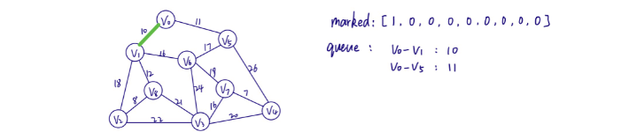

② 标记V1，将V1关联的边放入队列，得到最短边V0-V5。

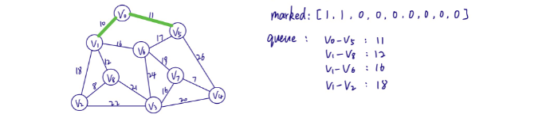

③ 标记V5，将V5关取的边放人队列，得到最短边V1-V8。

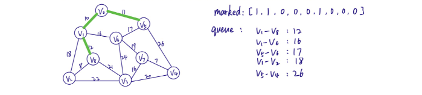

④ 标记V8，将V8关联的边放入队列，得到最短边V8-V2。

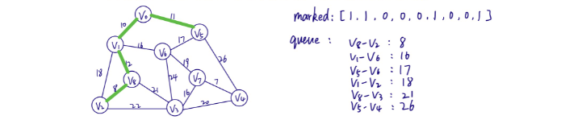

⑤ 标记V2，将V2关联的边放入队列，得到最短边V1-V6。

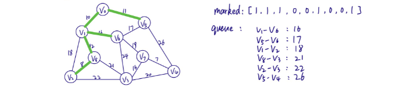

⑥ 标记V6，将V6关联的边放入队列，得到最短边V6-V5，由于V5已被标记，再次取V1-V2，发现两者也都被标记，再次取V6-V7。

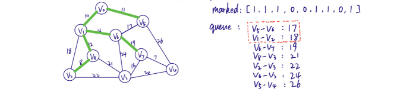

⑦ 标记V7，将V7关联的边放入队列，得到最短边V7-V4。

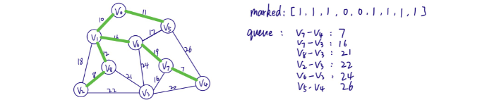

⑧ 标记V4，将V4关联的边放入队列，得到最短边V7-V3。

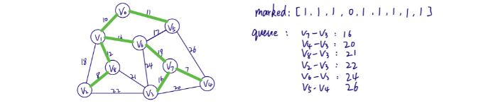

⑨ 标记V3，至此，发现已得到8条边，那么便得到了最小生成树。

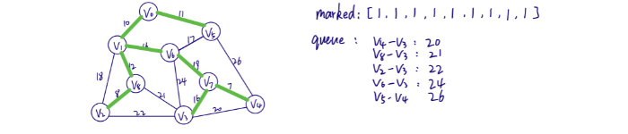

## 4.2 克鲁斯卡尔（Kruskal）算法

Prim算法是在标记顶点后动态查找最小权值的边，那么我们可以换种思路，在构建图时便将边按权值由小到大排好序，按照排序取出一条边，但是要住意不要形成环。

① 得到最小边V1-V4，标记V1、V4。

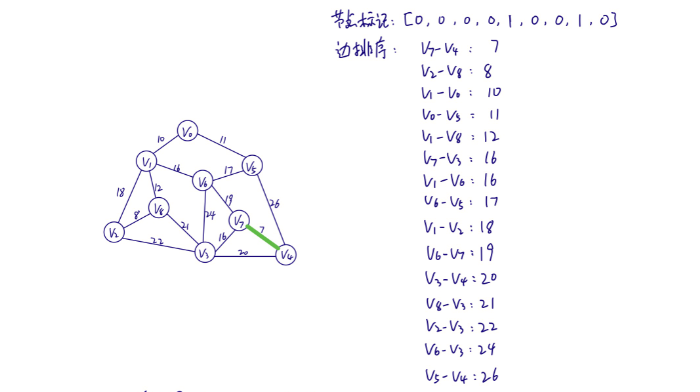

② 得到最小边V2-V8，标记V2、V8。

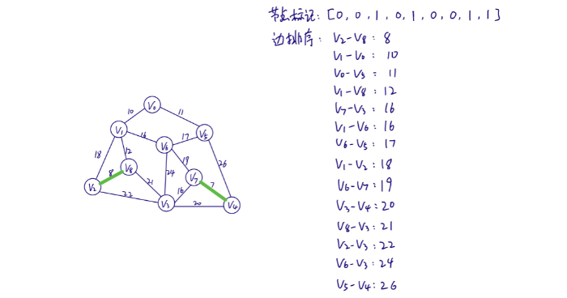

③ 得到最小边V1-V0，标记V1、V0。

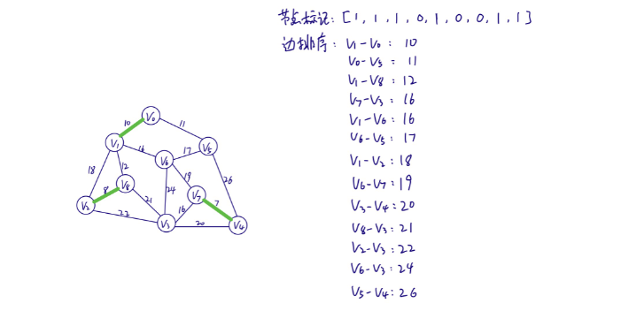

④ 得到最小边V0-V5，标记V5。

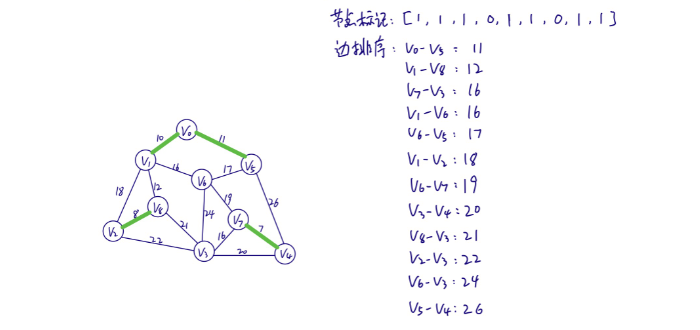

⑤ 得到最小边V1-V8。

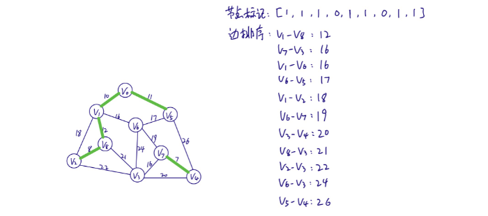

⑥ 得到最小边V7-V3、V1-V6，标记V7、V3。虽然此时所有顶点都已被标记，但是边只有7条，还差一条，所以还要继续。

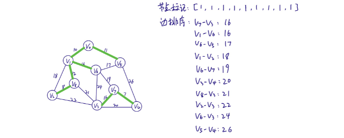

⑦ 得到最小边V6-V5，选择此边将会形成环，所以放弃，继续得到V1-V2，依然会形成环，再次得到V6-V7,不会形成环，且边总数为8，结束。

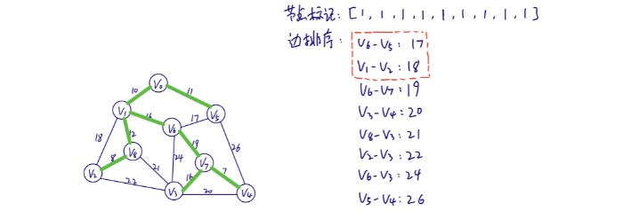

# 5. 最短路径

// 待续