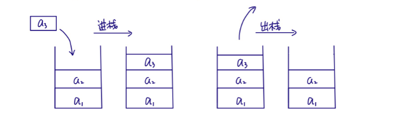
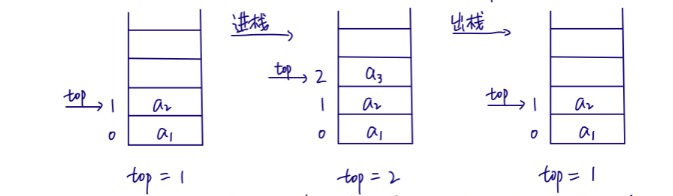
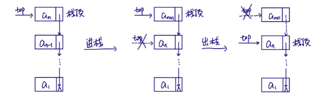
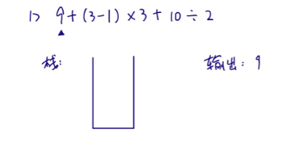
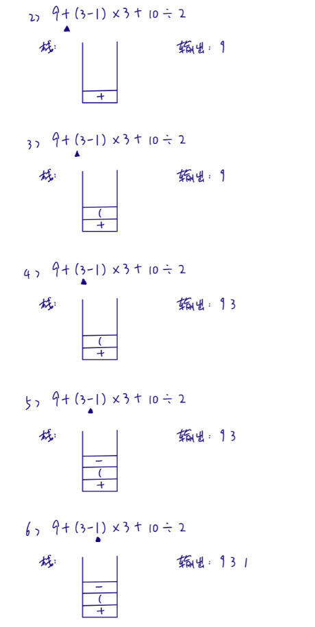
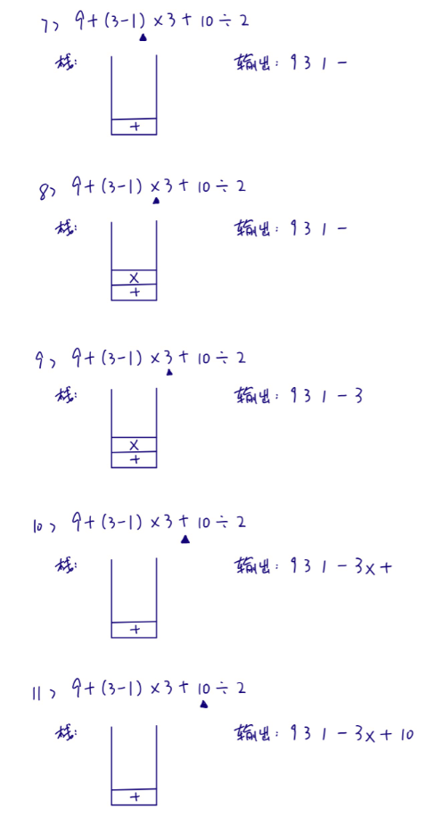
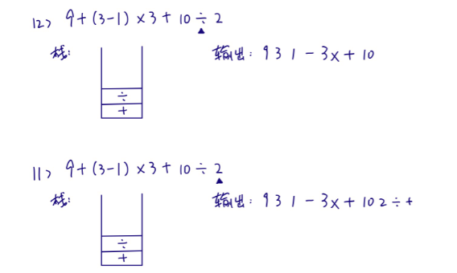
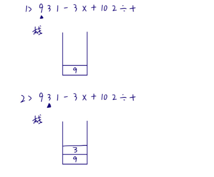
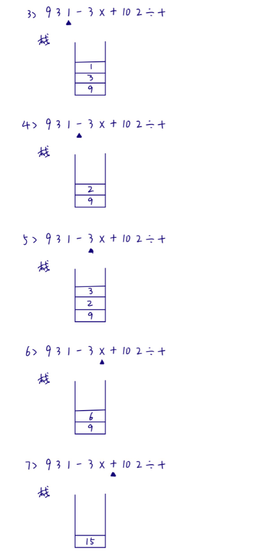
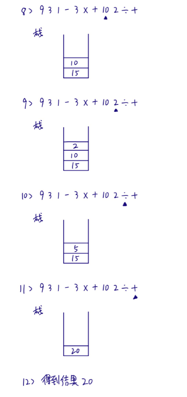

[TOC]

# 1 定义

栈是限定仅在表尾进行插入和删除操作的线性表。

把允许插入和删除的一端称为栈顶，另一端称为栈底，不含任何元素的栈称为空栈。楼又称为后进先出（LastInFistOut) 的线性表，简称LIFO结构。

栈的插入操作，叫作进栈，也称压栈、入栈。栈的删除操作，叫作出栈，也称弹栈。

# 2 栈的顺序存储结构

用数组来实现栈的存储结构时，由于栈只能在栈顶插入和删除，所以将数组下标为0的位置作为栈底更好，这样在元素插入和删除时便不需移动其它元素，但是在实现时需要维护一个表示栈顶元素位置的变量top。

无论进栈还是出栈，不需要移动其它元素，只需向后或向前移动top指针，所以时间复杂度为O(1)

# 3 栈的链式存储结构

单链表的头作为栈顶

# 4 栈的应用

## 4.1 递归

一个直接调用自己或者通过一系列的调用语句间接地调用自己的函数，称做递归函数。每个递归定义至少有一个条件，满足时递旧不再进行。

## 4.2 四则运算表达式求值

后缀表达法（以表达式"9+(3-1)×3+10÷2"为例）

**① 中缀表达式转为后缀表达式**

从左到右遍历中缀表达式的每个数字和符号，若是数字就输出，即成为后缀表达式的一部分；若是符号，则判断其与栈顶符号的优先级，是右括号或优先级低于栈顶符号则栈顶符号依次出栈并输出，并将当前符号进栈，一直到最终输出后缀表达式即可.

**② 后缀表达式计算结果**

从左到右遍历表达式的每个数字和符号，遇到数字就进栈，遇到符号就将处于栈顶的2个数字出栈，进行运算，运算结果进栈，一直到最终获得结果。

