[TOC]

# 1 定义

树是n(n&ge;0)个结点的有限集。n=0时称为空树。在任意一棵非空树中：
(1) 有且只有一个特定的称为根的结点。
(2) 当n>1时，其余结点可分为m(m>0)个互不相交的有限集T1、T2 .... Tm,其中每一个集合本身又是一棵树，称为根的子树。
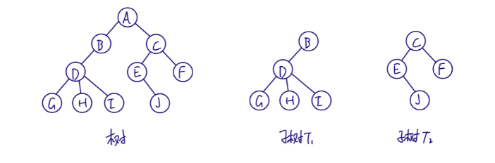

## 1.1 结点分类

结点拥有的子树数称为结点的度（Degree)。
度为0的结点称为叶结点或终端结点。度不为0的结点称为非终端结点或分支结点，除根节点外，分支结点也称为内部节点。
树的度是树内各结点的度的最大值。
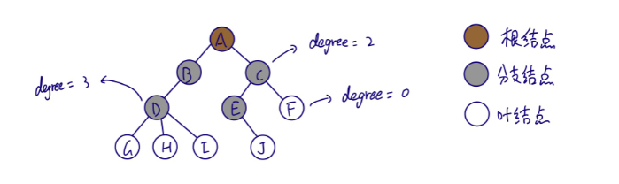

## 1.2 结点关系

结点的子树的根称为该结点的孩子（child），该结点称为孩子的双亲（parent)。

同一个双亲的孩子之间互为兄弟（sibling)。

结点的祖先是从根到该结点所经分支上的所有结点。

以某结点为根的子树中的任一结点都称为该结点的子孙。
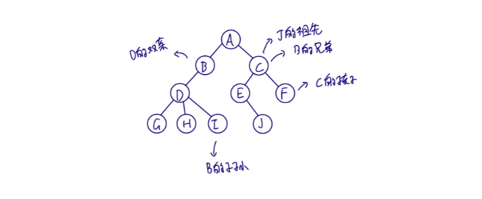

## 1.3 结点层次

结点的层次从根开始定义起，根为第一层，孩子为第二层。
树中结点的最大层次称为树的深度（depth）或高度。
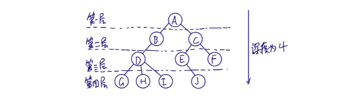

## 1.4 有序树/无序树

如果将树中结点的各子树看成从左至右是有次序的，不能互换的，则称树为有序树，否则称为无序树。

## 1.5 森林

m(m>0)棵至不相交的树的集合。

# 2 存储结构

## 2.1 双亲表示法

在每个结点中，附设一个指示器指示其双亲结点到链表中的位置。

**以数组作为存储结构为例：**

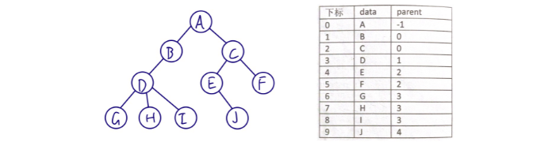
该结构可以很快找到双亲结点，但是如果要找孩子结点则需遍历整个结构。

**如果实际场景中更关注孩子节点，可增加相关指针，如下结构：**

**如果更关注兄弟节点，可优化为如下结构：**

 

总之，存储结构的设计是一个非常灵活的过程。一个存储结构设计得是否合理，取决于运算是否适合，是否方便，时间复杂度等。

## 2.2 孩子表示法

每个结点有多个指针域，其中每个指针指向一棵子树的根结点，称为多重链表表示法。
结点结构如下：

**方案一：**

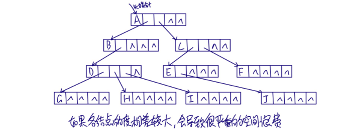

如果各结点的度相差较大，会导致很严重的空间浪费。

**方案二：**

每个结点指针域的个数等于该结点的度，用专门的位置来存储结点的度。

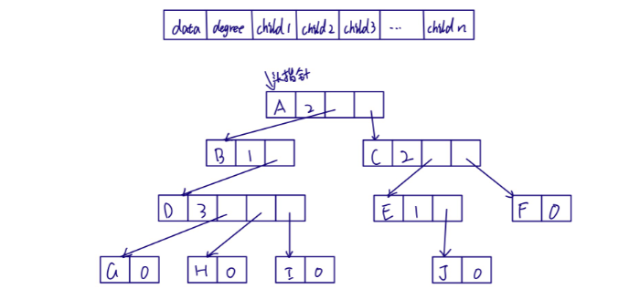
解决了空间浪费的问题，但各结点链表结构不同，加上度的维护，运算上带来了时间的损耗。

**方案三：**

把每个结点的孩子结点排列起来，以单链表作存储结构，则n个结点有n个孩子链表，如果是叶子结点则此单链表为空。然后n个头指针又组成一个线性表，采用顺序存储结构，放入一维数组中。
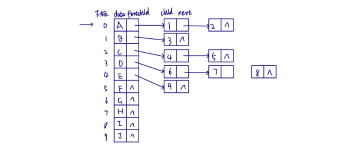

该结构对于查找孩子结点或兄弟结点，以及遍历树结构都非常方便，但是查找双亲结点却很麻烦。

**方案四：**

双亲孩子表示法

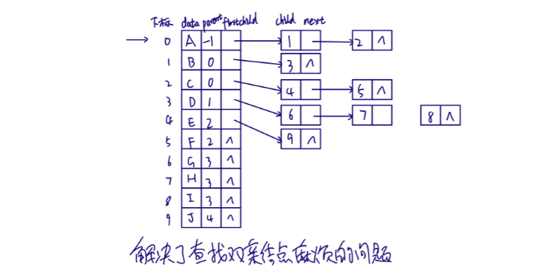

解决了查找双案结点麻烦的问题。

## 2.3 孩子兄弟表示法

任意一棵树，它的结点的第一个孩子如果存在就是唯一的，它的右兄弟存在也是唯一的，因此，设置两个指针，分别指向第一个孩子结点和右兄弟结点。

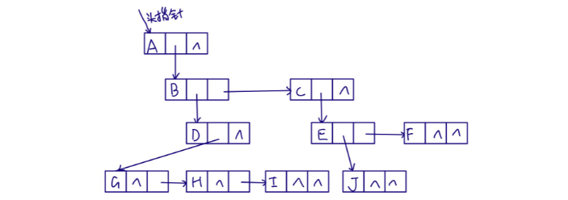查找孩子节点时，只需通过firstchild找到第一个孩子结点，然后通过rightsib查找其它孩子节点。
如果有必要，也可加入parent指针域来解决查找双亲结点的问题。

该表示法最大的好处是将一棵复杂的树变成了一棵二叉树，将上图稍做变形。
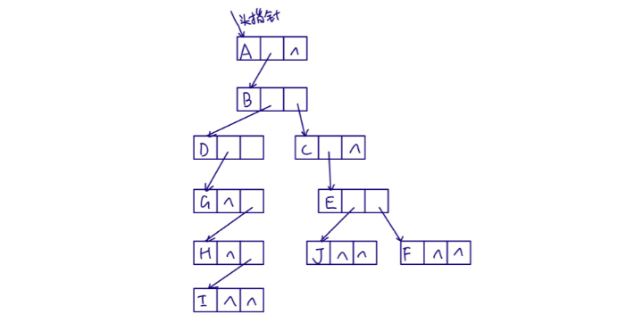

# 3 二叉树

## 3.1 定义

二又树是n(n&ge;0)个结点的有限集合，该集合或者为空集（称为空二叉树）,或者由一个根结点或者两棵互不相交的、分别称为根结点的左子树和右子树的二叉树组成。

## 3.2 二叉树特点

① 每个结点最多有2棵子树。
② 左子树和右子树是有顺序的，次序不能任意颠倒。
③ 即使树中某结点只有一棵子树，也要区分它是左子树还是右子树。

## 3.3 特殊二叉树

### 3.3.1 斜树

所有结点都只有左子树或者右子树

### 3.3.2 满二叉树

所有分支结点都有左子树和右子树，并且所有叶子节点都在同一层。

### 3.3.3 完全二叉树

对一棵有n个结点的二叉树按层序编号，编号为i的结点与同样深度的满二叉树中偏号为i的结点在二叉树中位置完全相同。

 

满二叉树一定是完全二叉树，但完全二叉树不一定是满二叉树。

完全二叉树的特点：

① 叶子结点只能出现在最下两层。
② 最下层叶子一定集中在左部连续位置。
③ 倒数二层，若有叶子结点，一定在左部连续位置。
④ 如果结点度为1,则只有左子树。
⑤ 同样结点数的二叉树，完全二叉树的深度最小。

## 3.4 二叉树性质

① 在二叉树的第i层上至多有2i-1个结点（i&ge;1)。

② 深度为k的二叉树至多有2k-1个结点（k&ge;1)。

③ 对任何一棵二叉树T,如果其终端结点数为n0，度为2的结点数为n2，则 n0=n2+1。

> 推导方式：
> 在二叉树T中，结点的度只有0、1、2三种情况，设其结点数分别为n0、n1、n2，则树T的总结点数为n，n=n0+n1+n2。
> 树结点总数为n，那么树中结点连线数为n-1，同时，度为0、1、2的结点向外分出的连线数分别为0、1、2，可得连线总数为 n1+2n2，即 n-1=n1+2n2，而 n=n0+n1+n2，得到 n0+n1+n2-1=n1+2n2，最终可得 n0=n2+1。

④ 具有n个结点的完全二叉树的深度为 |log2n|+1 (|x|表示向下取整）。
⑤ 对一棵有n个结点的完全二叉树的结点按层序编号，对任一结点i。

- 如果i=1，则为根结点；如果i>1，则其双亲结点为|i/2|。
- 如果2i&gt;n，则无左孩子；否则其左孩子为2i。
- 如果2i+1&gt;n，则无右孩子；否则其右孩子为2i+1。

## 3.5 二叉树的存储结构

### 3.5.1 顺序存储结构

 

 
如果二叉树为斜树，那么会造成空间浪费，所以，顺序存储结构一般只用于完全二叉树。

### 3.5.2 二叉链表

结点数据结构

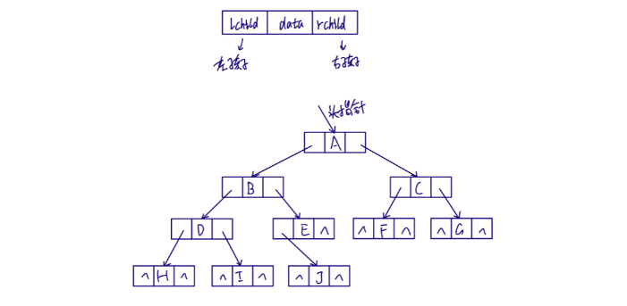 
如果有需要，可以再增加一个指向其双亲的指针域，称为三叉链表。

## 3.6 遍历二叉树

从根结点出发，按照其种次序依次访问二叉树中所有结点，使得每个结点被访问且仅被访问一次。

### 3.6.1 前序遍历

若二叉树为空，则空操作返回，否则先访问根结点，然后前序遍历左子树，再前序遍历右子树。
 

### 3.6.2 中序遍历

若二叉树为空，则空操作返回，否则从根结点开始（注意不是先访问根结点）,中序遍历根结点的左子树，然后访向根结点，最后中序遍历右子树。 

### 3.6.3 后序遍历

若树为空，则空操作返回，否则从左到右先叶子后结点的方式遍历右子树，最后访问根结点。
 

### 3.6.4 层序遍历

若树为空，则空操作返回，否则从树的第一层，从上而下遍历访问，在同一层中，从左到右逐个访问。
 

### 3.6.5 由遍历序列构造二叉树

给出一个二叉树，我们可以用前序、中序、后序、层序4种不同的方式得到不同的遍历序列，那么如果已知某一种或者多种遍历序列，能不能推导出二叉树结构呢？

**如果只给定一种遍历序列，是不能推导出唯一的二叉树结构的，因为一种遍历序列可能对应多种不同的二叉树结构**，如下图所示：

- 只给定中序遍历序列

  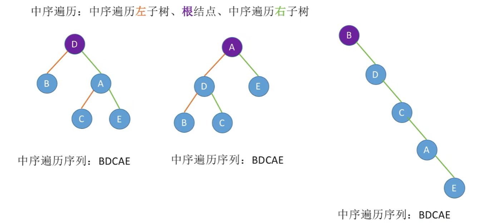
  
- 只给定前序遍历序列

  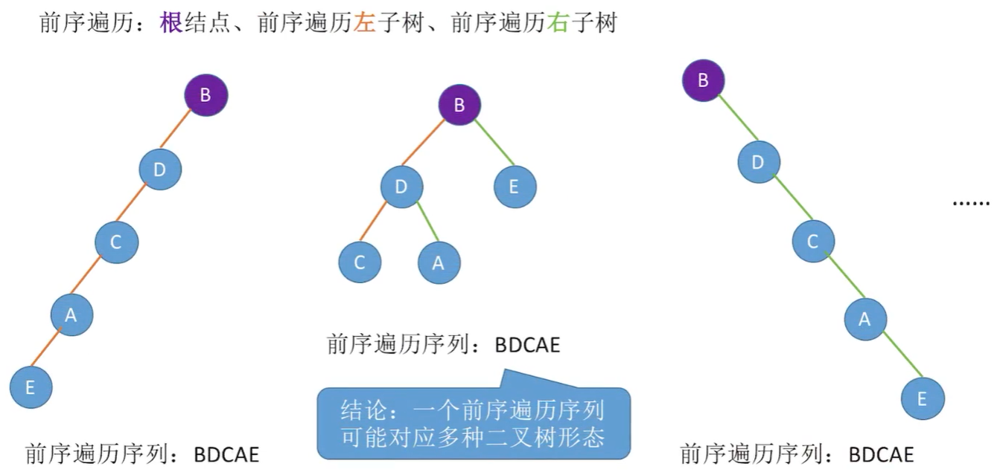

- 只给定后续遍历序列

  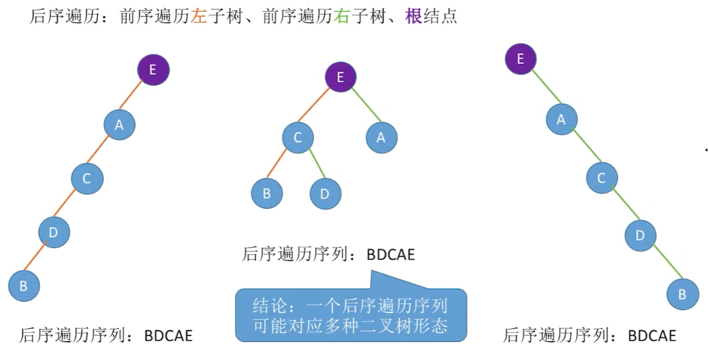

- 只给定层序遍历序列

  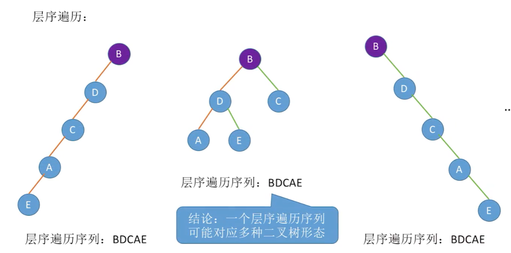

  

**想要通过遍历序列推导出唯一的二叉树结构，必须给定3种遍历序列组合之一：（前序 + 中序）、（后续 + 中序）或者（层序 + 中序）**

- **前序 + 中序遍历序列**

  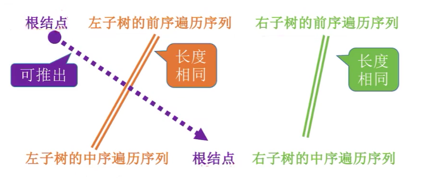

  推导思路：通过前序遍历序列的第一个节点，我们可以确定根节点，确定根节点后，利用中序遍历序列，可以确定根节点的左右子树的中序遍历序列；然后通过长度相同的特征，得出左右子树的前序遍历序列，再根据其第一个节点确定左右子树的根节点。按照这种思路逐级递归推导即可。

  

- **后续 + 中序遍历序列**

  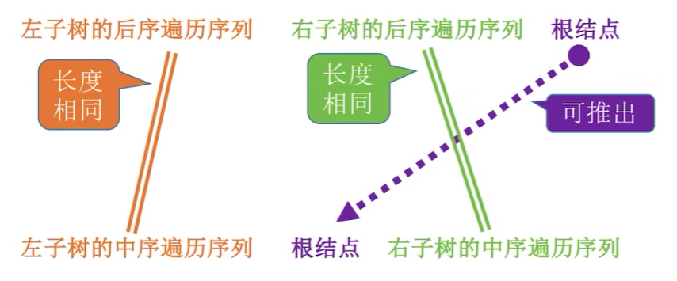

  推导思路：通过后续遍历序列的最后一个节点，我们可以确定根节点，确定根节点后，利用中序遍历序列，可以确定根节点的左右子树的中序遍历序列；然后通过长度相同的特征，得出左右子树的前序遍历序列，再根据其最后一个节点确定左右子树的根节点。按照这种思路逐级递归推导即可。

  

- **层序 + 中序遍历序列**

  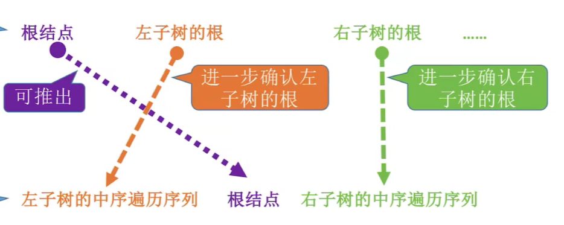

  推导思路：通过层序遍历序列的第一个节点，我们可以确定根节点，确定根节点后，利用中序遍历序列，可以确定根节点的左右子树的中序遍历序列；然后通过长度相同的特征，得出左右子树的前序遍历序列，再根据其第一个节点确定左右子树的根节点。按照这种思路逐级递归推导即可。

## 3.7 线索二叉树

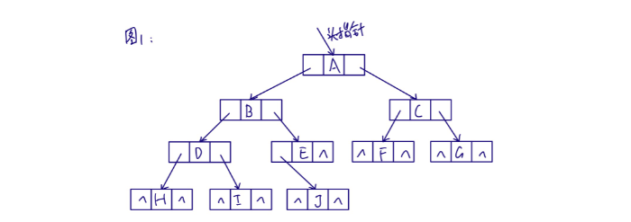 
对于图中二叉树结构，如果有n个结点，那么共有2n个指针城，有n-1条线，那么肯定会存在2n-(n-1)=n+1个指针域为空指针域，造成资源浪费。
同时，只有在遍历时才能知道每个节点的前驱和后继节点。
为了解决上述问题，我们可以在构建二叉树时就维护结点的前驱和后继指针，将这两种指称为线索，对应的二叉树称为线索二叉树。
构建二叉树时我们可以以不同的方式构建，下面以中序遍历为例。
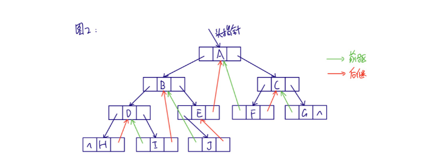 
经过中序遍历处理后，lchild空指针改为前驱指针，rchild空指针改为后继指针，最后只剩下链表的首尾有2个空指针域未被使用。
但图2中结构仍存在问题，那便是无法区分lchild是左孩子指针还是前驱指针，rchild是右孩子指针还是后继指针。可以通过添加标识域来区分。
 

## 3.8 树、森林与二叉树的转换

树的孩子兄弟法可以将一棵树以二叉链表进行存储，借助二又链表树和二叉树可以相互转换。

### 3.8.1 树转换为二叉树

① 加线。在所有兄弟结点之间加一条连线。
② 去线。对树中每个结点，只保留它与第一个孩子的连线，删除与其他孩子的连线。

③ 层次调整，以树的根结点为轴心，将整棵树顺时针旋转一定的角度，使其结构层次分明。注意第一个孩子是二叉树结点的左孩子，兄弟转换过来的孩子是结点的右孩子。

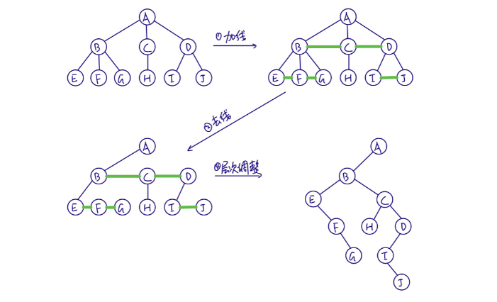 

### 3.8.2 森林转换为二叉树

① 将每个树转换为二叉树。
② 第一棵树不动，从第二棵树开始，依次将其根结点作为前一棵树的右孩子结点。 

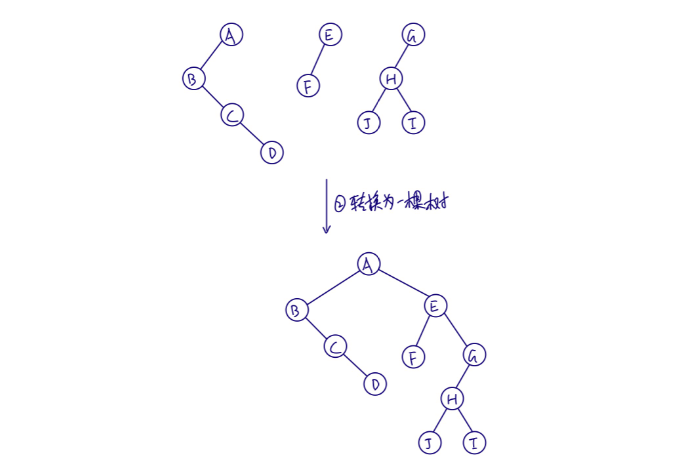 

### 3.8.3 二叉树转化为树

① 加线。若某结点存在左孩子，将左孩子的所有右孩子结点都作为此结点的孩子。
② 去线。删除树中所有结点与右孩子的连线。
③ 层次调整。

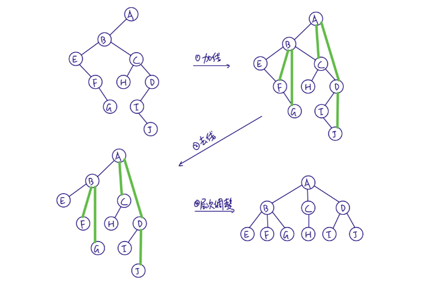 

### 3.8.4 二叉树转换为森林

① 从根结点开始，若右孩子存在，则把与右孩子的连线删除，再查看分离后的二叉树，若右孩子存在，则连线删除....直到所有的右孩子连线全都删除。
② 将每棵二叉树转换为树。

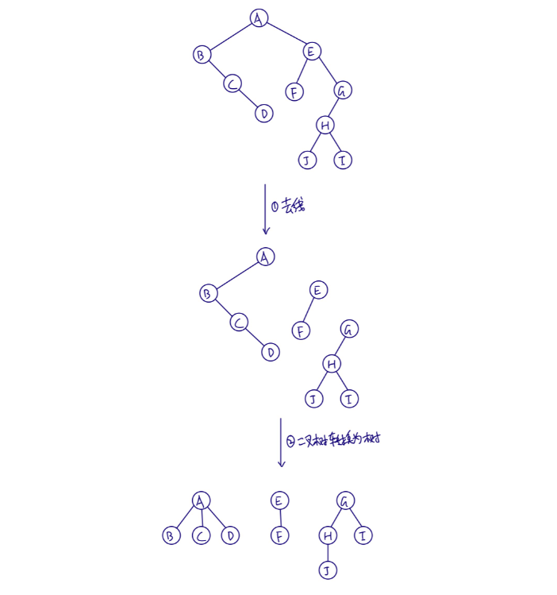 
