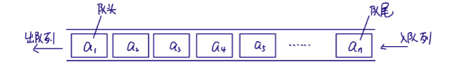
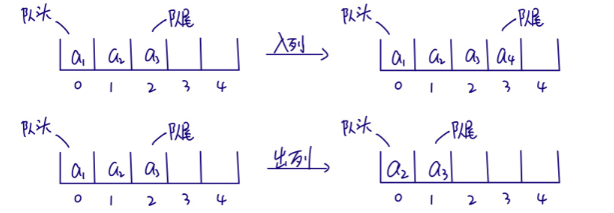
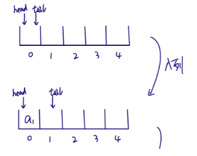
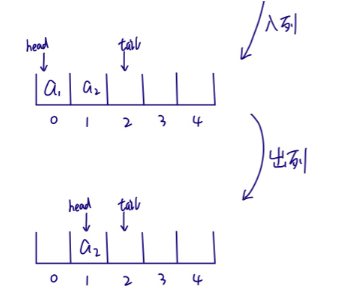
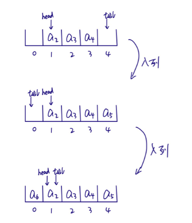
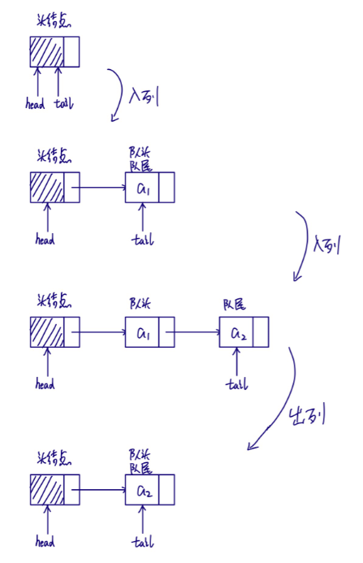

[TOC]

# 1 定义

队列是只允许在一端进行插入操作，而在另一端进行删除操作的线性表。

队列是一种先进先出（FirstInFistOut) 的线性表，简称FIFO。允许插入的一端称为队尾，允许删除的一个篇称为队头。

# 2 队列顺序存储结构

## 2.1 简单的数组实现

入列时只需在队尾追加元素，时间复杂度为O(1)。

出列时再移除队头的元素后，还需将其它无素向前移动，时间复杂度为O(n)。

## 2.2 双指针的数组实现

入列和出列都不需要移动元素，时间复杂度都为O(1)。

但当tail指针位于数组最后位置时，再入列元素会产生数组越界的问题，实际上数组靠前位置可能是空闭的，但无法再次使用。

## 2.3 循环队列

头尾相接的数组

入列和出列的时间复杂度为O(1),同时不会出现tail指针溢出问题.但是只要是数组的实现，都摆脱不了数组大小无法满足元素数量而溢出的问题。

# 3 队列的链式存储结构

入列和出列的时间复杂度都为O(1)。

总的来说，在可以确定队列长度最大值的情况下，建议使用循环队列，否则使用链表队列。

