[TOC]

# 1 地球空间参考系统

## 1.1 空间参考系统

空间参考系统是指确定地理目标平面和高程的平面坐标系和高程系的统称。

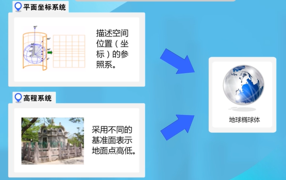

那么，什么是地球椭球体呢？

## 1.2 地球椭球体

地球椭球体的由来：

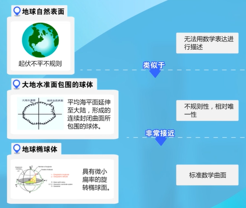

地球自然表面、大地水准面、地球椭球体之间的关系：

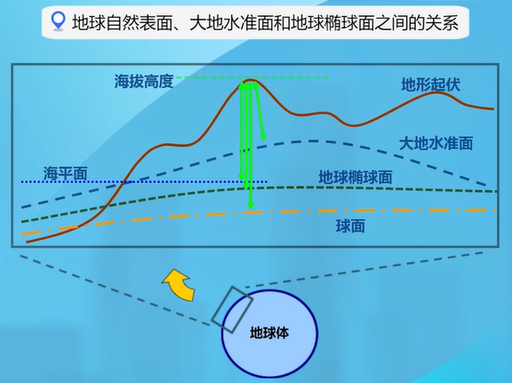

一个形状、大小和定位、定向都已确定的地球椭球体称作**参考椭球体**。不同的国家和地区会根据自身实际情况使用不同的参考椭球体。

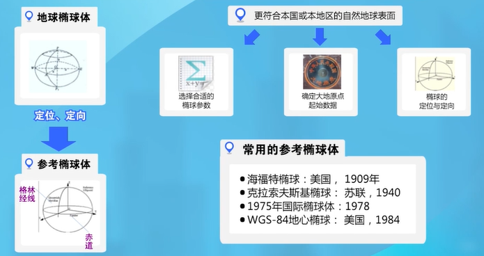

## 1.3 大地坐标系

大地坐标系是大地测量中以参考椭球体为基准面建立的坐标系。参考椭球体一旦确定，则标志着大地坐标系已经建立。

空间上任意一点的大地坐标系用**L（大地经度）、H（大地纬度）、B（大地高）**表示。

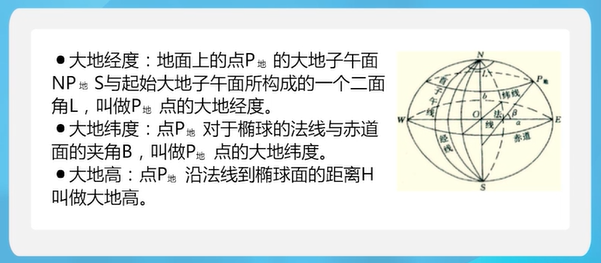

空间点的高程是以大地水准面为基准建立的。

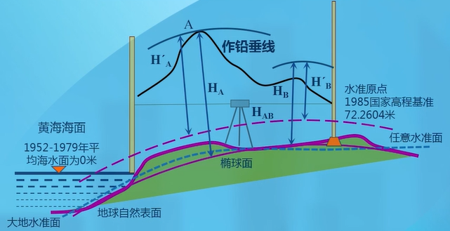

**我国常用的大地坐标系：**

1. 1954年北京坐标系（简称 北京54坐标系）
2. 1980西安坐标系
3. 2000国家大地坐标系

**国外广泛应用的坐标系：**

1. WGS-84坐标系

   美国国防部研制，GPS定位就是基于此坐标系。

**我国的高程系统：**

1. 1956黄海高程系
2. 1985国家高程基准

## 1.4 地理格网

按一定的数学规则对地球表面进行划分形成地理格网，可以用于表示呈点、线和面状分布、以格网作为统计单元的地理信息。

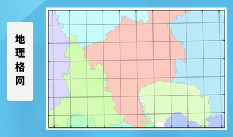

**我国的坐标格网系统：**

1. $4^o$​​​ X $6^o$​​​​​​ 格网系统

   以维度 $4^o$​​​​ 和经度 $6^o$​​​​​​ 进行划分而构成的多级地理格网系统，主要适用于表示陆地与近海地区全国或省（区）范围内各种地理信息等。

   

   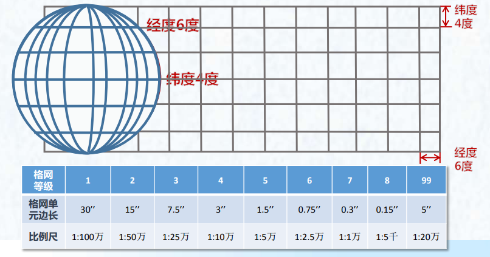

   

2. 直角坐标格网系统

   将地球表面按数学法则投影到平面上，再按一定的纵横坐标间距和统一的坐标原点对其进行划分而构成的多级地理格网系统。

   

   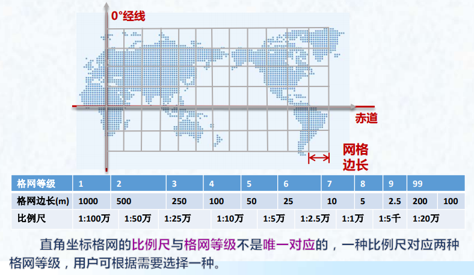

   

3. 自行设计格网系统

   在GIS中，还需要用到1:2000、1:1000和1:500的地形图，在国家标准中未规定它们的格网等级和格网单元边长，可根据实际需要自行设计。

   

   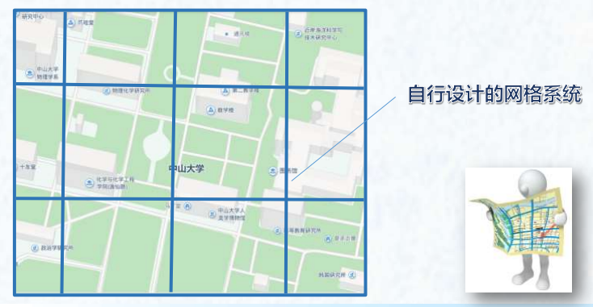

   

上述三种格网之间可以相互转换，它们的分级各呈一定的层次关系，构成完整的系列，便于组成地区、国家或全球的格网体系。

# 2 地图投影

## 2.1 地图投影的实质

地图投影的实质就是建立地球椭球面上的点的地理坐标（λ，φ）与平面上对应点的平面坐标（x，y）之间的函数关系。

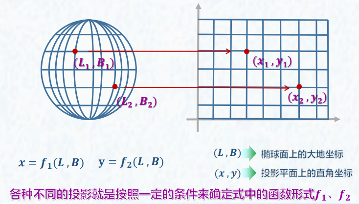

## 2.2 地图投影的分类

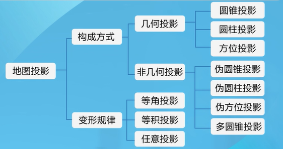

### 2.2.1 几何投影

以透视几何学原理为基础，借助于可以展开为平面的几何面进行投影，从而构成经纬网络。

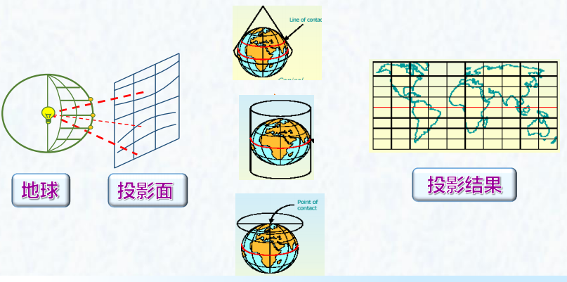

#### 2.2.1.1 圆锥投影

以圆锥面作为投影面，与地球相切（割）而构成的投影。因切（割）位置的不同，有正、横、斜之分，但实用中只有正轴圆锥投影。

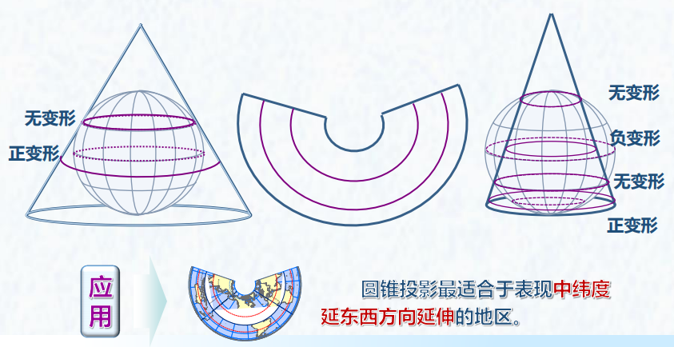

#### 2.2.1.2 圆柱投影

以圆柱面作为投影面，与地球相切（割）而构成的投影。有正、横、斜之分，实用中主要应用正轴与横轴圆柱投影。

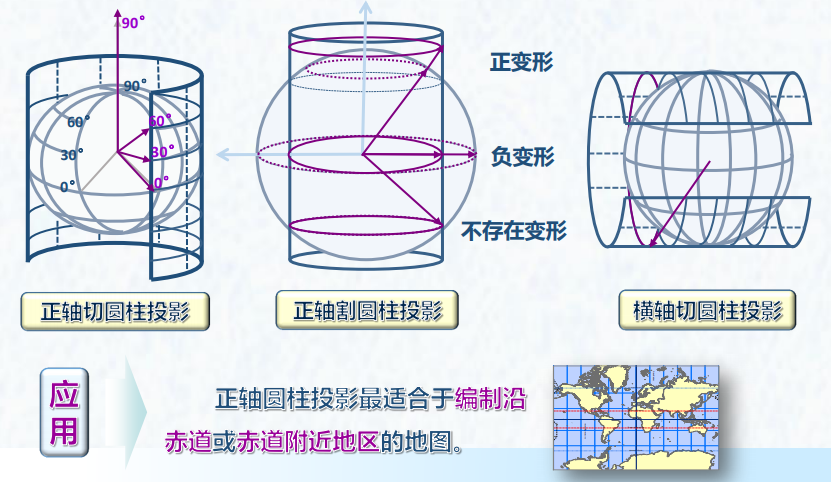

#### 2.2.1.3 方位投影

以平面作为投影面，与球面相切（割）而构成的投影。

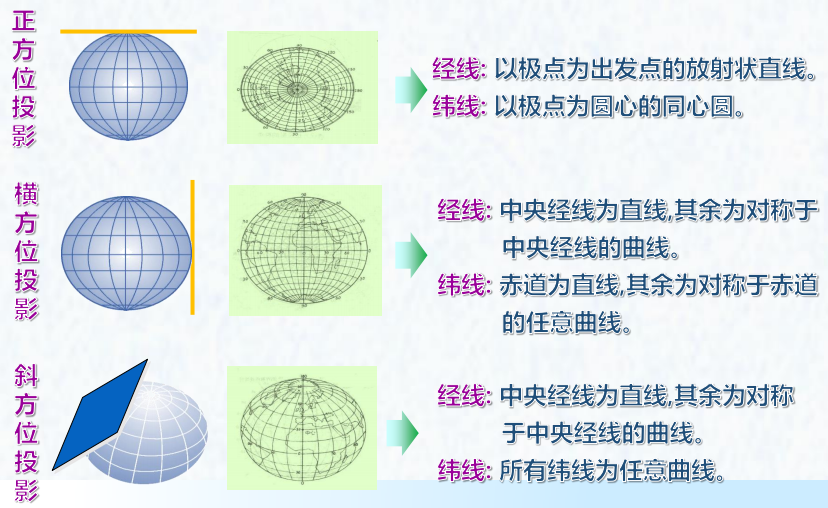

### 2.2.2 等角投影

投影前后任意两方向线所夹的角度不改变，即在一定范围内，能保持形状不改变。

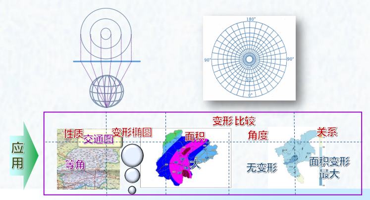

### 2.2.3 等积投影

投影前后面积保持不变的投影。

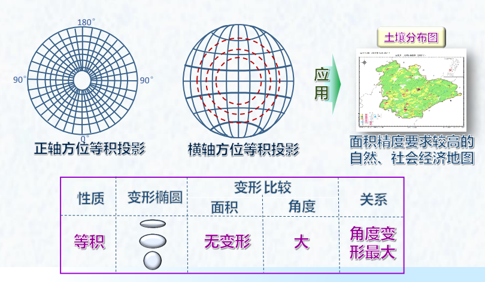

### 2.2.4 等距投影

等距投影是一种任意投影。沿某一特定方向的长度不变形，即沿该特定方向长度之比等于1。

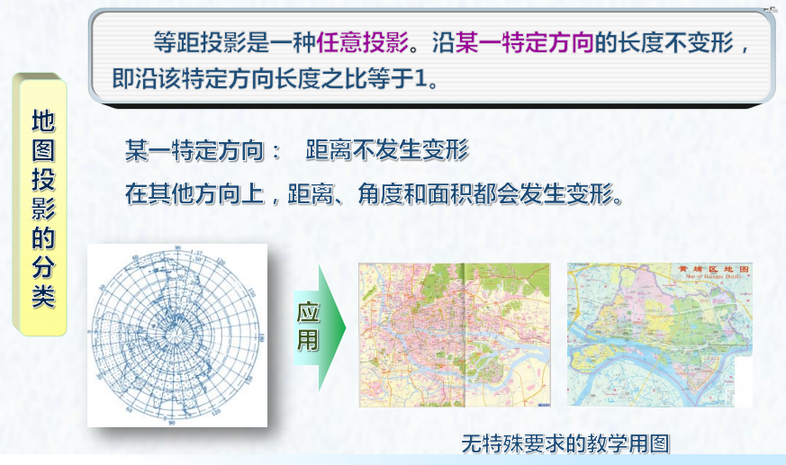

### 2.2.5 高斯-克吕格投影

假设一个椭圆柱面与地球椭球体面横切于某一条经线上，按照等角条件将中央经线东、西各 $3^o$ 或 $1.5^o$ 经线范围内的经纬线投影到椭圆柱面上，然后将椭圆柱面展开成平面而成的。

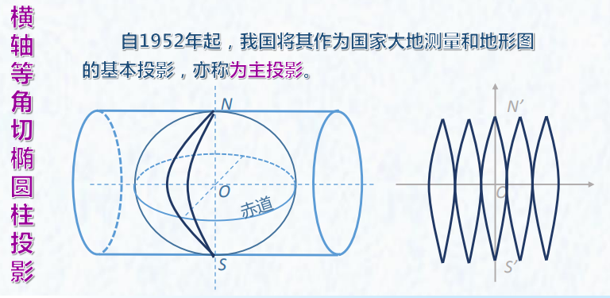

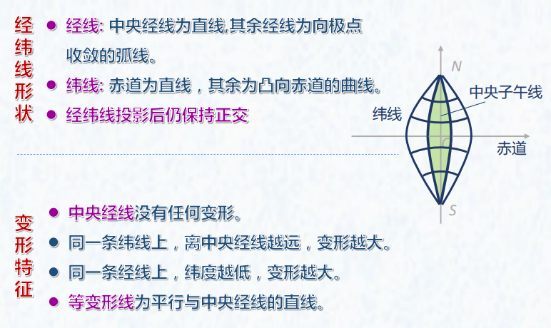

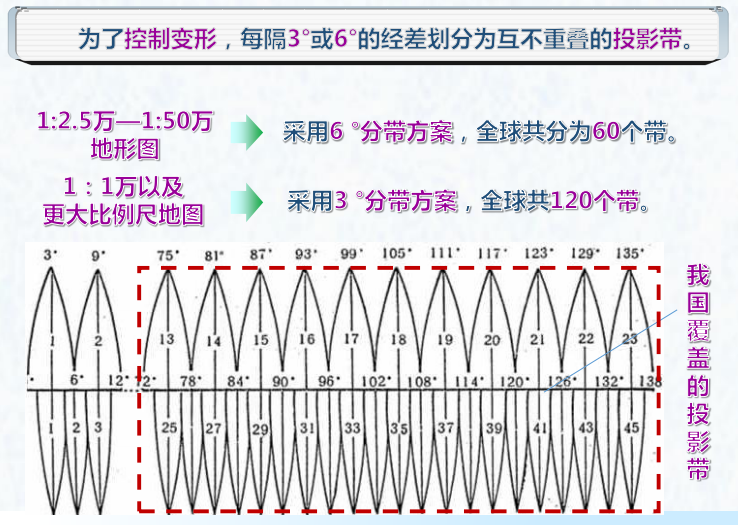

# 3 空间坐标转换

## 3.1 大地坐标系的转换

**转换思路：**

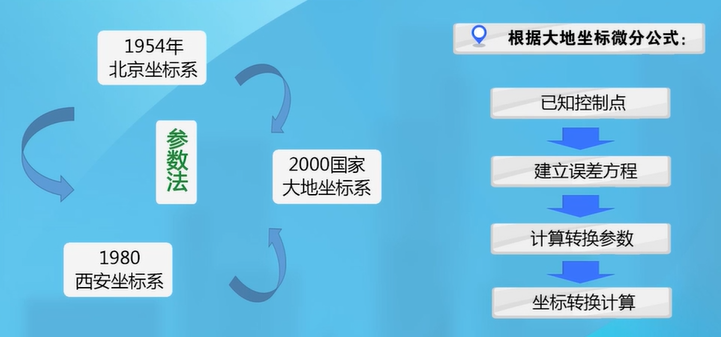

**大地微分公式：**

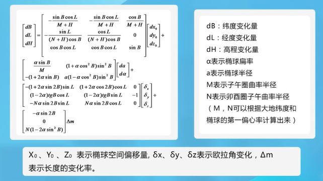

**参数法解算坐标转换：**（三参数适合近距离，七参数适合远距离）

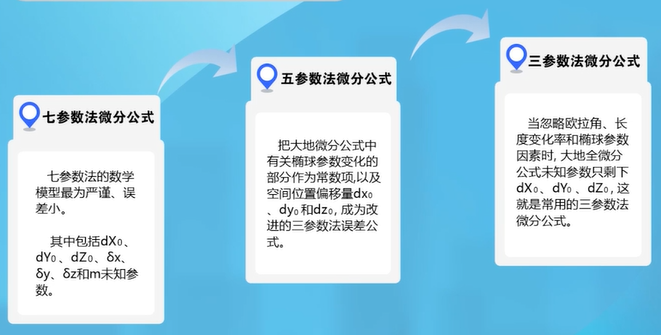

## 3.2 WGS-84坐标系与国标坐标成果的转换

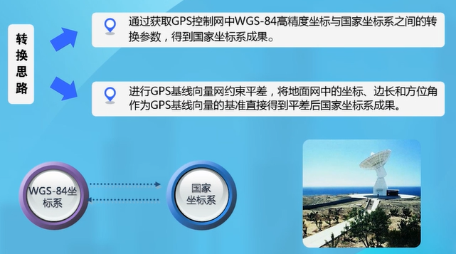

## 3.3 国家坐标系与地方坐标系转换

**转换思路：**

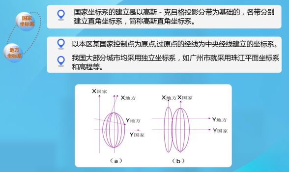

**转换方法：**

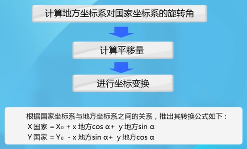
