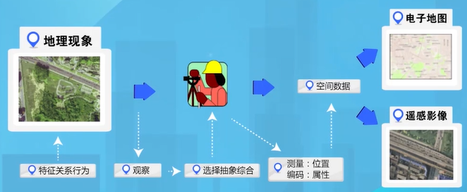
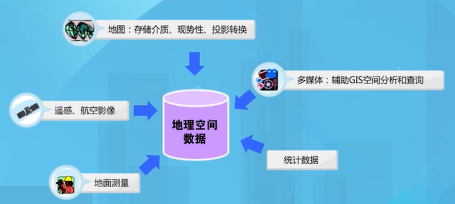

[TOC]

# 1 GIS的概念

1. 地理信息

   地理信息是表征地理系统诸要素的数量、质量、分布特征、相互联系和变化规律的数字、文字、图像和图形等的总称。

2. 地理信息系统

   地理信息系统（GIS）是以空间数据库为基础，采用地理模型分析，实现地理信息的采集、存储、检索、分析、显示、预测和更新。

   

# 2 GIS的组成

1. 硬件

   包括计算机系统（服务器、工作站、平板电脑），数据采集系统（GPS接收器、PDA采集系统、数字化仪、扫描仪），输出设备（打印机、绘图仪），网络设备（交换机、集线器、路由器）等。

2. 软件

   包括源代码（国内外比较著名的gis软件：ArcGIS、MapInfo、SuperMap、GeoStar、MapGIS）、公共用户界面。

3. 数据

   图形数据、图像数据、统计数据、属性数据、音频数据、视频数据等。

4. 人员

   科学研究人员、项目管理人员、软件设计人员、系统开发人员、数据处理人员。

5. 基础设施

   数据标准规范、法律法规、GIS组织管理架构等。

# 3 GIS的分类

**按内容进行分类：**

1. 专题GIS

   指有限目标和专业特点的GIS。如土地管理、交通管理等。

2. 区域GIS

   指以区域综合研究和全面服务为目标的GIS。如公众服务平台等。

3. GIS工具

   指一组具有图形图像数字化、存储管理、查询检索、分析运算和多种输出等功能的软件包。

**按照国家标准化委员会的分类：**

1. 基础GIS
2. 专业应用的GIS
3. 专项应用的GIS

# 4 GIS的基本功能

1. 数据采集

   把现有资料转换为计算机可以处理的形式，并保证数据的完整性和逻辑的一致性。

   

   这些数据的来源包括：

2. 数据处理与变换

   将数据转换或者处理成某种需要的形式以适应这个系统，比如坐标变换、格式转换等。

3. 数据的存储与管理

4. 查询与空间分析功能
5. 可视化功能

