[TOC]

参考资料：

- [第三讲 地理空间数据的组成与特征（第一节）](./resources/pdf/第三讲 地理空间数据的组成与特征（第一节）.pdf)

- [第三讲 地理空间数据的组成与特征（第二节）](./resources/pdf/第三讲 地理空间数据的组成与特征（第二节）.pdf)

- [第三讲 地理空间数据的组成与特征（第三节）](./resources/pdf/第三讲 地理空间数据的组成与特征（第三节）.pdf)

- [第三讲 地理空间数据的组成与特征（第四节）](./resources/pdf/第三讲 地理空间数据的组成与特征（第四节）.pdf)

# 1 空间数据

## 1.1 定义

**空间对象：**是指GIS处理的客体，是现实世界中客观存在的实体或现象。空间对象可以抽象成点、线、面和体等多种数据类型及其组合。

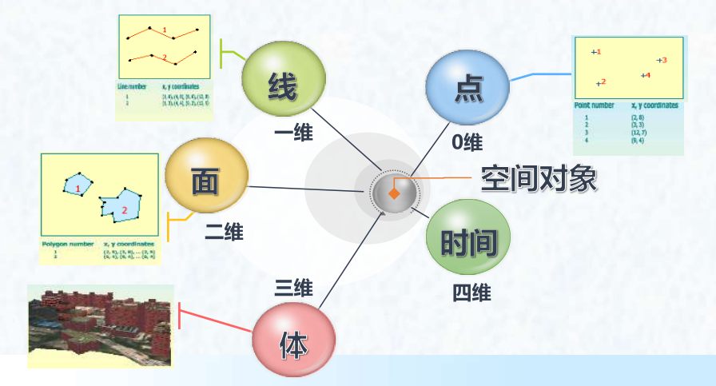

**点对象：**相对集中于一个较小范围，且按比例尺缩小后仅能呈现点状分布的实体或现象。

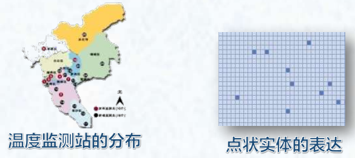

**线对象：**呈线状或带状分布的实体或动态现象。

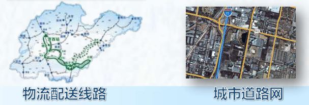

**面对象：**分布于较大范围，且按比例尺缩小后仍能明确显示其轮廓的实体或对象。

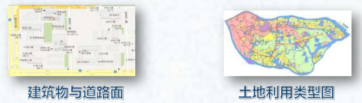

**体对象：**通常用来表示人工或自然的具有长、宽、高的三维目标。

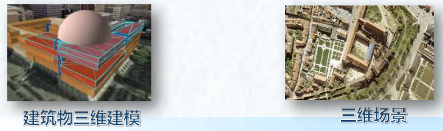

**地理数据：**表示地理位置、分布特点的自然现象和社会现象的诸要素文件。它包括自然地理数据和社会经济数据。

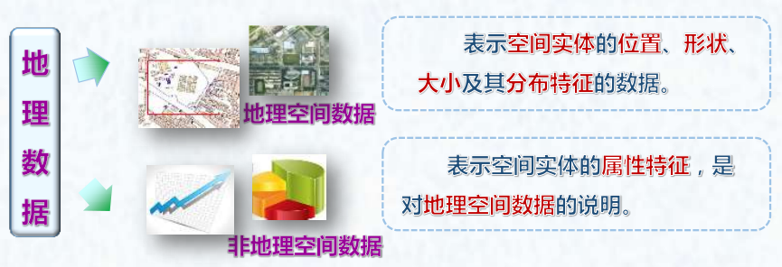

## 1.2 特征

1. 空间特征

   指空间物体的几何特征以及拓扑关系。

2. 属性特征

   与空间现象的属性信息相关联。

3. 时间特征

   地理空间数据是动态的信息。

## 1.3 分类

根据数据来源，地理空间数据可分为以下四类：

1. 图形数据

   数字化的数据。

2. 图像数据

   航空和航天数据。

3. 实体属性数据

   空间实体的专题信息数据。

4. 统计数据

   描述性数据。

### 1.3.1 图形数据

**图形数据的概念：**

把构成地图要素的点、线、面以点的坐标对（x，y）形式记录下来，形成有规律的数据集合体。

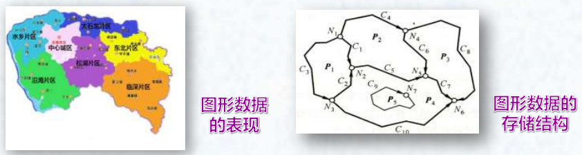

**图形数据的来源：**

- 纸质地图数字化
- 空间分析
- 外业测量
- 图像数据转换

**图形数据的表达：**

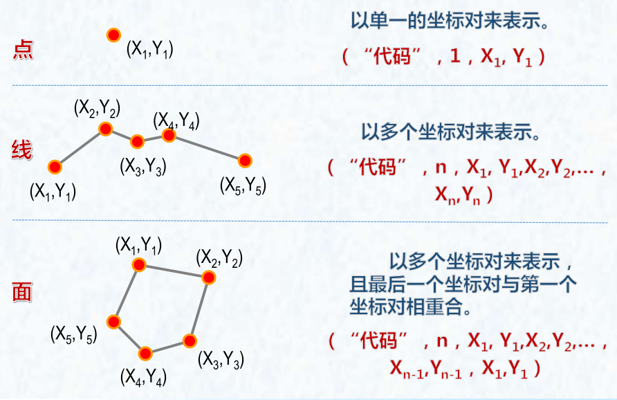

**图形数据的组织：**

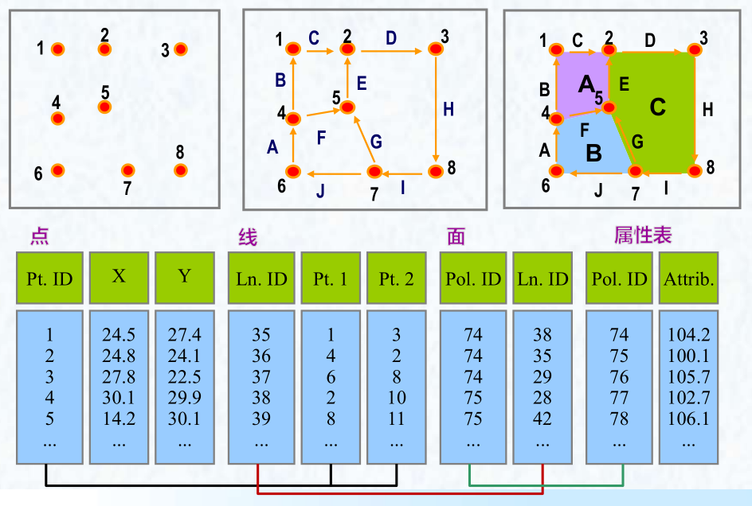

**图形数据的比例尺：**

比例尺反应了制图区域和地图的比例关系。地图上某线段的长度与实地相应线段的水平长度之比，成为地图比例尺。

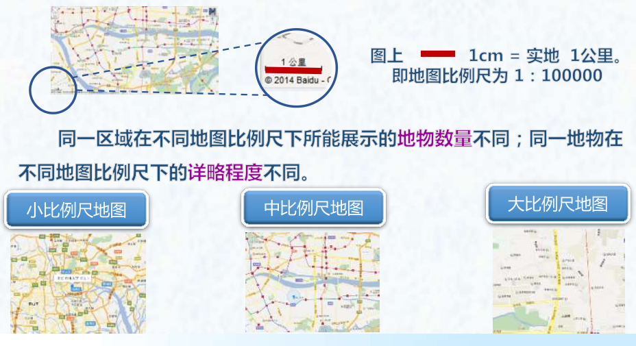

**图形数据的拓扑结构：**

拓扑结构是指基本要素点、线、面和体之间具有邻接、关联和包含的拓扑关系，与长度、面积无关。

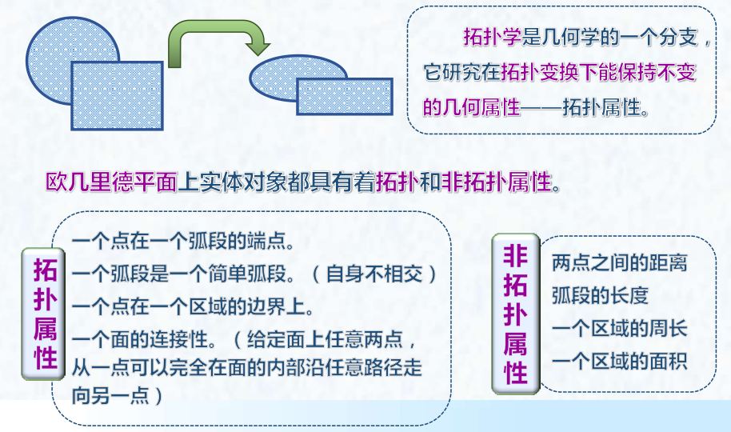

**基本拓扑关系：**

1. 拓扑邻接

   指存在于空间图形中同类要素之间的拓扑关系，如节点邻接关系、多边形邻接关系等。

   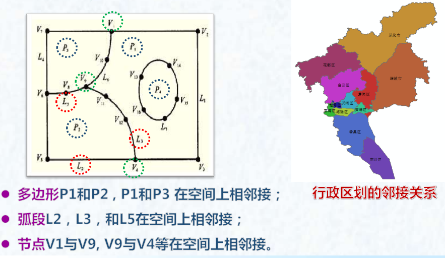

   

2. 拓扑关联

   指存在于空间图形中不同类要素之间的拓扑关系，如多边形与弧段、弧段与节点之间的关联关系。

   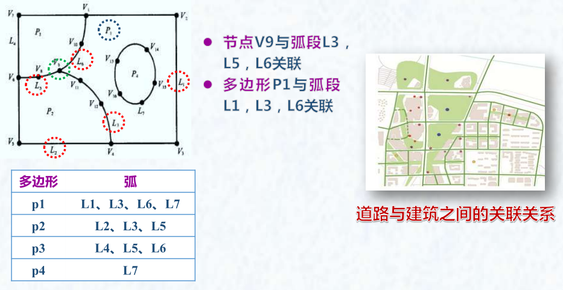

   

3. 拓扑包含

   指存在于空间图形中同类但不同级的基本要素之间的拓扑关系。

   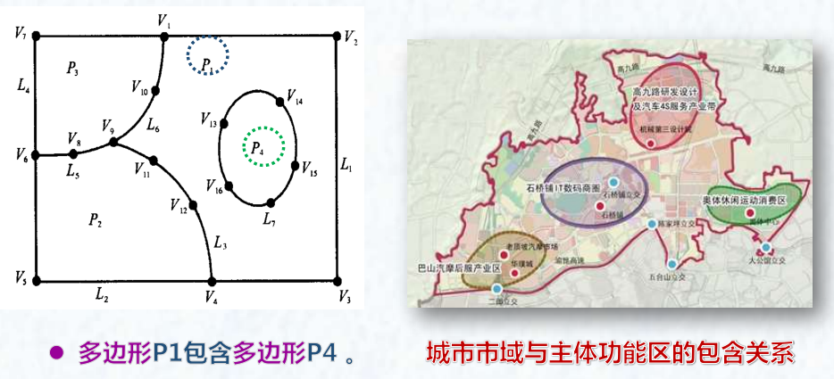

### 1.3.2 图像数据

**图像数据的概念：**

图像数据的最小单元为像元或像素，像元的数值可用于描述客观世界中存在的现象。

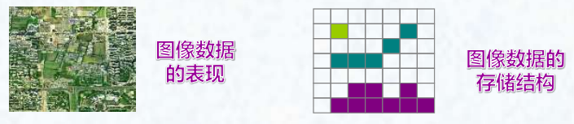

**图像数据的实质：**

图像数据的实质是像元的阵列，每个像元由行列号确定其位置，且具有实体属性的编码值。

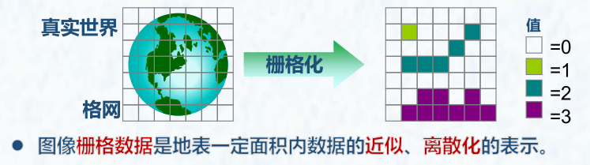

**空间分辨率：**

指像元所代表的地面范围的大小，即扫描仪的瞬时视场，或地面物体能分辨的最小单元。

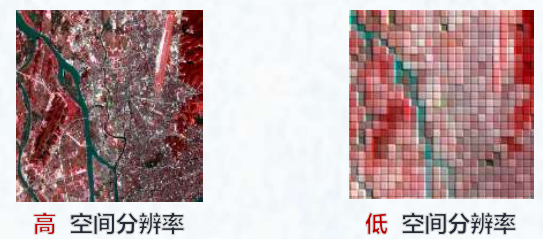

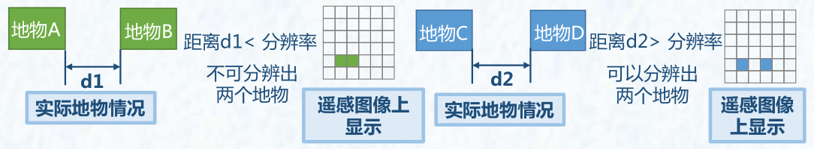

**图像数据的表达：**

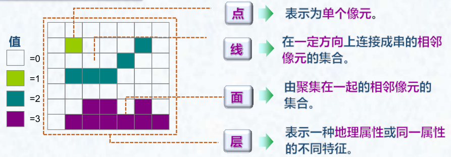

**图像数据的组织形式：**

1. 面向栅格单元的组织方式

   以不同层中对应于同一像元位置上的各个属性值表示为一个数组。

2. 面向地理实体

   以多边形为单位，记录属性值及组成多边形的各个像元坐标。

3. 以“层”方式存储

   以层为基础，每层以像元为序，记录其坐标和属性值。

**图像数据的方向表达：**

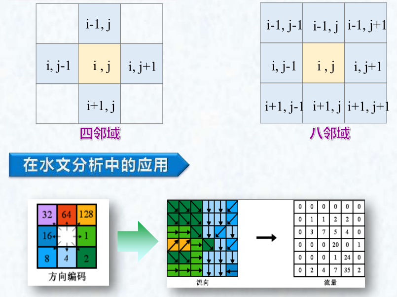

# 2 矢量数据

## 2.1 基本概念

矢量数据是指通过记录地理实体坐标的方式精确地表示点、线、面等实体地空间位置和形状。

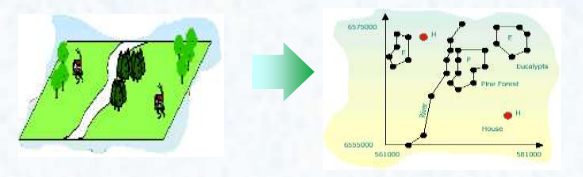

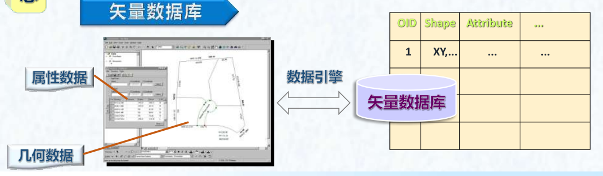

## 2.2 数据编码

把需要加工处理的信息，根据一定的数据结构和目标的定性特征，用特定的代码或编码字符来表示，以便于计算机识别和管理。

**数据编码方法：**

1. 坐标序列法

   任何点、线、面实体都可以用某一坐标体系中的坐标点坐标（x，y）来表示。

   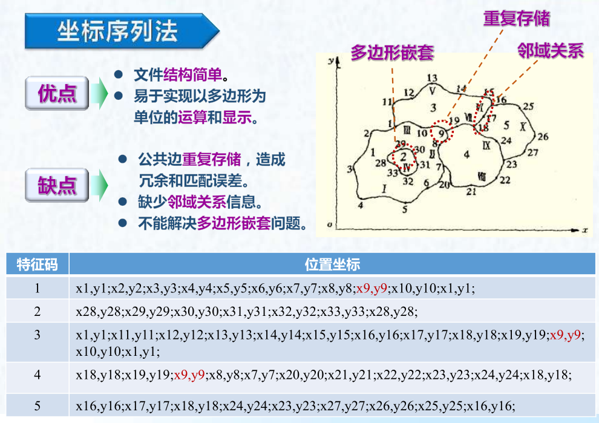

   

2. 树状索引编码法

   采用树状索引以减少数据冗余并间接表示邻域信息。

   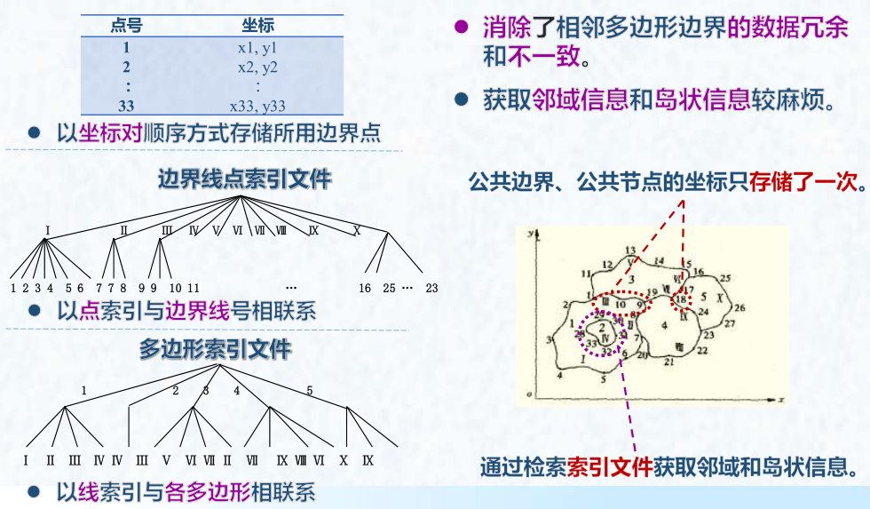

   

3. 拓扑结构编码法

   输入数据的同时输入拓扑连接关系，从一系列相互关联的链中建立拓扑结构，解决多边形嵌套和邻域关系。

   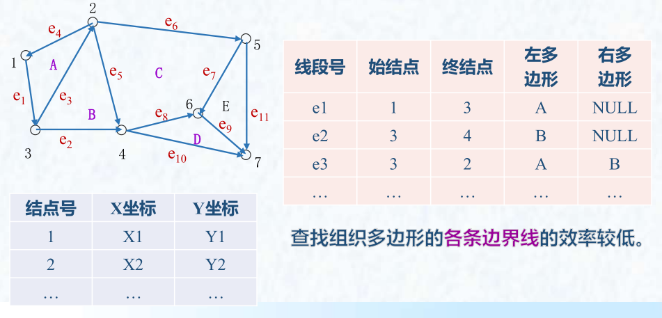

## 2.3 数据压缩

从所取得的矢量数据集合中抽出一个子集作为一个新的数据源，在规定的精度范围内最好地逼近原集合，而又取得尽可能大的压缩比。

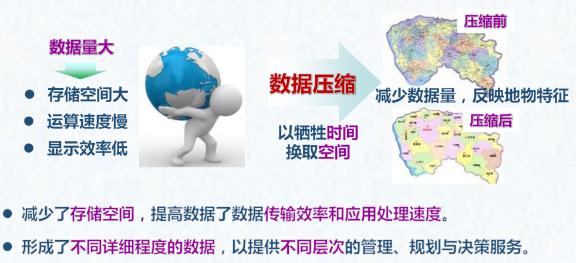

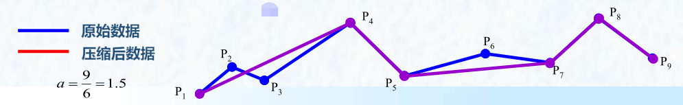

**数据压缩方法：**

1. 间隔取点法
2. 间隔取点法 - 按距离取点
3. 垂距法
4. 偏角法
5. 光栏法
6. 道格拉斯 - 普克法

## 2.4 数据变换

1. 平移变换
2. 比例变换
3. 旋转变换
4. 错位变换

# 3 栅格数据

## 3.1 基本概念

**栅格数据：**是指把空间分割成统一的尺寸与形状（栅格或格子）的一种空间填充数据结构，整个区域由栅格单元（像元或像素）组成。通过分层表示不同种类的信息，每层只能描述一种信息。

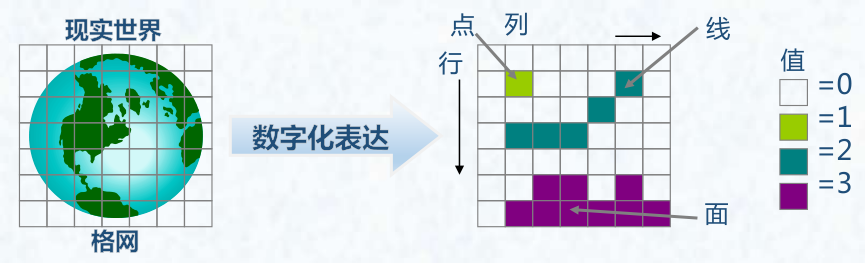

**栅格数据的获取：**

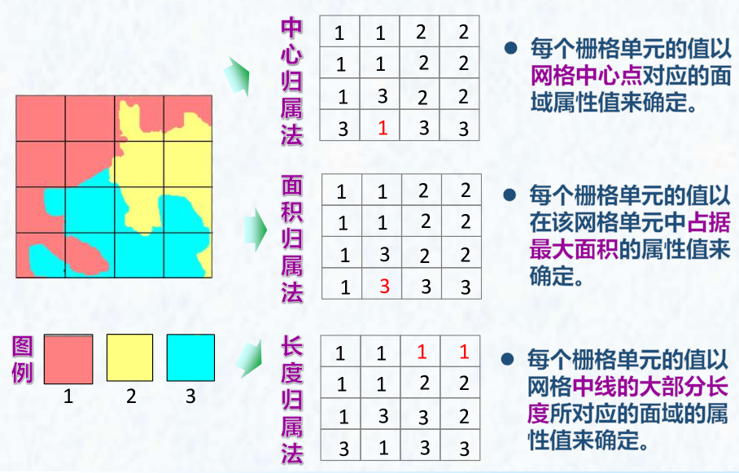

## 3.2 数据存储

**栅格单元位置和属性：**每个栅格单元都有自己的位置和属性值。

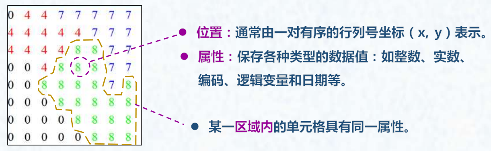

**栅格单元地理坐标的推算：**

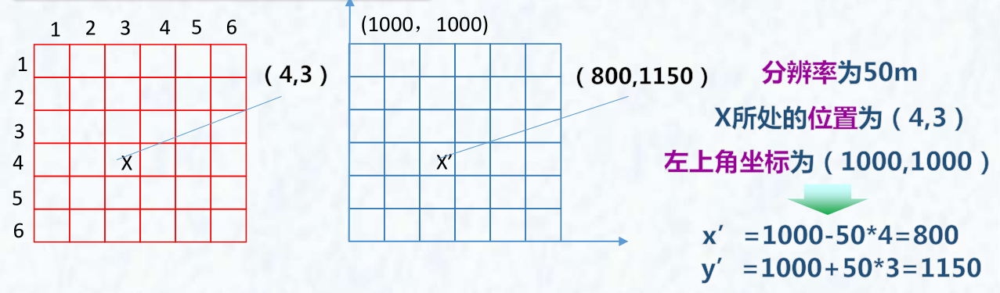

## 3.3 数据压缩

数据压缩方法：

1. 长度编码法

   从左至右，从上至下扫描栅格数据，记录属性值及相同的栅格数据。

   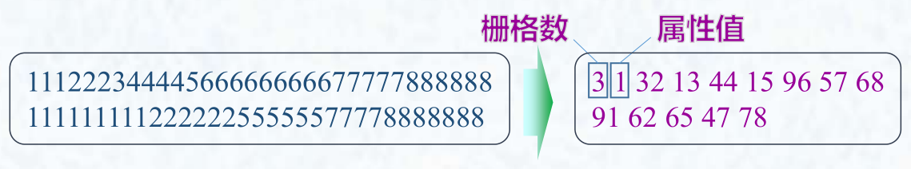

   缺点：

   - 每行长度不同，在数据差异大时较少使用

   

2. 改变扫描顺序法

   迂回式的读取方式，省去每次跳回每行开始处的时间，节省扫描时间。

   

   

3. 链式编码法

   又称边界链码法，多边形的边界可由某一原点开始并按某些基本方向确定的单位矢量链。

   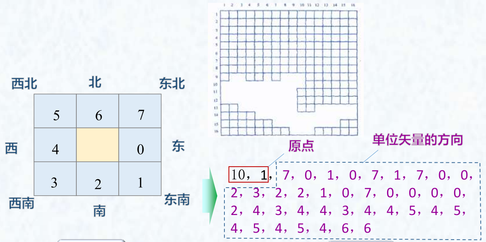

   优点：

   - 具有很强的压缩能力。

   - 具有一定的运算能力，如周长、面积等。

   缺点：

   - 难以实现叠加运算。

   - 局部修改将改变整体结构，效率低。

   - 相邻边界重复存储。

   

4. 游程长度编码法

   按行的顺序存储多边形内各个像元的序号，即在某行上从左至右存储该多边形的始末像元序号。

   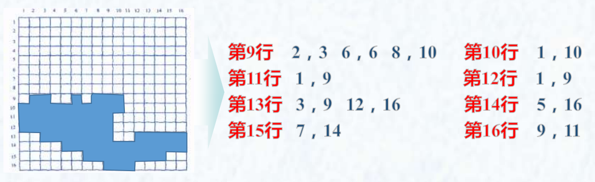

   特点：

   - 在许多相邻像元属性值相同的基础上，压缩效率更高。

   - 在进行网格加密时，数据量没有明显的增加。

   - 易于检索、叠加、合并等操作。

   - 压缩和解压处理工作都有所增加。

   

5. 块式编码法

   将游程长度编码扩大到二维的情况，把多边形范围划分成由像元组成的正方形，然后对各个正方形进行编码。

   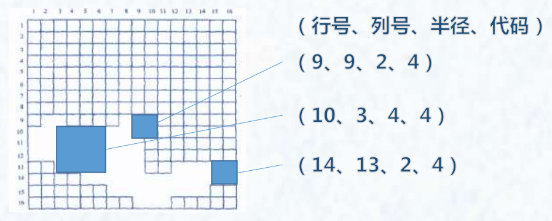

   特点：

   - 所能包含的正放心越大，边界越简单，编码的效果越好。

   - 在合并、插入、检查延展性、计算面积等操作时有明显的优越性。

   - 对不适应的运算方式，必须再转换成简单数据形式才能顺利进行。

   

6. 四叉树编码法

   将 $2^n$ x $2^n$ 像元阵列的区域，逐步分解成包含单一类型的方形区域，最小的方形区域为一个像元。

   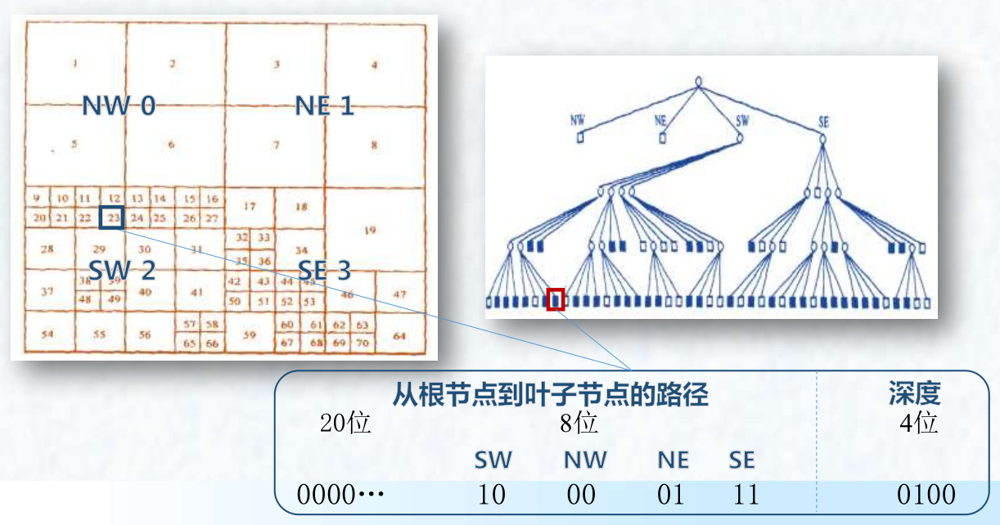

   优点：

   - 容易而有效地计算多边形地数量特征。

   - 阵列的各个部分分辨率是可变的。

   - 与简单栅格编码地相互转换较容易。

   - 多边形中嵌套不同类型小多边形地表示较方便。

   缺点：

   - 转换的不确定性，用同一形状和大小的多边形可能得出多种不同的四叉树结构。

## 3.4 数据运算

### 3.4.1 基本运算

1. 平移

   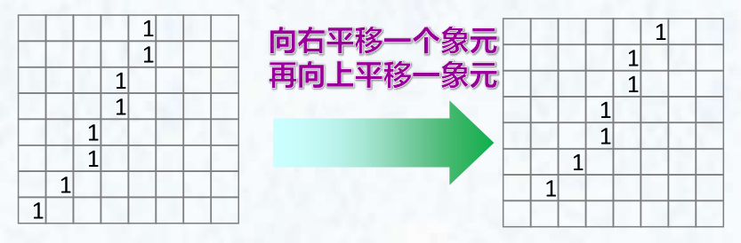

   

2. 算术组合

   加减乘除、开方、平方等

   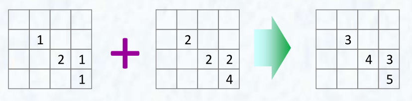

   

3. 布尔逻辑运算

   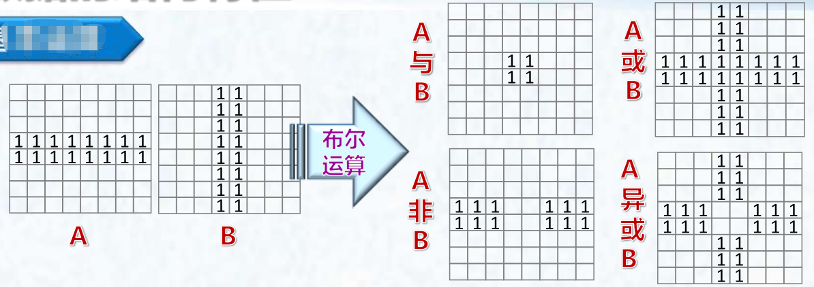

   

### 3.4.2 宏运算

1. 扩张

   描述地理事物的扩张，如城市扩张、污染扩散等。

   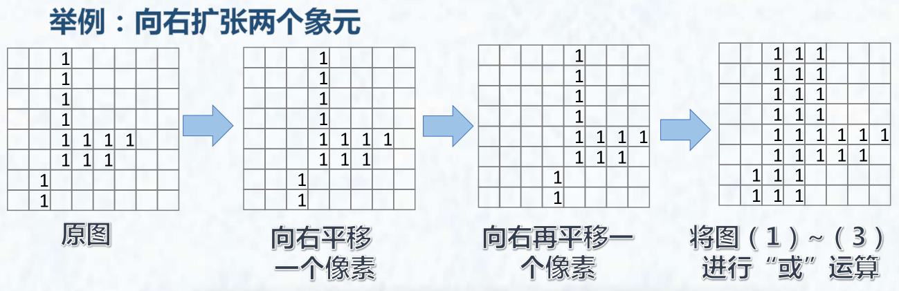

   

2. 侵蚀

   描述地理事物分布或影响范围的缩小，如农田被侵占。

   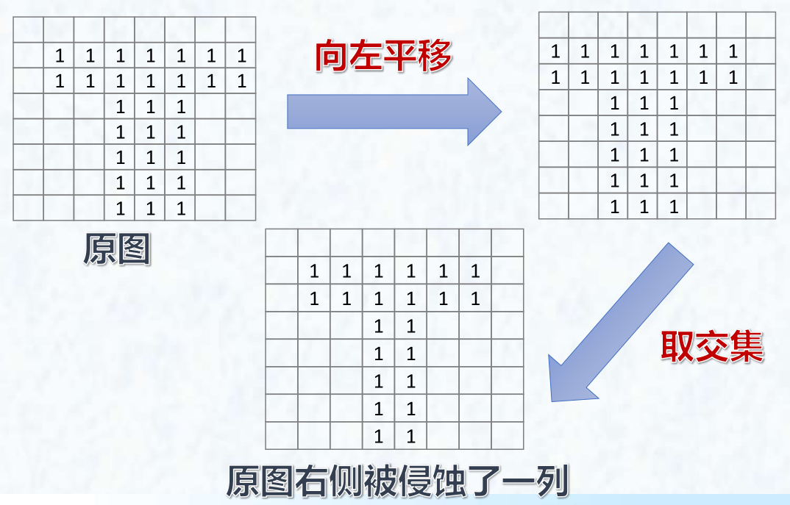

   

3. 加粗

   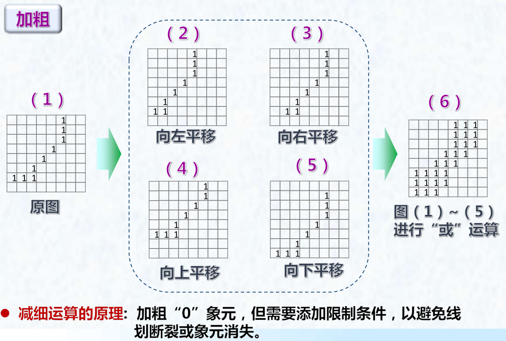

   

4. 填充

   带有边界条件的逐步加粗法。

   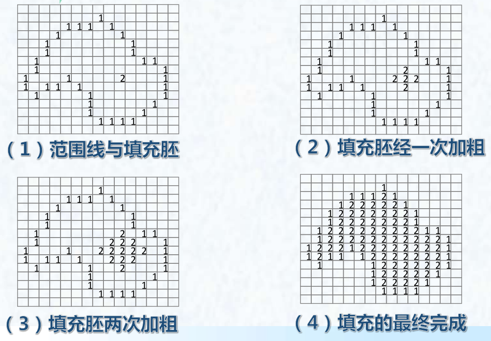

   

# 4 矢量和栅格数据的比较

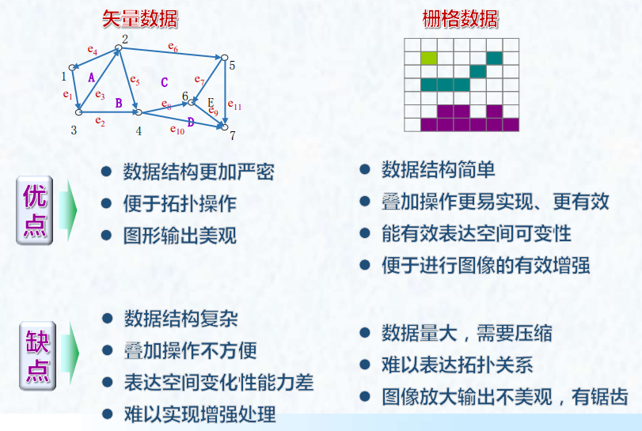
