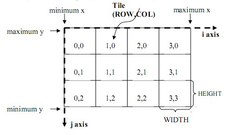
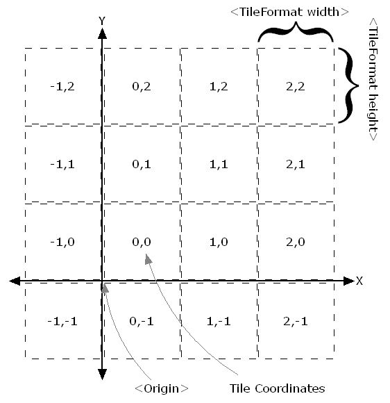

[TOC]

WebGIS的开发经常需要面对各种地图服务规范，例如WMS、WFS、WCS、WPS、WMTS、TMS、WMSC等，对这些规范的基础认识是非常重要的。

这篇文章中仅仅是对各种服务规范的简要介绍，详细信息可以参考<a href="https://docs.geoserver.org/stable/en/user/services/index.html#services" target="_blank">GeoServer官网对这些服务的详细介绍</a>。

在介绍各种地图服务规范前，先来简单了解下面几个组织机构，因为所有的地图服务规范，都出自这些组织机构之手：

- **OGC**

  开放地理空间信息联盟 （Open Geospatial Consortium-OGC），是一个非盈利的国际标准组织，致力于提供地理信息行业软件和数据及服务的标准化工作，它制定了数据和服务的一系列标准，GIS厂商按照这个标准进行开发可保证空间数据的互操作。OGC在1994年到2004年期间机构名为Open GIS Consortium， 后因业务需要更名为OGC。

- **OSGeo**

  OSGeo是指[开源空间信息基金会（Open Source Geospatial Foundation，OSGeo）是一个全球性非营利性组织，目标是支持全球性的合作，建立和推广高品质的空间信息开源软件。

# WMS（网络地图服务）

OGC的Web Map Service（网络地图服务）规范，它定义了一个HTTP接口，用于从服务器请求**图像格式**的地理信息。

WMS为请求地理空间图像提供了一个标准接口，这使得WMS客户端可以从多个WMS服务端请求地图图像，然后将它们合并到一个视图中供用户使用。这个标准保证了这些图像可以像实际中那样相互叠加。

WMS目前主要有两个版本：1.1.1 和 1.3.0，前者应用最为广泛。

WMS支持以下操作：

| 操作             | 描述                                                         | 服务端实现 |
| ---------------- | ------------------------------------------------------------ | ---------- |
| Exceptions       | 出现异常。                                                   | 必须       |
| GetCapabilities  | 检索服务的元数据，包括支持的操作和参数，以及可用的图层列表。 | 必须       |
| GetMap           | 检索指定区域和内容的地图图像。                               | 必须       |
| GetFeatureInfo   | 检索地图上像素位置的基础数据，包括几何形状和属性值。         | 可选       |
| DescribeLayer    | 指示WFS或WCS检索图层的附加信息。                             | 可选       |
| GetLegendGraphic | 检索生成的地图图例。                                         | 可选       |

:bulb: 关于WMS的详细描述可以参考 <a href="https://docs.geoserver.org/stable/en/user/services/wms/reference.html#operations" target="_blank">GeoServer官网对WMS的介绍</a>。

# WFS（网络要素服务）

OGC的Web Feature Service（网络要素服务）规范，用来通过HTTP来创建、修改和交换**矢量格式**的地理信息。WFS用地理标记语言(GML)编码和传输信息，GML是XML的一个子集。

WFS目前最新版本为2.0.0，其还有1.0.0和1.1.0版本，不同版本之间有一些比较重要的差异。

WFS定义了一个以独立于底层地理数据的方式对离散的地理要素访问，并且支持事务的框架。通过发现、查询、锁定和事务操作的组合，用户可以访问源空间和属性数据，从而实现查询、设置样式、编辑（创建、更新和删除）和下载单个要素。

WFS支持以下操作：

| 操作                  | 描述                                                         | 版本支持 |
| --------------------- | ------------------------------------------------------------ | -------- |
| GetCapabilities       | 生成元数据文档，描述服务器提供的WFS服务以及有效的WFS操作和参数。 | 所有     |
| DescribeFeatureType   | 返回WFS服务支持的要素类型的描述。                            | 所有     |
| GetFeature            | 返回从数据源中选择的要素，包括几何图形和属性值。             | 所有     |
| LockFeature           | 通过持久化的要素锁来防止要素被修改。                         | 所有     |
| Transaction           | 修改（创建、更新、删除）要素类型。                           | 所有     |
| GetPropertyValue      | 通过查询表达式来检索要素的属性值或者复杂要素的部分属性值。   | 仅2.0.0  |
| GetFeatureWithLock    | 返回所选择的要素，并对这些要素应用锁。                       | 仅2.0.0  |
| CreateStoredQuery     | 创建一个存储的查询。                                         | 仅2.0.0  |
| DropStoredQuery       | 删除一个存储的查询。                                         | 仅2.0.0  |
| ListStoredQueries     | 返回存储的查询列表。                                         | 仅2.0.0  |
| DescribeStoredQueries | 返回一个描述存储的查询的元数据文档。                         | 仅2.0.0  |
| GetGMLObject          | 根据ID检索要素和元素。                                       | 仅1.1.0  |

:bulb: 关于WFS的详细描述可以参考 <a href="https://docs.geoserver.org/stable/en/user/services/wfs/reference.html" target="_blank">GeoServer官网对WFS的介绍</a>。

# WCS（网络栅格服务）

OGC的Web Coverage Service（网络栅格服务）规范，它将接收到的地理空间数据称为“coverages”，即代表空间变化现象的数字地理空间信息。可以将它视作栅格数据的WFS。

注意区别WCS和WMS，它们很相似，都能返回相似的格式，但是WCS可以返回更新信息，包括更有价值的元数据和更多的格式，WCS还支持精确查询。

WCS为如何请求地图图像的栅格定义了标准。WMS返回的地图图像只能当成图片使用，但是WCS返回的结果可以用于复杂的建模和分析，这是因为它包含了更多的信息。WCS还允许客户端进行精确查询，这样客户端就可以提取其需要的coverage。

WCS支持以下操作：

| 操作             | 描述                                          |
| ---------------- | --------------------------------------------- |
| GetCapabilities  | 检索服务器数据列表，以及有效的WCS操作和参数。 |
| DescribeCoverage | 检索完整描述所请求的coverage的XML文档。       |
| GetCoverage      | 检索coverage                                  |

# WPS（网络处理服务）

OGC的Web Processing Service（网络处理服务）规范，用于发布地理空间的处理、算法和计算。

WPS支持以下操作：

| 操作            | 描述                                                         |
| --------------- | ------------------------------------------------------------ |
| GetCapabilities | 请求服务提供的详细信息，包括服务元数据和描述可用处理的元数据。响应是一个称为功能文档的XML文档。 |
| DescribeProcess | 请求服务所提供的处理的描述。                                 |
| Execute         | 请求使用指定的输入值和所需的输出数据项执行处理。             |

:bulb: 关于WPS的详细描述可以参考 <a href="https://docs.geoserver.org/stable/en/user/services/wps/index.html" target="_blank">GeoServer官网对WPS的介绍</a>。

# WMS-C

OSGeo的Web Mapping Service - Cached规范，其目的在于提供一种预先缓存数据的方法，以提升地图请求的速度。

WMS-C通过bbox和resolutions去决定请求的地图层级，为了更加直观的请求地图瓦片，一些软件做了一些改进，例如WorldWind在请求中使用level/x/y三个参数，直观明了。典型的基于WMS-C的实现是TileCache。

需要注意的是，WMS-C目前已经被TMS和WMTS取代。已经使用WMS-C规范的程序目前仍然被支持，但是如果编写新的应用程序，应该考虑TMS和WMTS。

# WMTS（网络地图瓦片服务）

OGC的Web Map Tile Service（网络地图瓦片服务）规范，定义了允许用户访问瓦片地图的操作。

WMTS提供了一种采用**预定义图块方法**发布数字地图服务的标准化解决方案。WMTS弥补了WMS不能提供分块地图的不足，在服务器端把地图切割为一定不同级别大小的瓦片（瓦片矩阵集合），对客户端预先提供这些预定义的瓦片，将更多的数据处理操作如叠加和切割等放在客户端，降低服务器端的载荷。

WMTS牺牲了提供定制地图的灵活性，代之以通过提供静态数据（基础地图）来增强伸缩性，这些静态数据的范围框和比例尺被限定在各个图块内。这些固定的图块集使得对WMTS服务的实现可以使用一个仅简单返回已有文件的Web服务器即可，同时使得可以利用一些标准的诸如分布式缓存的网络机制实现伸缩性。

WMTS支持KVP、SOAP、RESTful三种协议，WMTS中瓦片形状为矩形，不同比例尺瓦片可以尺寸不同，瓦片组织方式如下图：

WMTS支持以下操作：

| 操作            | 描述               | 服务端实现 |
| --------------- | ------------------ | ---------- |
| GetCapabilities | 获取服务的元信息   | 必须       |
| GetTile         | 获取切片           | 必须       |
| GetFeatureInfo  | 获取所选的要素信息 | 可选       |

:bulb: 关于WMTS的详细描述可以参考 <a href="./resources/Web_Map_Tile_Service_Standard.pdf" target="_blank">Web_Map_Tile_Service_Standard</a>。

# TMS（切片地图服务）

OSGeo的Tile Map Service（切片地图服务）规范，定义了允许用户访问瓦片地图的操作。

TMS和WMTS在本质上非常类似，都是将地图切片保存到本地，从而提升访问速度，并且基本上遵循的是同一种切片规则。

值得注意的是，TMS仅支持RESTful三种协议，TMS中瓦片形状为正方形，瓦片组织方式**在y方向上WMTS是相反的**，与如下图：

:bulb: 关于TMS的详细描述可以参考 <a href="https://wiki.osgeo.org/wiki/Tile_Map_Service_Specification" target="_blank">Tile_Map_Service_Specification</a>。