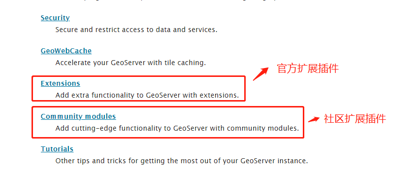
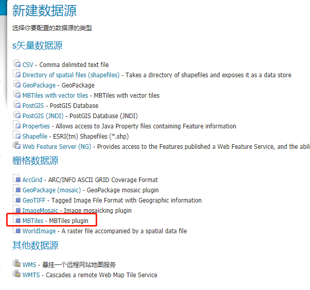
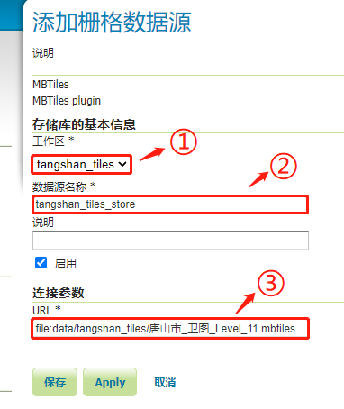

[TOC]

GeoServer默认不支持MBTiles瓦片数据，但是可通过安装相关插件来实现对瓦片地图的支持。

**关于geoserver插件**

geoserver的插件扩展分为官方和社区两类，可以在官网的<a href="https://docs.geoserver.org/latest/en/user/index.html" target="_blank">用户手册</a>页面中找到入口，如下图：

在geoserver的<a href="https://build.geoserver.org/geoserver/main/" target="_blank">资源下载</a>页面中，可以找到官方插件和社区插件的下载目录，如下图：

# 1 安装MBTiles插件

## 1.1 下载插件

- <a href="https://build.geoserver.org/geoserver/main/community-latest/geoserver-2.21-SNAPSHOT-mbtiles-store-plugin.zip" target="_blank">mbtiles-store-plugin</a>
- <a href="https://build.geoserver.org/geoserver/main/community-latest/geoserver-2.21-SNAPSHOT-mbtiles-plugin.zip" target="_blank">mbtiles-plugin</a>
- <a href="https://build.geoserver.org/geoserver/main/ext-latest/geoserver-2.21-SNAPSHOT-wps-plugin.zip" target="_blank">wps-plugin</a>

## 1.2 安装插件

将上述插件解压到geoserver安装位置的 `WEB-INF/lib` 目录下

## 1.3 重启

重新启动geoserver服务

## 1.4 验证

登录geoserver，创建数据源（store），在创建页面中可以看到 MBTiles 数据源选项说明安装成功，如下图：

# 2 发布MBTiles瓦片数据

## 2.1 创建数据源

1. **新建数据源，选择MBTiles数据源：**

2. **编辑数据源属性：**
   - ① 选择所属工作区，如果未创建，需要先创建工作区（在geoserver中，工作区【workplace】类似于项目的概念，是顶层结构，地图数据源必须在工作区下）。
   - ② 填写数据源名称，建议不要使用中文。
   - ③ 填写MBTiles文件路径，该路径有两种可选择的格式：
     - **绝对路径**：指文件的绝对路径，格式为 `file:绝对路径`，例如 `file:D:\workplace\geoserver-2.19.2\data_dir\data\tangshan_tiles\唐山市_卫图2_Level_11.mbtiles`。
     - **相对路径**：指相对于geoserver数据目录`/data_dir` 的路径，例如 `file:data/tangshan_tiles/唐山市_卫图2_Level_11.mbtiles`。

3. **保存数据源**

## 2.2 发布图层

数据源保存提交后，将自动跳转对应的图层发布页面，点击“发布”按钮。

然后编辑图层属性：

- ① 填写图层基本属性。

- ② 确认坐标系，一般情况下，MBTiles数据源可自动读取出其坐标系，否则可以自己选择坐标系。

- ③ 确认地图范围，如果坐标系自动可以自动识别出，那么地图范围也可以自动识别出，否则可以通过按钮 **Compute from SRS bounds**、**Compute from native bounds** 来根据坐标系自动填充。

- ④ 点击 **Reload band definitions** 按钮重新加载覆盖细节。

- 保存

## 2.3 预览图层

进入**Layer Preview** 页面，找到发布的图层，点击 **OpenLayers** 按钮进行预览：

