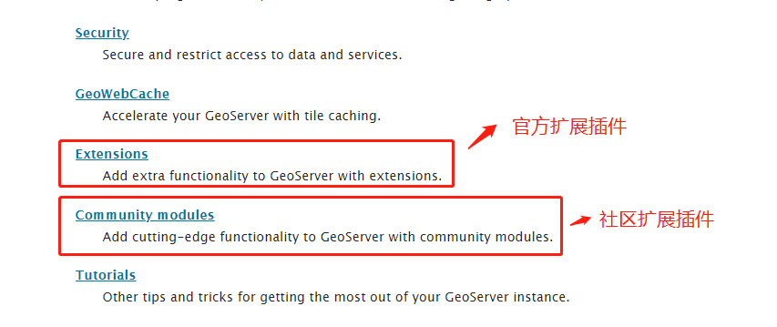
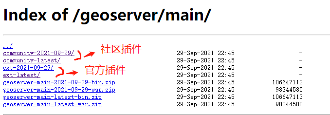
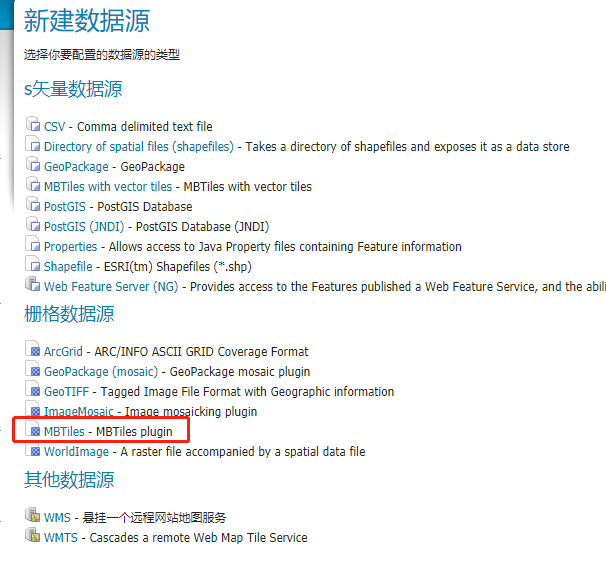
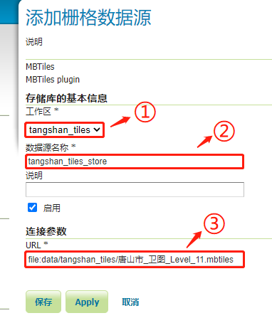

[TOC]

GeoServer默认不支持mbtiles瓦片地图，但是可通过安装相关插件来实现对瓦片地图的支持。

**关于geoserver插件**

geoserver的插件扩展分为官方和社区两类，可以在官网的<a href="https://docs.geoserver.org/latest/en/user/index.html" target="_blank">用户手册</a>页面中找到入口，如下图：

在geoserver的<a href="https://build.geoserver.org/geoserver/main/" target="_blank">资源下载</a>页面中，可以找到官方插件和社区插件的下载目录，如下图：

# 1 安装mbtiles插件

1. **下载相关插件**：
   - <a href="https://build.geoserver.org/geoserver/main/community-latest/geoserver-2.21-SNAPSHOT-mbtiles-store-plugin.zip" target="_blank">mbtiles-store-plugin</a>
   - <a href="https://build.geoserver.org/geoserver/main/community-latest/geoserver-2.21-SNAPSHOT-mbtiles-plugin.zip" target="_blank">mbtiles-plugin</a>
   - <a href="https://build.geoserver.org/geoserver/main/ext-latest/geoserver-2.21-SNAPSHOT-wps-plugin.zip" target="_blank">wps-plugin</a>

2. **安装插件：**

   将上述插件解压到geoserver安装位置的 `WEB-INF/lib` 目录下

3. **重启geoserver**

4. **验证是否安装成功**

   登录geoserver，创建数据源（store），在创建页面中可以看到 MBTiles 数据源选项说明安装成功，如下图：

   

# 2 发布mbtiles瓦片地图

1. 新建数据源，选择 MBTiles 数据源

   

2. 配置瓦片地图文件位置

   如果是绝对路径，url的格式是 `file:C:\Data\landbase.mbtiles`，如果放在geoserver的数据目录（`/data_dir`）中，可以按照相对路径进行填写`file:data/landbase.mbtiles` 。

   

3. 发布图层
