[TOC]

GeoServer提供了地图切片功能，本篇文章就以我在<a href="./GeoServer发布MBTiles瓦片数据.html" target="_blank">《GeoServer发布MBTiles瓦片数据》</a>中发布的图层为例进行切片。

# 1 创建Gridsets

点击geoserver页面左侧菜单栏中的 **Gridsets** 菜单

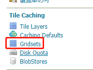

跳转后的页面中列出了当前已存在的 Gridsets，每个Gridsets都是基于一种坐标系建立的，即 CRS 列。

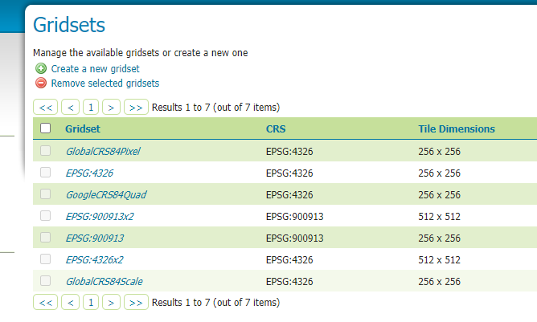

查看要进行的切片的图层信息，发现该图层坐标系为 EPSG:3857，并且该图层为11级别精度，相应的我也想要切分出11个级别，发现已有的 Gridsets 列表中没有满足条件的，那么点击 **Create a new gridset** 按钮进行新建。

**编辑Gridset**：

- ① 编辑Gridset名称，一般建议用 `坐标系x缩放层级` 的格式。
- ② 点击查找按钮，选择坐标系。
- ③ 点击 **Compute from maximum extent of CRS** 按钮，自动计算范围。
- ④ 点击 **Add zoom level** 按钮，添加缩放层级。由于我的地图图层精度为11级，所以此处我设置了0-11的缩放层级，如⑤中所示。

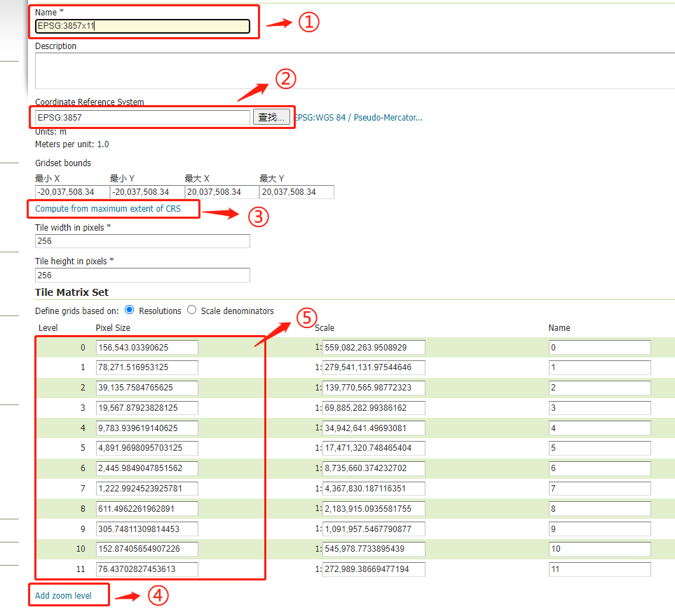

 

**保存Gridset**

# 2 修改图层的Tile Caching

找到要切片的图层，进入图层编辑页面，点击 **Tile Caching** 标签：

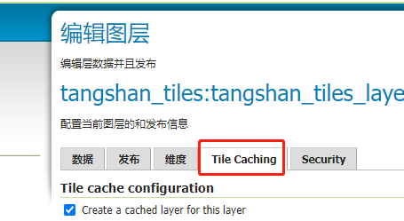

找到最底部GridSet列表：

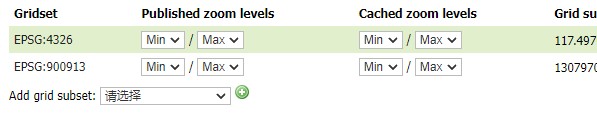

可以看到，当前的两个GridSet并不是我想要的，我想要设置的应该是在上一步中创建的GridSet，即 `EPSG:3857x11`，那么删除这两个GridSet，然后点击底部下拉选择框，找到`EPSG:3857x11`：

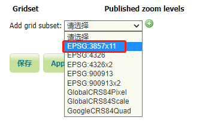

点击右侧添加按钮：

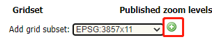

添加成功：

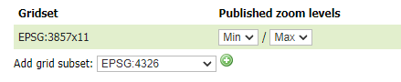

保存图层。

# 3 执行切片任务

点击geoserver页面左侧菜单栏中的 **Tile Layers** 菜单

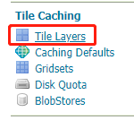

跳转后的页面中列出了当前可执行切片的图层，找到目标图层，点击 **Seed/Truncate** 按钮：

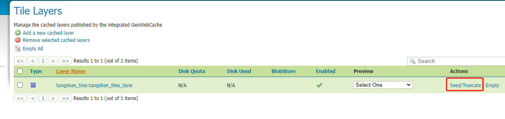

按钮点击后跳转执行切片页面：

- ① 确认 Gridset 是否正确。
- ② 设置好要进行切片的层级范围。
- ③ 提交

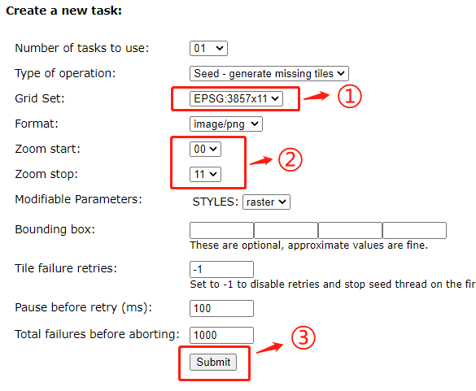

提交任务后，将展示任务列表，可以点击 **Refresh list** 按钮来刷新任务状态：

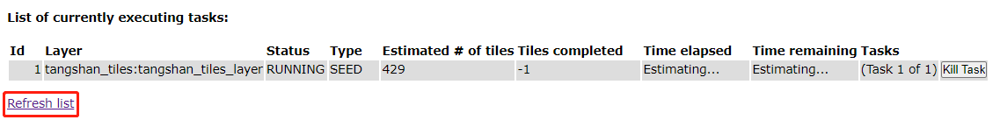

当任务列表变为如下状态时，表示切片已完成：

:laughing: 接下来，便可以通过OpenLayers等工具加载地图来查看效果啦！