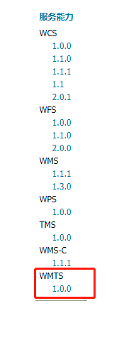
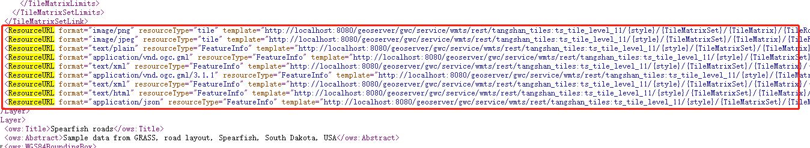
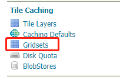
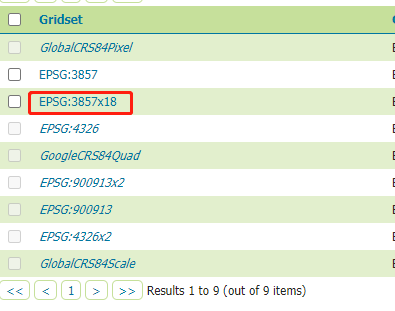
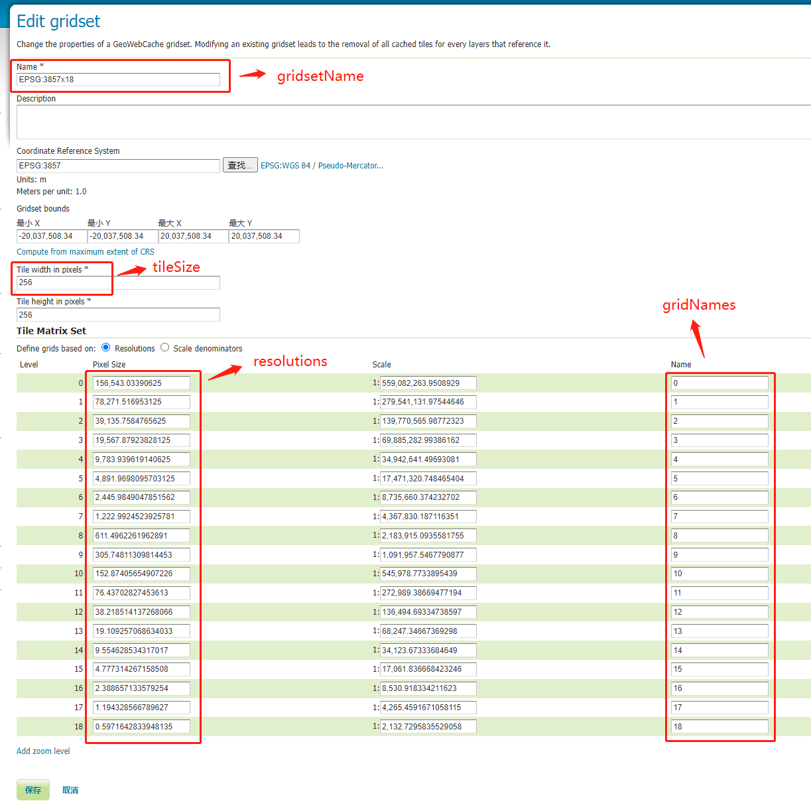

OpenLayers可以使用 **<a href="../basic/WebGIS - XYZ.html" target="_blank">XYZ</a>** 或者 **WMTS** 类两种方式来加载Geoserver发布的WMTS瓦片地图：

# 方式一：通过 XYZ 类

```vue
<template>
  <div id="map"></div>
</template>

<script>
import {Map, View} from 'ol';
import TileLayer from 'ol/layer/Tile';
import XYZ from 'ol/source/XYZ';
import Projection from 'ol/proj/Projection';

export default {
  name: "LoadWMTSByXYZ",
  data() {
    return {
      map: null
    }
  },
  mounted() {
    this.initMap();
  },
  methods: {
    initMap() {
      const app = this;
      const bounds = [13203197.206783397, 4788454.964696088, 13218733.03278226, 4799595.661568641];
      const map = new Map({
        target: 'map',
        view: new View({
          projection: new Projection({
            code: 'EPSG:3857',
            units: 'm',
            global: false
          })
        }),
        layers: [
          new TileLayer({
            source: new XYZ({
              url: "http://localhost:8080/geoserver/gwc/service/wmts/rest/LuanNan:LuanNan_tiles/EPSG:3857x18/{z}/{y}/{x}?format=image/png"
            })
          })
        ]
      });
      map.getView().fit(bounds, map.getSize());
      app.map = map;
    }
  }
}
</script>

<style scoped>

#map {
  width: 1000px;
  height: 800px;
  border: 1px solid black;
}

</style>
```


**附加**：可以通过如下方式查找GeoServer中WMTS的Rest URL格式

1. 点击首页左侧的 WMTS 

   

2. `<ResourceURL>` 标签内容就是各个图层的rest加载路径

   


# 方式二：通过 WMTS 类

```vue
<template>
  <div id="map"></div>
</template>

<script>
import {Map, View} from 'ol';
import TileLayer from 'ol/layer/Tile';
import WMTSTileGrid from 'ol/tilegrid/WMTS';
import WMTS from 'ol/source/WMTS';
import Projection from 'ol/proj/Projection';
import {getTopLeft} from 'ol/extent.js';
import {get as getProjection} from 'ol/proj.js';

export default {
  name: "LoadWMTS",
  data() {
    return {
      map: null
    }
  },
  mounted() {
    this.initMap();
  },
  methods: {
    initMap() {
      const app = this;
      const bounds = [13203197.206783397, 4788454.964696088, 13218733.03278226, 4799595.661568641];
      const gridsetName = 'EPSG:3857x18';
      const gridNames = ['0', '1', '2', '3', '4', '5', '6', '7', '8', '9', '10', '11', '12', '13', '14', '15', '16', '17', '18'];
      const style = '';
      const format = 'image/png';
      const layerName = 'LuanNan:LuanNan_tiles';
      const projection = getProjection('EPSG:3857');
      const extent = projection.getExtent();
      const origin = getTopLeft(extent);
      const tileSize = [256, 256];
      const resolutions = [156543.03390625, 78271.516953125, 39135.7584765625, 19567.87923828125, 9783.939619140625, 4891.9698095703125,
        2445.9849047851562, 1222.9924523925781, 611.4962261962891, 305.74811309814453, 152.87405654907226, 76.43702827453613,
        38.218514137268066, 19.109257068634033, 9.554628534317017, 4.777314267158508, 2.388657133579254, 1.194328566789627, 0.5971642833948135];
      const tileGrid = new WMTSTileGrid({
        tileSize: tileSize,
        extent: extent,
        origin: origin,
        resolutions: resolutions,
        matrixIds: gridNames
      });
      const map = new Map({
        target: 'map',
        view: new View({
          projection: new Projection({
            code: 'EPSG:3857',
            units: 'm',
            global: false
          })
        }),
        layers: [
          new TileLayer({
            source: new WMTS({
              url: "http://localhost:8080/geoserver/gwc/service/wmts",
              layer: layerName,
              matrixSet: gridsetName,
              format: format,
              projection: projection,
              tileGrid: tileGrid,
              style: style,
              wrapX: true
            })
          })
        ]
      });
      map.getView().fit(bounds, map.getSize());
      app.map = map;
    }
  }
}
</script>

<style scoped>

#map {
  width: 1000px;
  height: 800px;
  border: 1px solid black;
}

</style>
```


**附加**：上述代码中 gridsetName、gridNames、resolutions等参数可以通过如下方式查找：

1. 进入 GridSets

   

2. 点击图层使用的格网集

   

3. 对应查找相关的参数

   


:bulb: 源代码可参见 https://github.com/RabbitNoTeeth/openlayers-demo

