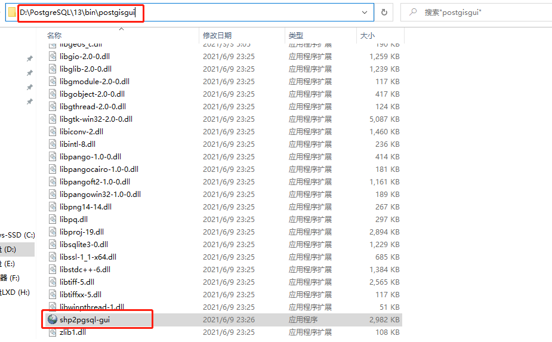

[TOC]

# 1 导入


## 1.1 GUI方式

仅限于Windows

### 1.1.1 打开shp2pgsql-gui工具

可在开始菜单中找到该工具，如下图：


也可以在PostGIS安装目录中找到该工具，如下图：




### 1.1.2 连接目标数据库

点击“View connection details”填写数据库配置


填写数据库配置


连接成功后，日志窗口中将打印成功日志


### 1.1.3 选择shp文件

点击“Add File”按钮，选择shp文件（注意：文件所在路径不能含有中文，否则将导入失败）


文件选择完成，可修改“Table”列来设置将数据导入哪个表中


点击“Options”可设置其他导入属性，如编码等


### 1.1.4 确认导入

点击“Import”进行导入


导入成功后，日志窗口将打印成功日志


## 1.2 命令行方式

PostGIS提供了shp2pgsql命令，从而可通过命令行导入shp文件，shp2pgsql命令位于PostGIS安装目录的bin目录下。


**USAGE：**

```
shp2pgsql [<options>] <shapefile> [[<schema>.]<table>]
```


**OPTIONS：**

- **-s**                 [\<from>:]\<srid> Set the SRID field. Defaults to 0. Optionally reprojects from given SRID.
- **-d**                Drops the table, then recreates it and populates it with current shape file data.
- **-a**                Appends shape file into current table, must be exactly the same table schema.
- **-c**                Creates a new table and populates it, this is the default if you do not specify any options.
- **-p**                Prepare mode, only creates the table.
- **-g**                \<geocolumn> Specify the name of the geometry/geography column (mostly useful in append mode).
- **-D**               Use postgresql dump format (defaults to SQL insert statements).
- **-e**                Execute each statement individually, do not use a transaction. Not compatible with -D.
- **-G**               Use geography type (requires lon/lat data or -s to reproject).
- **-k**                Keep postgresql identifiers case.
- **-i**                 Use int4 type for all integer dbf fields.
- **-I**                 Create a spatial index on the geocolumn.
- **-m**              \<filename>  Specify a file containing a set of mappings of (long) column names to 10 character DBF column names. The content of the file is one or more lines of two names separated by white space and no trailing or leading space. For example:  COLUMNNAME DBFFIELD1、 AVERYLONGCOLUMNNAME DBFFIELD2
- **-S**                Generate simple geometries instead of MULTI geometries.
- **-t**                 \<dimensionality> Force geometry to be one of '2D', '3DZ', '3DM', or '4D'
- **-w**               Output WKT instead of WKB.  Note that this can result in coordinate drift.
- **-W**              \<encoding> Specify the character encoding of Shape's attribute column. (default: "UTF-8")
- **-N**               \<policy> NULL geometries handling policy (insert*,skip,abort).
- **-n**               Only import DBF file.
- **-T**               \<tablespace> Specify the tablespace for the new table.  Note that indexes will still use the default tablespace unless the -X flag is also used.
- **-X**               \<tablespace> Specify the tablespace for the table's indexes. This applies to the primary key, and the spatial index if the -I flag is used.
- **-?**                Display this help screen.


**示例：**

> 如果 psql 未设置未环境变量，那么需要指定其绝对路径地址

```
shp2pgsql -c C:\Users\Lenovo\Desktop\gisdata\hunan.shp | psql -h localhost -U postgres -d gisdemo -p 5432
```


# 2 导出

## 2.1 GUI方式

仅限于Windows

### 2.1.1 打开shp2pgsql-gui工具

可在开始菜单中找到该工具，如下图：


也可以在PostGIS安装目录中找到该工具，如下图：


### 2.1.2 连接目标数据库

点击“View connection details”填写数据库配置


填写数据库配置


连接成功后，日志窗口中将打印成功日志


### 2.1.3 选择导出表格

点击“Add Table”按钮，选择数据所在表格


表格选择完成，可修改“Filename”列来设置导出文件名称


点击“Options”可设置其他导出属性


### 2.1.4 确认导出

点击“Export”进行导出


选择导出文件位置


导出成功后，日志窗口将打印成功日志


## 1.2 命令行方式

PostGIS提供了pgsql2shp命令，从而可通过命令行导出shp文件，pgsql2shp命令位于PostGIS安装目录的bin目录下。


**USAGE：**

```
pgsql2shp [<options>] <database> [<schema>.]<table>
pgsql2shp [<options>] <database> <query>
```

 

**OPTIONS：**

-  **-f**                     \<filename>  Use this option to specify the name of the file to create.
- **-h**                     \<host>  Allows you to specify connection to a database on a machine other than the default.
- **-p**                     \<port>  Allows you to specify a database port other than the default.
- **-P**                     \<password>  Connect to the database with the specified password.
- **-u**                     \<user>  Connect to the database as the specified user.
- **-g**                     \<geometry_column> Specify the geometry column to be exported.
- **-b**                     Use a binary cursor.
- **-r**                      Raw mode. Do not assume table has been created by the loader. This would not unescape attribute names and will not skip the 'gid' attribute.
- **-k**                      Keep PostgreSQL identifiers case.
- **-m**                    \<filename>  Specify a file containing a set of mappings of (long) column names to 10 character DBF column names. The content of the file is one or more lines of two names separated by white space and no trailing or leading space. For example: COLUMNNAME DBFFIELD1、 AVERYLONGCOLUMNNAME DBFFIELD2
- **-q**                     Quiet mode. No messages to stdout.
- **-?**                      Display this help screen.


**示例：**

```
pgsql2shp -f C:\Users\Lenovo\Desktop\gisdata2\hunan.shp -h localhost -u postgres -P 123456 -p 5432 gisdemo  public.hunan
```

