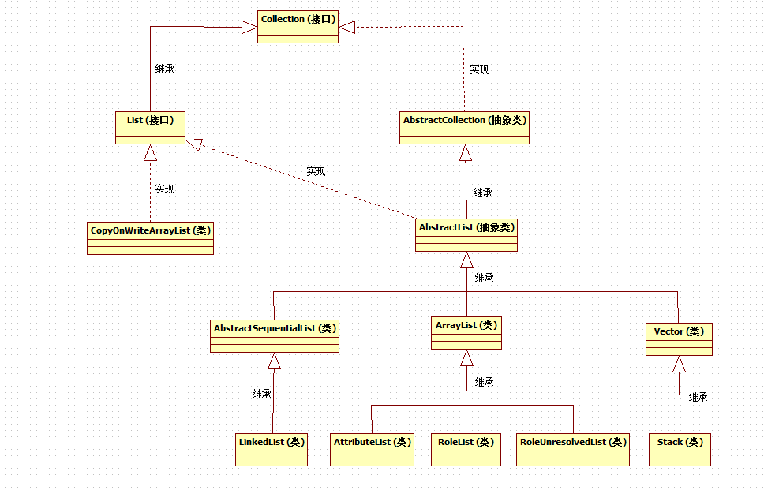

# 1 总览




# 2 LinkedList

LinkedList是一个双向链表，同时实现了List和Deque接口，允许插入重复元素，允许插入null值。它不是线程安全的。如果在多线程环境下使用，需要手动实现同步，或者使用工具类Collections提供的静态方法获取其同步的包装类：List list = Collections.synchronizedList(new LinkedList(...))；或者考虑使用concurrent模块提供的构建工具。


## 2.1 内部基础实现 

```
transient Node<E> first;
transient Node<E> last;
private static class Node<E> {
    E item;
    Node<E> next;
    Node<E> prev;

    Node(Node<E> prev, E element, Node<E> next) {
        this.item = element;
        this.next = next;
        this.prev = prev;
    }
}
```

通过源码，可以看到LinkedList内部是通过维护两个首尾Node节点，每个Node节点内都记录这前后的节点和自身包含的元素，从而实现了一个双端链表。


## 2.2 API

### 2.2.1 add(E e)

向尾部添加，等同于addLast(E e)方法。

```
public boolean add(E e) {
    linkLast(e);
    return true;
}

void linkLast(E e) {
    final Node<E> l = last;          //获取当前的尾节点
    final Node<E> newNode = new Node<>(l, e, null);    //创建新节点,将其前节点关联到当前尾节点,后节点为null,因为add添加是向尾部添加
    last = newNode;                //更新尾节点引用为新建的节点
    if (l == null)             //如果之前的尾节点为null,说明链表中没有元素
        first = newNode;         //那么新建的节点就是首节点
    else
        l.next = newNode;        //否则将之前的尾节点的后节点关联为新的尾节点
    size++;                      //递增元素个数
    modCount++;                   //递增修改次数
}
```


### 2.2.2 addFirst(E e)

向头部添加元素

```
public void addFirst(E e) {
    linkFirst(e);
}

private void linkFirst(E e) {
    final Node<E> f = first;      //获取当前的首节点
    final Node<E> newNode = new Node<>(null, e, f);    //新建节点,将其后节点关联到当前的首节点
    first = newNode;            //更新首节点引用为新建节点
    if (f == null)             //如果之前的首节点为null,说明链表中没有元素
        last = newNode;             //那么新建节点也是尾节点
    else
        f.prev = newNode;        //否则将之前的首节点的前节点关联为新建节点
    size++;                      //递增元素个数
    modCount++;                   //递增修改次数
}
```


### 2.2.3 add(int index,E e)

向指定位置添加元素

```
public void add(int index, E element) {
    checkPositionIndex(index);    //首先检查参数角标

    if (index == size)          //当前最后一个元素的角标是size-1,如果index等于size,说明是向尾部添加
        linkLast(element);       //调用linkLast方法向尾部添加元素
    else
        linkBefore(element, node(index));  //否则,先获取index角标位置的元素,然后调用linkBefore向指定位置添加元素
}

private void checkPositionIndex(int index) {
    if (!isPositionIndex(index))
        throw new IndexOutOfBoundsException(outOfBoundsMsg(index));
}
private boolean isPositionIndex(int index) {
    return index >= 0 && index <= size;       //检查参数角标是否超出范围
}

Node<E> node(int index) {
    // assert isElementIndex(index);

    if (index < (size >> 1)) {    //如果index小于size的一半,也就是index在列表的前一半位置
        Node<E> x = first;       //获取当前的首节点
        for (int i = 0; i < index; i++)
            x = x.next;             //从首节点开始遍历,获取到当前index位置的元素
        return x;
    } else {
        Node<E> x = last;        //反之则从尾节点开始向前遍历,获取到当前index位置的元素
        for (int i = size - 1; i > index; i--)
            x = x.prev;
        return x;
    }
}

void linkBefore(E e, Node<E> succ) {
    // assert succ != null;
    final Node<E> pred = succ.prev;          //获取添加前index位置节点的前一个节点
    final Node<E> newNode = new Node<>(pred, e, succ); //创建新节点,将其前节点关联为pred,后节点关联为添加前index位置节点
    succ.prev = newNode;               //更新添加前index位置节点的前节点关联
    if (pred == null)                 //如果pred为null,说明插入的是首节点
        first = newNode;
    else
        pred.next = newNode;            //否则更新pred的后节点关联为新建节点
    size++;                            //递增元素个数
    modCount++;                         //递增修改次数
}
```


### 2.2.4 remove()、removeFirst()、poll()、pollFirst()

删除首节点。

remove和poll都会删除并返回删除u的元素，但是两者也有一个明显的区别：那就是当链表中没有元素时，remove操作抛处NoSuchElementException异常，而poll操作返回null。


以remove()方法为例:

```
public E remove() {
    return removeFirst();
}

public E removeFirst() {
    final Node<E> f = first;
    if (f == null)
        throw new NoSuchElementException();
    return unlinkFirst(f);
}

private E unlinkFirst(Node<E> f) {
    // assert f == first && f != null;
    final E element = f.item;     //获取首节点中的元素
    final Node<E> next = f.next;   //获取首节点的下一个节点
    f.item = null;             //清空首节点的引用,避免由于过期引用引起内存泄露
    f.next = null; // help GC     //清空首节点的引用,避免由于过期引用引起内存泄露
    first = next;              //更新首节点引用
    if (next == null)           //如果next为null,说明链表删除首节点后元素数量为0
        last = null;            //更新last为null
    else
        next.prev = null;        //否则更新next的前节点为null,因为现在next为新的首节点
    size--;                      //递减元素个数
    modCount++;                   //递增修改次数
    return element;                //返回元素
}
```


### 2.2.5 removeLast()、pollLast()

删除尾节点。

```
public E removeLast() {
    final Node<E> l = last;
    if (l == null)
        throw new NoSuchElementException();
    return unlinkLast(l);
}

private E unlinkLast(Node<E> l) {
    // assert l == last && l != null;
    final E element = l.item;     //获取尾节点中的元素
    final Node<E> prev = l.prev;   //获取尾节点的前节点
    l.item = null;             //清空尾节点的引用,避免由于过期引用引起内存泄露
    l.prev = null; // help GC     //清空尾节点的引用,避免由于过期引用引起内存泄露
    last = prev;               //更新尾节点引用
    if (prev == null)           //如果prev为null,说明链表删除尾节点后元素数量为0
        first = null;           //更新first为null
    else
        prev.next = null;        //否则更新prev的后节点为null,因为现在prev为新的尾节点
    size--;                      //递减元素个数
    modCount++;                   //递增修改次数
    return element;                //返回元素
}
```


### 2.2.6 remove(int index)

删除指定位置的元素。

```
public E remove(int index) {
    checkElementIndex(index);     //先检查index角标是否超出范围
    return unlink(node(index));       //先调用node()方法获取index位置的元素,此方法在上面已经有详细讲解,然后调用unlink方法删除index位置的元素
}

E unlink(Node<E> x) {
    // assert x != null;
    final E element = x.item;     //获取节点的元素
    final Node<E> next = x.next;   //获取前节点
    final Node<E> prev = x.prev;   //获取后节点

    if (prev == null) {             //如果前节点为null,说明当前index位置节点为first首节点
        first = next;           //更新首节点引用为后节点
    } else {
        prev.next = next;        //否则将index位置的前后节点相连
        x.prev = null;          //清空被删除节点的前节点引用,避免过期引用导致内存泄露
    }

    if (next == null) {             //如果后节点为null,说明当前index位置节点为last尾节点
        last = prev;            //更新尾节点引用为前节点
    } else {
        next.prev = prev;        //否则将index位置的前后节点相连
        x.next = null;          //清空被删除节点的后节点引用,避免过期引用导致内存泄露
    }

    x.item = null;             //清空删除节点的元素引用,避免过期引用导致内存泄露
    size--;                      //递减元素个数
    modCount++;                   //递增修改次数
    return element;                //返回元素
}
```


LinkedList与ArrayList相比，插入和删除更快，但是随即查询和遍历较慢。

