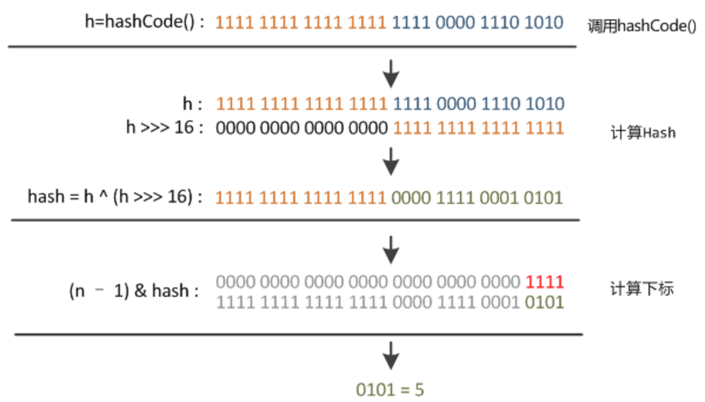
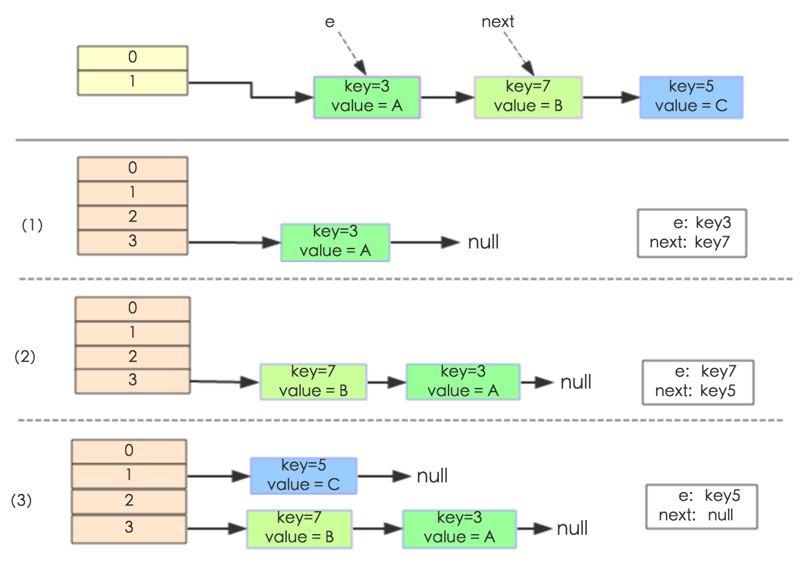
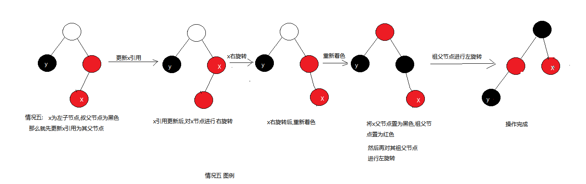
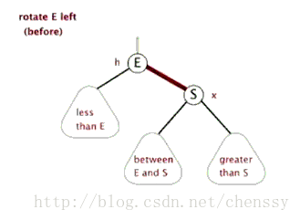

# 1 总览


# 1 HashMap

以下内容引自 http://www.importnew.com/20386.html，原文写的非常好，此处搬运了一下。


搞清楚HashMap，首先需要知道HashMap是什么，即它的存储结构(字段)；其次弄明白它能干什么，即它的功能实现(方法)。下面我们针对这两个方面详细展开讲解。


## 1.1 存储结构

从结构实现来讲，HashMap是数组+链表+红黑树（JDK1.8增加了红黑树部分）实现的，如下图所示。


这里需要讲明白两个问题：数据底层具体存储的是什么？这样的存储方式有什么优点呢？

HashMap类中有一个非常重要的字段，就是 Node[] table，即哈希桶数组，它是一个Node的数组。我们来看Node[JDK1.8]是何物。

```
static class Node<K,V> implements Map.Entry<K,V> {
        final int hash;    //用来定位数组索引位置
        final K key;
        V value;
        Node<K,V> next;   //链表的下一个node
 
        Node(int hash, K key, V value, Node<K,V> next) { ... }
        public final K getKey(){ ... }
        public final V getValue() { ... }
        public final String toString() { ... }
        public final int hashCode() { ... }
        public final V setValue(V newValue) { ... }
        public final boolean equals(Object o) { ... }
}
```

Node是HashMap的一个内部类，实现了Map.Entry接口，本质是就是一个映射(键值对)。上图中的每个黑色圆点就是一个Node对象。


HashMap就是使用哈希表来存储的。哈希表为解决冲突，可以采用开放地址法和链地址法等来解决问题，Java中HashMap采用了链地址法。

链地址法，简单来说，就是数组加链表的结合。在每个数组元素上都一个链表结构，当数据被Hash后，得到数组下标，把数据放在对应下标元素的链表上。例如程序执行下面代码：

```
map.put("美团","小美");
```

系统将调用”美团”这个key的hashCode()方法得到其hashCode 值（该方法适用于每个Java对象），然后再通过Hash算法的后两步运算（高位运算和取模运算，下文有介绍）来定位该键值对的存储位置，有时两个key会定位到相同的位置，表示发生了Hash碰撞。当然Hash算法计算结果越分散均匀，Hash碰撞的概率就越小，map的存取效率就会越高。

如果哈希桶数组很大，即使较差的Hash算法也会比较分散，如果哈希桶数组数组很小，即使好的Hash算法也会出现较多碰撞，所以就需要在空间成本和时间成本之间权衡，其实就是在根据实际情况确定哈希桶数组的大小，并在此基础上设计好的hash算法减少Hash碰撞。那么通过什么方式来控制map使得Hash碰撞的概率又小，哈希桶数组（Node[] table）占用空间又少呢？答案就是好的Hash算法和扩容机制。

在理解Hash和扩容流程之前，我们得先了解下HashMap的几个字段。从HashMap的默认构造函数源码可知，构造函数就是对下面几个字段进行初始化，源码如下：

```
int threshold;             // 所能容纳的key-value对极限 
final float loadFactor;    // 负载因子
int modCount;  
int size;
```

首先，Node[] table的初始化长度length(默认值是16)，Load factor为负载因子(默认值是0.75)，threshold是HashMap所能容纳的最大数据量的Node(键值对)个数。threshold = length * Load factor。也就是说，在数组定义好长度之后，负载因子越大，所能容纳的键值对个数越多。

结合负载因子的定义公式可知，threshold就是在此Load factor和length(数组长度)对应下允许的最大元素数目，超过这个数目就重新resize(扩容)，**扩容后的HashMap容量是之前容量的两倍**。默认的负载因子0.75是对空间和时间效率的一个平衡选择，建议大家不要修改，除非在时间和空间比较特殊的情况下，如果内存空间很多而又对时间效率要求很高，可以降低负载因子Load factor的值；相反，如果内存空间紧张而对时间效率要求不高，可以增加负载因子loadFactor的值，这个值可以大于1。

size这个字段其实很好理解，就是HashMap中实际存在的键值对数量。注意和table的长度length、容纳最大键值对数量threshold的区别。而modCount字段主要用来记录HashMap内部结构发生变化的次数，主要用于迭代的快速失败。强调一点，内部结构发生变化指的是结构发生变化，例如put新键值对，但是某个key对应的value值被覆盖不属于结构变化。

在HashMap中，哈希桶数组table的长度length大小必须为2的n次方(一定是合数)，这是一种非常规的设计，常规的设计是把桶的大小设计为素数。相对来说素数导致冲突的概率要小于合数，具体证明可以参考 http://blog.csdn.net/liuqiyao_01/article/details/14475159，Hashtable初始化桶大小为11，就是桶大小设计为素数的应用（Hashtable扩容后不能保证还是素数）。HashMap采用这种非常规设计，主要是为了在取模和扩容时做优化，同时为了减少冲突，HashMap定位哈希桶索引位置时，也加入了高位参与运算的过程。

这里存在一个问题，即使负载因子和Hash算法设计的再合理，也免不了会出现拉链过长的情况，一旦出现拉链过长，则会严重影响HashMap的性能。于是，在JDK1.8版本中，对数据结构做了进一步的优化，引入了红黑树。而当链表长度太长（默认超过8）时，链表就转换为红黑树，利用红黑树快速增删改查的特点提高HashMap的性能，其中会用到红黑树的插入、删除、查找等算法。本文不再对红黑树展开讨论，想了解更多红黑树数据结构的工作原理可以参考 http://blog.csdn.net/v_july_v/article/details/6105630。


## 1.2 功能实现

HashMap的内部功能实现很多，本文主要从根据key获取哈希桶数组索引位置、put方法的详细执行、扩容过程三个具有代表性的点深入展开讲解。

### 1.2.1 确定哈希桶数组索引位置

不管增加、删除、查找键值对，定位到哈希桶数组的位置都是很关键的第一步。前面说过HashMap的数据结构是数组和链表的结合，所以我们当然希望这个HashMap里面的元素位置尽量分布均匀些，尽量使得每个位置上的元素数量只有一个，那么当我们用hash算法求得这个位置的时候，马上就可以知道对应位置的元素就是我们要的，不用遍历链表，大大优化了查询的效率。HashMap定位数组索引位置，直接决定了hash方法的离散性能。先看看源码的实现(方法一+方法二):

```
方法一：
static final int hash(Object key) {   //jdk1.8 & jdk1.7
     int h;
     // h = key.hashCode() 为第一步 取hashCode值
     // h ^ (h >>> 16)  为第二步 高位参与运算
     return (key == null) ? 0 : (h = key.hashCode()) ^ (h >>> 16);
}
方法二：
static int indexFor(int h, int length) {  //jdk1.7的源码，jdk1.8没有这个方法，但是实现原理一样的
     return h & (length-1);  //第三步 取模运算
}
```

这里的Hash算法本质上就是三步：取key的hashCode值、高位运算、取模运算。

对于任意给定的对象，只要它的hashCode()返回值相同，那么程序调用方法一所计算得到的Hash码值总是相同的。我们首先想到的就是把hash值对数组长度取模运算，这样一来，元素的分布相对来说是比较均匀的。但是，模运算的消耗还是比较大的，在HashMap中是这样做的：调用方法二来计算该对象应该保存在table数组的哪个索引处。

这个方法非常巧妙，它通过h & (table.length -1)来得到该对象的保存位，而HashMap底层数组的长度总是2的n次方，这是HashMap在速度上的优化。当length总是2的n次方时，h& (length-1)运算等价于对length取模，也就是h%length，但是&比%具有更高的效率。

在JDK1.8的实现中，优化了高位运算的算法，通过hashCode()的高16位异或低16位实现的：(h = k.hashCode()) ^ (h >>> 16)，主要是从速度、功效、质量来考虑的，这么做可以在数组table的length比较小的时候，也能保证考虑到高低Bit都参与到Hash的计算中，同时不会有太大的开销。

下面举例说明下，n为table的长度。




### 1.2.2 分析HashMap的put方法

HashMap的put方法执行过程可以通过下图来理解，自己有兴趣可以去对比源码更清楚地研究学习。


①.判断键值对数组table[i]是否为空或为null，否则执行resize()进行扩容；

②.根据键值key计算hash值得到插入的数组索引i，如果table[i]==null，直接新建节点添加，转向⑥，如果table[i]不为空，转向③；

③.判断table[i]的首个元素是否和key一样，如果相同直接覆盖value，否则转向④，这里的相同指的是hashCode以及equals；

④.判断table[i] 是否为treeNode，即table[i] 是否是红黑树，如果是红黑树，则直接在树中插入键值对，否则转向⑤；

⑤.遍历table[i]，判断链表长度是否大于8，大于8的话把链表转换为红黑树，在红黑树中执行插入操作，否则进行链表的插入操作；遍历过程中若发现key已经存在直接覆盖value即可；

⑥.插入成功后，判断实际存在的键值对数量size是否超多了最大容量threshold，如果超过，进行扩容。

JDK1.8HashMap的put方法源码如下:

```
 public V put(K key, V value) {
     // 对key的hashCode()做hash
     return putVal(hash(key), key, value, false, true);
 }

 final V putVal(int hash, K key, V value, boolean onlyIfAbsent,
                boolean evict) {
     Node<K,V>[] tab; Node<K,V> p; int n, i;
     // 步骤①：tab为空则创建
     if ((tab = table) == null || (n = tab.length) == 0)
         n = (tab = resize()).length;
     // 步骤②：计算index，并对null做处理 
     if ((p = tab[i = (n - 1) & hash]) == null) 
         tab[i] = newNode(hash, key, value, null);
     else {
         Node<K,V> e; K k;
         // 步骤③：节点key存在，直接覆盖value
         if (p.hash == hash &&
             ((k = p.key) == key || (key != null && key.equals(k))))
             e = p;
         // 步骤④：判断该链为红黑树
         else if (p instanceof TreeNode)
             e = ((TreeNode<K,V>)p).putTreeVal(this, tab, hash, key, value);
         // 步骤⑤：该链为链表
         else {
             for (int binCount = 0; ; ++binCount) {
                 if ((e = p.next) == null) {
                     p.next = newNode(hash, key,value,null);
                      //链表长度大于8转换为红黑树进行处理
                     if (binCount >= TREEIFY_THRESHOLD - 1) // -1 for 1st  
                         treeifyBin(tab, hash);
                     break;
                 }
                  // key已经存在直接覆盖value
                 if (e.hash == hash &&
                     ((k = e.key) == key || (key != null && key.equals(k))))                                            break;
                 p = e;
             }
         }
        
         if (e != null) { // existing mapping for key
             V oldValue = e.value;
             if (!onlyIfAbsent || oldValue == null)
                 e.value = value;
             afterNodeAccess(e);
             return oldValue;
         }
     }
     ++modCount;
     // 步骤⑥：超过最大容量 就扩容
     if (++size > threshold)
         resize();
     afterNodeInsertion(evict);
     return null;
 }
```


### 1.2.3 扩容机制

扩容(resize)就是重新计算容量，向HashMap对象里不停的添加元素，而HashMap对象内部的数组无法装载更多的元素时，对象就需要扩大数组的长度，以便能装入更多的元素。当然Java里的数组是无法自动扩容的，方法是使用一个新的数组代替已有的容量小的数组，就像我们用一个小桶装水，如果想装更多的水，就得换大水桶。

我们分析下resize的源码，鉴于JDK1.8融入了红黑树，较复杂，为了便于理解我们仍然使用JDK1.7的代码，好理解一些，本质上区别不大，具体区别后文再说。

```
void resize(int newCapacity) {   //传入新的容量
     Entry[] oldTable = table;    //引用扩容前的Entry数组
     int oldCapacity = oldTable.length;         
     if (oldCapacity == MAXIMUM_CAPACITY) {  //扩容前的数组大小如果已经达到最大(2^30)了
         threshold = Integer.MAX_VALUE; //修改阈值为int的最大值(2^31-1)，这样以后就不会扩容了
         return;
     }
 
     Entry[] newTable = new Entry[newCapacity];  //初始化一个新的Entry数组
     transfer(newTable);                         //！！将数据转移到新的Entry数组里
     table = newTable;                           //HashMap的table属性引用新的Entry数组
     threshold = (int)(newCapacity * loadFactor);//修改阈值
 }
```

这里就是使用一个容量更大的数组来代替已有的容量小的数组，transfer()方法将原有Entry数组的元素拷贝到新的Entry数组里。

```
void transfer(Entry[] newTable) {
     Entry[] src = table;                   //src引用了旧的Entry数组
     int newCapacity = newTable.length;
     for (int j = 0; j < src.length; j++) { //遍历旧的Entry数组
         Entry<K,V> e = src[j];             //取得旧Entry数组的每个元素
         if (e != null) {
             src[j] = null;//释放旧Entry数组的对象引用（for循环后，旧的Entry数组不再引用任何对象）
             do {
                 Entry<K,V> next = e.next;
                 int i = indexFor(e.hash, newCapacity); //！！重新计算每个元素在数组中的位置
                 e.next = newTable[i]; //标记[1]
                 newTable[i] = e;      //将元素放在数组上
                 e = next;             //访问下一个Entry链上的元素
             } while (e != null);
         }
     }
 }
```

newTable[i]的引用赋给了e.next，也就是使用了单链表的头插入方式，同一位置上新元素总会被放在链表的头部位置；这样先放在一个索引上的元素终会被放到Entry链的尾部(如果发生了hash冲突的话），这一点和Jdk1.8有区别，下文详解。在旧数组中同一条Entry链上的元素，通过重新计算索引位置后，有可能被放到了新数组的不同位置上。

下面举个例子说明下扩容过程。假设了我们的hash算法就是简单的用key mod 一下表的大小（也就是数组的长度）。其中的哈希桶数组table的size=2， 所以key = 3、7、5，put顺序依次为 5、7、3。在mod 2以后都冲突在table[1]这里了。这里假设负载因子 loadFactor=1，即当键值对的实际大小size 大于 table的实际大小时进行扩容。接下来的三个步骤是哈希桶数组 resize成4，然后所有的Node重新rehash的过程。




下面我们讲解下JDK1.8做了哪些优化。经过观测可以发现，我们使用的是2次幂的扩展(指长度扩为原来2倍)，所以，元素的位置要么是在原位置，要么是在原位置再移动2次幂的位置。看下图可以明白这句话的意思，n为table的长度，图（a）表示扩容前的key1和key2两种key确定索引位置的示例，图（b）表示扩容后key1和key2两种key确定索引位置的示例，其中hash1是key1对应的哈希与高位运算结果。


元素在重新计算hash之后，因为n变为2倍，那么n-1的mask范围在高位多1bit(红色)，因此新的index就会发生这样的变化：


因此，我们在扩充HashMap的时候，不需要像JDK1.7的实现那样重新计算hash，只需要看看原来的hash值新增的那个bit是1还是0就好了，是0的话索引没变，是1的话索引变成“原索引+oldCap”，可以看看下图为16扩充为32的resize示意图：


这个设计确实非常的巧妙，既省去了重新计算hash值的时间，而且同时，由于新增的1bit是0还是1可以认为是随机的，因此resize的过程，均匀的把之前的冲突的节点分散到新的bucket了。这一块就是JDK1.8新增的优化点。有一点注意区别，JDK1.7中rehash的时候，旧链表迁移新链表的时候，如果在新表的数组索引位置相同，则链表元素会倒置，但是从上图可以看出，JDK1.8不会倒置。有兴趣的同学可以研究下JDK1.8的resize源码，写的很赞，如下:

```
final Node<K,V>[] resize() {
     Node<K,V>[] oldTab = table;
     int oldCap = (oldTab == null) ? 0 : oldTab.length;
     int oldThr = threshold;
     int newCap, newThr = 0;
     if (oldCap > 0) {
         // 超过最大值就不再扩充了，就只好随你碰撞去吧
         if (oldCap >= MAXIMUM_CAPACITY) {
             threshold = Integer.MAX_VALUE;
             return oldTab;
         }
         // 没超过最大值，就扩充为原来的2倍
         else if ((newCap = oldCap << 1) < MAXIMUM_CAPACITY &&
                  oldCap >= DEFAULT_INITIAL_CAPACITY)
             newThr = oldThr << 1; // double threshold
     }
     else if (oldThr > 0) // initial capacity was placed in threshold
         newCap = oldThr;
     else {               // zero initial threshold signifies using defaults
         newCap = DEFAULT_INITIAL_CAPACITY;
         newThr = (int)(DEFAULT_LOAD_FACTOR * DEFAULT_INITIAL_CAPACITY);
     }
     // 计算新的resize上限
     if (newThr == 0) {

         float ft = (float)newCap * loadFactor;
         newThr = (newCap < MAXIMUM_CAPACITY && ft < (float)MAXIMUM_CAPACITY ?
                   (int)ft : Integer.MAX_VALUE);
     }
     threshold = newThr;
     @SuppressWarnings({"rawtypes"，"unchecked"})
         Node<K,V>[] newTab = (Node<K,V>[])new Node[newCap];
     table = newTab;
     if (oldTab != null) {
         // 把每个bucket都移动到新的buckets中
         for (int j = 0; j < oldCap; ++j) {
             Node<K,V> e;
             if ((e = oldTab[j]) != null) {
                 oldTab[j] = null;
                 if (e.next == null)
                     newTab[e.hash & (newCap - 1)] = e;
                 else if (e instanceof TreeNode)
                     ((TreeNode<K,V>)e).split(this, newTab, j, oldCap);
                 else { // 链表优化重hash的代码块
                     Node<K,V> loHead = null, loTail = null;
                     Node<K,V> hiHead = null, hiTail = null;
                     Node<K,V> next;
                     do {
                         next = e.next;
                         // 原索引
                         if ((e.hash & oldCap) == 0) {
                             if (loTail == null)
                                 loHead = e;
                             else
                                 loTail.next = e;
                             loTail = e;
                         }
                         // 原索引+oldCap
                         else {
                             if (hiTail == null)
                                 hiHead = e;
                             else
                                 hiTail.next = e;
                             hiTail = e;
                         }
                     } while ((e = next) != null);
                     // 原索引放到bucket里
                     if (loTail != null) {
                         loTail.next = null;
                         newTab[j] = loHead;
                     }
                     // 原索引+oldCap放到bucket里
                     if (hiTail != null) {
                         hiTail.next = null;
                         newTab[j + oldCap] = hiHead;
                     }
                 }
             }
         }
     }
     return newTab;
 }
```


## 1.3 JDK1.8与JDK1.7的性能对比

HashMap中，如果key经过hash算法得出的数组索引位置全部不相同，即Hash算法非常好，那样的话，getKey方法的时间复杂度就是O(1)，如果Hash算法技术的结果碰撞非常多，假如Hash算极其差，所有的Hash算法结果得出的索引位置一样，那样所有的键值对都集中到一个桶中，或者在一个链表中，或者在一个红黑树中，时间复杂度分别为O(n)和O(lgn)。 鉴于JDK1.8做了多方面的优化，总体性能优于JDK1.7，下面我们从两个方面用例子证明这一点。

### 1.3.1 Hash较均匀的情况

为了便于测试，我们先写一个类Key，如下：

```
class Key implements Comparable<Key> {
 
    private final int value;
 
    Key(int value) {
        this.value = value;
    }
 
    @Override
    public int compareTo(Key o) {
        return Integer.compare(this.value, o.value);
    }
 
    @Override
    public boolean equals(Object o) {
        if (this == o) return true;
        if (o == null || getClass() != o.getClass())
            return false;
        Key key = (Key) o;
        return value == key.value;
    }
 
    @Override
    public int hashCode() {
        return value;
    }
}
```

这个类复写了equals方法，并且提供了相当好的hashCode函数，任何一个值的hashCode都不会相同，因为直接使用value当做hashcode。为了避免频繁的GC，我将不变的Key实例缓存了起来，而不是一遍一遍的创建它们。代码如下：

```
public class Keys {
 
    public static final int MAX_KEY = 10_000_000;
    private static final Key[] KEYS_CACHE = new Key[MAX_KEY];
 
    static {
        for (int i = 0; i < MAX_KEY; ++i) {
            KEYS_CACHE[i] = new Key(i);
        }
    }
 
    public static Key of(int value) {
        return KEYS_CACHE[value];
    }
}
```

现在开始我们的试验，测试需要做的仅仅是，创建不同size的HashMap（1、10、100、……10000000），屏蔽了扩容的情况，代码如下：

```
static void test(int mapSize) {
 
       HashMap<Key, Integer> map = new HashMap<Key,Integer>(mapSize);
       for (int i = 0; i < mapSize; ++i) {
           map.put(Keys.of(i), i);
       }
 
       long beginTime = System.nanoTime(); //获取纳秒
       for (int i = 0; i < mapSize; i++) {
           map.get(Keys.of(i));
       }
       long endTime = System.nanoTime();
       System.out.println(endTime - beginTime);
   }
 
   public static void main(String[] args) {
       for(int i=10;i<= 1000 0000;i*= 10){
           test(i);
       }
   }
```

在测试中会查找不同的值，然后度量花费的时间，为了计算getKey的平均时间，我们遍历所有的get方法，计算总的时间，除以key的数量，计算一个平均值，主要用来比较，绝对值可能会受很多环境因素的影响。结果如下：


通过观测测试结果可知，JDK1.8的性能要高于JDK1.7 15%以上，在某些size的区域上，甚至高于100%。由于Hash算法较均匀，JDK1.8引入的红黑树效果不明显，下面我们看看Hash不均匀的的情况。


### 1.3.2 Hash极不均匀的情况

假设我们又一个非常差的Key，它们所有的实例都返回相同的hashCode值。这是使用HashMap最坏的情况。代码修改如下： 

```
class Key implements Comparable<Key> {
 
    //...
 
    @Override
    public int hashCode() {
        return 1;
    }
}
```

仍然执行main方法，得出的结果如下表所示：


从表中结果中可知，随着size的变大，JDK1.7的花费时间是增长的趋势，而JDK1.8是明显的降低趋势，并且呈现对数增长稳定。当一个链表太长的时候，HashMap会动态的将它替换成一个红黑树，这话的话会将时间复杂度从O(n)降为O(logn)。hash算法均匀和不均匀所花费的时间明显也不相同，这两种情况的相对比较，可以说明一个好的hash算法的重要性。


## 1.4 小结

(1) 扩容是一个特别耗性能的操作，所以当程序员在使用HashMap的时候，估算map的大小，初始化的时候给一个大致的数值，避免map进行频繁的扩容。

(2) 负载因子是可以修改的，也可以大于1，但是建议不要轻易修改，除非情况非常特殊。

(3) HashMap是线程不安全的，不要在并发的环境中同时操作HashMap，建议使用ConcurrentHashMap。

(4) JDK1.8引入红黑树大程度优化了HashMap的性能。


# 2 ConcurrentHashMap

文章内容引自 http://blog.csdn.net/zly9923218/article/details/51420561

## 2.1 数据结构

1.8 版本的 ConcurrentHashMap 不再采用 Segment 实现，而是改用 Node，Node 是一个链表的结构，每个节点可以引用到下一个节点(next)。
Node是最核心的内部类，包装了key-value键值对，所有插入ConcurrentHashMap的数据都包装在这里面。

它与HashMap中的定义很相似，但是有一些差别它对value和next属性设置了volatile同步锁，它不允许调用setValue方法直接改变Node的value域，它增加了find方法辅助map.get()方法。

### 2.2.1 Node

```
/**
 * The array of bins. Lazily initialized upon first insertion.
 * Size is always a power of two. Accessed directly by iterators.
 */
transient volatile Node<K,V>[] table;
static class Node<K,V> implements Map.Entry<K,V> {
       final int hash;
       final K key;
       volatile V val;//带有同步锁的value  
       volatile Node<K,V> next;//带有同步锁的next指针  

       Node(int hash, K key, V val, Node<K,V> next) {
           this.hash = hash;
           this.key = key;
           this.val = val;
           this.next = next;
       }

       public final K getKey()       { return key; }
       public final V getValue()     { return val; }
       public final int hashCode()   { return key.hashCode() ^ val.hashCode(); }
       public final String toString(){ return key + "=" + val; }
       //不允许直接改变value的值  
       public final V setValue(V value) {
           throw new UnsupportedOperationException();
       }

       public final boolean equals(Object o) {
           Object k, v, u; Map.Entry<?,?> e;
           return ((o instanceof Map.Entry) &&
                   (k = (e = (Map.Entry<?,?>)o).getKey()) != null &&
                   (v = e.getValue()) != null &&
                   (k == key || k.equals(key)) &&
                   (v == (u = val) || v.equals(u)));
       }

       /**
        * Virtualized support for map.get(); overridden in subclasses.
        */
       Node<K,V> find(int h, Object k) {
           Node<K,V> e = this;
           if (k != null) {
               do {
                   K ek;
                   if (e.hash == h &&
                       ((ek = e.key) == k || (ek != null && k.equals(ek))))
                       return e;
               } while ((e = e.next) != null);
           }
           return null;
       }
   }
```


### 2.2.2 TreeNode

树节点类，另外一个核心的数据结构。
当链表长度过长的时候，会转换为TreeNode。
但是与HashMap不相同的是，它并不是直接转换为红黑树，而是把这些结点包装成TreeNode放在TreeBin对象中，由TreeBin完成对红黑树的包装。
而且TreeNode在ConcurrentHashMap继承自Node类，而并非HashMap中的集成自LinkedHashMap.Entry


### 2.2.3 TreeBin

这个类并不负责包装用户的key、value信息，而是包装的很多TreeNode节点。它代替了TreeNode的根节点，也就是说在实际的ConcurrentHashMap“数组”中，存放的是TreeBin对象，而不是TreeNode对象，这是与HashMap的区别。另外这个类还带有了读写锁。


### 2.2.4 ForwardingNode

一个用于连接两个table的节点类。它包含一个nextTable指针，用于指向下一张表。而且这个节点的key value next指针全部为null，它的hash值为-1。这里面定义的find的方法是从nextTable里进行查询节点，而不是以自身为头节点进行查找。

```
static final class ForwardingNode<K,V> extends Node<K,V> {
        final Node<K,V>[] nextTable;
        ForwardingNode(Node<K,V>[] tab) {
            super(MOVED, null, null, null);
            this.nextTable = tab;
        }

        Node<K,V> find(int h, Object k) {
            // loop to avoid arbitrarily deep recursion on forwarding nodes
            outer: for (Node<K,V>[] tab = nextTable;;) {
                Node<K,V> e; int n;
                if (k == null || tab == null || (n = tab.length) == 0 ||
                    (e = tabAt(tab, (n - 1) & h)) == null)
                    return null;
                for (;;) {
                    int eh; K ek;
                    if ((eh = e.hash) == h &&
                        ((ek = e.key) == k || (ek != null && k.equals(ek))))
                        return e;
                    if (eh < 0) {
                        if (e instanceof ForwardingNode) {
                        //这里表示没有扩容复制完，则继续等下次循环
                            tab = ((ForwardingNode<K,V>)e).nextTable;
                            continue outer;
                        }
                        else
                            return e.find(h, k);
                    }
                    if ((e = e.next) == null)
                        return null;
                }
            }
        }
    }
```


## 2.2 构造函数

```
public ConcurrentHashMap() {
    }


    public ConcurrentHashMap(int initialCapacity) {
        if (initialCapacity < 0)
            throw new IllegalArgumentException();
        int cap = ((initialCapacity >= (MAXIMUM_CAPACITY >>> 1)) ?
                   MAXIMUM_CAPACITY :
                   tableSizeFor(initialCapacity + (initialCapacity >>> 1) + 1));
        this.sizeCtl = cap;
    }

    public ConcurrentHashMap(Map<? extends K, ? extends V> m) {
        this.sizeCtl = DEFAULT_CAPACITY;
        putAll(m);
    }

    public ConcurrentHashMap(int initialCapacity, float loadFactor) {
        this(initialCapacity, loadFactor, 1);
    }

    public ConcurrentHashMap(int initialCapacity,
                             float loadFactor, int concurrencyLevel) {
        if (!(loadFactor > 0.0f) || initialCapacity < 0 || concurrencyLevel <= 0)
            throw new IllegalArgumentException();
        if (initialCapacity < concurrencyLevel)   // Use at least as many bins
            initialCapacity = concurrencyLevel;   // as estimated threads
        long size = (long)(1.0 + (long)initialCapacity / loadFactor);
        int cap = (size >= (long)MAXIMUM_CAPACITY) ?
            MAXIMUM_CAPACITY : tableSizeFor((int)size);
        this.sizeCtl = cap;
    }
```

注意，1.8版本的 ConcurrentHashMap 在构造函数中不会初始化 Node 数组，而是第一次 put 操作的时候初始化。

整个 Map 第一次 put 的时候，map 中用于存放数据的 Node[] 还是null。


## 2.3 关键属性

```
public class ConcurrentHashMap<K,V> extends AbstractMap<K,V>
    implements ConcurrentMap<K,V>, Serializable {
    /**
    * 最大的Map容量
    */
    private static final int MAXIMUM_CAPACITY = 1 << 30;

    /**
     * The default initial table capacity.  Must be a power of 2
     * (i.e., at least 1) and at most MAXIMUM_CAPACITY.
     * 默认的table数组长度
     */
    private static final int DEFAULT_CAPACITY = 16;

    /**
     * The largest possible (non-power of two) array size.
     * Needed by toArray and related methods.
     * 最大的table数组长度
     */
    static final int MAX_ARRAY_SIZE = Integer.MAX_VALUE - 8;
    /** 
     * 实际上保存的是hashmap中的元素个数  利用CAS锁进行更新 
     但它并不用返回当前hashmap的元素个数  
     */  
    private transient volatile long baseCount;  

    /*
     * hash表初始化或扩容时的一个控制位标识量。 
     * 负数代表正在进行初始化或扩容操作 
     * -1代表正在初始化 
     * -N 表示有N-1个线程正在进行扩容操作 
     * 正数或0代表hash表还没有被初始化，这个数值表示初始化或下一次进行扩容的大小 
    */ 

    private transient volatile int sizeCtl;   
    static final int MOVED     = -1; // hash for forwarding nodes
    static final int TREEBIN   = -2; // hash for roots of trees
    //注意，只有树的根节点的hash才等于 -2，TreeNode的hash和Node是一样的
}
```


## 2.4 初始化函数initTable

对于ConcurrentHashMap来说，调用它的构造方法仅仅是设置了一些参数而已。而整个table的初始化是在向ConcurrentHashMap中插入元素的时候发生的。如调用put、computeIfAbsent、compute、merge等方法的时候，调用时机是检查table==null。

初始化方法主要应用了关键属性sizeCtl 如果这个值 < 0，表示其他线程正在进行初始化，就放弃这个操作。

在这也可以看出ConcurrentHashMap的初始化只能由一个线程完成。如果获得了初始化权限，就用CAS方法将sizeCtl置为-1，防止其他线程进入。初始化数组后，将sizeCtl的值改为0.75*n


**sizeCtl含义：**

1. 负数代表正在进行初始化或扩容操作。

2. -1代表正在初始化。

3. -N 表示有N-1个线程正在进行扩容操作。

4. 正数或0代表hash表还没有被初始化。

   这个数值表示初始化或下一次进行扩容的大小，这一点类似于扩容阈值的概念。还后面可以看到，它的值始终是当前ConcurrentHashMap容量的0.75倍，这与loadfactor是对应的。

```
/**
 * Initializes table, using the size recorded in sizeCtl.
 */
private final Node<K,V>[] initTable() {
    Node<K,V>[] tab; int sc;
    while ((tab = table) == null || tab.length == 0) {
            //sizeCtl表示有其他线程正在进行初始化操作，把线程挂起。对于table的初始化工作，只能有一个线程在进行。
        if ((sc = sizeCtl) < 0)
            Thread.yield(); // lost initialization race; just spin
        else if (U.compareAndSwapInt(this, SIZECTL, sc, -1)) {//利用CAS方法把sizectl的值置为-1 表示本线程正在进行初始化
            try {
                if ((tab = table) == null || tab.length == 0) {
                    int n = (sc > 0) ? sc : DEFAULT_CAPACITY;
                    @SuppressWarnings("unchecked")
                    Node<K,V>[] nt = (Node<K,V>[])new Node<?,?>[n];
                    table = tab = nt;
                    sc = n - (n >>> 2);//相当于0.75*n 设置一个扩容的阈值
                }
            } finally {
                sizeCtl = sc;
            }
            break;
        }
    }
    return tab;
}
```


## 2.5 put插入函数

### 2.5.1 put和1.7版本的改变

对应的 put 操作也不再使用 ReentrantLock 使用，而是采用 CAS + 同步的方式实现

1）整个 Map 第一次 put 的时候，map 中用于存放数据的 Node[] 还是null，注意，1.8版本的 ConcurrentHashMap 在构造函数中不会初始化 Node 数组，而是第一次 put 操作的时候初始化；

2）根据对应的key hash 到具体的索引，如果该索引对应的 Node 为 null，则采用 CAS 操作更新整个 table

3）如果该key hash 对应的 Node 不为 null，则在该 Node 对象上采用同步方式更新 Node 链表最尾部元素的值，可以看到1.8版本中的 ConcurrentHashMap 在 put 操作的时候同步操作也只是在对应的一个 node 节点（链表头结点）上同步，而不需要在整个 table 上同步


### 2.5.2 put操作步骤

根据hash值计算这个新插入的点在table中的位置i。

如果i位置是空的，直接放进去，否则进行判断，如果i位置是树节点，按照树的方式插入新的节点，否则把i插入到链表的末尾。

ConcurrentHashMap不允许key或value为null值。

涉及到多线程，put方法就要复杂一点。在多线程中可能有以下两个情况：

如果一个或多个线程正在对ConcurrentHashMap进行扩容操作，当前线程也要进入扩容的操作中。这个扩容的操作之所以能被检测到，是因为transfer方法中在空结点上插入forward节点，如果检测到需要插入的位置被forward节点占有，就帮助进行扩容helpTransfer；

如果检测到要插入的节点是非空且不是forward节点（说明扩容还没有扩到这个节点，那么可以对该节点进行插入），就对这个节点加锁，这样就保证了线程安全。尽管这个有一些影响效率，但是还是会比hashTable的synchronized要好得多。

整体流程就是首先定义不允许key或value为null的情况放入
对于每一个放入的值，首先利用spread方法对key的hashcode进行一次hash计算，由此来确定这个值在table中的位置。

如果这个位置存在结点，说明发生了hash碰撞，首先判断这个节点的类型。

如果是链表节点（fh >0），则得到的结点就是hash值相同的节点组成的链表的头节点。需要依次向后遍历确定这个新加入的值所在位置。如果遇到hash值与key值都与新加入节点是一致的情况，则只需要更新value值即可。否则依次向后遍历，直到链表尾插入这个结点。

如果加入这个节点以后链表长度大于8，就把这个链表转换成红黑树。

如果这个节点的类型已经是树节点的话，直接调用树节点的插入方法进行插入新的值。


```
final V putVal(K key, V value, boolean onlyIfAbsent) {
       //不允许 key或value为null  
       if (key == null || value == null) throw new NullPointerException();
       //计算hash值  
       int hash = spread(key.hashCode());
       int binCount = 0;
       for (Node<K,V>[] tab = table;;) {
           Node<K,V> f; int n, i, fh;
           // 第一次 put 操作的时候初始化，如果table为空的话，初始化table  
           if (tab == null || (n = tab.length) == 0)
               tab = initTable();

           //根据hash值计算出在table里面的位置   
           else if ((f = tabAt(tab, i = (n - 1) & hash)) == null) {
               // 根据对应的key hash 到具体的索引，如果该索引对应的 Node 为 null，则采用 CAS 操作更新整个 table
               // 如果这个位置没有值 ，直接放进去，不需要加锁  
               if (casTabAt(tab, i, null,
                            new Node<K,V>(hash, key, value, null)))
                   break;                   // no lock when adding to empty bin
           }
           //当遇到表连接点时，需要进行整合表的操作  
           else if ((fh = f.hash) == MOVED)
               tab = helpTransfer(tab, f);
           else {
               V oldVal = null;
               // 结点上锁，只是对链表头结点作锁操作
               synchronized (f) {
                   if (tabAt(tab, i) == f) {
                       //fh > 0 说明这个节点是一个链表的节点 不是树的节点  
                       if (fh >= 0) {
                           binCount = 1;
                           //在这里遍历链表所有的结点  
                           for (Node<K,V> e = f;; ++binCount) {
                               K ek;
                               //如果hash值和key值相同  则修改对应结点的value值  
                               if (e.hash == hash &&
                                   ((ek = e.key) == key ||
                                    (ek != null && key.equals(ek)))) {
                                   oldVal = e.val;
                                   if (!onlyIfAbsent)
                                       e.val = value;
                                   break;
                               }
                               Node<K,V> pred = e;
                               //如果遍历到了最后一个结点，那么就证明新的节点需要插入 就把它插入在链表尾部  
                               if ((e = e.next) == null) {
                                   // 插入到链表尾
                                   pred.next = new Node<K,V>(hash, key,
                                                             value, null);
                                   break;
                               }
                           }
                       }
                       //如果这个节点是树节点，就按照树的方式插入值  
                       else if (f instanceof TreeBin) {
                           // 如果是红黑树结点，按照红黑树的插入
                           Node<K,V> p;
                           binCount = 2;
                           if ((p = ((TreeBin<K,V>)f).putTreeVal(hash, key,
                                                          value)) != null) {
                               oldVal = p.val;
                               if (!onlyIfAbsent)
                                   p.val = value;
                           }
                       }
                   }
               }
               if (binCount != 0) {
                   // 如果这个链表结点达到了临界值8，那么把这个链表转换成红黑树
                   if (binCount >= TREEIFY_THRESHOLD)
                       treeifyBin(tab, i);
                   if (oldVal != null)
                       return oldVal;
                   break;
               }
           }
       }
       //将当前ConcurrentHashMap的元素数量+1，table的扩容是在这里发生的
       addCount(1L, binCount);
       return null;
   }
```

至于为什么1.8采用 synchronized 关键字而不是采用 ReentrantLock 方式实现同步，也许是因为1.8版本的虚拟机对 synchronized 关键字已经有足够的优化吧


## 2.6 红黑树转换

在putVal函数中，treeifyBin是在链表长度达到一定阈值（8）后转换成红黑树的函数。
但是并不是直接转换，而是进行一次容量判断，如果容量没有达到转换的要求，直接进行扩容操作并返回；如果满足条件才将链表的结构转换为TreeBin ，这与HashMap不同的是，它并没有把TreeNode直接放入红黑树，而是利用了TreeBin这个小容器来封装所有的TreeNode。

```
private final void treeifyBin(Node<K,V>[] tab, int index) {
    Node<K,V> b; int n, sc;
    if (tab != null) {
        if ((n = tab.length) < MIN_TREEIFY_CAPACITY)
            tryPresize(n << 1);
        else if ((b = tabAt(tab, index)) != null && b.hash >= 0) {
            synchronized (b) {
                if (tabAt(tab, index) == b) {
                    TreeNode<K,V> hd = null, tl = null;
                    for (Node<K,V> e = b; e != null; e = e.next) {
                        TreeNode<K,V> p =
                            new TreeNode<K,V>(e.hash, e.key, e.val,
                                              null, null);
                        if ((p.prev = tl) == null)
                            hd = p;
                        else
                            tl.next = p;
                        tl = p;
                    }
                    setTabAt(tab, index, new TreeBin<K,V>(hd));
                }
            }
        }
    }
}
```


## 2.7 检测是否扩容addCount方法

put方法结尾处调用了addCount方法，把当前ConcurrentHashMap的元素个数+1这个方法一共做了两件事,更新baseCount的值，检测是否进行扩容

```
private final void addCount(long x, int check) {
    CounterCell[] as; long b, s;
    //利用CAS方法更新baseCount的值 
    if ((as = counterCells) != null ||
        !U.compareAndSwapLong(this, BASECOUNT, b = baseCount, s = b + x)) {
        CounterCell a; long v; int m;
        boolean uncontended = true;
        if (as == null || (m = as.length - 1) < 0 ||
            (a = as[ThreadLocalRandom.getProbe() & m]) == null ||
            !(uncontended =
              U.compareAndSwapLong(a, CELLVALUE, v = a.value, v + x))) {
            fullAddCount(x, uncontended);
            return;
        }
        if (check <= 1)
            return;
        s = sumCount();
    }
    //如果check值大于等于0 则需要检验是否需要进行扩容操作
    if (check >= 0) {
        Node<K,V>[] tab, nt; int n, sc;
        while (s >= (long)(sc = sizeCtl) && (tab = table) != null &&
               (n = tab.length) < MAXIMUM_CAPACITY) {
            int rs = resizeStamp(n);
            //
            if (sc < 0) {
                if ((sc >>> RESIZE_STAMP_SHIFT) != rs || sc == rs + 1 ||
                    sc == rs + MAX_RESIZERS || (nt = nextTable) == null ||
                    transferIndex <= 0)
                    break;
                 //如果已经有其他线程在执行扩容操作
                if (U.compareAndSwapInt(this, SIZECTL, sc, sc + 1))
                    transfer(tab, nt);
            }
            //当前线程是唯一的或是第一个发起扩容的线程  此时nextTable=null
            else if (U.compareAndSwapInt(this, SIZECTL, sc,
                                         (rs << RESIZE_STAMP_SHIFT) + 2))
                transfer(tab, null);
            s = sumCount();
        }
    }
}
```


## 2.8 协助扩容函数helpTransfer

这个方法被调用的时候，当前ConcurrentHashMap一定已经有了nextTable对象，首先拿到这个nextTable对象，调用transfer方法。回看上面的transfer方法可以看到，当本线程进入扩容方法的时候会直接进入复制阶段。

```
/**
 * Helps transfer if a resize is in progress.
 */
final Node<K,V>[] helpTransfer(Node<K,V>[] tab, Node<K,V> f) {
    Node<K,V>[] nextTab; int sc;
    if (tab != null && (f instanceof ForwardingNode) &&
        (nextTab = ((ForwardingNode<K,V>)f).nextTable) != null) {
        int rs = resizeStamp(tab.length);//计算一个操作校验码
        while (nextTab == nextTable && table == tab &&
               (sc = sizeCtl) < 0) {
            if ((sc >>> RESIZE_STAMP_SHIFT) != rs || sc == rs + 1 ||
                sc == rs + MAX_RESIZERS || transferIndex <= 0)
                break;
            if (U.compareAndSwapInt(this, SIZECTL, sc, sc + 1)) {
                transfer(tab, nextTab);
                break;
            }
        }
        return nextTab;
    }
    return table;
}
```


## 2.9 get方法

给定一个key来确定value的时候，必须满足两个条件 key相同 hash值相同，对于节点可能在链表或树上的情况，需要分别去查找。

```
public V get(Object key) {
    Node<K,V>[] tab; Node<K,V> e, p; int n, eh; K ek;
    //计算hash值
    int h = spread(key.hashCode());
    //根据hash值确定节点位置
    if ((tab = table) != null && (n = tab.length) > 0 &&
        (e = tabAt(tab, (n - 1) & h)) != null) {
        //如果搜索到的节点key与传入的key相同且不为null,直接返回这个节点  
        if ((eh = e.hash) == h) {
            if ((ek = e.key) == key || (ek != null && key.equals(ek)))
                return e.val;
        }
        //如果eh<0 说明这个节点在树上 直接寻找
        else if (eh < 0)
            return (p = e.find(h, key)) != null ? p.val : null;
         //否则遍历链表 找到对应的值并返回
        while ((e = e.next) != null) {
            if (e.hash == h &&
                ((ek = e.key) == key || (ek != null && key.equals(ek))))
                return e.val;
        }
    }
    return null;
}
```


## 2.10 扩容方法 transfer

支持多线程进行扩容操作，并没有加锁
这样做的目的不仅仅是为了满足concurrent的要求，而是希望利用并发处理去减少扩容带来的时间影响

### 2.10.1 扩容整体操作

1. 构建nextTable
   第一部分是构建一个nextTable，它的容量是原来的两倍，这个操作是单线程完成的。这个单线程的保证是通过RESIZE_STAMP_SHIFT这个常量经过一次运算来保证的。

2. 复制
   第二个部分就是将原来table中的元素复制到nextTable中，这里允许多线程进行操作。


### 2.10.2 扩容并发实现

- 单线程
  大体思想就是遍历、复制的过程。首先根据运算得到需要遍历的次数i，然后利用tabAt方法获得i位置的元素：
  1、如果这个位置为空，就在原table中的i位置放入forwardNode节点，这个也是触发并发扩容的关键点；
  2、如果这个位置是Node节点（fh>=0），如果它是一个链表的头节点，就构造一个反序链表，把他们分别放在nextTable的i和i+n的位置上
  3、如果这个位置是TreeBin节点（fh<0），也做一个反序处理，并且判断是否需要untreefi，把处理的结果分别放在nextTable的i和i+n的位置上
  4、遍历过所有的节点以后就完成了复制工作，这时让nextTable作为新的table，并且更新sizeCtl为新容量的0.75倍 ，完成扩容。

- 多线程
  多线程遍历节点，处理了一个节点，就把对应点的值set为forward，另一个线程看到forward，就向后继续遍历，再加上给节点上锁的机制，就完成了多线程的控制。

这样交叉就完成了复制工作。而且还很好的解决了线程安全的问题。


代码实现

```
/**
   * 一个过渡的table表  只有在扩容的时候才会使用
   */
  private transient volatile Node<K,V>[] nextTable;

/**
   * Moves and/or copies the nodes in each bin to new table. See
   * above for explanation.
   */
  private final void transfer(Node<K,V>[] tab, Node<K,V>[] nextTab) {
      int n = tab.length, stride;
      if ((stride = (NCPU > 1) ? (n >>> 3) / NCPU : n) < MIN_TRANSFER_STRIDE)
          stride = MIN_TRANSFER_STRIDE; // subdivide range
      if (nextTab == null) {            // initiating
          try {
              @SuppressWarnings("unchecked")
              Node<K,V>[] nt = (Node<K,V>[])new Node<?,?>[n << 1];//构造一个nextTable对象 它的容量是原来的两倍
              nextTab = nt;
          } catch (Throwable ex) {      // try to cope with OOME
              sizeCtl = Integer.MAX_VALUE;
              return;
          }
          nextTable = nextTab;
          transferIndex = n;
      }
      int nextn = nextTab.length;
      ForwardingNode<K,V> fwd = new ForwardingNode<K,V>(nextTab);//构造一个连节点指针 用于标志位
      boolean advance = true;//并发扩容的关键属性 如果等于true 说明这个节点已经处理过
      boolean finishing = false; // to ensure sweep before committing nextTab
      for (int i = 0, bound = 0;;) {
          Node<K,V> f; int fh;
          //这个while循环体的作用就是在控制i--  通过i--可以依次遍历原hash表中的节点
          while (advance) {
              int nextIndex, nextBound;
              if (--i >= bound || finishing)
                  advance = false;
              else if ((nextIndex = transferIndex) <= 0) {
                  i = -1;
                  advance = false;
              }
              else if (U.compareAndSwapInt
                       (this, TRANSFERINDEX, nextIndex,
                        nextBound = (nextIndex > stride ?
                                     nextIndex - stride : 0))) {
                  bound = nextBound;
                  i = nextIndex - 1;
                  advance = false;
              }
          }
          if (i < 0 || i >= n || i + n >= nextn) {
              int sc;
              if (finishing) {
                //如果所有的节点都已经完成复制工作  就把nextTable赋值给table 清空临时对象nextTable
                  nextTable = null;
                  table = nextTab;
                  sizeCtl = (n << 1) - (n >>> 1);//扩容阈值设置为原来容量的1.5倍  依然相当于现在容量的0.75倍
                  return;
              }
              //利用CAS方法更新这个扩容阈值，在这里面sizectl值减一，说明新加入一个线程参与到扩容操作
              if (U.compareAndSwapInt(this, SIZECTL, sc = sizeCtl, sc - 1)) {
                  if ((sc - 2) != resizeStamp(n) << RESIZE_STAMP_SHIFT)
                      return;
                  finishing = advance = true;
                  i = n; // recheck before commit
              }
          }
          //如果遍历到的节点为空 则放入ForwardingNode指针
          else if ((f = tabAt(tab, i)) == null)
              advance = casTabAt(tab, i, null, fwd);
          //如果遍历到ForwardingNode节点  说明这个点已经被处理过了 直接跳过  这里是控制并发扩容的核心
          else if ((fh = f.hash) == MOVED)
              advance = true; // already processed
          else {
                //节点上锁
              synchronized (f) {
                  if (tabAt(tab, i) == f) {
                      Node<K,V> ln, hn;
                      //如果fh>=0 证明这是一个Node节点
                      if (fh >= 0) {
                          int runBit = fh & n;
                          //以下的部分在完成的工作是构造两个链表  一个是原链表  另一个是原链表的反序排列
                          Node<K,V> lastRun = f;
                          for (Node<K,V> p = f.next; p != null; p = p.next) {
                              int b = p.hash & n;
                              if (b != runBit) {
                                  runBit = b;
                                  lastRun = p;
                              }
                          }
                          if (runBit == 0) {
                              ln = lastRun;
                              hn = null;
                          }
                          else {
                              hn = lastRun;
                              ln = null;
                          }
                          for (Node<K,V> p = f; p != lastRun; p = p.next) {
                              int ph = p.hash; K pk = p.key; V pv = p.val;
                              if ((ph & n) == 0)
                                  ln = new Node<K,V>(ph, pk, pv, ln);
                              else
                                  hn = new Node<K,V>(ph, pk, pv, hn);
                          }
                          //在nextTable的i位置上插入一个链表
                          setTabAt(nextTab, i, ln);
                          //在nextTable的i+n的位置上插入另一个链表
                          setTabAt(nextTab, i + n, hn);
                          //在table的i位置上插入forwardNode节点  表示已经处理过该节点
                          setTabAt(tab, i, fwd);
                          //设置advance为true 返回到上面的while循环中 就可以执行i--操作
                          advance = true;
                      }
                      //对TreeBin对象进行处理  与上面的过程类似
                      else if (f instanceof TreeBin) {
                          TreeBin<K,V> t = (TreeBin<K,V>)f;
                          TreeNode<K,V> lo = null, loTail = null;
                          TreeNode<K,V> hi = null, hiTail = null;
                          int lc = 0, hc = 0;
                          //构造正序和反序两个链表
                          for (Node<K,V> e = t.first; e != null; e = e.next) {
                              int h = e.hash;
                              TreeNode<K,V> p = new TreeNode<K,V>
                                  (h, e.key, e.val, null, null);
                              if ((h & n) == 0) {
                                  if ((p.prev = loTail) == null)
                                      lo = p;
                                  else
                                      loTail.next = p;
                                  loTail = p;
                                  ++lc;
                              }
                              else {
                                  if ((p.prev = hiTail) == null)
                                      hi = p;
                                  else
                                      hiTail.next = p;
                                  hiTail = p;
                                  ++hc;
                              }
                          }
                          //如果扩容后已经不再需要tree的结构 反向转换为链表结构
                          ln = (lc <= UNTREEIFY_THRESHOLD) ? untreeify(lo) :
                              (hc != 0) ? new TreeBin<K,V>(lo) : t;
                          hn = (hc <= UNTREEIFY_THRESHOLD) ? untreeify(hi) :
                              (lc != 0) ? new TreeBin<K,V>(hi) : t;
                           //在nextTable的i位置上插入一个链表    
                          setTabAt(nextTab, i, ln);
                          //在nextTable的i+n的位置上插入另一个链表
                          setTabAt(nextTab, i + n, hn);
                           //在table的i位置上插入forwardNode节点  表示已经处理过该节点
                          setTabAt(tab, i, fwd);
                          //设置advance为true 返回到上面的while循环中 就可以执行i--操作
                          advance = true;
                      }
                  }
              }
          }
      }
  }
```


# 3 WeakHashMap

文章内容引自: http://www.importnew.com/27358.html 和 http://ifeve.com/weakhashmap/


WeakHashMap的定义如下：

```
public class WeakHashMap<K,V> extends AbstractMap<K,V> implements Map<K,V>
```

简单来说，WeakHashMap实现了Map接口，基于hash-table实现，在这种Map中，key的类型是WeakReference。如果对应的key被回收，则这个key指向的对象会被从Map容器中移除。

WeakHashMap跟普通的HashMap不同，**WeakHashMap的行为一定程度上基于垃圾收集器的行为**，因此一些Map数据结构对应的常识在WeakHashMap上会失效：size()方法的返回值会随着程序的运行变小，isEmpty()方法的返回值会从false变成true等等。

WeakHashMap与HashMap的异同点：

- 同：支持null值和null键、不允许重复键值、非同步。

- 异：java8的HashMap在链表元素大于8时，自动将链表转化为红黑树。而WeakHashMap则一直使用链表， **WeakHashMap的键值能在gc中自动回收**。


## 3.1 引用

“引用”，在Java中指的是一个对象对另一对象的使用（指向）。WeakHashMap中的键的类型是WeakReference，在Java中还有另外两种引用：强引用（Strong Reference）、软引用（Soft Reference）。


### 3.1.1 强引用

被强引用指向的对象，绝对不会被垃圾收集器回收。

`Integer prime = 1;`，这个语句中prime对象就有一个强引用。


### 3.1.2 软引用

被[SoftReference](http://duqicauc.gitee.io/2017/11/10/weakhashmap-in-java/)指向的对象**可能**会被垃圾收集器回收，但是只有在JVM内存不够的情况下才会回收。

如下代码可以创建一个软引用： 

```
Integer prime = 1;  
SoftReference<Integer> soft = new SoftReference<Integer>(prime);
prime = null;
```


### 3.1.3 弱引用

当一个对象仅仅被WeakReference引用时，在**下个垃圾收集周期**时候该对象就会被回收。

我们通过下面代码创建一个WeakReference：

```
Integer prime = 1;  
WeakReference<Integer> soft = new WeakReference<Integer>(prime);
prime = null;
```

当把prime赋值为null的时候，原prime对象会在下一个垃圾收集周期中被回收，因为已经没有强引用指向它。


## 3.2 关于Entry<K,V>

和HashMap一样，WeakHashMap也是用一个Entry实体来构造里面所有的元素的，但是这个Entry却和HashMap的不同，它是弱引用。

```
private static class Entry<K,V> extends WeakReference<Object> implements Map.Entry<K,V>
```

如上，Entry还继承了WeakReference，所以Entry是个弱引用。何为弱引用呢？

就是就是每当进行一次gc，这个对象就会被清除，当然如果这个对象还存在着软引用或者强引用，就可能不会被清除。


## 3.3 ReferenceQueue

queue是用来存放那些被jvm清除的entry的引用，因为WeakHashMap使用的是弱引用，所以一旦gc，就会有key键被清除，所以会把entry加入到queue中。在WeakHashMap中加入queue的目的，就是为expungeStaleEntries所用。

```
Entry(Object key, V value,
              ReferenceQueue<Object> queue,
              int hash, Entry<K,V> next) {
            super(key, queue);
            this.value = value;
            this.hash  = hash;
            this.next  = next;
        }
```

在构造每一个Entry时，都将它与queue绑定，从而一旦被jvm回收，那么这个Entry就会被加入到queue中。


## 3.4 expungeStaleEntries方法

在WeakHashMap中，由jvm回收的，仅仅是Entry的key部分，所以一旦jvm强制回收，那么这些key都会为null，再通过私有的`expungeStaleEntries` 方法，把value也置为null，并且把`size--` 。

```
/**
     * 从ReferenceQueue中取出过期的entry，从WeakHashMap找到对应的entry，逐一删除
     * 注意，只会把value置为null。
     */
    private void expungeStaleEntries() {
        for (Object x; (x = queue.poll()) != null; ) {
            //遍历queue
            synchronized (queue) {
                @SuppressWarnings("unchecked")
                    Entry<K,V> e = (Entry<K,V>) x;
                int i = indexFor(e.hash, table.length);
                Entry<K,V> prev = table[i];
                Entry<K,V> p = prev;
                while (p != null) {
                    //遍历table[i]所在链表
                    Entry<K,V> next = p.next;
                    if (p == e) {
                        //queue里面有e，那就删了。
                        if (prev == e)
                            //e就是当前的p.next
                            table[i] = next;
                        else
                            prev.next = next;
                        // Must not null out e.next;
                        // stale entries may be in use by a HashIterator
                        //置为null，帮助gc。只制null了value。
                        e.value = null; // Help GC
                        //设置e的value，但是没看到设置e的key。
                        size--;
                        break;
                    }
                    prev = p;
                    p = next;
                }
            }
        }
    }
```

上面代码逻辑为：当在table中找到queue中存在元素时，就把value置空，然后size--。所以在WeakHashMap中，就只有key被回收。


# 4 EnumMap

EnumMap是以枚举类型作为key的map实现，专门用来存储以枚举类型作为key的键值对，性能优越。非同步、允许value为null、但是key值不可为null。

EnumMap对于key键的处理，不同于典型的HashMap通过key的hash值来获取数组角标，因为在EnumMap中，key必须是枚举类型，而每个枚举常量都有一个唯一的oridinal序数，EnumMap直接使用这个ordinal序数作为数组角标，从而实现快速的查找。


## 4.1 内部实现

```
public class EnumMap<K extends Enum<K>, V> extends AbstractMap<K, V>
        implements java.io.Serializable, Cloneable
// 键值key的枚举类型,在上面EnumMap的class声明中可以看到,参数类型K必须是枚举类型
private final Class<K> keyType;
// 存放key的数组容器
private transient K[] keyUniverse;
// 存放value值的数组容器
private transient Object[] vals;
// 记录数组容器内的value值的个数
private transient int size = 0;
```


## 4.2 构造函数

```
// 通过指定key键的类型创建
public EnumMap(Class<K> keyType) {
    this.keyType = keyType;
    keyUniverse = getKeyUniverse(keyType);  //获取作为参数的枚举类型的常量数组,更新key数组容器
    vals = new Object[keyUniverse.length];  //创建指定大小的value值数组容器
}

// 通过传入一个EnumMap创建
public EnumMap(EnumMap<K, ? extends V> m) {
    ...
}

// 通过传入一个key键类型为枚举类型的map创建
public EnumMap(Map<K, ? extends V> m) {
    ...
}
```


## 4.3 put()

```
public V put(K key, V value) {
    typeCheck(key);     //检查参数类型K
    int index = key.ordinal();  //获取作为key的枚举类型的序数,作为数组index,这也是EnumMap高效的原因,不需要复杂的计算就可获取key对应的数组角标
    Object oldValue = vals[index];  //查询index位置的value值
    vals[index] = maskNull(value);  //更新index位置的value值
    if (oldValue == null)           //如果index位置在更新之前有值,那么将size加1
        size++;
    return unmaskNull(oldValue);    //返回index位置更新前的值
}
```


## 4.4 remove()

```
public V remove(Object key) {
    if (!isValidKey(key))       //检查key键类型
        return null;
    int index = ((Enum<?>)key).ordinal();   //获取key的序数
    Object oldValue = vals[index];      //获取key对应的值
    vals[index] = null;                 //置空引用
    if (oldValue != null)
        size--;
    return unmaskNull(oldValue);        //返回被删除的value值
}
```


# 5 IdentityHashMap

IdentityHashMap是一个基于hash，**key值可重复**的map实现。允许存入null、非同步。其内部实现原理与HashMap完全不同，而对于key值的可重复的定义在于只有key完全相同(同一个引用的对象)时，才会覆盖，在文章后面会附上一个测试示例。


## 5.1 内部实现

```
//数组容器默认大小
private static final int DEFAULT_CAPACITY = 32;
//数组容器最小容量
private static final int MINIMUM_CAPACITY = 4;
//数组容器最大容量
private static final int MAXIMUM_CAPACITY = 1 << 29;
//数组容器,注意此处,IdentityHashMap只维护了一个数组,所有的key和value都放在同一个数组中,没有链表或者红黑树结构
//而HashMap是通过散列桶数组,链表以及红黑树实现的
transient Object[] table; // non-private to simplify nested class access
//键值对个数
int size;
//容器修改次数
transient int modCount;
```


## 5.2 构造参数

```
public IdentityHashMap() {
    init(DEFAULT_CAPACITY); //无参构造函数,初始化数组容器
}
private void init(int initCapacity) {
    //注意,初始化数组容器时,大小一定要x2,因为key和value都保存在了同一个数组中
    table = new Object[2 * initCapacity];   
}
```


## 5.3 put()

```
public V put(K key, V value) {
    final Object k = maskNull(key);

    retryAfterResize: for (;;) {
        final Object[] tab = table;
        final int len = tab.length;
        int i = hash(k, len);   //获取key的hash值

        /*遍历数组容器查找key值,遍历的过程中,数组容器被视作一个首位相连的环形数组,有些朋友可能担心此时引起死循环问题,由于IdentityHashMap的扩容机制,可以保证数组容器永远达不到100%的利用率,所以不会引发死循环问题*/
        for (Object item; (item = tab[i]) != null;
             i = nextKeyIndex(i, len)) {
            //查找到key之后更新其对应的value,返回oldValue
            /*注意此处对key的查找判断,使用的是"=="操作符,而不是equals比较,这也是为什么IdentityHashMap能存储某种程度上"相同"的key,而不能存储同一引用的key*/
            if (item == k) {
                @SuppressWarnings("unchecked")
                V oldValue = (V) tab[i + 1];
                //在IdentityHashMap的数组容器中,key与其对应的value的位置是相连的.并且value在后
                tab[i + 1] = value;
                return oldValue;
            }
        }
        //未找到key,准备添加操作,现将size记录加1
        final int s = size + 1;
        //如果当前数组长度小于3倍的size,则进行扩容,扩容策略为2倍容量扩容
        if (s + (s << 1) > len && resize(len))
            continue retryAfterResize;
        //添加键值对
        modCount++;
        tab[i] = k;
        tab[i + 1] = value;
        size = s;
        return null;
    }
}
```


## 5.4 remove()

```
public V remove(Object key) {
    Object k = maskNull(key);
    Object[] tab = table;
    int len = tab.length;
    int i = hash(k, len);   //获取key的hash值

    //遍历数组,依旧将数组视作首尾相连的环形
    while (true) {
        Object item = tab[i];
        //查找到key后进行删除
        if (item == k) {
            modCount++;
            size--;
            @SuppressWarnings("unchecked")
            V oldValue = (V) tab[i + 1];
            tab[i + 1] = null;
            tab[i] = null;
            //删除后重新计算i位置之后的key的hash,重新排列键值对
            closeDeletion(i);
            return oldValue;
        }
        //如果位置i为null,说明不存在key值,直接返回
        if (item == null)
            return null;
        //未查找到key,或许下一个key的角标,继续遍历
        i = nextKeyIndex(i, len);
    }
}
```


## 5.5 示例

简单看下IdentityHashMap和HashMap在使用时的不同之处：

```
public static void main(String[] args) throws InterruptedException {

    HashMap<Integer,String> hashMap = new HashMap<>();
    IdentityHashMap<Integer,String> identityHashMap1 = new IdentityHashMap<>();
    IdentityHashMap<Integer,String> identityHashMap2 = new IdentityHashMap<>();

    hashMap.put(new Integer(10),"aaa");
    hashMap.put(new Integer(10),"bbb");

    identityHashMap1.put(new Integer(10),"aaa");
    identityHashMap1.put(new Integer(10),"bbb");

    Integer integer = new Integer(10);
    identityHashMap2.put(integer,"aaa");
    identityHashMap2.put(integer,"bbb");

    System.out.println("hashMap : " + hashMap);
    System.out.println("identityHashMap1 : " + identityHashMap1);
    System.out.println("identityHashMap2 : " + identityHashMap2);

}

输出结果:
hashMap : {10=bbb}
identityHashMap1 : {10=bbb, 10=aaa}
identityHashMap2 : {10=bbb}
```


# 6 TreeMap

TreeMap 是一个有序的key-value集合，它是通过红黑树实现的。本章节将主要讲解TreeMap
中方法fixAfterInsertion是如何在每次添加节点之后修复二叉树到平衡状态的。


## 6.1 红黑树节点的数据类型

```
//红黑树根节点
private transient Entry<K,V> root;

//红黑树节点
static final class Entry<K,V> implements Map.Entry<K,V> {
    K key;                  //键
    V value;                //值
    Entry<K,V> left;        //左子节点
    Entry<K,V> right;       //右子节点
    Entry<K,V> parent;      //父节点
    boolean color = BLACK;  //节点颜色
	...
}
```


## 6.2 红黑树的特性约束

通过这些特性来对红黑树进行平衡调整，实现了完美平衡的二叉树：

- 根节点与叶节点都是黑色节点，其中叶节点为Null节点。
- 每个红色节点的两个子节点都是黑色节点，换句话说就是不能有连续两个红色节点。
- 从根节点到所有叶子节点上的黑色节点数量是相同的。


## 6.3 put()

```
public V put(K key, V value) {
    Entry<K,V> t = root;
    if (t == null) {
        compare(key, key); 
        //如果根节点为空,那么创建一个根节点,其颜色为黑色(根节点的颜色必须是黑色)
        root = new Entry<>(key, value, null);
        size = 1;
        modCount++;
        return null;
    }
    int cmp;
    Entry<K,V> parent;
    Comparator<? super K> cpr = comparator;
    //根节点不为空,判断是否使用默认的比较器进行比较
    if (cpr != null) {
        do {
            parent = t;
            cmp = cpr.compare(key, t.key);
            //key小于当前节点,则将当前节点更新为其左子节点,继续比较,直到t引用为空
            if (cmp < 0)
                t = t.left;
                //key大于当前节点,则将当前节点更新为其右子节点,继续比较,直到t引用为空
            else if (cmp > 0)
                t = t.right;
            else
                //如果相等,直接更新当前节点的value值
                return t.setValue(value);
        } while (t != null);
    }
    else {
        if (key == null)
            throw new NullPointerException();
        @SuppressWarnings("unchecked")
        Comparable<? super K> k = (Comparable<? super K>) key;
        //比较器不同,但是比较逻辑同上
        do {
            parent = t;
            cmp = k.compareTo(t.key);
            if (cmp < 0)
                t = t.left;
            else if (cmp > 0)
                t = t.right;
            else
                return t.setValue(value);
        } while (t != null);
    }
    //如果最后没有找到key,那么就需要添加新节点,创建新节点
    Entry<K,V> e = new Entry<>(key, value, parent);
    //根据比较结果选择是左子节点还是右子节点
    if (cmp < 0)
        parent.left = e;
    else
        parent.right = e;
    //对二叉树进行平衡操作,这里才是红黑树的精髓重点!!!
    fixAfterInsertion(e);
    size++;
    modCount++;
    return null;
}
```

put方法的逻辑与普通二叉树的添加思路基本相同，唯一的不同就是在最后的fixAfterInsertion(e)方法，对二叉树进行平衡，下面将通过示例和源码的解读来展示其实现原理。


## 6.4 fixAfterInsertion()

在其while循环中，包含了六种二叉树状态，每种状态在下面都有图例说明

```
private void fixAfterInsertion(Entry<K,V> x) {
    x.color = RED;

    while (x != null && x != root && x.parent.color == RED) {   //只要当前节点父节点是红节点就,就继续循环
        if (parentOf(x) == leftOf(parentOf(parentOf(x)))) {
            Entry<K,V> y = rightOf(parentOf(parentOf(x)));
            if (colorOf(y) == RED) {                //情况一: 见图例
                setColor(parentOf(x), BLACK);
                setColor(y, BLACK);
                setColor(parentOf(parentOf(x)), RED);
                x = parentOf(parentOf(x));
            } else {
                if (x == rightOf(parentOf(x))) {    //情况二: 见图例
                    x = parentOf(x);
                    rotateLeft(x);
                }
                                                        //此处省略的else对应情况三: 见图例
                setColor(parentOf(x), BLACK);
                setColor(parentOf(parentOf(x)), RED);
                rotateRight(parentOf(parentOf(x)));
            }
        } else {
            Entry<K,V> y = leftOf(parentOf(parentOf(x)));
            if (colorOf(y) == RED) {                        //情况四: 见图例
                setColor(parentOf(x), BLACK);
                setColor(y, BLACK);
                setColor(parentOf(parentOf(x)), RED);
                x = parentOf(parentOf(x));
            } else {
                if (x == leftOf(parentOf(x))) {         //情况五: 见图例
                    x = parentOf(x);
                    rotateRight(x);
                }
                                                            //此处省略的else对应情况六: 见图例
                setColor(parentOf(x), BLACK);
                setColor(parentOf(parentOf(x)), RED);
                rotateLeft(parentOf(parentOf(x)));
            }
        }
    }
    root.color = BLACK;
}
```


### 6.4.1 情况一


### 6.4.2 情况二


### 6.4.3 情况三


### 6.4.4 情况四


### 6.4.5 情况五



### 6.4.6 情况六


## 6.5 左旋转与右旋转

此处先不放源码，通过两张动态图可以很直观地理解这两种操作


**左旋转**



**右旋转**


### 6.6 put示例

