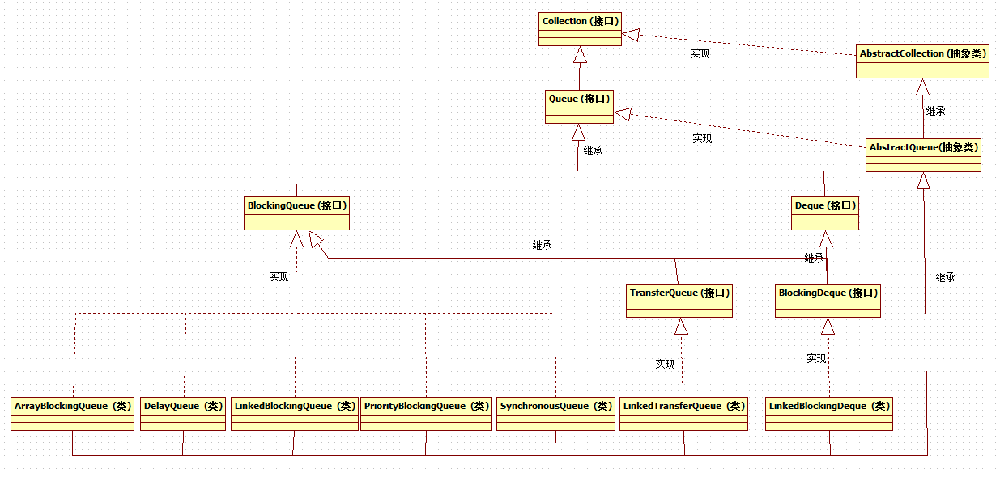

[TOC]


# 1 总览




# 2 LinkedBlockingQueue

LinkedBlockingQueue是一个基于链表实现的阻塞队列，先进先出顺序，是构建生产者-消费者模式的首选构件。


## 2.1 内部实现

```
/**
 * 内部数据结构通过单向链表实现
 * @param <E>
 */
static class Node<E> {
    E item;
    Node<E> next;
    Node(E x) { item = x; }
}

/**
 * 内部链表长度,默认为int的最大值
 */
private final int capacity;

/**
 * 当前链表元素个数
 */
private final AtomicInteger count = new AtomicInteger();

/**
 * 链表头结点,其item永远为null
 */
transient Node<E> head;

/**
 * 链表尾节点,其item永远为null
 */
private transient Node<E> last;

/**
 * 元素出列持有的锁
 */
private final ReentrantLock takeLock = new ReentrantLock();

/**
 * 当链表为空时,该condition使所有的取出元素线程等待
 */
private final Condition notEmpty = takeLock.newCondition();

/**
 * 元素入列持有的锁
 */
private final ReentrantLock putLock = new ReentrantLock();

/**
 * 当链表为满时,该condition是所有放入元素的线程等待
 */
private final Condition notFull = putLock.newCondition();
```


## 2.2 构造函数

```
/**
 * 创建默认长度的链表
 */
public LinkedBlockingQueue() {
    this(Integer.MAX_VALUE);
}

/**
 * 创建指定长度的链表,链表初始化时,首尾节点为同一个节点,其item为null,这是不变的.
 * @param capacity
 */
public LinkedBlockingQueue(int capacity) {
    if (capacity <= 0) throw new IllegalArgumentException();
    this.capacity = capacity;
    last = head = new Node<E>(null);
}

/**
 * 根据给定集合创建链表
 * @param c
 */
public LinkedBlockingQueue(Collection<? extends E> c) {
    this(Integer.MAX_VALUE);    //创建默认大小的链表
    final ReentrantLock putLock = this.putLock;
    putLock.lock(); // Never contended, but necessary for visibility
    try {
        int n = 0;
        for (E e : c) {
            if (e == null)
                throw new NullPointerException();
            if (n == capacity)
                throw new IllegalStateException("Queue full");
            enqueue(new Node<E>(e));
            ++n;
        }
        count.set(n);
    } finally {
        putLock.unlock();
    }
}
```


## 2.3 入栈和出栈

```
/**
 * 元素入栈
 * @param node
 */
private void enqueue(Node<E> node) {
    //将新节点作为尾节点,同时将旧尾节点的next指针指向新的尾节点
    last = last.next = node;
}

/**
 * 元素出栈
 * @return
 */
private E dequeue() {
    //获取当前首节点
    Node<E> h = head;
    //新的首节点为h的next节点
    Node<E> first = h.next;
    //更新旧首节点的引用,防止出现过期引用
    h.next = h; // help GC
    //更新首节点
    head = first;
    //获取首节点中的元素,在LinkedBlockingQueue中,第一个元素是保存在第二个节点中,
    //  首节点的item永远为null,保持不变
    E x = first.item;
    first.item = null;
    return x;
}
```


## 2.4 put()

```
public void put(E e) throws InterruptedException {
    if (e == null) throw new NullPointerException();
    int c = -1;
    Node<E> node = new Node<E>(e);
    final ReentrantLock putLock = this.putLock;
    final AtomicInteger count = this.count;
    //锁住queue,防止其他添加操作线程并发修改queue
    putLock.lockInterruptibly();
    try {
        //如果queue满了,那么阻塞所有的添加操作线程,使其等待
        while (count.get() == capacity) {
            notFull.await();
        }
        //queue未满,元素入栈
        enqueue(node);
        //更新计数器
        c = count.getAndIncrement();
        //如果添加元素后,队列未满,那么唤醒某个添加操作的线程,允许添加
        if (c + 1 < capacity)
            notFull.signal();
    } finally {
        //解锁
        putLock.unlock();
    }
    if (c == 0)
        signalNotEmpty();
}
```


## 2.5 offer()

LinkedBlockingQueue中提供了一个特殊的offer方法，即添加元素时可以指定过期时间，如果在过期时间内，队列未满，添加成功，则返回true；否则，超过规定时间，未添加成功，则返回false。

```
public boolean offer(E e, long timeout, TimeUnit unit)
        throws InterruptedException {

    if (e == null) throw new NullPointerException();
    long nanos = unit.toNanos(timeout);
    int c = -1;
    final ReentrantLock putLock = this.putLock;
    final AtomicInteger count = this.count;
    putLock.lockInterruptibly();
    try {
        while (count.get() == capacity) {
            //如果队列满了,并且超出了指定时间,直接返回false,不在阻塞等待
            if (nanos <= 0)
                return false;
            //否则等待指定时间
            nanos = notFull.awaitNanos(nanos);
        }
        enqueue(new Node<E>(e));
        c = count.getAndIncrement();
        if (c + 1 < capacity)
            notFull.signal();
    } finally {
        putLock.unlock();
    }
    if (c == 0)
        signalNotEmpty();
    return true;
}
```


## 2.6 take()

```
public E take() throws InterruptedException {
    E x;
    int c = -1;
    final AtomicInteger count = this.count;
    final ReentrantLock takeLock = this.takeLock;
    //锁住queue,防止其他取出操作的线程并发修改queue
    takeLock.lockInterruptibly();
    try {
        //如果当前队列为空,那么阻塞所有的取出操作线程
        while (count.get() == 0) {
            notEmpty.await();
        }
        //元素出栈
        x = dequeue();
        //更新引用
        c = count.getAndDecrement();
        //如果取出元素后,链表不为空,那么唤醒一个取出操作的线程,允许继续取出
        if (c > 1)
            notEmpty.signal();
    } finally {
        //解锁
        takeLock.unlock();
    }
    if (c == capacity)
        signalNotFull();
    return x;
}
```