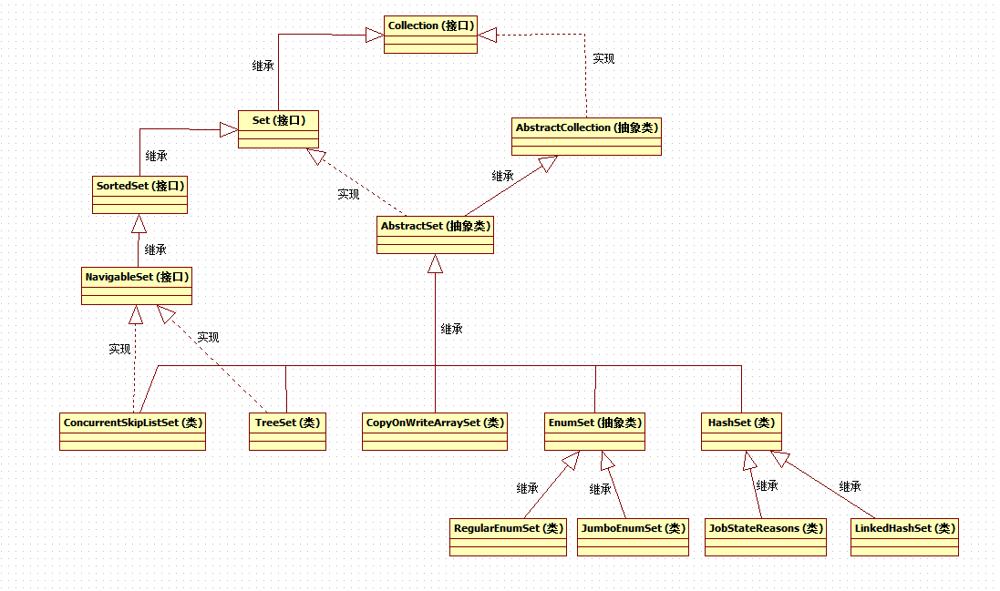

[TOC]


# 1 总览




# 2 TreeSet

TreeSet作为一个可排序的set集合，可以按照一定的排序规则对set中保存的元素进行排序。（由于TreeSet是基于TreeMap实现的，所以本章节只是简单讲解，在TreeMap中会进行详细讲解）


## 2.1 API

### 2.1.1 构造函数

```
public TreeSet() {
    this(new TreeMap<E,Object>());
}

public TreeSet(Comparator<? super E> comparator) {
    this(new TreeMap<>(comparator));
}
```

从TreeSet常用的两个构造器中，我们可以看出，TreeSet内部是通过维护一个TreeMap来实现的，当使用无参构造函数时，使用的是TreeMap中默认的自然顺序比较器，同时也提供了自定义比较器实现的构造函数。


### 2.1.2 add添加元素

```
private static final Object PRESENT = new Object();

public boolean add(E e) {
    return m.put(e, PRESENT)==null;
}
```

在TreeSet内部定义了一个常量PRESENT，每次在add添加元素时，其实是将我们想要添加的元素作为key，常量PRESENT作为value添加到map中，调用map的put()方法。


### 2.1.3 其他

TreeSet的add、remove等方法，内部全部调用的是TreeMap的相关方法，再查看TreeMap源码，我们可以看到，TreeMap是非同步的，如果在并发访问中map被修改，那么会抛出ConcurrentModificationException异常。


# 3 EnumSet

EnumSet 是一个与枚举类型一起使用的专用 Set 实现。枚举set中所有元素都必须来自单个枚举类型（即必须是同类型，且该类型是Enum的子类）。EnumSet有两个子类:RegularEnumSet和JumboEnumSet.


## 3.1 API

创建EnumSet

```
//定义一个枚举类
public enum DemoEnum {
    JACK,ROSE,TOM,BOB,MARRY
}

//创建EnumSet的常见方法
public static void main(String[] args) {

    EnumSet<DemoEnum> set1 = EnumSet.noneOf(DemoEnum.class);    //创建一个空set
    EnumSet<DemoEnum> set2 = EnumSet.allOf(DemoEnum.class);     //创建一个set,并enum中所有元素添加到set中

    System.out.println("--------------set1-------------");
    for (DemoEnum element:set1){
        System.out.println(element);
    }

    System.out.println("--------------set2-------------");
    for (DemoEnum element:set2){
        System.out.println(element);
    }

}

输出结果:
--------------set1-------------
--------------set2-------------
JACK
ROSE
TOM
BOB
MARRY
```


EnumSet是一个抽象类，所以并不能直接使用其构造函数创建，一般通过其提供的静态工厂方法来创建，我们来看一下noneOf()方法的源码:

```
public static <E extends Enum<E>> EnumSet<E> noneOf(Class<E> elementType) {
    Enum<?>[] universe = getUniverse(elementType);	//首先,校验elementType是否是enum,并获取其所有元素组成的数组
    if (universe == null)
        throw new ClassCastException(elementType + " not an enum");
    if (universe.length <= 64)	//当数组长度,也就是enum内元素个数小于等于64时,创建子类RegularEnumSet
        return new RegularEnumSet<>(elementType, universe);
    else			//反之,则创建子类JumboEnumSet
        return new JumboEnumSet<>(elementType, universe);
}
```

为什么noneOf内部会判断enum内部元素是否大于64并且创建不同的子类呢？这就涉及到EnumSet的实现原理。


## 3.2 内部原理

### 3.2.1 RegularEnumSet

查看RegularEnumSet源码,发现其对内部元素的维护是通过一个long来维护的:

```
private long elements = 0L;
```


查看其add方法:

```
public boolean add(E e) {
    typeCheck(e);			//检查类型
    long oldElements = elements;	//获取添加前elements的long值
    elements |= (1L << ((Enum<?>)e).ordinal());		//获取元素对应的ordinal值,将该数值对应的long的bit位更新为1
    return elements != oldElements;	//比较添加前后的值,判断元素是否已经添加过
}
```


实现原理：
RegularEnumSet内部维护了一个long值，我们知道，long类型有64个bit位，最开始每个bit位置都为0，当添加新元素时，获取新元素对应的ordinal值，将ordinal值对应的bit位更新为1，即实现了元素的存储。


### 3.2.2 JumboEnumSet

那么，当枚举元素个数大于64时，JumboEnumSet是如何做的呢?
查看源码:

```
private long elements[];

public boolean add(E e) {
    typeCheck(e);

    int eOrdinal = e.ordinal();
    int eWordNum = eOrdinal >>> 6;

    long oldElements = elements[eWordNum];
    elements[eWordNum] |= (1L << eOrdinal);
    boolean result = (elements[eWordNum] != oldElements);
    if (result)
        size++;
    return result;
}
```

可以看到，当元素个数大于64后，明显一个long值不够存储了，那么便维护一个long数组。


### 3.2.3 性能

因为EnumSet内部对元素的维护是通过long的bit位，而不是数组或者链表，所以其性能很优秀，下面是一个小示例，来比较下EnumSet和HashSet的性能。

DemoEnum中有50个元素，以50个元素为单位，进行添加和删除，然后循环50000次。

```
public enum DemoEnum {
    T00,T01,T02,T03,T04,T05,T06,T07,T08,T09,
    T10,T11,T12,T13,T14,T15,T16,T17,T18,T19,
    T20,T21,T22,T23,T24,T25,T26,T27,T28,T29,
    T30,T31,T32,T33,T34,T35,T36,T37,T38,T39,
    T40,T41,T42,T43,T44,T45,T46,T47,T48,T49
}

public static void main(String[] args) {

    testEnumSet();
    testHashSet();

}

public static void testEnumSet(){
    EnumSet<DemoEnum> set = EnumSet.noneOf(DemoEnum.class);

    long start = System.currentTimeMillis();
    for(int x=0;x<50000;x++){
        for(DemoEnum element:DemoEnum.values()){
            set.add(element);
        }
        for(DemoEnum element:DemoEnum.values()){
            set.remove(element);
        }
    }
    long end = System.currentTimeMillis();
    System.out.println("EnumSet:" + (end-start) + "ms");
}

public static void testHashSet(){
    HashSet<DemoEnum> set = new HashSet<>();

    long start = System.currentTimeMillis();
    for(int x=0;x<50000;x++){
        for(DemoEnum element:DemoEnum.values()){
            set.add(element);
        }
        for(DemoEnum element:DemoEnum.values()){
            set.remove(element);
        }
    }
    long end = System.currentTimeMillis();
    System.out.println("HashSet:" + (end-start) + "ms");
}

输出结果:
EnumSet:21ms
HashSet:90ms
```

可以看到，EnumSet的性能要高于HashSet，当插入和删除的操作越频繁，其效率的提升越明显。


# 4 HashSet

HashSet，基于散列的元素不可重复集合，不保证元素在集合中的顺序，允许存入null值，其有两个常见的子类：LinkedHashSet 和 JobStateReasons。


## 4.1 内部实现

在HashSet源码中，我们可以看到：

```
private transient HashMap<E,Object> map;

private static final Object PRESENT = new Object();

public HashSet() {
    map = new HashMap<>();
}
```

很明显，HashSet是通过内部维护一个HashMap来实现的，其增加和删除的方法也是对内部map的调用。(关于HashMap的详解请查看相关Map体系的文章，此处不加赘述)


## 4.2 子类

### 4.2.1 LinkedHashSet

在HashSet中,有一个非public访问权限的构造方法:

```
HashSet(int initialCapacity, float loadFactor, boolean dummy) {
    map = new LinkedHashMap<>(initialCapacity, loadFactor);
}
```

这是为LinkedHashSet准备的，也可以很明显的看出，LinkedHashSet是通过维护一个LinkedHashMap来实现的，我们在查看LinkedHashSet源码时可以发现，其源码很简单，所有的构造函数都是对上述构造函数的调用。

```
public LinkedHashSet(int initialCapacity, float loadFactor) {
    super(initialCapacity, loadFactor, true);
}

public LinkedHashSet(int initialCapacity) {
    super(initialCapacity, .75f, true);
}

public LinkedHashSet() {
    super(16, .75f, true);
}

public LinkedHashSet(Collection<? extends E> c) {
    super(Math.max(2*c.size(), 11), .75f, true);
    addAll(c);
}
```


### 4.2.2 JobStateReasons

JobStateReasons 类是打印属性类，它是一个枚举值集合，提供了有关作业当前状态的额外信息，即扩充作业的 JobState 属性值的信息。
上述是Jdk API中对JobStateReasons的定义，由于在日常开发中并没有使用到过，所以此处先留白，等后面如果有了进一步的了解再补充。


# 5 ConcurrentSkipListSet

ConcurrentSkipListSet是线程安全的有序的集合，适用于高并发的场景。


ConcurrentSkipListSet 和 TreeSet的异同点：

1. 都是有序的集合。

2. 线程安全机制不同。

   TreeSet是非线程安全的，而ConcurrentSkipListSet是线程安全的。

3. 实现原理不同。

   ConcurrentSkipListSet是通过ConcurrentSkipListMap实现的，而TreeSet是通过TreeMap实现的。

   

ConcurrentSkipListSet的增删等方法，也是对内部ConcurrentSkipListMap的相关方法调用，关于ConcurrentSkipListMap的实现原理详解请查看相关Map体系的文章，此处不再做赘述。


# 6 CopyOnWriteArraySet

CopyOnWriteArraySet，是一个基于”写复制”机制的元素有序但不可重复的Set集合，是线程安全的。何为”写复制”呢？就是当集合在写入一个新元素时，创建一个内部容器的副本，向副本中添加元素，然后将内部容器的引用指向新的容器副本。即每次添加新元素都会创建一个新的内部容器。


## 6.1 内部实现

```
private final CopyOnWriteArrayList<E> al;

public CopyOnWriteArraySet() {
    al = new CopyOnWriteArrayList<E>();
}
```

CopyOnWriteArraySet是通过内部维护一个CopyOnWriteArrayList来实现的，关于CopyOnWriteArrayList，请查看List体系文章的详解，此处不做赘述。但是本篇文章会重点讲解一下CopyOnWriteArrayList中专门为CopyOnWriteArraySet而配置的方法。


## 6.2 API

### 6.2.1 add

```
public boolean add(E e) {
    return al.addIfAbsent(e);
}

public boolean addAll(Collection<? extends E> c) {
    return al.addAllAbsent(c) > 0;
}
```

在CopyOnWriteArraySet中，add方法并没有调用CopyOnWriteArrayList的add或者addAll方法，而是调用了特殊的addIfAbsent()或者addAllAbsent()，这两个方法是CopyOnWriteArrayList专门为CopyOnWriteArraySet准备的方法，下面我们重点看下这两个方法的实现原理。


### 6.2.2 addIfAbsent

```
public boolean addIfAbsent(E e) {
   Object[] snapshot = getArray();                                //首先,复制内部数组容器的一个快照副本
   return indexOf(e, snapshot, 0, snapshot.length) >= 0 ? false : //然后在快照副本中查找该元素,如果不存在,则调用私有方法addIfAbsent进行添加
         addIfAbsent(e, snapshot);
}


private boolean addIfAbsent(E e, Object[] snapshot) {
   final ReentrantLock lock = this.lock;
   lock.lock();                              //使用lock锁住,防止其他线程并发修改
   try {
      Object[] current = getArray();
      int len = current.length;
      if (snapshot != current) {            //比较当前的容器和作为参数传递进来的容器副本,如果两者不相同,说明原始容器已经被修改过
         int common = Math.min(snapshot.length, len);   //得到原始容器和容器副本各自长度,选择最小值
         for (int i = 0; i < common; i++)                //遍历
            if (current[i] != snapshot[i] && eq(e, current[i]))    //当原始容器中位置i的元素与要添加的元素相同,但是与副本容器中位置i的元素不同,那么说明元素已经被添加了,直接返回false
               return false;
         if (indexOf(e, current, common, len) >= 0)     //在原始容器中大于角标common的位置继续查找,如果找到了要添加的元素,那么直接返回
            return false;
      }
      Object[] newElements = Arrays.copyOf(current, len + 1);    //当原始容器和容器副本相同时,说明元素未添加,那么直接更新原始容器,将其大小+1
      newElements[len] = e;     //将元素添加到数组尾部
      setArray(newElements);    //更新引用
      return true;
   } finally {
      lock.unlock();
   }
}
```


### 6.2.3 addAllAbsent

```
public int addAllAbsent(Collection<? extends E> c) {
   Object[] cs = c.toArray();             //将集合转为数组
   if (cs.length == 0)
      return 0;
   final ReentrantLock lock = this.lock;
   lock.lock();
   try {
      Object[] elements = getArray();                  //获取当前容器数组
      int len = elements.length;
      int added = 0;
      for (int i = 0; i < cs.length; ++i) {             //遍历传入的集合中的所有元素
         Object e = cs[i];    
         if (indexOf(e, elements, 0, len) < 0 &&       //如果当前容器中不包含该元素,并且传入的集合数组中此元素第一次出现,那么直接添加,记录成功添加元素的个数
               indexOf(e, cs, 0, added) < 0)
            cs[added++] = e;
      }
      if (added > 0) {                                 //如果添加的元素个数大于0,那么创建新的数组并更新当前的容器引用到新数组
         Object[] newElements = Arrays.copyOf(elements, len + added);
         System.arraycopy(cs, 0, newElements, len, added);
         setArray(newElements);
      }
      return added;
   } finally {
      lock.unlock();
   }
}
```