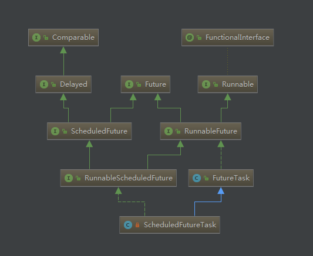

[TOC]

Future 表示异步计算的结果。

它提供了检查计算是否完成的方法，以等待计算的完成，并获取计算的结果。计算完成后只能使用 get 方法来获取结果，如有必要，计算完成前可以阻塞此方法。取消则由 cancel 方法来执行。还提供了其他方法，以确定任务是正常完成还是被取消了。一旦计算完成，就不能再取消计算。如果为了可取消性而使用 Future 但又不提供可用的结果，则可以声明 Future<?> 形式类型、并返回 null 作为底层任务的结果。

Future通常与Executor框架一起使用，作为整个异步框架体系中的重要成员。下面是Future框架的结构图：




# 1 Future

作为Future框架的顶层接口，Future接口中定义了获取异步执行结果、取消异步任务以及获取异步任务状态的方法。


**源码解读**

```
public interface Future<V> {

    /**
     * 尝试取消任务的执行。如果任务已经完成、或者已经被取消、或者由于其他的原因不可以取消，那么将返回false；
     * 如果任务在取消时还未启动，那么任务将永远不会执行；
     * 如果任务在取消时已经启动了，该方法的参数mayInterruptIfRunning为true时，会直接中断执行任务的线程来强制取消任务，该方法返回后，客户端调用isDone方法会返回true，也就是说，被取消的任务也视为完成状态。
     * 只有该方法返回true时，客户端调用isCancelled方法才会返回true
     *
     * @param mayInterruptIfRunning 如果任务正在执行，该值为true时，会直接中断执行任务的线程来强制取消任务；
     *                              值为false时，会等待任务执行完毕
     * @return 是否取消成功
     */
    boolean cancel(boolean mayInterruptIfRunning);

    /**
     * 如果任务在完成前就被取消了，那么返回true；否则返回false
     */
    boolean isCancelled();

    /**
     * 如果任务已经完成，那么返回true；否则返回false
     * 无论任务是被取消还是正常执行完毕，都会返回true；
     */
    boolean isDone();

    /**
     * 获取异步任务的执行结果（如果任务未执行完，那么等待任务执行完毕）
     *
     * @return 异步执行结果
     * @throws CancellationException 如果任务执行时被取消，那么抛出该异常
     * @throws ExecutionException 如果任务代码执行时发生异常，那么抛出该异常，客户端可以
     *                            通过捕获该异常，该异常中记录了务代码执行时发生的异常
     * @throws InterruptedException 如果在等待时，当前线程被中断，那么抛出该异常
     */
    V get() throws InterruptedException, ExecutionException;

    /**
     * 获取异步任务的执行结果（如果任务未执行完，那么等待任务执行完毕；如果等待超时，
     * 将抛出异常）
     *
     * @param timeout 超时时间
     * @param unit 时间单位
     * @return 异步执行结果
     * @throws CancellationException 如果任务执行时被取消，那么抛出该异常
     * @throws ExecutionException 如果任务代码执行时发生异常，那么抛出该异常，客户端可以
     *                            通过捕获该异常，该异常中记录了务代码执行时发生的异常
     * @throws InterruptedException 如果在等待时，当前线程被中断，那么抛出该异常
     * @throws TimeoutException 如果等待超时，抛出该异常
     */
    V get(long timeout, TimeUnit unit)
            throws InterruptedException, ExecutionException, TimeoutException;
}
```


在Future接口的方法定义中，重点理解cancel方法在取消任务时执行的策略。


# 2 RunnableFuture

RunnableFuture接口很简单，只是在继承Future接口的同时继承了Runnable接口，使得其实现类不仅可以保存异步任务的执行状态和结果，同时也可以作为一个任务直接执行。


**源码解读**

```
public interface RunnableFuture<V> extends Runnable, Future<V> {
    /**
     * Sets this Future to the result of its computation
     * unless it has been cancelled.
     * 
     * 此处的原版注释很好理解，我之所以没放中文翻译是因为翻译过来总
     * 是很拗口，比如这样：将自身作为自身执行后的future结果...
     * 看吧，翻译成中文太尴尬了...好在英文注释很简单，大家自行理解吧
     */
    void run();
}
```


# 3 FutureTask

FutureTask是RunnableFuture接口的实现。

关于FutureTask的实现，一定要理解FutureTask的各种状态以及状态间是如何转换的。


## 3.1 内部字段

对各个字段的详解，都在代码是用注释说明了，要重点理解FutureTask内部定义的几种状态。

```
/**
 * 任务运行状态，初始化时为NEW.
 * 只有在set、setException和cancel方法中会将运行状态转化为最终
 * 状态（最终状态不是一个固定的状态，而是代表任务进入某个状态后，
 * 任务状态不会再变化了）
 *
 * 在任务完成期间，任务状态可能是COMPLETING（正在设置执行结果），或者
 * INTERRUPTING（调用cancel(true)后强制中断执行任务）。
 *
 * 任务从中间状态过渡到最终状态是通过改变int值实现的，因为每个状态都用
 * 唯一的int值表示，所以任务状态值的改变会很高效
 *
 * 任务状态的转变可能有以下几种情况:
 * NEW -> COMPLETING -> NORMAL
 * NEW -> COMPLETING -> EXCEPTIONAL
 * NEW -> CANCELLED
 * NEW -> INTERRUPTING -> INTERRUPTED
 */

//当前任务状态，注意，该字段用volatile关键字修饰，每次状态的变化对所有线程都是可见的
private volatile int state;

/**
 * 各个状态详解：
 * NEW:表示是个新的任务或者还没被执行完的任务。这是初始状态。
 * COMPLETING:任务已经执行完成或者执行任务的时候发生异常，
 *              但是任务执行结果或者异常原因还没有保存到outcome字段(outcome字段用来保存任务执行结果，
 *              如果发生异常，则用来保存异常原因)的时候，状态会从NEW变更到COMPLETING。但是这个状态
 *              时间会比较短，属于中间状态。
 * NORMAL:任务已经执行完成并且任务执行结果已经保存到outcome字段，状态会从COMPLETING转换到NORMAL。
 *             这是一个最终态。
 * EXCEPTIONAL:任务执行发生异常并且异常原因已经保存到outcome字段中后，状态会从COMPLETING转换到
 *               EXCEPTIONAL。这是一个最终态。
 * CANCELLED:任务还没开始执行或者已经开始执行但是还没有执行完成的时候，用户调用了cancel(false)
 *              方法取消任务且不中断任务执行线程，这个时候状态会从NEW转化为CANCELLED状态。这是一个最终态。
 * INTERRUPTING: 任务还没开始执行或者已经执行但是还没有执行完成的时候，用户调用了cancel(true)方法
 *                  取消任务并且要中断任务执行线程但是还没有中断任务执行线程之前，状态会从NEW转化为INTERRUPTING。
 *                  这是一个中间状态。
 * INTERRUPTED:调用interrupt()中断任务执行线程之后状态会从INTERRUPTING转换到INTERRUPTED。
 *                  这是一个最终态。
 */
private static final int NEW          = 0;
private static final int COMPLETING   = 1;
private static final int NORMAL       = 2;
private static final int EXCEPTIONAL  = 3;
private static final int CANCELLED    = 4;
private static final int INTERRUPTING = 5;
private static final int INTERRUPTED  = 6;

/** Callable任务 */
private Callable<V> callable;
/** 任务执行结果或者异常 */
private Object outcome; // non-volatile, protected by state reads/writes
/** 执行任务的线程 */
private volatile Thread runner;
/** 基于无锁并发栈结构的等待线程 */
private volatile WaitNode waiters;
```


## 3.2 构造函数

```
/**
 * 通过Callable任务初始化FutureTask，任务执行成功后，get()方法返回的值为Callable任务
 * 的call方法返回的值。
 */
public FutureTask(Callable<V> callable) {
    if (callable == null)
        throw new NullPointerException();
    this.callable = callable;
    this.state = NEW;       // ensure visibility of callable
}

/**
 * 通过Runnable任务初始化FutureTask，任务执行成功后，get()方法返回的值为作为构造参数传入
 * 的值result
 */
public FutureTask(Runnable runnable, V result) {
    this.callable = Executors.callable(runnable, result);
    this.state = NEW;       // ensure visibility of callable
}
```

FutureTask提供了两个构造函数，分别通过Callable任务和Runnable任务来初始化一个FutureTask，因为Runnable类型任务是没有返回值的，所以我们需要指定任务执行成功后的返回值。

在FutureTask构造方法中，通过Executors工具类将Runnable任务包装成Callable类型任务，我们可以看下是如何包装的：

```
public static <T> Callable<T> callable(Runnable task, T result) {
    if (task == null)
        throw new NullPointerException();
//将Runnable 类型任务包装为RunnableAdapter
    return new RunnableAdapter<T>(task, result);
}

//RunnableAdapter继承了Callable接口，并在call方法中调用了task的run方法来执行任务，执行完毕后，返回指定的值result
static final class RunnableAdapter<T> implements Callable<T> {
    final Runnable task;
    final T result;
    RunnableAdapter(Runnable task, T result) {
        this.task = task;
        this.result = result;
    }
    public T call() {
        task.run();
        return result;
    }
}
```


## 8.3 获取任务执行结果

通过get方法获取任务执行结果：

```
/**
 * 获取任务执行结果，如果任务没有执行完毕，那么一直等待任务执行完毕
 */
public V get() throws InterruptedException, ExecutionException {
    int s = state;
    if (s <= COMPLETING)
        //如果任务出于未完成状态，那么等待任务完成
        s = awaitDone(false, 0L);
    //如果任务已经完成，那么返回结果
    return report(s);
}

/**
 * 获取任务执行结果，如果任务没有执行完毕，那么等待指定的时间，如果等待超时，任务
 * 仍未完成，那么抛出TimeoutException异常
 */
public V get(long timeout, TimeUnit unit)
        throws InterruptedException, ExecutionException, TimeoutException {
    if (unit == null)
        throw new NullPointerException();
    int s = state;
    if (s <= COMPLETING &&
            (s = awaitDone(true, unit.toNanos(timeout))) <= COMPLETING)
        throw new TimeoutException();
    return report(s);
}

private int awaitDone(boolean timed, long nanos)
        throws InterruptedException {
    //确定任务的执行时间
    final long deadline = timed ? System.nanoTime() + nanos : 0L;
    WaitNode q = null;
    boolean queued = false;
    for (;;) {
        if (Thread.interrupted()) {
            //如果当前线程被中断，那么在等待线程的队列中移除此线程
            removeWaiter(q);
            throw new InterruptedException();
        }

        int s = state;
        if (s > COMPLETING) {
            //已经执行完毕（无论成功与否），或者正在被取消，或者已经被取消
            if (q != null)
                //不再需要其他线程来等待执行该任务了
                q.thread = null;
            //直接返回任务状态
            return s;
        }
        else if (s == COMPLETING)
            //如果任务处于COMPLETING状态，说明任务执行完毕（可能成功也可能失败），
            //  但是还未来的及将执行结果赋给outcome变量，那么当前线程要让出优先权
            Thread.yield();
        else if (q == null)
            //如果等待线程队列为空，那么新建等待线程队列节点
            q = new WaitNode();
        else if (!queued)
            //如果还没有入列，那么把当前节点加入waiters首节点并替换原来waiters
            // 也就是说，将当前线程放到等待线程队列的首位
            queued = UNSAFE.compareAndSwapObject(this, waitersOffset,
                    q.next = waiters, q);
        else if (timed) {
            //如果需要等待，那么计算等待时间
            nanos = deadline - System.nanoTime();
            if (nanos <= 0L) {
                //如果已经超时，那么删除等待节点并返回任务状态
                removeWaiter(q);
                return state;
            }
            //否则等待指定时间后执行任务
            LockSupport.parkNanos(this, nanos);
        }
        else
            //阻塞等待直到被其他线程唤醒
            LockSupport.park(this);
    }
}
```

**具体的执行流程如下：**

- 计算等待时间deadline，如果是带超时时间的get，deadline = 当前时间 + 等待时间，如果是不带超时时间的get，deadline = 0。
- 判断线程是否中断，如果线程中断，将当前线程从等待队列waiters中移除，抛出中断异常，否则，跳转到步骤3。
- 获取task状态state：
  如果task状态为已完成状态，将等待线程节点的线程置为null，返回state；
  如果task状态为正在执行，调用`Thread.yield()`将线程从执行状态变为可执行状态；
  否则，跳转到步骤4。
- 如果等待线程节点q为null，初始化等待线程节点q，否则，跳转到步骤5。
- 如果当前等待线程节点q还未成功进入等待队列waiters，进入线程等待队列，否则，跳转到步骤6。
- 判断是否是带超时时间的get：
  如果是带超时时间get，判断当前是否超时，如果已经超时，将当前等待节点q从waiters中移出，返回task状态state，如果还未超时，调用LockSupport.parkNanos方法阻塞当前线程；
  否则，跳转到步骤7。
- 调用LockSupport.park方法，阻塞当前线程，然后跳转到步骤2。


从get方法整个流程可以看出：
FutureTask维护一个等待线程队列waiters，如果task还未执行完毕，调用get方法的线程会先进入等待队列自旋等待；
awaitDone方法其实是个死循环，直到task状态变为已完成状态或者等待时间超过超时时间或者线程中断才会跳出循环，程序结束；
为了节省开销，线程不会一直自旋等待，而是会阻塞，使用LockSupport的park系列方法实现线程阻塞；


## 8.4 执行任务

```
public void run() {
    //如果任务不是初始状态，说明已经有其他线程在执行任务或者执行完毕，那么直接返回
    if (state != NEW ||
            !UNSAFE.compareAndSwapObject(this, runnerOffset,
                    null, Thread.currentThread()))
        return;
    try {
        Callable<V> c = callable;
        if (c != null && state == NEW) {
            V result;
            boolean ran;
            try {
                result = c.call();
                ran = true;
            } catch (Throwable ex) {
                result = null;
                ran = false;
                //任务执行失败，将异常赋给outcome字段
                setException(ex);
            }
            if (ran)
                //任务执行成功，将结果赋给outcome字段
                set(result);
        }
    } finally {
        //任务执行完毕，无论成功或是失败，都属于执行完毕，那么将任务绑定的线程置为null
        runner = null;
        int s = state;
        if (s >= INTERRUPTING)
            //如果只想能够任务的线程正在被中断或者已经被中断，那么进行处理
            handlePossibleCancellationInterrupt(s);
    }
}

private void handlePossibleCancellationInterrupt(int s) {
    // 如果执行任务的线程正在被中断，那么当前线程让出优先权，
    //  来优先执行线程的中断操作
    if (s == INTERRUPTING)
        while (state == INTERRUPTING)
            Thread.yield();
}
```


## 8.5 取消任务

```
public boolean cancel(boolean mayInterruptIfRunning) {
    //只有NEW状态的任务才允许直接取消
    if (!(state == NEW &&
            UNSAFE.compareAndSwapInt(this, stateOffset, NEW,
                    mayInterruptIfRunning ? INTERRUPTING : CANCELLED)))
        return false;
    try {    // in case call to interrupt throws exception
        if (mayInterruptIfRunning) {
            try {
                Thread t = runner;
                if (t != null)
                    //如果允许强制中断并且任务正在执行，那么强制中断执行任务的线程
                    t.interrupt();
            } finally { // final state
                UNSAFE.putOrderedInt(this, stateOffset, INTERRUPTED);
            }
        }
    } finally {
        //任务取消完成后，通过finishCompletion方法唤醒所有等待线程队列中的线程
        finishCompletion();
    }
    return true;
}
```


## 8.6 其他

在FutureTask内部，任务状态的转换以及等待线程队列节点的更新，都是通过cas方式实现的，FutureTask内部使用UNSAFE对象来完成所有的cas操作。

UNSAFE对象可以线程安全地获取内容，但是这并不代表它适合在开发中大量使用。更多时候，UNSAFE出现在成熟的框架中，用于一些底层工作。如果要使用UNSAFE对象，一定要保证代码经过了大量的测试。

UNSAFE对象进行cas操作的api不难理解，从FutureTask的内部示例中，可以很容易理解:

这是FutureTask内部维护的UNSAFE对象

```
// Unsafe mechanics
private static final sun.misc.Unsafe UNSAFE;
private static final long stateOffset;
private static final long runnerOffset;
private static final long waitersOffset;
static {
    try {
        UNSAFE = sun.misc.Unsafe.getUnsafe();
        Class<?> k = FutureTask.class;
        stateOffset = UNSAFE.objectFieldOffset
                (k.getDeclaredField("state"));
        runnerOffset = UNSAFE.objectFieldOffset
                (k.getDeclaredField("runner"));
        waitersOffset = UNSAFE.objectFieldOffset
                (k.getDeclaredField("waiters"));
    } catch (Exception e) {
        throw new Error(e);
    }
}
```


这是一段使用UNSAFE对象进行cas更新操作的代码：

```
UNSAFE.compareAndSwapObject(this,runnerOffset,null,Thread.currentThread())
```

`compareAndSwapObject`方法的参数1是要修改的对象，参数2是要修改的字段在对象中的偏移量表示（long），参数3是期望的当前值，参数4是要更新的最新值。

其他方法参考api或者查看源码，此处不再讲解关于UNSAFE过多的内容。


# 4 ScheduledFuture

首先，看一下ScheduledFuture接口的定义：

```
public interface ScheduledFuture<V> extends Delayed, Future<V> { 
}
```


ScheduledFuture接口除了继承Future接口外，还继承了Delayed接口，来看下Delayed接口：

```
public interface Delayed extends Comparable<Delayed> { 
    long getDelay(TimeUnit unit); 
}
```


Delayed接口中只定义了一个getDelay方法，用于返回从现在起，多久后开始执行定时任务。这样一来，ScheduledFuture的实现就可以通过实现该方法获取距离任务执行所剩的延时时间。


# 5 RunnableScheduledFuture

首先，看一下RunnableScheduledFuture接口的定义：

```
public interface RunnableScheduledFuture<V> extends RunnableFuture<V>, ScheduledFuture<V> { 
    boolean isPeriodic(); 
}
```

RunnableScheduledFuture接口继承了ScheduledFuture和RunnableFuture，并且定义了isPeriodic方法，当任务需要周期性重复执行时，该方法返回true.


# 6 ScheduledFutureTask

ScheduledFutureTask作为RunnableScheduledFuture接口的实现，是在ScheduledThreadPoolExecutor线程池中作为私有内部类声明的，因为ScheduledFutureTask只在该线程池中使用，所以可以作为私有内部类声明。


## 6.1 字段属性

```
/** 任务队列中任务数 */
private final long sequenceNumber;

/** 任务初始执行的延时时长 */
private long time;

/**
 * 任务周期性重复执行时，两次执行之间的延时时长
 */
private final long period;

/** 重新入列的周期性任务 */
RunnableScheduledFuture<V> outerTask = this;

/**
 * 二叉堆索引
 */
int heapIndex;
```


## 6.2 构造函数

```
/**
 * 创建一次性的延时任务
 */
ScheduledFutureTask(Runnable r, V result, long ns) {
    super(r, result);
    //设置延时时间
    this.time = ns;
    //不需要周期性重复执行，所以设置周期延时为0
    this.period = 0;
    //更新队列中的任务数
    this.sequenceNumber = sequencer.getAndIncrement();
}

/**
 * 创建周期任务，延时ns后开始第一次执行任务，此后每隔period时长重复执行任务
 */
ScheduledFutureTask(Runnable r, V result, long ns, long period) {
    super(r, result);
    this.time = ns;
    this.period = period;
    this.sequenceNumber = sequencer.getAndIncrement();
}

/**
 * 创建周期任务，延时ns后开始第一次执行任务，此后每隔period时长重复执行任务
 */
ScheduledFutureTask(Callable<V> callable, long ns) {
    super(callable);
    this.time = ns;
    this.period = 0;
    this.sequenceNumber = sequencer.getAndIncrement();
}
```


## 6.3 getDelay

获取当前时间距离任务执行的延时

```
public long getDelay(TimeUnit unit) {
    return unit.convert(time - now(), NANOSECONDS);
}
```


## 6.4 compareTo

重点看一下compareTo方法，因为定时任务的排序是按照执行时间排序的，从任务执行时间到当前时间的延时越小，任务越靠前。所以ScheduledFutureTask之间的比较也是通过delay的比较来确定大小

```
public int compareTo(Delayed other) {
    if (other == this) // compare zero if same object
        return 0;
    if (other instanceof ScheduledFutureTask) {
        ScheduledFutureTask<?> x = (ScheduledFutureTask<?>)other;
        long diff = time - x.time;
        if (diff < 0)
            return -1;
        else if (diff > 0)
            return 1;
        else if (sequenceNumber < x.sequenceNumber)
            return -1;
        else
            return 1;
    }
    long diff = getDelay(NANOSECONDS) - other.getDelay(NANOSECONDS);
    return (diff < 0) ? -1 : (diff > 0) ? 1 : 0;
}
```


## 6.5 run

执行任务

```
public void run() {
    //首先，通过isPeriodic方法判断当前任务是否是周期任务
    boolean periodic = isPeriodic();
    if (!canRunInCurrentRunState(periodic))
        //如果当前线程池运行状态下不允许执行任务，取消该任务
        cancel(false);
    else if (!periodic)
        //如果是非周期性任务，那么调用父类FutureTask方法，只执行一次
        ScheduledFutureTask.super.run();
    else if (ScheduledFutureTask.super.runAndReset()) {
        //如果是周期性任务，调用run方法执行任务，执行完毕后重新初始化任务状态，
        // 为下一次执行做准备
        
        //设置任务下一次执行的延时
        setNextRunTime();
        //重新将任务入列，等待下次执行
        reExecutePeriodic(outerTask);
    }
}
```


## 6.6 cancle

取消任务

```
public boolean cancel(boolean mayInterruptIfRunning) {
    //调用父类FutureTask的cancel方法取消任务
    boolean cancelled = super.cancel(mayInterruptIfRunning);
    if (cancelled && removeOnCancel && heapIndex >= 0)
        //如果取消成功，并且ScheduledThreadPoolExecutor线程池设置任务取消后删除任务，
        //  并且任务队列不为空，那么删除被取消的任务
        remove(this);
    return cancelled;
}
```