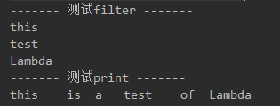
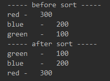
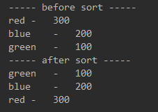
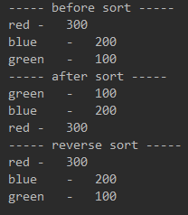

[TOC]


# 1 初识Lambda

## 1.1 定义

Lambda表达式可以理解为简洁的表示可传递的匿名函数的一种方式.


## 1.2 特点

1. 匿名

   没有名称，它不像方法那样属于某个特定的类，但是和方法一样，lambda有参数列表、函数主体、返回类型，还可能有可以抛出的异常列表。

2. 传递

   可以作为参数传递给方法或者存储在变量中。

3. 简洁

   无需像匿名类那样写很多模版代码。


## 1.3 基本语法

```
(parameters) -> expression     或者      (paramters) -> {statements;}
```

即：（参数列表） ->    函数主体

其中，’函数主体’可以是单行代码，也可以是多行代码，多行时要使用｛｝括起来


## 1.4 示例

```
1. (String s) -> s.length()            传入字符串参数s，返回s的长度
2. (Apple a) -> a.getWeight()>50       传入参数Apple，返回apple的weight重量是否大于50的boolean值
3. (int x,int y) -> {                  传入参数x和y，打印出其相加的结果
     System.out.println('result:');
     System.out.println(x+y);
   }
4. () -> 40                            不需要参数，直接返回int值40
```


## 1.5 Lambda与变量

Lambda可以没有限制的捕获实例变量和静态变量，但局部变量必须声明为final，或者事实上是final。也就是说，Lambda表达式只能捕获指派给它们的局部变量一次。

代码示例：

```
// 成功示例
int num = 200;                              
Runnable r = () -> System.out.println(num)   // num虽然是局部变量，但是在上下文中并没有对num进行更改，可以说num是隐式的final

// 失败示例
int num = 200;
Runnable r = () -> System.out.println(num)   // 无法编译，报错，因为 num 作为局部变量，在上下文中出现了再次修改的情况，其不再是隐式的final
num = 300；
```

如果允许捕获可变的局部变量，就会引发线程不安全的可能性，这不是java想看到的，java8的重要思想就是实现函数式编程的支持和实现多核的并发优化。


# 2 函数式接口

## 2.1 定义

函数式接口就是只定义一个抽象方法的接口，如我们熟知的Comparator和Runnable。


## 2.2 与Lambda的关系

Lambda表达式的使用是建立在函数式接口的基础上，换句话说，使用Lambda必须要有对应的函数式接口.


## 2.3 函数描述符

函数式接口抽象方法的签名。如：

```
void process(Apple a);                      函数描述符： (Apple) -> void
int totalWeight(Apple a1,Apple a2);         函数描述符： (Apple,Apple) -> int
```


## 2.4 Api

### 2.4.1 自定义函数式接口

当我们自定义了一个只有一个抽象方法的接口时，这个接口就是一个函数式接口，可以为Lambda表达式使用。

一般自定义的函数式接口，建议使用 @FunctionalInterface 注解标记，这也是java8 api中提供的函数式接口所使用的。


### 2.4.2 java8 api提供的函数式接口

```
函数式接口               函数描述符
Predicate<T>            T -> boolean
Consumer<T>             T -> void
Function<T,R>           T -> R
Supplier<T>             () -> T
UnaryOperator<T>        T -> T
BinaryOperator<T>       (T,T) -> T
BiPredicate<L,R>        (L,R) -> boolean
Biconsumer<T,U>         (T,U) -> void
BiFunction<T,U,R>       (T,U) -> R
```


## 2.5 示例

```
public class LambdaFirst {

    // 定义测试list
    private static List<String> stringList;

    // 初始化list
    static{
        stringList = new ArrayList<String>();
        stringList.add("this");
        stringList.add("is");
        stringList.add("a");
        stringList.add("test");
        stringList.add("of");
        stringList.add("Lambda");
    }

    // 筛选出list中字符串
    public static List<String> filter(List<String> list, Predicate<String> predicate){
        List<String> result = new ArrayList<String>();
        for(String str:list){
            // 根据返回的boolean筛选，此处依然是调用抽象方法，并没有明确判定条件
            if(predicate.test(str)){
                result.add(str);
            }
        }
        return result;
    }

    // 遍历list，并操作str
    public static void operator(List<String> list, Consumer<String> consumer){
        List<String> result = new ArrayList<String>();
        for(String str:list){
            // 此处依然抽象，没有明确如何操作str
            consumer.accept(str);
        }
    }

    public static void main(String[] args) {
        System.out.println("------- 测试filter -------");
        List<String> result = filter(stringList,(String str) -> str.length()>3);  //传入判定条件，长度大于3
        for(String s:result){
            System.out.println(s);
        }
        System.out.println("------- 测试print -------");
        operator(stringList,(String str) -> System.out.print(str+"\t"));  //传入操作，打印str

    }
}
```

控制台结果：




这只是Lambda初级的牛刀小试，可以看出对比匿名类，代码更加简化，同时也增加了更大的灵活性。


# 3 方法引用

## 3.1 概念

方法引用可以被看作仅仅调用特定方法的Lambda的一种快捷写法。


## 3.2 分类

### 3.2.1 指向静态方法的引用

```
例如：Integer的静态方法parseInt，写作 Integer::parseInt
```


### 3.2.2 指向任意类型实例方法的方法引用

```
例如：String的length方法，写作 String::legth
```


### 3.2.3 指向现有对象的实例方法的方法引用

```
例如：局部变量 apple 的类型为 Apple，Apple类中有getColor()方法，如果要调用它，就可以写成 apple::getColor
```


### 3.2.4 构造方法引用

```
4.1 空参构造函数
Supplier<Apple> s1 = Apple::new;
Apple apple = s1.get();

4.2 一个参数的构造方法
Function<String,Apple> s2 = Apple::new;
Apple apple = s2.get("red");

4.3 两个参数的构造方法
BiFunction<String,Integer,Apple> s3 = Apple::new; 
Apple apple = s2.get("red",100);

4.4 三个参数的构造方法（注意上面中用到的都是java8提供的函数式接口，对于三个参数的，api中没有合适的函数式接口有这样的签名匹配，所以要自定义函数式接口）
public interface MyFunction<A,B,C,D>{
    D apply(A a,B b,C c);
}
MyFunction<String,Integer,Apple> s4 = Apple::new; 
Apple apple = s2.get("red",100,"china");
```


## 3.3 示例

```
    // list集合的遍历操作方法，并未给出具体的遍历操作，后面通过lambda表达式传入
    private void printList(List<Apple> list, Consumer<Apple> consumer){
        for(Apple apple:list){
            consumer.accept(apple);
        }
    }

    // 创建并打印集合list
    public List<Apple> test1(){
        List<Apple> appleList = new ArrayList<Apple>();
        BiFunction<String,Integer,Apple> biFunction = Apple :: new;    //使用方法引用，创建实体
        appleList.add(biFunction.apply("red",300));
        appleList.add(biFunction.apply("blue",200));
        appleList.add(biFunction.apply("green",100));

        printList(appleList,(Apple apple) -> System.out.println(apple));   //传入lambda表达式，也就是遍历操作的代码，打印集合中的对象
        return appleList;
    }

    @Test
    public void test2(){
        System.out.println("----- before sort -----");

        List<Apple> appleList = test1();        //获取排序前的集合并打印

        System.out.println("----- after sort -----");

        appleList.sort((Apple a1,Apple a2) -> a1.getWeight().compareTo(a2.getWeight()));     //通过Lambda表达式传入比较器

        printList(appleList,(Apple apple) -> System.out.println(apple));   //打印排序后的集合
    }
```

输出结果：




```
@Test
    public void test3(){
        System.out.println("----- before sort -----");

        List<Apple> appleList = test1();             //获取原始集合并打印

        System.out.println("----- after sort -----");

        appleList.sort(Comparator.comparing(Apple::getWeight));    //使用方法引用，Comparator.comparing是api中提供的接口

        printList(appleList,(Apple apple) -> System.out.println(apple)); //打印排序后的list
    }
```

输出结果：




# 4 复合Lambda表达式

## 4.1 概念

将多个简单的Lambda表达式复合成复杂的表达式。


## 4.2 示例

### 4.2.1 比较器复合

**逆序**

上一节实战中的例子是按照weight属性来给苹果进行升序排序，我们想要升序排序之后再降序排序，如何实现呢？使用api提供的Comparator的默认方法reversed。

```
public void test3(){
        System.out.println("----- before sort -----");
        List<Apple> appleList = test1();

        System.out.println("----- after sort -----");
        appleList.sort(Comparator.comparing(Apple::getWeight));
        printList(appleList,(Apple apple) -> System.out.println(apple));

        System.out.println("----- reverse sort -----");                       //插入新的代码
        appleList.sort(Comparator.comparing(Apple::getWeight).reversed());    //使用reversed方法逆序
        printList(appleList,(Apple apple) -> System.out.println(apple));
    }
```

输出结果：




**比较器链**

想要在重量排序后在按照颜色对苹果进行排序，可以使用api中的Comparator.thenComparing。

```
appleList.sort(Comparator.comparing(Apple::getWeight).thenComparing(Apple::getColor));
```


### 4.2.2 谓词复合

谓词接口包括三个方法：negate、and、or，让你可以重用已有的Predicate来创建更复杂的谓词。

```
Predicate<Apple> redApple = (Apple apple) -> apple.getColor().equals("red");
Predicate<Apple> notRedApple = redApple.negate();
Predicate<Apple> redAndHeavyApple = redApple.and((Apple apple) -> apple.getWeight()>150);
Predicate<Apple> redAndHeavyAppleOrGreen = redApple.and((Apple apple) -> apple.getWeight()>150)
                                                   .or((Apple apple) -> apple.getColor().equals("green"));
```


### 4.2.3 函数复合

可实现流水线式的操作.

api中Function接口谓词配置了andThen和compose两个默认方法。

```
Function<Integer,Integer> f = x -> x+1;
Function<Integer,Integer> g = x -> x*2;
Function<Integer,Integer> h1 = f.andThen(g);
System.out.println(h1.apply(2));        //输出为 6
Function<Integer,Integer> h2 = f.compose(g);
System.out.println(h2.apply(2));        //输出为 5
```