[TOC]

HotSpot VM有3个主要组件: VM运行时(Runtime) , JIT编译器(JIT Compiler) , 内存管理器(Memory Manager)

# 1 架构概览图

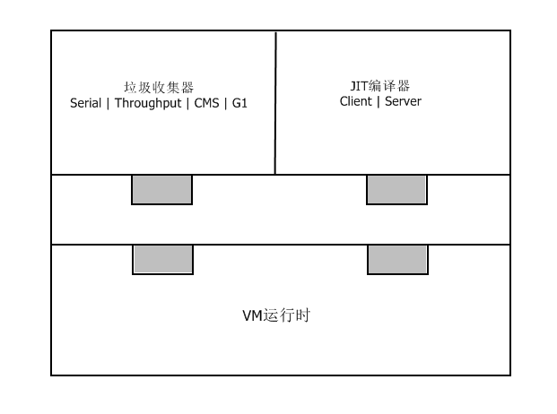

如图所示，JIT编译器和垃圾回收器都是**可插拔**的。VM运行时系统为两者提供服务和通用API。

**32位与64位的比较**

- 32位

  早期的HotSpot VM是32位的，内存地址空间限制为4G，实际java堆的大小受限于底层的操作系统：如Windows上最大可用java堆大约为1.5G，Linux上最大可用java堆约为2.5-3.0G。

- 64位

  64位HotSpot VM增大了java堆，使服务器系统可以使用更多的内存。

  但是64位VM也带来了性能的损失：内部java对象表示(普通对象指针)从32位变成了64位，降低了CPU缓存的效率。在Java6中，HotSpot VM引入了压缩指针特性(通过 –XX: +UseCompressedOops 开启)，优化了64位VM性能的缺失，实际上，一些java应用在64位VM上使用了压缩指针后，性能甚至要好于32位，这是因为使用压缩指针后指针大小不再是64位，变得更小，有助于提高cpu缓存效率。
  此外，在一些平台上(Intel或者AMD x64)，64位VM可以使用更多的cpu寄存器，有助于程序性能的改善。这是因为更多的cpu寄存器可以避免寄存器卸载：当活跃状态数超过cpu寄存器数，多出的活跃状态只能存放在内存中，就会发生寄存器卸载。寄存器卸载时，多出的活跃状态会被”卸载”到内存中，而内存的运行效率是低于寄存器的，于是就会对应用性能造成影响。

# 2 组件：VM运行时

HotSpot VM运行时环境担当许多职责，包括命令行选项解析、VM生命周期管理、类加载、字节码解释、异常处理、同步、线程管理、java本地接口、VM致命错误处理等。

## 2.1 命令行选项

可以通过命令行选项来配置HotSpot VM来提供java引用性能

**命令行选项主要有3类：**

1. 标准选项。
   所有java虚拟机都必须实现的选项。
2. 非标准选项。
   以 –X 为前缀，不保证也不强制所有的java虚拟机实现都支持。
3. 非稳定选项。
   以 –XX 为前缀，通常是为了特定需要来对JVM运行时进行配置。

**命令行选项的类型和默认值**

命令行选项用于控制HotSpot VM的内部变量，每个变量都有类型和默认值：

1. 对于内部变量为布尔类型的选项来说，只要在命令行上添加或者去掉它就可以控制这些变量。

2. 对于带有布尔标记的非稳定选项来说，选项名前的+或者-表示true或者false。

   例如：-XX:+AggressiveOpts 表示设置内部变量AggressiveOpts为true来开启相应的优化，而 –XX:- AggressiveOpts 表示设置其为false以关闭相应的优化。

3. 还有一类带有附加选项的非稳定选项，如 –XX:OptionName=N，几乎所有附加选项为整数的非稳定选项，整数后面都可以接后缀k、m、g，表示千、百万及十亿。

## 2.2 VM生命周期

VM运行时系统负责启动和停止HotSpot VM。启动HotSpot VM的组件是启动器，HotSpot VM有若干个启动器，如：java、javaw、javaws等。

**启动器启动HotSpot VM时执行的操作:**

1. 解析命令行选项。
   如 –client 或 -server 等。
2. 设置堆的大小和JIT编译器。
   如果命令行选项中对两者没有显式设置，那么启动器通过自动优化来根据底层操作系统来进行设置(VM的自动优化会在后面的章节介绍)。
3. 设定环境变量。
4. 如果命令行有 –jar 选项，启动器就会从指定jar的manifest中查找Main-Class，否则从命令行读取Main-Class。
5. 使用标准java本地接口方法 JNI_CreateJavaVM 在新创建的线程中创建HotSpot VM。
6. HotSpot VM创建并初始化完成后，加载 Main-Class。
7. HotSpot VM通过JNI方法 CallStaticVoidMethod 调用main方法，并将命令行选项传给它。至此，HotSpot VM开始正式执行命令行指定的java程序。

## 2.3 VM类加载

### 2.3.1 类加载的三个阶段

#### 2.3.1.1 加载

1. 对于给定的java类，先加载它的所有超类和超接口，如果类的继承层次有错，或者引用的超接口不是接口，超类实际上是超接口等错误，直接抛出异常。
2. 加载类，根据它的名字找到其二进制类文件，定义java类，创建出其java.lang.Class对象。如果没有找到java类的二进制表示，抛出NoClassDefFound异常。
3. 对类的格式进行语法检查。

#### 2.3.1.2 链接

1. 验证，检查类文件的语义，常量池符号以及类型。如果有错，抛出异常。
2. 准备，创建静态字段，初始化为标准默认值(对于 public static int value = 123，准备阶段将其初始化为0，而不是123)，以及分配内存。

#### 2.3.1.3 初始化

初始化类，运行构造器。

### 2.3.2 关于类初始化

出于性能的考虑，通常直到类初始化时HotSpot VM才会加载和链接类，这意味着：类A引用类B，加载A不一定导致加载B(除非B需要验证)。执行B的第一条指令会导致初始化B，从而加载和链接B。

### 2.3.3 类加载器委派

当请求类加载器查找和加载某个类时，该类加载器可以转而请求别的类加载器来加载。类加载器之间是层级化关系，每个类加载器都可以委派给上一级类加载器。

**JavaSE类加载器的层级查找顺序为：**

1. 启动类加载器。

   由HotSpot VM实现，负责加载BOOTCLASSPATH路径中的类，如包含JavaSE类库的 rt.Jar。

2. 扩展类加载器。

   由JavaSE系统实现，它负责从JRE的lib/ext目录下加载类。

3. 系统类加载器。

   是默认的应用程序类加载器，加载Java类的main方法并从classpath上加载类。

   

### 2.3.4 类型安全

Java的类型**由全限定名和类加载器唯一确定**，也就是说，两个不同类加载器加载的类，即使全限定名相同，也是两个不同的类型。

## 2.4 解释器

HotSpot VM解释器是一种基于模版的解释器。JVM启动时，HotSpot VM运行时系统利用内部TemplateTable中的信息在内存中生成解释器。TemplateTable包含与每个字节码对应的机器代码，每个模版描述一个字节码。 HotSpot VM TemplateTable定义了所有的模版，并提供了获得字节码模版的访问函数。

## 2.5 异常处理

异常处理由HotSpot VM解释器，JIT编译器和其他组件一起协作实现。
当VM遇到抛出的异常时，就会调用VM运行时系统查找该异常最近的处理器。如果在当前方法中没有找到，当前的活动栈帧就会退栈，重复这个过程直到找到异常处理器。一旦发现适当的异常处理器，VM的执行状态就会更新，并且跳转到该异常处理器继续执行java代码。

**异常处理主要有两种情形**

1. 同一方法抛出和捕获异常。
2. 由调用方法捕获异常，这种情况下会需要退栈。

## 2.6 同步

HotSpot VM用monitor对象来保证线程运行代码之间的互斥。Java的monitor对象可以锁定或者解锁，但任何时刻只有一个线程拥有该monitor对象。只有在获得monitor对象后，线程才可以进入它所保护的临界区。Java中临界区由同步块表示，代码中用synchronized语句表示。

Java5 HotSpot VM中引入了偏向锁(命令行选项 –XX:+UseBiasedLocking 开启)，最好情况下成本基本为0。如果大多数对象在其生命周期中最多只会被一个线程锁住，那就可以启动偏向锁。

HotSpot VM内部表示java对象的第一个字(word)，包含了java对象的同步状态编码，通常称之为标记字。标记字可以存放以下几种对象同步状态：

1. 中立

   已解锁。

2. 偏向

   已锁定/已解锁且无共享。

3. 栈锁

   已锁定且共享，但非竞争。

4. 膨胀

   已锁定/已解锁且共享和竞争。

## 2.7 线程管理

### 2.7.1 线程模型

HotSpot VM的线程模型中，java线程被一对一映射为本地操作系统线程。

### 2.7.2 线程创建和销毁

当java.lang.Thread启动时，HotSpot VM创建与之相关联的JavaThread和OSThread对象，最后是本地线程。本地线程初始化后开始执行run方法，返回时先处理所有未捕获的异常，之后终止线程，释放所有已分配的资源，并从已知线程列表中移除JavaThread。
线程终止后，与HotSpot VM交互，检查是否在终止该线程后需要终止整个HotSpot VM。

### 2.7.3 线程状态

**从HotSpot VM的角度，线程可以有以下状态：**

1. 新线程

   线程正在初始化的过程中。

2. 线程在Java中

   线程正在执行java代码。

3. 线程在VM中

   线程正在VM中执行。

4. 线程阻塞

   线程因某种原因被阻塞。

**从调试角度，线程还有其他的状态：**

1. MONITOR_WAIT

   线程正在等待获取竞争的监视锁。

2. CONDVAR_WAIT

   线程正在等待使用HotSpot VM的内部条件变量(没有与任何java对象关联)。

3. OBJECT_WAIT

   java线程正在执行java.lang.Object.wait()。

   

### 2.7.4 VM内部线程

1. VM线程
2. 周期任务线程
3. 垃圾收集线程
4. JIT编译器线程
5. 信号分发线程

### 2.7.5 安全点

当HotSpot VM到达安全点时，所有的java执行线程都会被阻塞。
垃圾收集是最为人知的安全点操作，更明确地说是其Stop-The-World阶段，还有其他的安全点：如偏向锁的撤离、线程栈的转储、线程的挂起或停止等 。

# 3 组件：垃圾收集器

## 3.1 分代垃圾收集

HotSpot VM使用分代垃圾收集算法，将堆分成两个物理区，也就是分代：

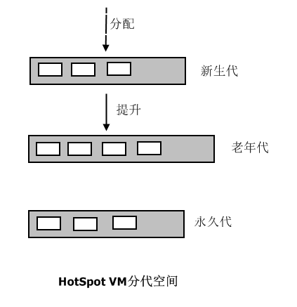

### 3.1.1 新生代

大多数新创建的对象都被分配到新生代中，通常新生代的空间比较小且收集频繁，新生代中大部分对象的存活时间很短，新生代的收集称为Minior GC，Minior GC后存活的对象很少，收集效率高。

#### 3.1.1.1 新生代的内存布局

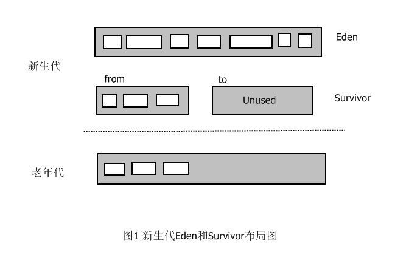

- **Eden** 

  大多数对象被直接分配在这里，但不是所有，因为大对象可能直接分配到老年代。Minior GC后Eden区几乎总是空的，

- **Survivor(一对)**

   这里存放的对象至少经历了一次Minior GC，它们在提升到老年代之前还有一次被收集的机会。Survivor分为两块，只有一块持有对象，另一块几乎为空的。

#### 3.1.1.2 Minior GC演示

灰色X标记的是需要被收集的对象。

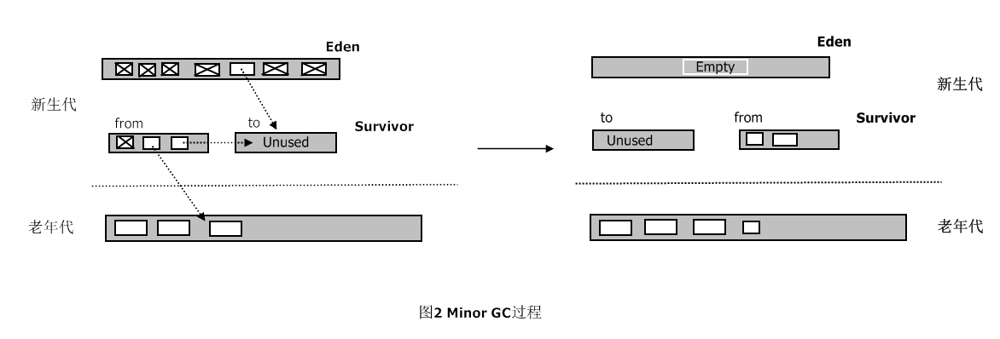

MinorGC过程中，Eden中存活的对象被复制到未使用的Survivor，被占用的Survivor中不够老的存活对象也被复制到未使用的Survivor，足够老的对象被提升到老年代，其他的对象会被收集。

MoniorGC完成后，两个Survivor交换角色，Eden完全为空，仍然有一个Survivor为空，老年代略微增长。
因为收集过程中复制对象，所以这种垃圾收集器被称为**复制垃圾收集器**。

需要注意的是，在MinorGC过程中，Survivor可能出现无法容纳从Eden和另一个Survivor复制来的对象，当Survivor中出现存活对象溢出时，多余的对象将被转移到老年代，这称为过早提升。这会导致老年代中短期存活对象的增长，可能引发严重的性能问题。在MinorGC过程中，当老年代无法容纳更多对象时，MinorGC后通常就会触发FullGC。

### 3.1.2 老年代

新生代中长期存活的对象最后会被提升或晋升到老年代。老年代的空间一般比新生代大，并且空间占用的增长速度较慢，老年代收集称为FullGC，执行效率比较低，时间较长。

垃圾收集器不需要扫描整个老年代就能识别新生代中的存活对象，从而缩短MiniorGC的时间。HotSpot通过卡表的数据结构来达到这一目的：老年代以512字节为块划分成若干张卡，卡表是个单字节数组，每个数组元素对应堆中的一张卡。每次老年代对象中某个引用新生代的字段发生变化时，HotSpot就将该卡对应的卡表元素更新为适当的值，从而将该引用字段所在的卡标记为脏。在MinorGC过程中，垃圾收集器只会在脏卡中扫描查找老年代-新生代引用。

### 3.1.3 永久代

虽然称为代，但是实际上并不算是分代层次的一部分。HotSpot VM只用它来存储元数据，例如类的数据结构、保留字符串等。

### 3.1.4 元空间

Java8中，HotSpot删除了永久代，取而代之的是元空间(MetaSpace)，同时命令行选项PermSize 和 MaxPermSize会被忽略。

#### 3.1.4.1 元空间内存分配模型

现在大多数的类元数据分配在本地化内存中。我们用来描述类的元数据的klasses已经被移除。

#### 3.1.4.2 元空间的容量

默认情况下，类元数据分配受到可用的本机内存容量的限制（容量依然取决于你使用32位JVM还是64位操作系统的虚拟内存的可用性）。
一个新的参数 (MaxMetaspaceSize)可以使用。允许你来限制用于类元数据的本地内存。如果没有特别指定，元空间将会根据应用程序在运行时的需求动态设置大小。

#### 3.1.4.3 元空间的垃圾回收

如果类元数据的空间占用达到参数“MaxMetaspaceSize”设置的值，将会触发对死亡对象和类加载器的垃圾回收。
为了限制垃圾回收的频率和延迟，适当的监控和调优元空间是非常有必要的。元空间过多的垃圾收集可能表示类，类加载器内存泄漏或对你的应用程序来说空间太小了。

#### 3.1.4.4 java堆空间的影响

一些各种各样的数据已经转移到Java堆空间。这意味着未来的JDK8升级后，您可能会发现Java堆空间的不断增加。

#### 3.1.4.5 元空间监控

元空间的使用从HotSpot 1.8开始有详细的GC日志输出。

分代垃圾收集的一大优点是：每个分代都可以依据其特性选择最适合的垃圾收集算法。新生代通常使用速度快的垃圾收集器，因为MinorGC频繁；老年代通常使用空间效率高的垃圾收集器，因为老年代占用大部分java堆，这种垃圾收集器不会很快，不过FullGC不会很频繁，所以对性能影响不大。

## 3.2 各种垃圾收集器详解

### 3.2.1 总览

存在连线的两者表示可以配合使用。

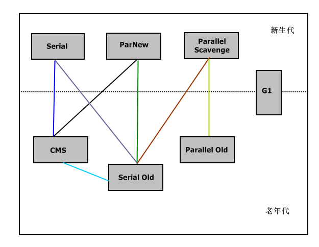

### 3.2.2 Serial收集器

#### 3.2.2.1 Serial

单线程收集器，用于新生代，采用上一章节图示中的复制算法，MonorGC以Stor-The-World(停止应用程序)方式运行，垃圾收集完毕后，才会继续执行应用程序。
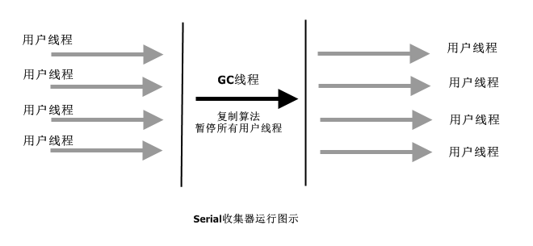

#### 3.2.2.2 Serial Old

单线程收集器，用于老年代，采用标记-压缩算法，FullGC以Stor-The-World(停止应用程序)方式运行，垃圾收集完毕后，才会继续执行应用程序。
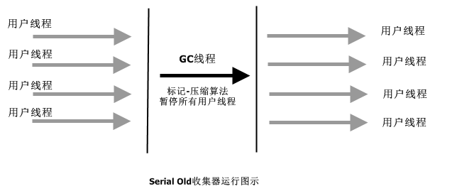

**标记-压缩算法**

首先找出老年代中存活的对象，然后将他们滑向堆的头部，从而将所有的空闲空间留在堆尾部的连续块中。这使得后面任何在老年代的分配操作都可以使用快速的指针碰撞技术。
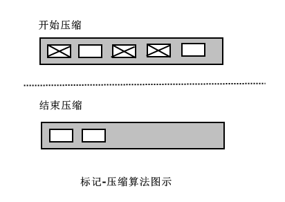

Serial适合大多数堆停顿时间要求不高和在客户端运行的应用。它虽然只使用一个线程进行垃圾收集，但是只需几百兆java堆就能管理很多重要的应用，并且在最差的情况下仍然能保持比较短的停顿(FullGC大约几秒钟)
对于限定单个cpu的环境来说，Serial由于没有线程交互的开销，可以获得最高的单线程收集效率。

### 3.2.3 Parallel收集器

#### 3.2.3.1 Parallel(ParNew)

Serial的多线程版本，用于新生代，采用复制算法。MonorGC以Stor-The-World方式运行。
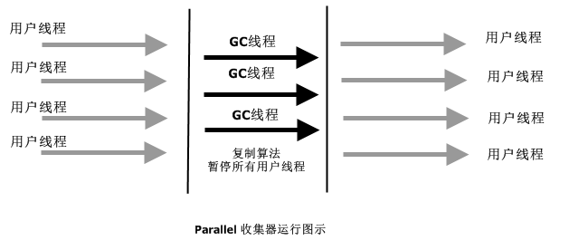

#### 3.2.3.2 Parallel Old

多线程，用于老年代，采用标记-压缩算法，FullGC以Stor-The-World方式运行。
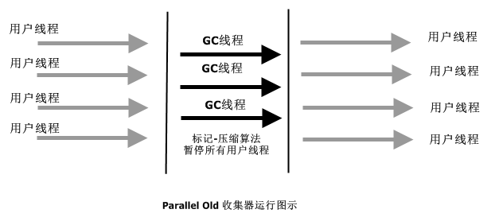

#### 3.2.3.3 Parallel Scavenge

多线程，用于新生代，采用复制算法，看上去和ParNew没有什么区别，但是它的目标是达到一个可控制的吞吐量。
$$
吞吐量 = 运行用户代码时间 / (运行用户代码时间 + 垃圾收集时间)
$$
 高吞吐量可以高效率地利用cpu时间，尽快完成运算任务，适合在后台运算而不需要太多交互的任务。

**Parallel Scavenge提供了两个命令行选项来精确控制吞吐量:**

- -XX:MaxGCPauseMillis 

  控制最大垃圾收集停顿时间。

- -XX:GCTimeRatio 

  直接设置吞吐量大小，是一个大于0小于100的整数，是垃圾收集时间占总时间的比率。默认值为99，就是允许最大1%的垃圾收集时间。

  

**Parallel Scavenge还提供提供了一个命令行选项来开启吞吐量自适应调节:**

- -XX:+UseAdaptiveSizePolicy 

  开启自适应调节，虚拟机根据系统运行状况收集性能监控信息，并自动调节优化新生代空间。

  通过 -XX:+UseParallelGC 或者 -XX:+UseParallelOldGC启用parallel收集器时会自动开启自适应调节，对多数应用而言，自适应策略都会工作的很好，如果需要关闭自适应调节，则可以通过命令行选项  -XX:-UseAdaptiveSizePolicy。

  开启  -XX:+UseParallelGC 或者 -XX:+UseParallelOldGC 时，如果关闭 -XX:-ScavengeBeforeFullGC，jvm在FullGC之前不会进行MinorGC；如果开启 -XX:+ScavengeBeforeFullGC，jvm会在FullGC之前进行一次MinorGC，分担一部分FullGC的工作，这样在两次独立的GC期间java线程有机会运行，缩短了最大的停顿时间，但是拉长了整体的停顿时间。

### 3.2.3 CMS收集器

CMS管理新生代的方式与Parallel相同，而在老年代使用并发标记清除算法，是一种以获取最短回收停顿时间为目标的垃圾收集器。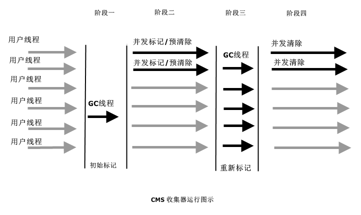

 **CMS的运行过程可以分为图示的四个阶段：**

1. 初始标记

   单线程，标记那些从外部(GC Roots)直接可达的老年代对象，以STW方式运行。

2. 并发标记/预清除

   与用户线程一起并发执行，标记所有从阶段一中被标记对象可达的存活对象，因为标记期间用户线程并发运行，可能更新了引用，所以到并发标记结束阶段，不能保证所有的存活对象都被标记。为了减少在重新标记阶段需要遍历的对象数量，并发标记结束后进行预清除，即重新遍历那些在并发标记期间被改掉的对象。

3. 重新标记

   多线程，重新遍历所有在并发标记期间有变动的对象并进行最后的标记，以STW方式运行。

4. 并发清除

   并发清除垃圾对象，清除后的区域不是连续的，HotSpot使用空闲列表来记录空闲部分，因为空闲列表的分配不如指针碰撞高效，所以老年代分配的代价提高，也使MInorGC产生额外的开销。因为当MInorGC过程中对象提升时，会在老年代中造成大量的分配。

**CMS优点**

整个垃圾回收周期内只有两次很短的停顿，整体停顿时间变短，有时可能缩短的非常客观。非常适用于需要快速响应的应用。

**CMS缺点**

1. 需要更大的java堆。

   因为在并发标记阶段，程序可能继续产生垃圾对象，这些垃圾对象可能被回收也可能不被回收，没有被回收的垃圾对象也称为浮动垃圾。

2. 缺乏压缩导致空间碎片化。

   导致无法最大程度利用所有可用的空闲空间。在回收周期中，如果在未回收到足够多的空间之前，老年代满了，那么CMS就会退而求其次，使用STW方式进行空间压缩。

3. 新生代停顿时间略微加长，吞吐量有所降低。

### 3.2.4 G1收集器

G1(Garbage-First) 收集器不再使用传统的分代布局，而是将整个java堆分成大小相等的多个独立区域(Region)。G1跟踪各个Region里面垃圾堆积的价值大小，在后台维护一个优先列表，每次根据允许的收集时间，优先回收价值最大的Region。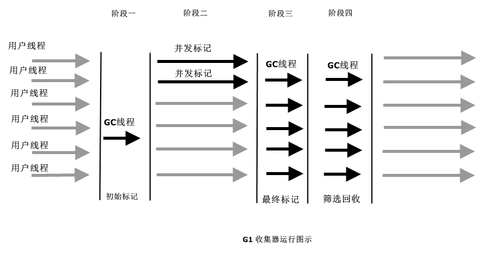

**G1的运行过程大致可以分为四个阶段**

1. 初始标记

   单线程，标记那些从外部(GC Roots)直接可达的老年代对象，以STW(Stop-The-World)方式进行。

2. 并发标记

   与用户线程一起并发执行，从GC Roots开始对堆中对象进行可达性分析，找到存活对象。

3. 最终标记

   多线程，重新遍历在并发标记阶段发生变化的对象并标记，以STW方式进行。

4. 筛选回收

   首先对各个Region的回收价值和成本进行排序，然后根据用户期望的GC时间指定回收计划，以STW方式进行。

追求低GC停顿可以尝试使用G1收集器。