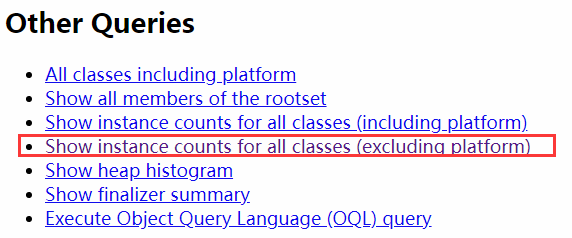
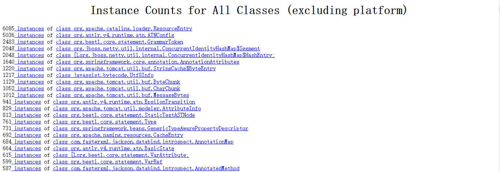
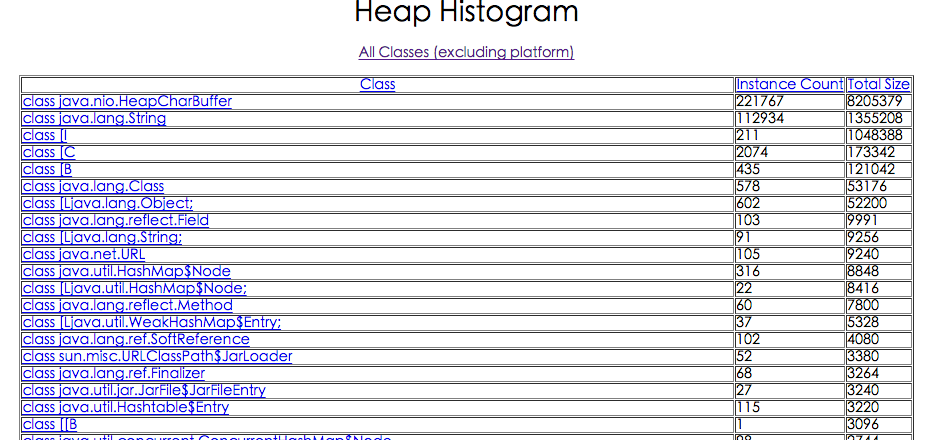

[TOC]


# 1 jps

JVM Process Status Tool，显示系统内所有的HotSpot虚拟机进程。


## 1.1 命令格式

`jps [option] [hostid]`


**option**参数

- `-l`：输出主类全名或jar路径 。
- `-q`：只输出LVMID 。
- `-m`：输出JVM启动时传递给main()的参数 。
- `-v`：输出JVM启动时显式指定的JVM参数。


其中[option]、[hostid]参数也可以不写。


## 1.2 示例

```
$ jps -l -m 
22786 org.apache.zookeeper.server.quorum.QuorumPeerMain /opt/zk/bin/../conf/zoo.cfg 
1718 com.aliyun.tianji.cloudmonitor.Application 
18664 /home/bookishBlogApp/vertx-bookish-1.0-fat.jar 
22971 sun.tools.jps.Jps -l -m
```


# 2 Jstat

jstat(JVM statistics Monitoring)是用于监视虚拟机运行时状态信息的命令，它可以显示出虚拟机进程中的类装载、内存、垃圾收集、JIT编译等运行数据。


## 2.1 命令格式

```
jstat [option] LVMID [interval] [count]
```


**参数**

- `[option]`：操作参数。
- `LVMID`：本地虚拟机进程ID。
- `[interval]`：连续输出的时间间隔。
- `[count]`：连续输出的次数。


**option 参数总览**

|      参数值      |                             说明                             |
| :--------------: | :----------------------------------------------------------: |
|      class       |                       类加载的行为统计                       |
|     compiler     |                     JIT编译器的行为统计                      |
|        gc        |                    垃圾回收中堆的行为统计                    |
|    gccapacity    | 各个垃圾回收代（新生代、老年代、永久代/元数据区）和它们相应的空间统计 |
|      gcutil      |                       垃圾回收统计概述                       |
|     gccause      | 垃圾收集统计概述（同-gcutil），附加最近两次垃圾回收事件的原因 |
|      gcnew       |                        新生代行为统计                        |
|  gcnewcapacity   |                新生代与其相应的内存空间的统计                |
|      gcold       |                    老年代和永久代行为统计                    |
|  gcoldcapacity   |                老年代与其相应的内存空间的统计                |
|  gcpermcapacity  |                永久代与其相应的内存空间的统计                |
|  gcmetacapacity  |               元数据区与其相应的内存空间的统计               |
| printcompilation |                     HotSpot编译方法统计                      |


## 2.2 示例

### 2.2.1 -class

监视类装载、卸载数量、总空间以及耗费的时间。

```
$ jstat -class 18664 
Loaded Bytes  Unloaded Bytes Time 
5065   9756.9 0        0.0   2.96
```


- `Loaded` : 加载class的数量
- `Bytes` :加载 class字节大小
- `Unloaded` : 未加载class的数量
- `Bytes` : 未加载class的字节大小
- `Time` : 加载时间


### 2.2.2 -compiler

输出JIT编译过的方法、数量、耗时等。

```
$jstat -compiler 18664 
Compiled Failed Invalid Time FailedType FailedMethod 
5914     0      0       9.56 0
```


- `Compiled` : 编译数量
- `Failed` : 编译失败数量
- `Invalid` : 无效数量
- `Time` : 编译耗时
- `FailedType` : 失败类型
- `FailedMethod` : 失败方法的全限定名


### 2.2.3 -gc

垃圾回收堆的行为统计。

```
$ jstat -gc 18664 
S0C   S1C   S0U   S1U EC     EU     OC      OU      MC      MU      CCSC   CCSU   YGC YGCT  FGC FGCT GCT 
704.0 704.0 173.4 0.0 5824.0 4523.7 14332.0 13111.4 32128.0 31190.5 3712.0 3524.6 200 0.451 6 0.151 0.601
```

C即Capacity 总容量，U即Used 已使用的容量

- `S0C` : survivor0区的总容量
- `S1C` : survivor1区的总容量
- `S0U` : survivor0区已使用的容量
- `S1C` : survivor1区已使用的容量
- `EC` : Eden区的总容量
- `EU` : Eden区已使用的容量
- `OC` : Old区的总容量
- `OU` : Old区已使用的容量
- `PC` 当前永久代的容量 (KB)
- `PU` 永久代已使用的容量 (KB)
- `MC` 当前元数据区的容量 (KB)
- `MU` 元数据区已使用的容量 (KB)
- `YGC` : 新生代垃圾回收次数
- `YGCT` : 新生代垃圾回收时间
- `FGC` : 老年代垃圾回收次数
- `FGCT` : 老年代垃圾回收时间
- `GCT` : 垃圾回收总消耗时间


### 2.2.4 -gccapacity

同-gc，不过还会输出Java堆各区域使用到的最大、最小空间。

```
$ jstat -gccapacity 18664 
NGCMN   NGCMX    NGC    S0C   S1C   EC     OGCMN   OGCMX    OGC     OC      MCMN MCMX      MC      CCSMN CCSMX     CCSC   YGC FGC 
5440.0  85312.0  7232.0 704.0 704.0 5824.0 10944.0 170688.0 14332.0 14332.0 0.0  1077248.0 32128.0 0.0   1048576.0 3712.0 200 6
```


- `NGCMN`: 新生代占用的最小空间
- `NGCMX` : 新生代占用的最大空间
- `NGC` : 当前新生代的容量
- `OGCMN` : 老年代占用的最小空间
- `OGCMX` : 老年代占用的最大空间
- `OGC`：当前年老代的容量 (KB)
- `OC`：当前年老代的空间 (KB)
- `PGCMN` : 永久代占用的最小空间
- `PGCMX` : 永久代占用的最大空间
- `MCMN` : 元数据区占用的最小空间
- `MCMX` : 元数据区占用的最大空间


### 2.2.5 -gcutil

同-gc，不过输出的是已使用空间占总空间的百分比。

```
$ jstat -gcutil 18664 
S0     S1    E      O      M      CCS    YGC  YGCT   FGC  FGCT   GCT 
24.63  0.00  85.44  91.48  97.08  94.95  200  0.451  6    0.151  0.601
```


### 2.2.6 -gccause

垃圾收集统计概述（同-gcutil），附加最近两次垃圾回收事件的原因。

```
$ jstat -gccause 18664 
S0     S1    E      O      M      CCS    YGC  YGCT   FGC  FGCT   GCT    LGCC                GCC 
24.63  0.00  86.71  91.48  97.08  94.95  200  0.451  6    0.151  0.601  Allocation Failure  No GC
```


- `LGCC`：最近垃圾回收的原因
- `GCC`：当前垃圾回收的原因


### 2.2.7 -gcnew

统计新生代的行为。

```
$ jstat -gcnew 18664 
S0C    S1C    S0U    S1U  TT  MTT  DSS    EC      EU      YGC  YGCT 
704.0  704.0  173.4  0.0  15  15   352.0  5824.0  5225.8  200  0.451
```


- `TT`：Tenuring threshold(提升阈值)
- `MTT`：最大的tenuring threshold
- `DSS`：survivor区域大小 (KB)


### 2.2.8 -gcnewcapacity

新生代与其相应的内存空间的统计。

```
$ jstat -gcnewcapacity 18664 
NGCMN   NGCMX    NGC     S0CMX   S0C    S1CMX   S1C    ECMX     EC      YGC  FGC 
5440.0  85312.0  7232.0  8512.0  704.0  8512.0  704.0  68288.0  5824.0  200  6
```


- `NGC`:当前年轻代的容量 (KB)
- `S0CMX`:最大的S0空间 (KB)
- `S0C`:当前S0空间 (KB)
- `ECMX`:最大eden空间 (KB)
- `EC`:当前eden空间 (KB)


### 2.2.9 -gcold

统计老年代的行为。

```
$ jstat -gcold 18664 
MC      MU      CCSC   CCSU   OC      OU      YGC  FGC  FGCT   GCT 
32128.0 31190.5 3712.0 3524.6 14332.0 13111.4 200  6    0.151  0.601
```


### 2.2.10 -gcoldcapacity

统计老年代的大小和空间。

```
$ jstat -gcoldcapacity 18664 
OGCMN   OGCMX    OGC     OC      YGC FGC FGCT  GCT 
10944.0 170688.0 14332.0 14332.0 200 6   0.151 0.601
```


### 2.2.11 -gcpermcapacity

永久代行为统计。

```
$ jstat -gcpermcapacity 28920 
 PGCMN      PGCMX       PGC         PC            YGC   FGC    FGCT     GCT   
 1048576.0  2097152.0   1048576.0   1048576.0     4     0      0.000    0.242
```


### 2.2.12 -gcmetacapacity

元数据区行为统计。

```
$ jstat -gcmetacapacity 18664 
MCMN MCMX      MC      CCSMN CCSMX     CCSC   YGC FGC FGCT   GCT 
0.0  1077248.0 32128.0 0.0   1048576.0 3712.0 200 6   0.151  0.601
```


### 2.2.13 -printcompilation

hotspot编译方法统计。

```
$ jstat -printcompilation 18664 
Compiled Size Type Method 
5914     16   1    com/mongodb/connection/RequestMessage$EncodingMetadata <init>
```


- `Compiled`：被执行的编译任务的数量
- `Size`：方法字节码的字节数
- `Type`：编译类型
- `Method`：编译方法的类名和方法名。类名使用”/” 代替 “.” 作为空间分隔符。方法名是给出类的方法名，格式是一致于HotSpot – XX:+PrintComplation 选项。


# 3 jmap

jmap(JVM Memory Map)命令用于生成heap dump文件，如果不使用这个命令，还可以使用`-XX:+HeapDumpOnOutOfMemoryError`参数来让虚拟机出现OOM的时候自动生成dump文件。 jmap不仅能生成dump文件，还可以查询finalize执行队列、Java堆和永久代的详细信息，如当前使用率、当前使用的是哪种收集器等。


## 3.1 命令格式

```
jmap [option] LVMID
```


**option参数**

- `dump` : 生成堆转储快照 
- `finalizerinfo` : 显示在F-Queue队列等待Finalizer线程执行finalizer方法的对象 
- `heap` : 显示Java堆详细信息 
- `histo` : 显示堆中对象的统计信息 
- `permstat` : to print permanent generation statistics 
- `F` : 当-dump没有响应时，强制生成dump快照


## 3.2 示例

### 3.2.1 -dump

常用格式`-dump::live,format=b,file= pid`
dump堆到文件，format指定输出格式，live指明是活着的对象，file指定文件名

```
$ jmap -dump:live,format=b,file=dump.hprof 28920 
Dumping heap to /home/xxx/dump.hprof ... 
Heap dump file created 
dump.hprof这个后缀是为了后续可以直接用MAT(Memory Anlysis Tool)打开
```


:bulb: 可以使用 **<a href="http://www.eclipse.org/mat/downloads.php" target="_blank">Eclipse Memory Analyzer</a>** 工具分析堆转储文件，非常非常非常好用！


### 3.2.2 -finalizerinfo

打印等待回收对象的信息。

```
$ jmap -finalizerinfo 18664 
Attaching to process ID 18664, please wait... 
Debugger attached successfully. 
Server compiler detected. 
JVM version is 25.144-b01 
Number of objects pending for finalization: 0
```

可以看到当前F-QUEUE队列中并没有等待Finalizer线程执行finalizer方法的对象


### 3.2.3 -heap

打印heap的概要信息、GC使用的算法、heap的配置及wise heap的使用情况。可以用此来判断内存目前的使用情况以及垃圾回收情况。

```
$ jmap -heap 18664 
Attaching to process ID 18664, please wait... 
Debugger attached successfully. 
Server compiler detected. 
JVM version is 25.144-b01 

using thread-local object allocation. 
Mark Sweep Compact GC	                //标记压缩GC算法 

Heap Configuration: 
MinHeapFreeRatio = 40	                //对应jvm启动参数-XX:MinHeapFreeRatio设置JVM堆最小空闲比率(default 40) 
MaxHeapFreeRatio = 70	                //对应jvm启动参数 -XX:MaxHeapFreeRatio设置JVM堆最大空闲比率(default 70) 
MaxHeapSize = 262144000 (250.0MB)	//对应jvm启动参数-XX:MaxHeapSize=设置JVM堆的最大大小 
NewSize = 5570560 (5.3125MB)	        //对应jvm启动参数-XX:NewSize=设置JVM堆的‘新生代’的默认大小 
MaxNewSize = 87359488 (83.3125MB)	//对应jvm启动参数-XX:MaxNewSize=设置JVM堆的‘新生代’的最大大小 
OldSize = 11206656 (10.6875MB)	        //对应jvm启动参数-XX:OldSize=<value>:设置JVM堆的‘老年代’的大小 
NewRatio = 2	                        //对应jvm启动参数-XX:NewRatio=:‘新生代’和‘老年代’的大小比率 
SurvivorRatio = 8	                //对应jvm启动参数-XX:SurvivorRatio=设置年轻代中Eden区与Survivor区的大小比值 
MetaspaceSize = 21807104 (20.796875MB)	//对应jvm启动参数-XX:MetaspaceSize=<value>:设置JVM堆的‘元数据区’的初始大小 
CompressedClassSpaceSize = 1073741824 (1024.0MB)	
MaxMetaspaceSize = 17592186044415 MB	//对应jvm启动参数-XX:MetaspaceSize=<value>:设置JVM堆的‘元数据区’的最大大小 
G1HeapRegionSize = 0 (0.0MB)	        //G1垃圾收集器每个Region区的大小 

Heap Usage: 
New Generation (Eden + 1 Survivor Space): 
capacity = 6815744 (6.5MB) 
used = 279696 (0.2667388916015625MB) 
free = 6536048 (6.2332611083984375MB) 
4.103675255408654% used 
Eden Space: 
capacity = 6094848 (5.8125MB) 
used = 279696 (0.2667388916015625MB) 
free = 5815152 (5.5457611083984375MB) 
4.589056199596774% used 
From Space: 
capacity = 720896 (0.6875MB) 
used = 0 (0.0MB) 
free = 720896 (0.6875MB) 
0.0% used 
To Space: 
capacity = 720896 (0.6875MB) 
used = 0 (0.0MB) 
free = 720896 (0.6875MB) 
0.0% used 
tenured generation: 
capacity = 14675968 (13.99609375MB) 
used = 6804304 (6.4890899658203125MB) 
free = 7871664 (7.5070037841796875MB) 
46.36357887943065% used 

8522 interned Strings occupying 779072 bytes.
```

可以很清楚的看到Java堆中各个区域目前的情况。


### 3.2.4 -histo

打印堆的对象统计，包括对象数、内存大小等等 （因为在dump:live前会进行full gc，如果带上live则只统计活对象，因此不加live的堆大小要大于加live堆的大小 ）

```
$ jmap -histo:live 18664 | more 

num #instances #bytes class name 
---------------------------------------------- 
1: 19123 1458752 [C 
2: 1639 746888 [B 
3: 5430 604224 java.lang.Class 
4: 19017 456408 java.lang.String 
5: 4056 385696 [Ljava.lang.Object; 
6: 8636 276352 java.util.concurrent.ConcurrentHashMap$Node 
7: 2749 145248 [I 
8: 3436 137440 java.util.LinkedHashMap$Entry 
9: 1256 110528 java.lang.reflect.Method 
10: 29 106976 [Ljava.nio.ByteBuffer; 
11: 3274 104768 java.util.HashMap$Node 
12: 6471 103536 java.lang.Object 
13: 814 90656 [Ljava.util.HashMap$Node; 
14: 81 89984 [Ljava.util.concurrent.ConcurrentHashMap$Node; 
15: 78 51168 io.netty.util.internal.shaded.org.jctools.queues.Mps
```

class name是对象类型，说明如下：

- `B` ：byte
- `C` ：char
- `D` ：double
- `F` ：float
- `I` ：int
- `J` ：long
- `Z` ：boolean
- `[` ：数组，如[I表示int[]
- `[L+类名` ：其他对象


### 3.2.5 -permstat

打印Java堆内存的永久保存区域的类加载器的智能统计信息。

对于每个类加载器而言，它的名称、活跃度、地址、父类加载器、它所加载的类的数量和大小都会被打印。此外，包含的字符串数量和大小也会被打印。

```
$ jmap -permstat 28920 
  Attaching to process ID 28920, please wait... 
  Debugger attached successfully. 
  Server compiler detected. 
  JVM version is 24.71-b01 
  finding class loader instances ..done. 
  computing per loader stat ..done. 
  please wait.. computing liveness.liveness analysis may be inaccurate ... 
  
  class_loader            classes bytes   parent_loader           alive?  type  
  <bootstrap>             3111    18154296          null          live    <internal> 
  0x0000000600905cf8      1       1888    0x0000000600087f08      dead    sun/reflect/DelegatingClassLoader@0x00000007800500a0 
  0x00000006008fcb48      1       1888    0x0000000600087f08      dead    sun/reflect/DelegatingClassLoader@0x00000007800500a0 
  0x00000006016db798      0       0       0x00000006008d3fc0      dead    java/util/ResourceBundle$RBClassLoader@0x0000000780626ec0 
  0x00000006008d6810      1       3056      null          dead    sun/reflect/DelegatingClassLoader@0x00000007800500a0
```


### 3.2.6 -F

强制模式。

如果指定的pid没有响应，请使用jmap -dump或jmap -histo选项。此模式下，不支持live子选项。


# 4 jhat

jhat(JVM Heap Analysis Tool)命令是与jmap搭配使用，用来分析jmap生成的dump，jhat内置了一个微型的HTTP/HTML服务器，生成dump的分析结果后，可以在浏览器中查看。

在此要注意，一般不会直接在服务器上进行分析，因为jhat是一个耗时并且耗费硬件资源的过程，一般把服务器生成的dump文件复制到本地或其他机器上进行分析。


## 4.1 命令格式

```
jhat [dumpfile]
```


**参数**

- `-stack` ：false|true ，关闭对象分配调用栈跟踪(tracking object allocation call stack)。 如果分配位置信息在堆转储中不可用，则必须将此标志设置为 false，默认值为 true。
- `-refs`： false|true ，关闭对象引用跟踪(tracking of references to objects)。默认值为 true，默认情况下, 返回的指针是指向其他特定对象的对象，如反向链接或输入引用(referrers or incoming references)，会统计计算堆中的所有对象。
- `-port` ：port-number，设置 jhat HTTP server 的端口号。默认值 7000。
- `-exclude` ：exclude-file，指定对象查询时需要排除的数据成员列表文件。例如，如果文件列列出java.lang.String.value , 那么当从某个特定对象 Object o 计算可达的对象列表时, 引用路径涉及 java.lang.String.value 的都会被排除。
- `-baseline` ：exclude-file，指定一个基准堆转储(baseline heap dump)。在两个 heap dumps 中有相同 object ID 的对象会被标记为不是新的(marked as not being new)，其他对象被标记为新的(new)，在比较两个不同的堆转储时很有用。
- `-debug` ：int，设置 debug 级别. 0 表示不输出调试信息。 值越大则表示输出更详细的 debug 信息。
- `-version` ：启动后只显示版本信息就退出。
- `-J< flag >` ：因为 jhat 命令实际上会启动一个JVM来执行，通过 -J 可以在启动JVM时传入一些启动参数。
  例如： -J-Xmx512m 则指定运行 jhat 的Java虚拟机使用的最大堆内存为 512 MB，如果需要使用多个JVM启动参数，则传入多个 -Jxxxxxx。


## 4.2 示例

```
$ jhat -J-Xmx512m dump.hprof 
Reading from dump.hprof... 
Dump file created Fri Feb 23 13:40:54 CST 2018 
Snapshot read, resolving... 
Resolving 110430 objects... 
Chasing references, expect 22 dots...................... 
Eliminating duplicate references...................... 
Snapshot resolved. 
Started HTTP server on port 7000 
Server is ready.
```

中间的`-J-Xmx512m`是在dump快照很大的情况下分配512M内存去启动HTTP服务器，运行完之后就可在浏览器打开Http://localhost:7000进行快照分析，堆快照分析主要在最后面的Heap Histogram里，里面根据class列出了dump的时候所有存活对象。

打开浏览器Http://localhost:7000，该页面提供了几个查询功能可供使用：



一般查看堆异常情况主要看这个两个部分： Show instance counts for all classes (excluding platform)，平台外的所有对象信息。如下图：



Show heap histogram 以树状图形式展示堆情况。如下图：



具体排查时需要结合代码，观察是否大量应该被回收的对象在一直被引用或者是否有占用内存特别大的对象无法被回收。
一般情况，会down到客户端用工具来分析。


# 5 jstack

jstack用于生成java虚拟机当前时刻的线程快照。

线程快照是当前java虚拟机内每一条线程正在执行的方法堆栈的集合，生成线程快照的主要目的是定位线程出现长时间停顿的原因，如线程间死锁、死循环、请求外部资源导致的长时间等待等。 

线程出现停顿的时候通过jstack来查看各个线程的调用堆栈，就可以知道没有响应的线程到底在后台做什么事情，或者等待什么资源。 如果java程序崩溃生成core文件，jstack工具可以用来获得core文件的java stack和native stack的信息，从而可以轻松地知道java程序是如何崩溃和在程序何处发生问题。另外，jstack工具还可以附属到正在运行的java程序中，看到当时运行的java程序的java stack和native stack的信息，如果现在运行的java程序呈现hung的状态，jstack是非常有用的。


## 5.1 命令格式

```
jstack [option] LVMID
```


**option参数**

- `-F` : 当正常输出请求不被响应时，强制输出线程堆栈 
- `-l` : 除堆栈外，显示关于锁的附加信息 
- `-m` : 如果调用到本地方法的话，可以显示C/C++的堆栈


## 5.2 示例

```
$ jstack -l 18664 
2018-02-23 14:20:45 
Full thread dump Java HotSpot(TM) 64-Bit Server VM (25.144-b01 mixed mode): 

"Thread-55" #212 daemon prio=5 os_prio=0 tid=0x00007f68e079f800 nid=0x5fab waiting on condition [0x00007f68d93da000] 
java.lang.Thread.State: TIMED_WAITING (parking) 
at sun.misc.Unsafe.park(Native Method) 
- parking to wait for <0x00000000f5bbda88> (a java.util.concurrent.SynchronousQueue$TransferStack) 
at java.util.concurrent.locks.LockSupport.parkNanos(LockSupport.java:215) 
at java.util.concurrent.SynchronousQueue$TransferStack.awaitFulfill(SynchronousQueue.java:460) 
at java.util.concurrent.SynchronousQueue$TransferStack.transfer(SynchronousQueue.java:362) 
at java.util.concurrent.SynchronousQueue.poll(SynchronousQueue.java:941) 
at java.util.concurrent.ThreadPoolExecutor.getTask(ThreadPoolExecutor.java:1073) 
at java.util.concurrent.ThreadPoolExecutor.runWorker(ThreadPoolExecutor.java:1134) 
at java.util.concurrent.ThreadPoolExecutor$Worker.run(ThreadPoolExecutor.java:624) 
at java.lang.Thread.run(Thread.java:748) 

Locked ownable synchronizers: 
- None 
......
```

关于jstack输出的分析，跳转这里：http://www.hollischuang.com/archives/110 ，写的非常棒。


# 6 jinfo

jinfo(JVM Configuration info)这个命令作用是实时查看和调整虚拟机运行参数。 之前的jps -v口令只能查看到显示指定的参数，如果想要查看未被显示指定的参数的值就要使用jinfo口令


## 6.1 命令格式

```
jinfo [option] [args] LVMID
```


**option参数**

- `-flag` : 输出指定args参数的值 
- `-flags` : 不需要args参数，输出所有JVM参数的值 
- `-sysprops` : 输出系统属性，等同于System.getProperties()


## 6.2 示例

```
$ jinfo -flags 18664 
Attaching to process ID 18664, please wait... 
Debugger attached successfully. 
Server compiler detected. 
JVM version is 25.144-b01 
Non-default VM flags: -XX:CICompilerCount=2 -XX:InitialHeapSize=16777216 -XX:MaxHeapSize=262144000 -XX:MaxNewSize=87359488 -XX:MinHeapDeltaBytes=196608 -XX:NewSize=5570560 -XX:OldSize=11206656 -XX:+PrintGC -XX:+PrintGCDetails -XX:+PrintGCTimeStamps -XX:+UseCompressedClassPointers -XX:+UseCompressedOops 
Command line: -XX:+PrintGCTimeStamps -XX:+PrintGCDetails -Xloggc:/home/bookishBlogApp/gc.log
```

