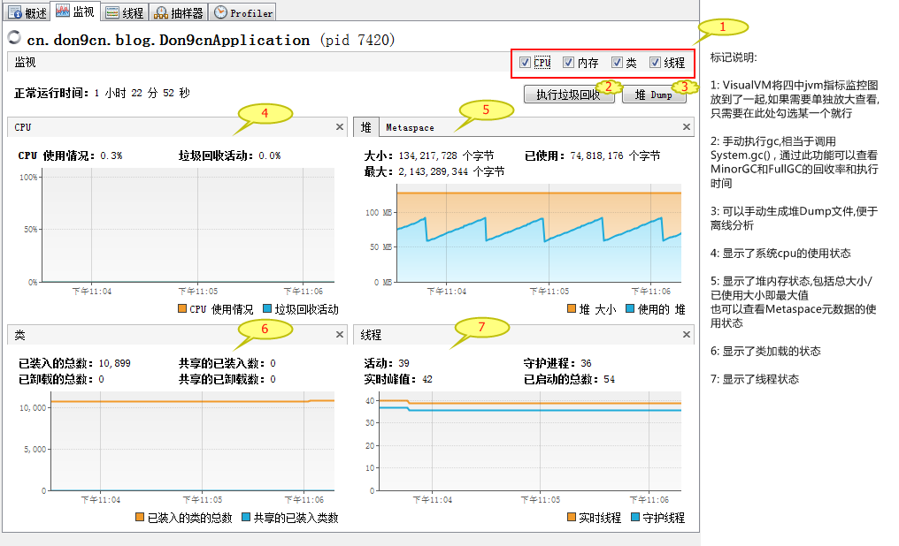

[TOC]


# 1 理解GC日志

HotSpot VM可以将每次GC的数据直接输出成日志，可以以文本方式查看GC统计数据，或者用GUI监控工具查看。


## 1.1 重要的垃圾收集数据

1. 当前使用的垃圾收集器。
2. Java堆的大小。
3. 新生代和老年代的大小。
4. 永久代的大小。
5. MinorGC的持续时间。
6. MinorGC的频率。
7. MinorGC的空间回收量。
8. FullGC的持续时间。
9. FullGC的频率。
10. 每个并发垃圾收集周期内的空间回收量。
11. 垃圾收集前后java堆的占用量。
12. 垃圾收集前后新生代和老年代的占用量。
13. 垃圾收集前后永久代的占用量。
14. 是否老年代或者永久代的占用触发了FullGC。
15. 应用是否显式调用了System.gc()。


## 1.2 开启GC日志输出

开启 `–XX:+PrintGCDetails` 可以打印出GC日志，默认是打印在console控制台。
使用 `–Xloggc:filename` 可以将GC日志直接输出到文件，filename为目标文件名称。
使用 `–XX:+PrintGCTimeStamps` 可以在GC日志中输出自jvm启动依赖到垃圾收集之间流逝的秒数，可以通过这个时间戳来统计GC频率。
使用 `–XX:+PrintGCDateStamps` 可以在GC日志中输出标准格式的年月日时分秒形式的时间戳，也可以根据此时间戳来统计GC频率。


## 1.3 MinorGC日志

为了便于注释说明，将日志作了分行处理 。

**原始日志**

```
1:	76.282: 
2: 	[GC (Allocation Failure) 
3:		[PSYoungGen: 554568K->35404K(573440K)] 
4:		610676K->93743K(641024K), 0.0260886 secs] 
5:		[Times: user=0.06 sys=0.01, real=0.03 secs]
```


**日志说明**

- 第1行

  开启了–XX:+PrintGCTimeStamps后的时间戳。

- 第2行

  `GC`表示是MinorGC。

- 第3行

  `PSYoungGen`表示新生代使用的是Parallel Scavenge收集器。(如果是`ParNew`，表示使用的是Parallel收集器； 如果是`DefNew`，表示使用的是Serial收集器)
  “->”左侧`554568K`是垃圾收集前新生代的占用量，右侧`35404K`是垃圾收集后新生代的占用量，因为MinorGC后Eden为空，所以`35404K`也代表GC后被占用的那一块Survivor的占用量。
  括号中的`573440K`是Eden和一块被占用的Survivor的和。

- 第4行

  “->”左侧`610676K`是垃圾收集前java堆的占用量，右侧`93743K`是垃圾收集后java堆的占用量。
  括号中的`641024K`是java堆的总量。
  `0.0260886 secs`是执行垃圾回收花费的时间。

- 第5行

  `user`是垃圾收集执行非操作系统调用指令所耗费的cpu时间。
  `sys`是垃圾收集执行操作系统调用指令所耗费的cpu时间。
  `real`是垃圾收集的实际时间。


## 1.4 FullGC日志

为了便于注释说明，将日志作了分行处理。

**原始日志:** 

```
1:	2784.826: 
2:		[Full GC (System.gc()) 
3:			[PSYoungGen: 672K->0K(558080K)] 
4:			[ParOldGen: 44257K->38446K(90112K)] 
5:			44929K->38446K(648192K), 
6:			[Metaspace: 61626K->61360K(1103872K)], 0.2257245 secs] 
7:			[Times: user=0.84 sys=0.00, real=0.23 secs]
```


**日志说明**

- 第1行

  开启了–XX:+PrintGCTimeStamps后的时间戳。

- 第2行

  `Full GC`,直接标明了GC类型`(System.gc())` 表示是通过程序中显式调用System.gc()触发的FullGC，如果是由jvm自动触发，则没有此参数。

- 第3行

  和上面MinorGC中的含义相同，不再赘述。

- 第4行

  `ParOldGen`说明老年代使用了Parallel Old收集器。
  “->”左侧`44257K`是垃圾回收前老年代的使用量，右侧38446K是垃圾收集后老年代的使用量。
  括号中的`90112K`是老年代的大小。

- 第5行

  `44929K->38446K(648192K)`是java堆的使用情况，同MinorGC中含义相同，不在赘述。

- 第6行

- `Metaspace`表示元数据区，此日志是java8的jvm生成，因为java8中HotSpot删除了永久代，取而代之的是元数据区。
  “->”左侧的`61626K`是垃圾收集前元数据区的使用量，右侧的`61360K`是垃圾收集后元数据区的使用量。
  括号中的`1103872K`是元数据区大小。
  `0.2257245 secs`是此次FullGC花费的时间。

- 第7行

  含义和MinorGC中相同，不再赘述。


FullGC中值得关注的是垃圾收集之前老年代和元数据区的占用量，因为当两者的占用接近其容量时，都会触发FullFC。


## 1.5 CMS老年代GC日志

当 `–XX:+UseConcMarkSweepGC` 使用CMS收集器时，会自动开启 `–XX:+UserParNewGC`。CMS在老年代的GC日志与上面的FullGC日志有很大的不同.


**原始日志:** 

```
1:	7.879: [GC (CMS Initial Mark) [1 CMS-initial-mark: 37262K(87424K)] 42307K(126720K), 0.0009025 secs] 
                [Times: user=0.00 sys=0.00, real=0.00 secs] 
2:	7.880: [CMS-concurrent-mark-start]
3:	7.905: [CMS-concurrent-mark: 0.023/0.025 secs] [Times: user=0.06 sys=0.00, real=0.02 secs] 
4:	7.905: [CMS-concurrent-preclean-start]
5:	7.905: [CMS-concurrent-preclean: 0.001/0.001 secs] [Times: user=0.00 sys=0.00, real=0.00 secs] 
6:	7.905: [CMS-concurrent-abortable-preclean-start]
7:	7.986: [GC (Allocation Failure) 7.986: [ParNew: 38926K->4352K(39296K), 0.0067288 secs] 76189K->43991K(126720K), 0.0067888 secs] 
                [Times: user=0.00 sys=0.00, real=0.01 secs] 
8:	8.102: [GC (Allocation Failure) 8.102: [ParNew8.120: [CMS-concurrent-abortable-preclean: 0.034/0.214 secs] 
                [Times: user=0.33 sys=0.02, real=0.22 secs] 
	: 39296K->876K(39296K), 0.0335647 secs] 78935K->40751K(126720K), 0.0336238 secs] [Times: user=0.13 sys=0.00, real=0.03 secs] 
9:	8.136: [GC (CMS Final Remark) [YG occupancy: 1569 K (39296 K)]8.136: [Rescan (parallel) , 0.0026637 secs]
        8.139: [weak refs processing, 0.0004099 secs]
        8.139: [class unloading, 0.0049642 secs]
        8.144: [scrub symbol table, 0.0053784 secs]
        8.149: [scrub string table, 0.0006631 secs][1 CMS-remark: 39874K(87424K)] 41443K(126720K), 0.0144267 secs] 
                [Times: user=0.02 sys=0.00, real=0.01 secs] 
10:	8.150: [CMS-concurrent-sweep-start]
11:	8.161: [CMS-concurrent-sweep: 0.010/0.011 secs] [Times: user=0.03 sys=0.02, real=0.01 secs] 
12:	8.161: [CMS-concurrent-reset-start]
13:	8.162: [CMS-concurrent-reset: 0.001/0.001 secs] [Times: user=0.00 sys=0.00, real=0.00 secs]
```


**日志说明:**

- 第1行
  `CMS Initial Mark`说明开始初始标记，此时会停顿所有java线程， `37262K`是当前java堆的使用量， `87424K`是java堆的总量，因为这段gc日志是在我的程序启动过程中的，所以看到后面还有`42307K(126720K)`，说明在启动过程中，java堆内存在扩大。
- 第2行
  开始并发标记，此时是和java线程并发执行。
- 第3行
  显式了并发标记的时间。
- 第4行
  开始并发预清除，也就是对并发标记阶段发生引用变化的对象进行重新标记。
- 第5行
  显式了并发预清除的执行时间。
- 第6行
  开始终止并发预清除。
- 第7行
  这是一次MinorGC日志，这也说明了在CMS并发阶段，也可能会进行MinorGC，此处的`76189K->43991K(126720K)`可以看出在CMS并发清除前，这次MonorGC后，java堆的使用量为43991K。
- 第8行
  终止并发预清除，此时依然穿插了一次MinorGC。
- 第9行
  进行最后标记， `CMS-remark: 39874K(87424K)] 41443K(126720K)`中可以看出当前java堆总量为126720K，使用量为41443K。
- 第10行
  开始并发清除。
- 第11行
  显式并发清除执行时间。
- 第12行
  重置并发，表示一个CMS清除周期完毕。


注意CMS并发清除开始和结束时的MinorGC，如果java堆的占用几乎没有怎么降低，很少有对象被回收，说明该轮CMS垃圾收集周期几乎没有找到垃圾对象而只是在浪费cpu，或者对象以不小于CMS并行清除垃圾对象的速度被提升到老年代。这两种情况都说明jvm需要调优，具体的调优请看后面专门的章节，此章节主要讲解如何理解GC日志。


如果对象提升到老年代的速度太快，而CMS收集器不能保持足够多的可用空间时，就会导致老年代的运行空间不足，这成为并发模式失败。当老年代碎片化达到某种程度，使得没有足够空间容纳新提升的对象时，也会引发并发模式失败。
当出现并发模式失败时，CMS的GC日志会有”**concurrent mode failure**”。发生并发模式失败时，老年代将以STW的方式进行垃圾收集，并且整理压缩碎片。


**作为一般性准则，并发垃圾收集的开销应该小于10%，也有可能达到1-3%。**


## 1.6 补充

使用 `–XX:+PrintGCApplicationConcurrentTime` 和 `–XX:+PrintGCApplicationStoppedTime`，jvm可以报告应用在安全点操作之间的运行时间，以及阻塞java线程的时间。
利用这俩个选项观察安全点操作有助于理解和量化延迟对jvm的影响，也可以用来辨别jvm安全点操作还是应用程序引入的延迟。

一段日志示例: 

```
8.752: Application time: 0.1273273 seconds    //此处延迟由MinorGC造成
8.752: [GC (Allocation Failure) 8.752: [ParNew: 38435K->433K(39296K), 0.0020703 secs] 73597K->35763K(126720K), 0.0021173 secs] 
        [Times: user=0.00 sys=0.00, real=0.00 secs] 
8.754: Total time for which application threads were stopped: 0.0022436 seconds, Stopping threads took: 0.0000156 seconds    
8.754: Application time: 0.0001583 seconds    //此处延迟由应用本身引入
8.754: Total time for which application threads were stopped: 0.0001487 seconds, Stopping threads took: 0.0000837 seconds
```

通过命令行选项 `-XX:+DisableExplicitGC` 可以禁用System.gc()。


# 2 JConsole

JConsole是一款随jdk发布的图形化jvm监控工具。


## 2.1 启动

在jdk安装目录的bin目录中可以找到jconsole，如下图：


在windows操作系统中，可以直接双击打开，也可以通过命令行打开。


## 2.2 连接jvm应用

我们选择上图中pid为7420的应用，点击连接。


## 2.3 连接成功


## 2.4 内存监控


补充：监控时可以留意一下Survivor是否长时间处于满状态，如果是，说明Survivor已经溢出，对象在老化之前就被提升到老年代，对新生代调优可以解决该问题。


## 2.5 线程监控 


## 2.6 类加载监控


## 2.7 VM概要


以文本形式显式当前时间jvm中各项监控指标的数据 


## 2.8 MBean监控

此界面列出了所有MBean，可以点击相应的MBean查看属性状态 。


# 3 VisualVM

VisualVM也是一款随jdk发布的图形化监测工具。


## 3.1 启动

在jdk安装目录的bin目录中,可以找到jvisualvm,如下图:

在windows操作系统中,可以直接双击运行,也可以通过命令行运行


## 3.2 概述

应用打开后，自动进入概述页面，此页面以文本形式列出了当前应用的一些基础信息。


## 3.3 监控


VisualVM默认将四个jvm监控指标放在了一起，每个指标的监控图与JConsole相比，没有JConsole数据详细，但是图形化要比JConsole更加直观。


## 3.4 线程详情监测


VisualVM通过不同的颜色标记线程状态，相比JConsole，更加直观，但是却没有了JConsole中的堆栈追踪信息，在分析线程等待原因及死锁上不如JConsole。


## 3.5 抽样器

可以随时对cpu和内存进行抽样，后期出现问题时可以通过对不同时间点的抽样数据来查找原因。


## 3.6 性能分析

可以对当前cpu和内存的状态进行性能分析。


# 4 jatack

快速定位java应用中的锁竞争，常用的技巧是用jdk的jatack抓取线程转储信息，监控锁竞争。


**jatack命令格式**

```
jstack [ option ] pid 
jstack [ option ] executable core 
jstack [ option ] [server-id@]remote-hostname-or-IP
```


**常用参数说明** 

- options
  `executable` Java executable from which the core dump was produced.(可能是产生core dump的java可执行程序)
  `core` 将被打印信息的core dump文件
  `remote-hostname-or-IP` 远程debug服务的主机名或ip
  `server-id` 唯一id,假如一台主机上多个远程debug服务

- 基本参数
  `-F` 当’jstack [-l] pid’没有相应的时候强制打印栈信息。
  `-l` 长列表。打印关于锁的附加信息，例如属于java.util.concurrent的ownable synchronizers列表。
  `-m  ` 打印java和native c/c++框架的所有栈信息，可以打印JVM的堆栈。
  `-h | -help` 打印帮助信息。
  `pid` 需要被打印配置信息的java进程id，可以用jps查询。


**抓取日志示例** 

```
"http-nio-8080-ClientPoller-0" #52 daemon prio=5 os_prio=0 tid=0x000000005f164000 nid=0x13a0 runnable [0x0000000061cee000]
   java.lang.Thread.State: RUNNABLE
        at sun.nio.ch.WindowsSelectorImpl$SubSelector.poll0(Native Method)
        at sun.nio.ch.WindowsSelectorImpl$SubSelector.poll(WindowsSelectorImpl.java:296)
        at sun.nio.ch.WindowsSelectorImpl$SubSelector.access$400(WindowsSelectorImpl.java:278)
        at sun.nio.ch.WindowsSelectorImpl.doSelect(WindowsSelectorImpl.java:159)
        at sun.nio.ch.SelectorImpl.lockAndDoSelect(SelectorImpl.java:86)
        - locked <0x00000000ad3b1d38> (a sun.nio.ch.Util$2)
        - locked <0x00000000ad3d56d8> (a java.util.Collections$UnmodifiableSet)
        - locked <0x00000000ad3ba000> (a sun.nio.ch.WindowsSelectorImpl)
        at sun.nio.ch.SelectorImpl.select(SelectorImpl.java:97)
        at org.apache.tomcat.util.net.NioEndpoint$Poller.run(NioEndpoint.java:787)
        at java.lang.Thread.run(Thread.java:745)

   Locked ownable synchronizers:
        - None

"http-nio-8080-exec-10" #51 daemon prio=5 os_prio=0 tid=0x000000005f163000 nid=0x1de8 waiting on condition [0x0000000061ace000]
   java.lang.Thread.State: WAITING (parking)
        at sun.misc.Unsafe.park(Native Method)
        - parking to wait for  <0x00000000ad4dbc58> (a java.util.concurrent.locks.AbstractQueuedSynchronizer$ConditionObject)
        at java.util.concurrent.locks.LockSupport.park(LockSupport.java:175)
        at java.util.concurrent.locks.AbstractQueuedSynchronizer$ConditionObject.await(AbstractQueuedSynchronizer.java:2039)
        at java.util.concurrent.LinkedBlockingQueue.take(LinkedBlockingQueue.java:442)
        at org.apache.tomcat.util.threads.TaskQueue.take(TaskQueue.java:103)
        at org.apache.tomcat.util.threads.TaskQueue.take(TaskQueue.java:31)
        at java.util.concurrent.ThreadPoolExecutor.getTask(ThreadPoolExecutor.java:1067)
        at java.util.concurrent.ThreadPoolExecutor.runWorker(ThreadPoolExecutor.java:1127)
        at java.util.concurrent.ThreadPoolExecutor$Worker.run(ThreadPoolExecutor.java:617)
        at org.apache.tomcat.util.threads.TaskThread$WrappingRunnable.run(TaskThread.java:61)
        at java.lang.Thread.run(Thread.java:745)

   Locked ownable synchronizers:
        - None

"http-nio-8080-exec-9" #50 daemon prio=5 os_prio=0 tid=0x000000005f162800 nid=0x219c waiting on condition [0x000000006191e000]
   java.lang.Thread.State: WAITING (parking)
        at sun.misc.Unsafe.park(Native Method)
        - parking to wait for  <0x00000000ad4dbc58> (a java.util.concurrent.locks.AbstractQueuedSynchronizer$ConditionObject)
        at java.util.concurrent.locks.LockSupport.park(LockSupport.java:175)
        at java.util.concurrent.locks.AbstractQueuedSynchronizer$ConditionObject.await(AbstractQueuedSynchronizer.java:2039)
        at java.util.concurrent.LinkedBlockingQueue.take(LinkedBlockingQueue.java:442)
        at org.apache.tomcat.util.threads.TaskQueue.take(TaskQueue.java:103)
        at org.apache.tomcat.util.threads.TaskQueue.take(TaskQueue.java:31)
        at java.util.concurrent.ThreadPoolExecutor.getTask(ThreadPoolExecutor.java:1067)
        at java.util.concurrent.ThreadPoolExecutor.runWorker(ThreadPoolExecutor.java:1127)
        at java.util.concurrent.ThreadPoolExecutor$Worker.run(ThreadPoolExecutor.java:617)
        at org.apache.tomcat.util.threads.TaskThread$WrappingRunnable.run(TaskThread.java:61)
        at java.lang.Thread.run(Thread.java:745)

   Locked ownable synchronizers:
        - None

"http-nio-8080-exec-8" #49 daemon prio=5 os_prio=0 tid=0x000000005f161800 nid=0x202c waiting on condition [0x0000000060e0e000]
   java.lang.Thread.State: WAITING (parking)
        at sun.misc.Unsafe.park(Native Method)
        - parking to wait for  <0x00000000ad4dbc58> (a java.util.concurrent.locks.AbstractQueuedSynchronizer$ConditionObject)
        at java.util.concurrent.locks.LockSupport.park(LockSupport.java:175)
        at java.util.concurrent.locks.AbstractQueuedSynchronizer$ConditionObject.await(AbstractQueuedSynchronizer.java:2039)
        at java.util.concurrent.LinkedBlockingQueue.take(LinkedBlockingQueue.java:442)
        at org.apache.tomcat.util.threads.TaskQueue.take(TaskQueue.java:103)
        at org.apache.tomcat.util.threads.TaskQueue.take(TaskQueue.java:31)
        at java.util.concurrent.ThreadPoolExecutor.getTask(ThreadPoolExecutor.java:1067)
        at java.util.concurrent.ThreadPoolExecutor.runWorker(ThreadPoolExecutor.java:1127)
        at java.util.concurrent.ThreadPoolExecutor$Worker.run(ThreadPoolExecutor.java:617)
        at org.apache.tomcat.util.threads.TaskThread$WrappingRunnable.run(TaskThread.java:61)
        at java.lang.Thread.run(Thread.java:745)

   Locked ownable synchronizers:
        - None
```

上面是一段jstack日志，可以看到很多这种格式`waiting on condition [0x0000000060e0e000]`的文本，说明线程正在等待获取某个锁，中括号中的一串标识就是锁地址。每个锁在jatack日志中的标识都是唯一的，如果多个线程在等待同一个标识，那么说明在竞争同一个锁。jstack对追踪锁竞争和查看锁竞争激烈程度十分有用，对分析死锁也很有用。