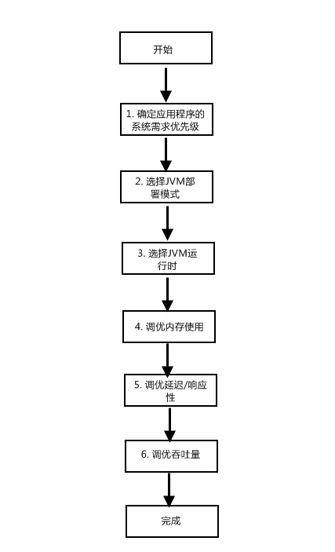

# 1 概述

上图描述了JVM调优的一般性流程。

**应用程序的系统需求包括不同的方面,一般可概括为以下几个方面：**

1. 可用性

   指当应用系统的某些组件发生故障或者失效时，应用程序或者应用程序的一部分在多大程度上还可以继续提供服务。

2. 可管理性

   对应用程序的配置、运行、监控、管理等操作带来的开销的度量。

3. 吞吐量

   应用程序单位时间内处理工作量。

4. 延迟及响应性

   指应用程序收到指令后从开始工作到完成工作所消耗的时间。

5. 内存占用

   应用程序所需内存的大小。

6. 启动时间

   应用程序初始化所消耗的时间。

# 2 选择JVM部署模式

## 2.1 单JVM部署

- 优点

  便于管理，同时减少了多个JVM自身带来内存开销。

- 缺点

  当应用程序遭到灾难性错误或者JVM失效时，无法保证程序的可用性，即单点故障。

## 2.2 多JVM部署

- 优点 

  增强了应用程序的可用性，同时在JVM多部署模式下，java堆通常比较小，较小的堆在垃圾收集时产生的停顿更小，一定程度上能带来更低的延迟。

- 缺点

  加大了应用程序监控管理的成本。同时，如果不将不同的JVM绑定到不同的处理器集上的话，可能引起跨硬件线程的迁移，这是由于应用程序的线程和JVM线程被分别绑定到不同的cpu，对程序有负面影响。所以使用多JVM部署模式时，强烈建议将不同的JVM绑定到不同的处理器集。

## 2.3 32位与64位的选择

如果应用程序需要消耗的内存超出了32位JVM的处理能力，那么就使用64位JVM。但是在使用64位JVM时要先确认应用程序中是否所有的第三方模块都支持64位JVM。
另外，如果程序中使用了**JNI**(java本地接口)，那么必须要使用64位JVM编译。

一般情况下，使用的JVM数越少越好，不仅便于管理，同时消耗的总内存也越少。但是对于特殊需求的应用，要适当选择。

# 3 选择JVM运行模式

## 3.1 Client模式

命令行选项： `-client`
启动快，占用内存少，JIT编译器生成代码的速度更快。

## 3.2 Server模式

命令行选项：`-server`
提供了更复杂的生成码优化功能，对于服务器应用而言尤其重要。

## 3.3 Tiered Server模式

Java7正式发布

命令行选项：`-server –XX:+TieredCompilation`
结合了前两者的优点，即快速启动和高效的生成码。

如果初始时不知道选择哪一种运行模式，那么就使用server模式，当启动时间或者内存占用无法满足要求时，如果JVM版本支持，那么就使用Tiered Server模式，如果还不能满足要求，那么就使用client模式。

# 4 垃圾收集调优基础

## 4.1 基本原则

- MinorGC回收原则

  即每次MinorGC都尽可能多地收集垃圾对象，以便减少FullGC的频率。

- GC内存最大化原则

  处理吞吐量和延迟的问题时，垃圾处理器能使用的内存越大，即java堆空间越大，垃圾收集的效果越好，应用程序也运行地更流畅。

- GC调优3选2原则

  在三个性能指标（吞吐量、延迟和内存占用）中选择两个进行JVM垃圾收集器调优、因为这三者中任何一个或者两个性能上的提升都会带来另两个或者另一个指标性能的下降。

## 4.2 垃圾收集器选择

很多情况下，ThroughPut收集器就能达到应用程序的停顿时间要求，所以可以从ThroughPut收集器开始入手，当需要时再转向CMS收集器。

## 4.3 推荐的GC日志命令行选项

1.  `-XX:+PrintGCTimeStamps –XX:+PrintGCDetails –Xloggc:`

   适用于所有应用程序的最小命令行选项集。同样适用于生产环境，因为开启GC日志对性能的影响极小。

2. `-XX:+PrintGCDateStamps`

   如果希望GC日志中时间以日期格式显式。

3. `-XX:+PrintGCApplicationStoppedTime –XX:+PrintGCApplicationConcurrentTime`

   针对调优延迟较高的应用，通过它们可以获得应用程序在安全点的停顿时间及两次安全点操作之间程序运行的时间。

4. `-XX:+PrintSafepointStatistics`

   将垃圾收集的安全点与其他的安全点区分开来，更便于查找应用高延迟的根源，是垃圾收集引起还是java代码引起。