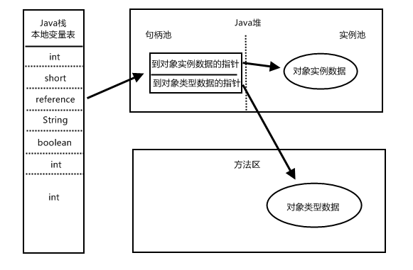
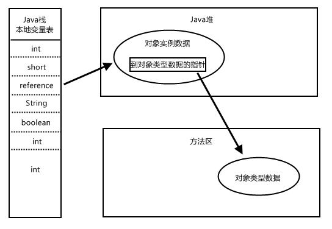

[TOC]

# 1 对象的创建

对象的创建就意味着内存的分配，内存的分配有两种方式：

1. 指针碰撞

   如果Java堆中内存是规整的，使用的空间在一边，空闲的空间在另一边，中间通过一个指针作为分界点，那么分配内存时只需要将指针向空闲空间移动与对象大小相等的距离。

2. 空闲列表

   如果Java堆不是规整的，是碎片化的，那么就需要维护一个列表，记录哪些内存块是可用的，为对象分配内存时，在列表上查找一块足够大的空间分配给对象，然后更新列表。

# 2 对象的内存布局

在HotSpot虚拟机中，对象在内存中存储的布局可以分为3块区域：对象头(Header)、实例数据(Instance Data) 和 对齐填充(Padding)。

## 2.1 对象头

对象头包含两部分信息：

1. Mark Word
   用于存储对象自身的运行时数据，如哈希码、GC分代年龄、锁状态标志、线程持有的锁、偏向线程ID、偏向时间戳等。
   是一个非固定的数据结构，会根据对象的状态复用自己的存储空间。

2. 类型指针
   即对象指向它的类元数据的指针，虚拟机通过这个指针来确定这个对象是哪个类的实例。
   如果对象是一个java数组，那在对象头中还必须有一块用于记录数组长度的数据。

## 2.2 实例数据

是对象真正存储的有效信息。

## 2.3 对齐填充

并不是必然存在的，仅仅起着占位符的作用。

由于HotSpot的自动内存管理系统要求对象大小必须是8字节的整数倍，而对象头部分正好是8字节的倍数，所以当实例数据部分不是8字节的倍数时，就需要对齐填充来补全。

# 3 对象的访问定位

目前主流的对象访问方式有使用**句柄**和**直接指针**两种。

## 3.1 使用句柄 

java堆中会划分出一块内存来作为句柄池，reference中存储的就是对象的句柄地址，而句柄中包含了对象实例数据和类型数据各自的具体地址信息。

使用句柄的**好处就是reference中存储的是稳定的句柄地址**，当对象被移动时只会改变句柄中的实例数据指针，而reference本身不需要改变。

## 3.2 使用直接指针 

使用直接指针的好处就是速度快，因为其减少了一次指针定位的时间开销。HotSpot采用了此对象访问定位方法。