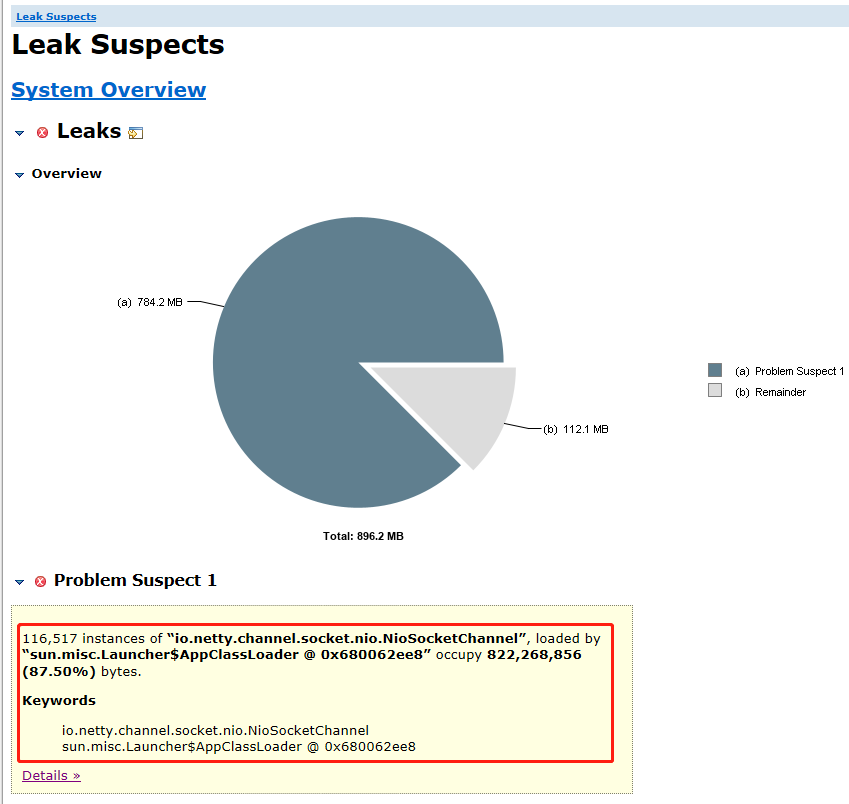
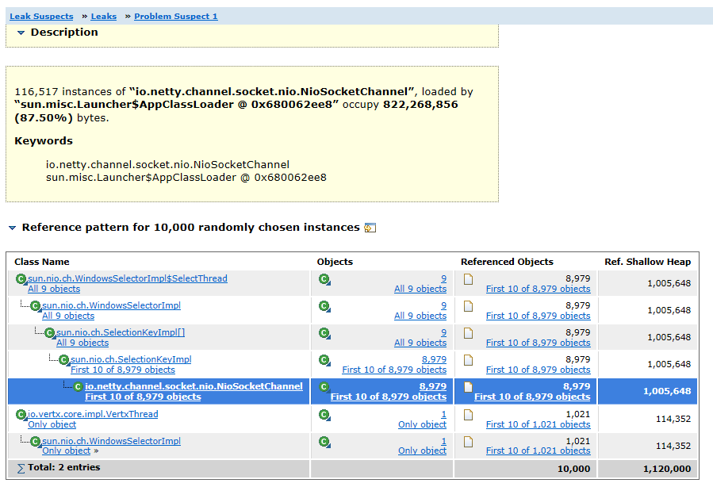
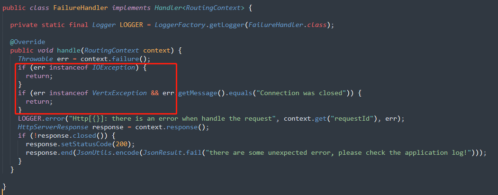
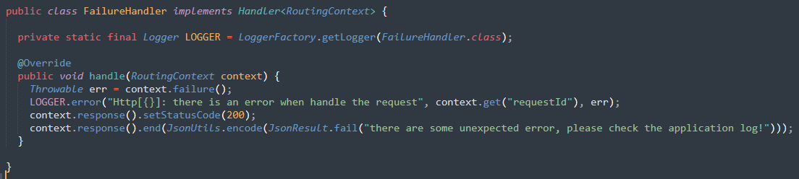
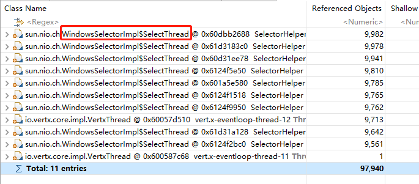
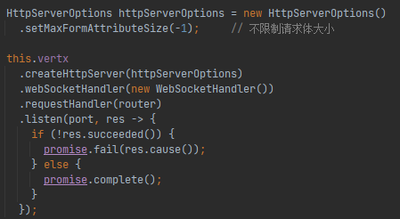
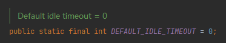
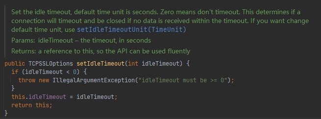
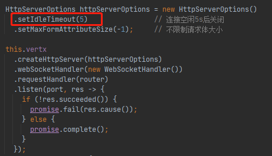

[TOC]

记录下在工作过程中遇到的各种CPU占用过高场景下问题的排查过程。


# 场景1

先简单介绍下Java应用及服务器环境：

- Java应用

  测温数据采集程序，用于接收各市县区测温设备上报的测温数据，并发量及数据量比较大。

  基于 vert.x 开发，主要使用 vert.x 官方的 Web、RabbitMQ、WebClient、Mysql 组件。

- 服务器环境

  操作系统：Windows Server 2016

  CPU：1U，10线程

  内存：32G

  JDK：1.8

应用上线后，稳定运行时CPU占用5%左右，内存占用400M左右。但是当3天后再次查看应用状态，发现CPU占用达到80%+，内存占用达到1G+，下面是我的排查过程：


**<font size="6">1. 生成线程转储</font>**

一般情况下，CPU占用过高的原因大部分由于线程引起的，比如死锁、死循环等。使用 **<a href="./JVM常用命令.html#5-jstack" target="_blank">jstack</a>** 命令生成线程转储。


**<font size="6">2. 分析线程转储</font>**

```
2021-10-08 17:16:12
Full thread dump Java HotSpot(TM) 64-Bit Server VM (25.261-b12 mixed mode):

"Thread-4487" #4580 daemon prio=5 os_prio=0 tid=0x000001d70780c800 nid=0x140c runnable [0x000000ac9f6ff000]
   java.lang.Thread.State: RUNNABLE
	at sun.nio.ch.WindowsSelectorImpl$SubSelector.poll0(Native Method)
	at sun.nio.ch.WindowsSelectorImpl$SubSelector.poll(Unknown Source)
	at sun.nio.ch.WindowsSelectorImpl$SubSelector.access$2600(Unknown Source)
	at sun.nio.ch.WindowsSelectorImpl$SelectThread.run(Unknown Source)

"Thread-4473" #4566 daemon prio=5 os_prio=0 tid=0x000001d704070000 nid=0x1138 runnable [0x000000ac9e8ff000]
   java.lang.Thread.State: RUNNABLE
	at sun.nio.ch.WindowsSelectorImpl$SubSelector.poll0(Native Method)
	at sun.nio.ch.WindowsSelectorImpl$SubSelector.poll(Unknown Source)
	at sun.nio.ch.WindowsSelectorImpl$SubSelector.access$2600(Unknown Source)
	at sun.nio.ch.WindowsSelectorImpl$SelectThread.run(Unknown Source)

...(此处省略n行，这之间，都是名称为 Thread-xxx 的线程状态日志)

"vert.x-internal-blocking-12" #94 prio=5 os_prio=0 tid=0x000001d778dcb000 nid=0x27f4 waiting on condition [0x000000ab818ff000]
   java.lang.Thread.State: WAITING (parking)
	at sun.misc.Unsafe.park(Native Method)
	- parking to wait for  <0x000000068005f308> (a java.util.concurrent.locks.AbstractQueuedSynchronizer$ConditionObject)
	at java.util.concurrent.locks.LockSupport.park(Unknown Source)
	at java.util.concurrent.locks.AbstractQueuedSynchronizer$ConditionObject.await(Unknown Source)
	at java.util.concurrent.LinkedBlockingQueue.take(Unknown Source)
	at java.util.concurrent.ThreadPoolExecutor.getTask(Unknown Source)
	at java.util.concurrent.ThreadPoolExecutor.runWorker(Unknown Source)
	at java.util.concurrent.ThreadPoolExecutor$Worker.run(Unknown Source)
	at io.netty.util.concurrent.FastThreadLocalRunnable.run(FastThreadLocalRunnable.java:30)
	at java.lang.Thread.run(Unknown Source)

"vert.x-worker-thread-18" #73 prio=5 os_prio=0 tid=0x000001d775d6e800 nid=0x714 waiting on condition [0x000000ab801fe000]
   java.lang.Thread.State: WAITING (parking)
	at sun.misc.Unsafe.park(Native Method)
	- parking to wait for  <0x000000068001c5f0> (a java.util.concurrent.locks.AbstractQueuedSynchronizer$ConditionObject)
	at java.util.concurrent.locks.LockSupport.park(Unknown Source)
	at java.util.concurrent.locks.AbstractQueuedSynchronizer$ConditionObject.await(Unknown Source)
	at java.util.concurrent.LinkedBlockingQueue.take(Unknown Source)
	at java.util.concurrent.ThreadPoolExecutor.getTask(Unknown Source)
	at java.util.concurrent.ThreadPoolExecutor.runWorker(Unknown Source)
	at java.util.concurrent.ThreadPoolExecutor$Worker.run(Unknown Source)
	at io.netty.util.concurrent.FastThreadLocalRunnable.run(FastThreadLocalRunnable.java:30)
	at java.lang.Thread.run(Unknown Source)

...(此处省略n行，这之间，都是名称为 vert.x-xxx 的线程状态日志)

"pool-10-thread-2" #58 prio=5 os_prio=0 tid=0x000001d775d62000 nid=0x2b18 waiting on condition [0x000000abfeffe000]
   java.lang.Thread.State: TIMED_WAITING (parking)
	at sun.misc.Unsafe.park(Native Method)
	- parking to wait for  <0x0000000680014a70> (a java.util.concurrent.locks.AbstractQueuedSynchronizer$ConditionObject)
	at java.util.concurrent.locks.LockSupport.parkNanos(Unknown Source)
	at java.util.concurrent.locks.AbstractQueuedSynchronizer$ConditionObject.awaitNanos(Unknown Source)
	at java.util.concurrent.ScheduledThreadPoolExecutor$DelayedWorkQueue.take(Unknown Source)
	at java.util.concurrent.ScheduledThreadPoolExecutor$DelayedWorkQueue.take(Unknown Source)
	at java.util.concurrent.ThreadPoolExecutor.getTask(Unknown Source)
	at java.util.concurrent.ThreadPoolExecutor.runWorker(Unknown Source)
	at java.util.concurrent.ThreadPoolExecutor$Worker.run(Unknown Source)
	at java.lang.Thread.run(Unknown Source)

...(此处省略n行，这之间，都是名称为 pool-xxx 的线程状态日志)

"AMQP Connection 127.0.0.1:5672" #54 prio=5 os_prio=0 tid=0x000001d7759bf800 nid=0x242c runnable [0x000000abfeefe000]
   java.lang.Thread.State: RUNNABLE
	at java.net.SocketInputStream.socketRead0(Native Method)
	at java.net.SocketInputStream.socketRead(Unknown Source)
	at java.net.SocketInputStream.read(Unknown Source)
	at java.net.SocketInputStream.read(Unknown Source)
	at java.io.BufferedInputStream.fill(Unknown Source)
	at java.io.BufferedInputStream.read(Unknown Source)
	- locked <0x0000000680016ea0> (a java.io.BufferedInputStream)
	at java.io.DataInputStream.readUnsignedByte(Unknown Source)
	at com.rabbitmq.client.impl.Frame.readFrom(Frame.java:91)
	at com.rabbitmq.client.impl.SocketFrameHandler.readFrame(SocketFrameHandler.java:184)
	- locked <0x0000000680016ec8> (a java.io.DataInputStream)
	at com.rabbitmq.client.impl.AMQConnection$MainLoop.run(AMQConnection.java:665)
	at java.lang.Thread.run(Unknown Source)

...(此处省略n行，这之间，都是名称为 AMQP Connection xxx 的线程状态日志)

"Service Thread" #10 daemon prio=9 os_prio=0 tid=0x000001d774f71800 nid=0x154 runnable [0x0000000000000000]
   java.lang.Thread.State: RUNNABLE

"C1 CompilerThread3" #9 daemon prio=9 os_prio=2 tid=0x000001d773a4e000 nid=0xba0 waiting on condition [0x0000000000000000]
   java.lang.Thread.State: RUNNABLE

"C2 CompilerThread2" #8 daemon prio=9 os_prio=2 tid=0x000001d773a43000 nid=0x29f4 waiting on condition [0x0000000000000000]
   java.lang.Thread.State: RUNNABLE

"C2 CompilerThread1" #7 daemon prio=9 os_prio=2 tid=0x000001d773a40000 nid=0x2a30 waiting on condition [0x0000000000000000]
   java.lang.Thread.State: RUNNABLE

"C2 CompilerThread0" #6 daemon prio=9 os_prio=2 tid=0x000001d773a3a800 nid=0x2924 waiting on condition [0x0000000000000000]
   java.lang.Thread.State: RUNNABLE

"Attach Listener" #5 daemon prio=5 os_prio=2 tid=0x000001d7739ec800 nid=0x1810 waiting on condition [0x0000000000000000]
   java.lang.Thread.State: RUNNABLE

"Signal Dispatcher" #4 daemon prio=9 os_prio=2 tid=0x000001d7739eb800 nid=0x2ae4 runnable [0x0000000000000000]
   java.lang.Thread.State: RUNNABLE

"Finalizer" #3 daemon prio=8 os_prio=1 tid=0x000001d7739c4800 nid=0x2bd0 in Object.wait() [0x000000abfbbff000]
   java.lang.Thread.State: WAITING (on object monitor)
	at java.lang.Object.wait(Native Method)
	at java.lang.ref.ReferenceQueue.remove(Unknown Source)
	- locked <0x000000068004d8e8> (a java.lang.ref.ReferenceQueue$Lock)
	at java.lang.ref.ReferenceQueue.remove(Unknown Source)
	at java.lang.ref.Finalizer$FinalizerThread.run(Unknown Source)

"Reference Handler" #2 daemon prio=10 os_prio=2 tid=0x000001d77399a000 nid=0x10ec in Object.wait() [0x000000abfbafe000]
   java.lang.Thread.State: WAITING (on object monitor)
	at java.lang.Object.wait(Native Method)
	at java.lang.Object.wait(Unknown Source)
	at java.lang.ref.Reference.tryHandlePending(Unknown Source)
	- locked <0x000000068018edf8> (a java.lang.ref.Reference$Lock)
	at java.lang.ref.Reference$ReferenceHandler.run(Unknown Source)

"VM Thread" os_prio=2 tid=0x000001d773994800 nid=0x276c runnable 

"GC task thread#0 (ParallelGC)" os_prio=0 tid=0x000001d756e24000 nid=0x24c runnable 

"GC task thread#1 (ParallelGC)" os_prio=0 tid=0x000001d756e26800 nid=0x8fc runnable 

"GC task thread#2 (ParallelGC)" os_prio=0 tid=0x000001d756e28000 nid=0x29a4 runnable 

"GC task thread#3 (ParallelGC)" os_prio=0 tid=0x000001d756e2a000 nid=0x2b08 runnable 

"GC task thread#4 (ParallelGC)" os_prio=0 tid=0x000001d756e2b000 nid=0x2af8 runnable 

"GC task thread#5 (ParallelGC)" os_prio=0 tid=0x000001d756e2c800 nid=0x1964 runnable 

"GC task thread#6 (ParallelGC)" os_prio=0 tid=0x000001d756e2f800 nid=0x8a4 runnable 

"GC task thread#7 (ParallelGC)" os_prio=0 tid=0x000001d756e30800 nid=0x264c runnable 

"GC task thread#8 (ParallelGC)" os_prio=0 tid=0x000001d756e31800 nid=0x2b54 runnable 

"VM Periodic Task Thread" os_prio=2 tid=0x000001d774f85000 nid=0x164c waiting on condition 

JNI global references: 880	
```

上述是线程转储中的部分内容，通过分析程序代码，所有以 `vert.x-`、`AMOP Connection`、`pool-` 为前缀的线程都是程序内创建并且维护的，也就是合理的，日志结尾部分 `Service Thread`、`C1 CompilerThread`、`Attach Listener`、`GC task` 等线程由jvm维护，也是合理的。

**一个非常不合理的地方在于那些 `Thread-xxx` 名称的线程**，这些线程并不是由程序代码创建，并且数量达到了4400+，是非常明显的异常现象。


**<font size="6">3. 分析导致线程大量创建的原因</font>**

```
"Thread-4487" #4580 daemon prio=5 os_prio=0 tid=0x000001d70780c800 nid=0x140c runnable [0x000000ac9f6ff000]
   java.lang.Thread.State: RUNNABLE
	at sun.nio.ch.WindowsSelectorImpl$SubSelector.poll0(Native Method)
	at sun.nio.ch.WindowsSelectorImpl$SubSelector.poll(Unknown Source)
	at sun.nio.ch.WindowsSelectorImpl$SubSelector.access$2600(Unknown Source)
	at sun.nio.ch.WindowsSelectorImpl$SelectThread.run(Unknown Source)
```

查看异常线程的详细堆栈信息，发现其发生位置在 `sun.nio.ch.WindowsSelectorImpl` 类，在经过查找相关资料后，确认该类为jdk的nio模型在windows系统上的实现，分析其源码（详细可参考 https://blog.csdn.net/liu_005/article/details/86253576 ）后发现它的工作原理简单解释为：在windows平台上，通过辅助线程来管理nio模型中channel的注册和注销，一个辅助线程管理一定数量的channel，channel数量越大，就会创建更多的辅助线程；当channel数量减少，也会销毁对应的辅助线程。


存在大量辅助线程的原因可能有2点：

- ① 存在大量未注销的channel
- ② jdk自身bug导致，在查询资料时，发现jdk的nio模型在windows下的实现确实存在bug，可能导致一直创建辅助线程，从而cpu占用飙升，这个问题好像到jdk1.8中也没有完全解决，只是很小的概率才会发生。


虽然原因②很有可能，但是毕竟它是概率性的，而对于我的应用来说，这个问题基本可以确定是必会发生的，那么就应该先从原因①着手进行分析。


**<font size="6">4. 生成堆转储</font>**

直接分析程序时是否存在大量未注销的channel可能有些无从下手，但是应用状态的异常不只在于cpu占用，还有个内存占用的异常也非常明显，比正常状态增加了好几倍，那么就先从内存下手，通过 **<a href="./JVM常用命令.html#3-jmap" target="_blank">jmap</a>** 命令生成堆转储。


使用 **<a href="http://www.eclipse.org/mat/downloads.php" target="_blank">Eclipse Memory Analyzer</a>** 工具打开堆转储文件，分析结果显示出一个明显的可疑状态：




可以看到， **io.netty.channel.socket.nio.NioSocketChannel** 类存在大量的实例，占用了 87.5% 的堆内存，点击 Details 查看详细信息：




查看实例引用情况，所有的channel实例都被 **sun.nio.WindowsSelectorImpl** 引用，而这恰好是导致辅助线程大量创建的原因。


到这里，就可以确定问题的根本在于存在大量未注销的channel。


**<font size="6">5. 检查程序代码</font>**

既然确定了问题的根本在于存在大量未注销的channel，那么就进一步分析程序逻辑。


在程序中，只有通过 vertx-web 模块搭建 http server 使用了 nio，用来接收测温设备的数据，那么就需要进一步排查是否在处理 http 请求时存在问题，导致 channel 一直无法释放。


最后，发现在http的FailureHandler，也就是异常处理器中，对于部分请求处理中出现的异常，未进行正确的响应：




修改程序，保证所有发生异常的请求都能响应：




**<font size="6">6. 验证问题是否解决</font>**

现在是2021-10-09，将程序重新打包部署，持续观察一段时间，等过几天后再来进一步更新。:sweat_smile:


**<font size="6">7. 后续来了</font>**

现在是2021-10-21，更新下程序优化的结果。

很遗憾，经过第5步中的代码优化，问题并没有得到解决:sob:，只好继续进一步分析。


再次打开MAT，分析堆转储。

首先查看程序中实例数量，NioSockerChannel实例数达到了97940，每一个NioSockerChannel本质上都对应一个连接。而考虑实际场景，测温设备总数大约10000，并且是http协议，请求在响应完成后应该关闭，第5步的代码优化也保证了所有请求都能够响应，这个实例数很明显是不正常的，这还只是程序运行了大概4小时的堆转储


进一步查看NioSockerChannel实例的引用链，可以发现每个NioSockerChannel实例都被多个WindowsSelectorImpl实例引用，而WindowsSelectorImpl实例运行在名称为SelectThread的线程上




WindowsSelectorImpl是java nio在windows上的实现，也就是说，这些NioSockerChannel都是存活状态，导致系统底层要不断的轮询这些channel，查看是否有新的事件需要处理，那么下一步就要分析为什么channel没有关闭，当前服务为http服务，客户端请求后，创建channel进行处理，响应完成后，channel理应关闭才对。


查看代码中创建http服务部分，发现vertx在创建http服务时，可以自定义一些配置（HttpServerOptions）：




那好，查看HttpServerOptions源码，发现其内部没有与channel关闭相关的参数，进一步查找其父类NetServerOptions，也没有找到有用的信息，再继续查找父类TCPSSLOptions，发现了这样一个属性：默认空闲超时时长




找到其set方法，查看注释，显然，idleTimeout用来控制空闲连接的超时时长，达到超时时长后该连接将被关闭；默认超时时长为0，即永不超时，也就是说连接永不关闭：




那好，修改创建http服务的代码，设置空闲连接的超时时长：




自从修改空闲连接的超时时长后，程序稳定运行了2天，cpu占用稳定在1%左右，进一步查看线程转储及堆转储，一切正常，问题解决！


:tada::tada::tada: