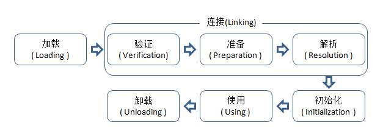

[TOC]


# 1 类加载机制

文章内容主要引自：http://www.importnew.com/18548.html。

类从被加载到虚拟机内存中开始，到卸载出内存为止，它的整个生命周期包括：加载(Loading)、验证(Verification)、准备(Preparation)、解析(Resolution)、初始化(Initialization)、使用(Using) 和 卸载(Unloading)7个阶段。

其中准备、验证、解析3个部分统称为连接(Linking)。如图所示:



加载、验证、准备、初始化和卸载这5个阶段的顺序是确定的，类的加载过程必须按照这种顺序按部就班地开始，而解析阶段则不一定：它在某些情况下可以在初始化阶段之后再开始，这是为了支持Java语言的运行时绑定（也称为动态绑定或晚期绑定）。以下内容都以HotSpot为基准。


## 1.1 加载

在加载阶段（可以参考java.lang.ClassLoader的loadClass()方法），虚拟机需要完成以下3件事情：

1. 通过一个类的全限定名来获取定义此类的二进制字节流。

   并没有指明要从一个Class文件中获取，可以从其他渠道，譬如：网络、动态生成、数据库等。

2. 将这个字节流所代表的静态存储结构转化为方法区的运行时数据结构。

3. 在内存中生成一个代表这个类的java.lang.Class对象。

   作为方法区这个类的各种数据的访问入口。

加载阶段和连接阶段（Linking）的部分内容（如一部分字节码文件格式验证动作）是交叉进行的，加载阶段尚未完成，连接阶段可能已经开始，但这些夹在加载阶段之中进行的动作，仍然属于连接阶段的内容，这两个阶段的开始时间仍然保持着固定的先后顺序。


## 1.2 验证

验证是连接阶段的第一步，这一阶段的目的是为了**确保Class文件的字节流中包含的信息符合当前虚拟机的要求，并且不会危害虚拟机自身的安全**。

验证阶段大致会完成4个阶段的检验动作：

1. 文件格式验证

   验证字节流是否符合Class文件格式的规范。

   例如：是否以魔术0xCAFEBABE开头、主次版本号是否在当前虚拟机的处理范围之内、常量池中的常量是否有不被支持的类型。

2. 元数据验证

   对字节码描述的信息进行语义分析（注意：对比javac编译阶段的语义分析），以保证其描述的信息符合Java语言规范的要求。

   例如：这个类是否有父类，除了java.lang.Object之外。

3. 字节码验证

   通过数据流和控制流分析，确定程序语义是合法的、符合逻辑的。

4. 符号引用验证

   确保解析动作能正确执行。

验证阶段是非常重要的，但**不是必须**的，它对程序运行期没有影响，如果所引用的类经过反复验证，那么可以考虑采用 `-Xverifynone` 参数来关闭大部分的类验证措施，以缩短虚拟机类加载的时间。


## 1.3 准备

准备阶段是**正式为类变量分配内存并设置类变量初始值的阶段**，这些变量所使用的内存都将在方法区中进行分配。这时候进行内存分配的仅包括类变量（被static修饰的变量），而不包括实例变量，实例变量将会在对象实例化时随着对象一起分配在堆中。其次，这里所说的初始值“通常情况”下是数据类型的零值，假设一个类变量的定义为：
`public static int value=123;`
那变量value在准备阶段过后的初始值为0而不是123。因为这时候尚未开始执行任何java方法，而把value赋值为123的putstatic指令是程序被编译后，存放于类构造器()方法之中，所以把value赋值为123的动作将在初始化阶段才会执行。

至于“特殊情况”是指：`public static final int value=123`，即当类字段的字段属性是ConstantValue时，会在准备阶段初始化为指定的值，所以标注为final之后，value的值在准备阶段初始化为123而非0。


## 1.4 解析

解析阶段是虚拟机**将常量池内的符号引用替换为直接引用的过程**。

解析动作主要针对**类或接口、字段、类方法、接口方法、方法类型、方法句柄和调用点限定符**7类符号引用进行。


## 5.初始化

类初始化阶段是类加载过程的最后一步，到了初始化阶段，才**真正开始执行类中定义的java程序代码**。

在准备阶段，变量已经赋过一次系统要求的初始值，而在初始化阶段，则根据程序猿通过程序指定的初始计划去初始化类变量和其他资源，或者说：初始化阶段是执行类构造器`<clinit>()`方法的过程。

`<clinit>()`方法是由编译器自动收集类中的所有类变量的赋值动作和静态语句块static{}中的语句合并产生的，编译器收集的顺序是由语句在源文件中出现的顺序所决定的，静态语句块只能访问到定义在静态语句块之前的变量，定义在它之后的变量，在前面的静态语句块可以赋值，但是不能访问。如下：

```
public class Test
{
    static
    {
        i=0;
        System.out.println(i);//这句编译器会报错：Cannot reference a field before it is defined（非法向前应用）
    }
    static int i=1;
}
```

`<clinit>()`方法与实例构造器`<init>()`方法不同，它不需要显示地调用父类构造器，虚拟机会保证在子类`<init>()`方法执行之前，父类的`<clinit>()`方法方法已经执行完毕。

由于父类的`<clinit>()`方法先执行，也就意味着父类中定义的静态语句块要优先于子类的变量赋值操作。
`<clinit>()`方法对于类或者接口来说并**不是必需**的，如果一个类中没有静态语句块，也没有对变量的赋值操作，那么编译器可以不为这个类生成`<clinit>()`方法。

接口中不能使用静态语句块，但仍然有变量初始化的赋值操作，因此接口与类一样都会生成`<clinit>()`方法。但接口与类不同的是，执行接口的`<clinit>()`方法不需要先执行父接口的`<clinit>()`方法。只有当父接口中定义的变量使用时，父接口才会初始化。另外，接口的实现类在初始化时也一样不会执行接口的`<clinit>()`方法。

虚拟机会保证一个类的`<clinit>()`方法在多线程环境中被正确的加锁、同步，如果多个线程同时去初始化一个类，那么只会有一个线程去执行这个类的`<clinit>()`方法，其他线程都需要阻塞等待，直到活动线程执行`<clinit>()`方法完毕。如果在一个类的`<clinit>()`方法中有耗时很长的操作，就可能造成多个线程阻塞，在实际应用中这种阻塞往往是隐藏的。

```
package jvm.classload;
 
public class DealLoopTest
{
    static class DeadLoopClass
    {
        static
        {
            if(true)
            {
                System.out.println(Thread.currentThread()+"init DeadLoopClass");
                while(true)
                {
                }
            }
        }
    }
 
    public static void main(String[] args)
    {
        Runnable script = new Runnable(){
            public void run()
            {
                System.out.println(Thread.currentThread()+" start");
                DeadLoopClass dlc = new DeadLoopClass();
                System.out.println(Thread.currentThread()+" run over");
            }
        };
 
        Thread thread1 = new Thread(script);
        Thread thread2 = new Thread(script);
        thread1.start();
        thread2.start();
    }
}

运行结果：（即一条线程在死循环以模拟长时间操作，另一条线程在阻塞等待）
Thread[Thread-0,5,main] start
Thread[Thread-1,5,main] start
Thread[Thread-0,5,main]init DeadLoopClass
```

需要注意的是，其他线程虽然会被阻塞，但如果执行`<clinit>()`方法的那条线程退出`<clinit>()`方法后，其他线程唤醒之后不会再次进入`<clinit>()`方法。**同一个类加载器下，一个类型只会初始化一次。** 


将上面代码中的静态块替换如下：

```
static
        {
            System.out.println(Thread.currentThread() + "init DeadLoopClass");
            try
            {
                TimeUnit.SECONDS.sleep(10);
            }
            catch (InterruptedException e)
            {
                e.printStackTrace();
            }
        }

运行结果：
Thread[Thread-0,5,main] start
Thread[Thread-1,5,main] start
Thread[Thread-1,5,main]init DeadLoopClass (之后sleep 10s)
Thread[Thread-1,5,main] run over
Thread[Thread-0,5,main] run over
```


虚拟机规范严格规定了有且只有5种情况（jdk1.7）必须对类进行“初始化”（而加载、验证、准备自然需要在此之前开始）：

1. 遇到new、getstatic、putstatic、invokestatic这四条字节码指令时，如果类没有进行过初始化，则需要先触发其初始化。

   生成这4条指令的最常见的Java代码场景是：使用new关键字实例化对象的时候、读取或设置一个类的静态字段（被final修饰、已在编译器把结果放入常量池的静态字段除外）的时候、以及调用一个类的静态方法的时候。

2. 使用java.lang.reflect包的方法对类进行反射调用的时候。

   如果类没有进行过初始化，则需要先触发其初始化。

3. 当初始化一个类的时候，如果发现其父类还没有进行过初始化，则需要先触发其父类的初始化。

4. 当虚拟机启动时，用户需要指定一个要执行的主类（包含main()方法的那个类），虚拟机会先初始化这个主类。

5. 当使用jdk1.7动态语言支持时，如果一个java.lang.invoke.MethodHandle实例最后的解析结果REF_getstatic、REF_putstatic、REF_invokeStatic的方法句柄，并且这个方法句柄所对应的类没有进行初始化，则需要先触发其初始化。


**示例：**

1. 通过数组定义来引用类，不会触发此类的初始化：

```
public class NotInitialization
{
    public static void main(String[] args)
    {
        SuperClass[] sca = new SuperClass[10];
    }
}

运行结果：（无）
```


2. 常量在编译阶段会存入调用类的常量池中，本质上并没有直接引用到定义常量的类，因此不会触发定义常量的类的初始化。

```
public class ConstClass
{
    static
    {
        System.out.println("ConstClass init!");
    }
    public static  final String HELLOWORLD = "hello world";
}
public class NotInitialization
{
    public static void main(String[] args)
    {
        System.out.println(ConstClass.HELLOWORLD);
    }
}

运行结果：hello world
```


3. 请问输出是什么？

```
public class StaticTest
{
    public static void main(String[] args)
    {
        staticFunction();
    }
 
    static StaticTest st = new StaticTest();
 
    static
    {
        System.out.println("1");
    }
 
    {
        System.out.println("2");
    }
 
    StaticTest()
    {
        System.out.println("3");
        System.out.println("a="+a+",b="+b);
    }
 
    public static void staticFunction(){
        System.out.println("4");
    }
 
    int a=110;
    static int b =112;
}

输出结果:
2
3
a=110,b=0
1
4
```

首先，在执行StaticTest类的主方法时，会先加载StaticTest类。类加载时，会先初始化static变量，并且按照static变量的声明顺序依次加载，所以开始执行`static StaticTest st = new StaticTest();`来初始化st变量，创建StaticTest实例时会先调用构造代码块（打印“2”），然后初始化变量a（由于变量b属于static变量，并且声明在st之后，所以不会初始化b），然后调用构造方法（打印“3”，打印“a=110，b=0”），到此时，st变量初始化完毕；下面开始执行static静态代码块（打印“1”），然后初始化static变量b，最后执行staticFunction方法（打印“4”）。


# 2 类加载器

## 2.1 分类

Java 中的类加载器大致可以分成两类：

1. 系统提供，主要有下面三个：
   **引导类加载器（bootstrap class loader）**：它用来加载 Java 的核心库，是用原生代码来实现的，并不继承自 java.lang.ClassLoader。
   **扩展类加载器（extensions class loader）**：它用来加载 Java 的扩展库。Java 虚拟机的实现会提供一个扩展库目录。该类加载器在此目录里面查找并加载 Java 类。
   **系统类加载器（system class loader）**：它根据 Java 应用的类路径（CLASSPATH）来加载 Java 类。一般来说，Java 应用的类都是由它来完成加载的。可以通过 ClassLoader.getSystemClassLoader()来获取它。

2. 由 Java 应用开发人员编写的。

   除了系统提供的类加载器以外，开发人员可以通过继承 java.lang.ClassLoader类的方式实现自己的类加载器，以满足一些特殊的需求。


除了引导类加载器之外，所有的类加载器都有一个父类加载器。

对于系统提供的类加载器来说，系统类加载器的父类加载器是扩展类加载器，而扩展类加载器的父类加载器是引导类加载器。

对于开发人员编写的类加载器来说，其父类加载器是加载此类加载器 Java 类的类加载器。因为类加载器 Java 类如同其它的 Java 类一样，也是要由类加载器来加载的。一般来说，开发人员编写的类加载器的父类加载器是系统类加载器。

类加载器通过这种方式组织起来，形成树状结构。树的根节点就是引导类加载器，如下图所示：


通过java代码示例演示类加载器组织结构：

```
public class ClassLoaderTest {

    public static void main(String[] args) {
        ClassLoader curClassLoader = ClassLoaderTest.class.getClassLoader();
        System.out.println(curClassLoader);
        ClassLoader parent = curClassLoader.getParent();
        while(parent != null){
            System.out.println(parent);
            parent = parent.getParent();
        }
    }
    
}

输出结果：
sun.misc.Launcher$AppClassLoader@18b4aac2
sun.misc.Launcher$ExtClassLoader@555590
```

可以看到，默认情况下，应用中的java类由系统类加载器（AppClassLoader）加载，系统类加载器的父加载器为扩展类加载器（ExtClassLoader）。

该示例中并没有打印出扩展类加载器的父加载器引导类加载器，这是由于在HotSpot的实现对于父加载器是引导类加载器的情况，getParent()返回null。


## 2.2 双亲委派模型

在讲解双亲委派模型前，先要知道jvm虚拟机判断两个类是否相同的依据是：类的全限定名 + 类加载器，即只有类的全限定名相同并且由同一个类加载器加载，才被认定为是相同的类。

双亲委派模型：类加载器在尝试加载某个类时，会先交给父类加载器，如果该父类加载器还有父类加载器，那么继续交给向上层类加载器加载... 当所有的父类加载器加载不到时，就由当前的类加载器加载。

双亲委派模型和jvm中判断类相同的依据带来了哪些好处呢？
如果我们编写了一个全限定名为java.lang.String的类，并且放入了一些恶意代码，因为类加载只进行一次，所以如果没有双亲委派模型，由不同的类加载器各自加载，那么该String类就可能取代java类库的String类而导致安全问题，或者自定义的String类根本加载不到。


## 2.3 线程上下文类加载器

线程上下文类加载器（context class loader）是从 JDK 1.2 开始引入的。

类 java.lang.Thread中的方法 getContextClassLoader()和 setContextClassLoader(ClassLoader cl)用来获取和设置线程的上下文类加载器。如果没有通过 setContextClassLoader(ClassLoader cl)方法进行设置的话，线程将继承其父线程的上下文类加载器。Java 应用运行的初始线程的上下文类加载器默认是系统类加载器。在线程中运行的代码可以通过此类加载器来加载类和资源。

首先，要明白**线程上下文类加载器会破坏双亲委派模型**，但是这种破坏是必需的，因为线程上下文类加载器解决了一些双亲委派模型无法解决的问题：如SPI，Java 提供了很多服务提供者接口（SPI），允许第三方为这些接口提供实现，常见的有JDBC、JCE、JNDI等。 这些SPI接口是由java类库提供的，由引导类加载器加载，而其实现类是第三方实现的java代码，通过系统类加载器加载，而由于双亲委派模型，使得引导类加载器无法加载这些实现类，也就无法提供正常的服务。 而线程上下文类加载器的出现，使得在SPI接口的代码中使用线程上下文类加载器，就可以成功地加载到SPI实现类。


## 2.4 自定义类加载器

```
public class ClassLoaderTest extends ClassLoader {

    @Override
    protected Class<?> findClass(String name) throws ClassNotFoundException {

        try {
            InputStream in = new FileInputStream("C:\\Users\\Administrator\\Desktop\\StaticTest.class");
            ByteArrayOutputStream out = new ByteArrayOutputStream();
            byte[] buffer = new byte[1024];
            int len = 0;
            while ((len = in.read(buffer)) != -1){
                out.write(buffer,0,len);
            }
            byte[] result = out.toByteArray();

            return defineClass("my.StaticTest",result,0,result.length);
        }catch (Exception e){
            throw new ClassNotFoundException();
        }

    }

    public static void main(String[] args) throws ClassNotFoundException {

        Class<?> clazz = new ClassLoaderTest().findClass("my.StaticTest");
        System.out.println(clazz);
        System.out.println(clazz.getClassLoader());

    }
}

输出结果：
class my.StaticTest
day0222类加载.ClassLoaderTest@4554617c
```

**在自定义的类加载器中，最好重写findClass方法，而不是重写loadClass方法**，因为在loadClass方法的实现中，当父类加载器加载不到指定的类时，会调用findClass方法来加载，这也使自定义的类加载器符合双亲委派模型。如果重写loadClass时不进行正确的判断，那么就会破环双亲委派模型。