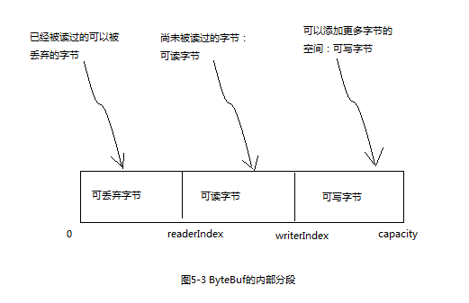
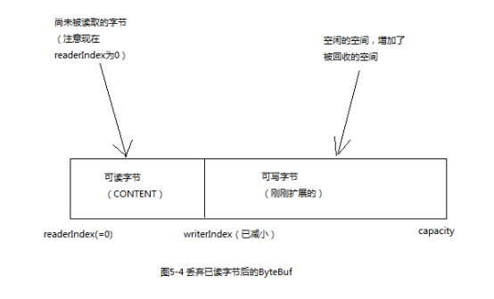

[TOC]

Netty的数据处理API通过两个组件暴露：ByteBuf 和 ByteBufHolder。

下面是一些ByteBuf API的优点：

1. 它可以被用户自定义的缓冲区类型扩展
2. 通过内置的复合缓冲区类型实现了透明的零拷贝
3. 容量可以按需增长
4. 在读和写这两种模式之间可以自由切换
5. 读和写使用了不同的索引
6. 支持方法的链式调用
7. 支持引用计数
8. 支持池化


# 1 ByteBuf类


## 1.1 它是如何工作的

ByteBuf 维护了两个不同的索引，一个用于读取，一个用于写入，当你从ByteBuf读取时，它的readerIndex将会被递增已经被读取的字节数，同样的，当你写入ByteBuf时，它的writerIndex也会被递增。

名称以read和write开头的ByteBuf方法，将会推进其对应的索引，而名称以set或者get开头的操作则不会。

可以指定ByteBuf的最大容量，默认限制是Integer.MAX_VALUE。


## 1.2 ByteBuf的使用模式

### 1.2.1 堆缓冲区

最常用的ByteBuf模式是将数据存储在JVM的堆空间中，这种模式被称为支撑数组，它能在没有使用池化的情况下提供快速的分配和释放，这种方式非常**适合于有遗留的数据需要处理的情况**。

```
****** 代码清单5-1 支撑数组 ******

ByteBuf heapBuf = ...;
//检查ByteBuf是否有一个支撑数组
if(heapBuf.hasArray()){
    //如果有,则获取对该数组的引用
    byte[] array = heapBuf.array();
    //计算第一个字节的偏移量
    int offset = heapBuf.arrayOffset() + heapBuf.readerIndex();
    //获取可读字节数
    int length = heapBuf.readableBytes();
    //使用数组,偏移量和长度作为参数调用你的方法
    handleArray(array,offset,length);
}
```


### 1.2.2 直接缓冲区

直接缓冲区是另一种ByteBuf模式，直接缓冲区的内容将驻留在常规的会被垃圾回收的堆之外，这样就避免了在每次调用本地IO操作之前或者之后，将缓冲区的内容复制到一个中间缓冲区。

直接缓冲区的缺点主要是: 相对于基于堆的缓冲区，它们的分配和释放都较为昂贵；同时如果你正在处理遗留代码，也可能因为数据不是在堆上，所以你不得不进行一次复制。

```
****** 代码清单5-2 访问直接缓冲区的数据 ******

ByteBuf directBuf = ...;
//检查ByteBuf是否由数组支撑,如果不是,则这是一个直接缓冲区
if(!directBuf.hasArray()){
    //获取可读字节数
    int length = directBuf.readableBytes();
    //分配一个新的数组来保存具有该长度的字节数据
    byte[] array = new byte[length];
    //将字节复制到该数组
    directBuf.getBytes(directBuf.readerIndex(),array);
    //使用数组,偏移量和长度作为参数调用你的方法
    handleArray(array,0,length);
}
```


### 1.2.3 复合缓冲区

复合缓冲区为多个ByteBuf提供了一个聚合视图，可以根据需要添加或者删除ByteBuf实例。

Netty通过ByteBuf的子类:CompositeByteBuf实现了这个模式，它提供了一个将多个缓冲区表示为单个合并缓冲区的虚拟表示。

CompositeByteBuf中的ByteBuf实例可能同时包含直接内存分配和非直接内存分配，如果只有其中一个，那么对hasArray()方法的调用就是对其内部ByteBuf实例的判断，否则将直接返回false。

```
****** 程序清单5-4 使用CompositeByteBuf的复合缓冲区模式 ******

CompositeByteBuf compositeByteBuf = Unpooled.compositeBuffer();
ByteBuf head = ...;
ByteBuf body = ...;
//将多个ByteBuf实例追加到CompositeByteBuf中
compositeByteBuf.addComponents(head,body);
...
//根据角标删除CompositeByteBuf中的ByteBuf实例
compositeByteBuf.removeComponent(0);
//CompositeByteBuf支持遍历操作,遍历的元素就是内部的ByteBuf实例
for(ByteBuf buf:compositeByteBuf){
    
}
```


CompositeByteBuf可能不支持访问其支撑数组，因此访问CompositeByteBuf中的数据类似于访问直接缓冲区的模式。

```
****** 代码清单5-5 访问CompositeBuf中的数据 ******

CompositeByteBuf compositeByteBuf = Unpooled.compositeBuffer();
//获取可读字节数
int length = compositeByteBuf.readableBytes();
//分配一个新的数组来保存具有该长度的字节数据
byte[] array = new byte[length];
//将字节复制到该数组
compositeByteBuf.getBytes(compositeByteBuf.readerIndex(),array);
//使用数组,偏移量和长度作为参数调用你的方法
handleArray(array,0,length);
```


Netty使用了CompositeByteBuf来优化套接字I/O操作，尽可能的消除了JDK的缓冲区实现带来的性能损失。
CompositeByteBuf的API也提供了大量实用的附加功能。


# 2 字节操作

## 2.1 随机访问索引

`getByte()`方法不会改变readerIndex或者writerIndex。

```
byte b = buf.getByte(index);
```


## 2.2 顺序访问索引




## 2.3 可丢弃字节

可丢弃字节的分段包含了已经被读过的字节。

通过调用`discardReadBytes()`方法，可以丢弃它们并回收空间（readerIndex归0，writerIndex相应的减小）。



虽然`discardReadBytes()`方法的频繁调用可以保证写分段的最大化，但是极有可能导致内存复制。只有在内存资源很宝贵的时候才建议这样做。


## 2.4 可读字节

任何以read、skip开头的操作都将检索或者跳过位于当前readerIndex的数据，并且将readerIndex增加已读的字节数。

读取可取字节，并将其写入到目标ByteBuf中：

```
readBytes(ByteBuf buf);
```


```
****** 代码清单5-7 读取所有数据 ******
ByteBuf buf = ...;
while(buf.isReadable()){
sout(buf.readByte());
}
```


## 2.5 可写字节

任何以write开头的操作都将从当前的writerIndex处开始写数据，并且将writerIndex增加已经写入的字节数。

`writeableBytes()`方法用来确定缓冲区中是否还有足够的空间。

```
****** 代码清单5-8 写数据******
ByteBuf buf = ...;
while(buf.writeableBytes()>= 4){
Buf.writeInt(random.nextInt());
}
```


## 2.6 索引管理

通过调用 `markReaderIndex()`、`maerWriterIndex()`、`resetReaderIndex()`、`resetWriterIndex()`来标记和重置ByteBuf的readerIndex和writerIndex。

也可以通过调用`readerIndex(int)`或者`writerIndex(inx)`来将索引移动到指定位置。

调用`clead()`方法可以将readerIndex和writerIndex重置为0，但是并不会清除内存中的内容。调用`clead()`比调用`discardReadBytes()`要轻量的多，因为它将只是重置索引而不会复制任何的内存。


## 2.7 查找操作

`indexOf()`：获取指定值的索引。
`Boolean process(byte value)`：检查输入值是否是正在查找的值

```
****** 代码清单5-9 使用ByteBufProcess来寻找\r ******
ByteBuf buf = ...;
int index = buf.forEachByte(ByteBufProcess.FIND_CR);
```


## 2.8 派生缓冲区

`duplicate()`、`slice()`、`slice(int,int)`、`Unpooled.unmodifiableBuffer(...)`、`order(ByteOrder)`、`readSlice(int)`

每个这些方法都将返回一个ByteBuf的实例，它具有自己的读写索引和标记索引，但是其内部存储是和源ByteBuf**共享**的，所以如果你修改了新实例的内容，那么它的原示例的内容也会变化，这点要很小心。

如果要得到一个现有缓冲区的独立真实副本，请使用`copy()`或者`copy(int,int)`方法。

slice和copy方法都可以实现对ByteBuf的切片效果，如果不涉及修改切片，建议使用slice方法来避免内存的复制。


## 2.9 读/写操作

有两种类别的读写操作：

1. `get()`和`set()`操作

   从给定的索引开始，并且保持索引不变。

2. `read()`和`write()`操作

   从给定的索引开始，并且会根据已经访问过的字节数对索引进行调整。


# 3 ByteBufHolder接口

除了实际的数据负载之外，我们还经常需要存储各种属性值，如HTTP响应，除了表示为字节的内容，还包括状态码、cookie等。

为了处理这种常见的用例,Netty提供了ByteBufHolder.
表5-6 ByteBufHolder的操作


|    名称     |                             描述                             |
| :---------: | :----------------------------------------------------------: |
|  content()  |                返回ByteBufHolder持有的ByteBuf                |
|   copy()    | 返回这个ByteBufHolder的一个深拷贝，包括一个其所包含的ByteBuf的非共享拷贝 |
| duplicate() | 返回这个ByteBufHolder的一个浅拷贝，包括一个其所包含的ByteBuf的共享拷贝 |

如果想要实现一个将其有效负载存储在ByteBuf中的消息对象，那么ByteBufHolder将是不错的选择。


# 4 ByteBuf分配

## 4.1 ByteBufAllocator接口

为了降低分配和释放内存的开销，Netty通过ByteBufAllocator实现了（ByteBuf的）池化，它可以用来分配任意类型的ByteBuf实例。

ByteBufAllocator的方法

|       名称        |                  描述                   |
| :---------------: | :-------------------------------------: |
|     buffer()      | 返回一个基于堆或者直接内存存储的ByteBuf |
|   heapBuffer()    |     返回一个基于堆内存存储的ByteBuf     |
|  directBuffer()   |    返回一个基于直接内存存储的ByteBuf    |
| compositeBuffer() |    返回一个复合缓冲区CompositeBuffer    |
|    ioBuffer()     |   返回一个用于套接字I/O操作的ByteBuf    |

```
****** 代码清单5-14 获取一个到ByteBufAllocator 的引用 ******

//从Channel获取一个到ByteBufAllocator的引用
Channel channel = ...;
ByteBufAllocator allocator1 = channel.alloc();

//从ChannelHandlerContext获取一个到ByteBufAllocator的引用
ChannelHandlerContext ctx = ...;
ByteBufAllocator allocator2 = ctx.alloc();
```


Netty提供了两种ByteBufAllocator的实现：

1. PooledByteBufAllocator 

   池化了ByteBuf的实例以提高性能并最大限度地减少内存碎片。Netty默认使用了PooledByteBufAllocator，但是也可以很容易的通过ChannelConfig API或者在引导过程中修改。

2. UnpooledByteBufAllocator

   不池化ByteBuf实例,并且每次它被调用时都会返回一个新的实例。


## 4.2 Unpooled缓冲区

一个简单的称为Unpooled的工具类，提供了静态的辅助方法来创建未池化的ByteBuf实例。

Unpooled的常用方法

|      名称       |                   描述                    |
| :-------------: | :---------------------------------------: |
|    buffer()     |  返回一个未池化的基于堆内存存储的ByteBuf  |
| directBuffer()  | 返回一个未池化的基于直接内存存储的ByteBuf |
| wrappedBuffer() |      返回一个包装了给定数据的ByteBuf      |
| copiedBuffer()  |      返回一个复制了给定数据的ByteBuf      |


## 4.3 ByteBufUtil类

ByteBufUtil提供了用于操作ByteBuf的静态的辅助方法，如hexdump()，它以十六进制的表示形式打印ByteBuf的内容。


# 5 引用计数

ReferenceCounted。

引用计数是一种通过在某个对象所持有的资源不再被其他对象引用时释放该对象所持有的资源来优化内存使用和性能的技术。

Netty在第四版为ByteBuf和ByteBufHolder引入了引用计数技术，它们都实现了ReferenceCounted接口。

引用计数背后的思想并不复杂：它主要涉及跟踪到某个特定对象的活动引用的数量。一个ReferenceCounted实现的实例将通常以活动的引用计数为1作为开始，只要引用计数大于0，就能保证对象不会被释放。当活动引用的数量减小到0时，该实例会被释放。

引用计数对于池化实现时至关重要的，它降低了内存分配的开销。

```
****** 代码清单5-15 引用计数 ******

Channel channel = ...;
//从Channel获取ByteBufAllocator
ByteBufAllocator allocator = channel.alloc();
//从ByteBufAllocator分配一个ByteBuf
ByteBuf buf = allocator.directBuffer();
//检查ByteBuf的引用计数是否为预期的1
assert buf.refCnt()==1;
****** 代码清单5-16 释放引用计数的对象 ******

ByteBuf buf = ...;
//减少到对象的活动引用,当减小到0时,对象被释放,并且返回true
boolean release = buf.release();
```