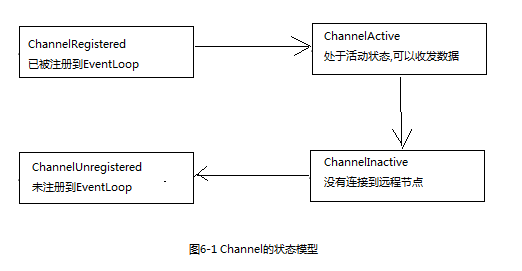
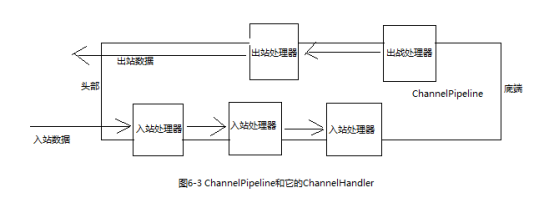

[TOC]


# 1 ChannelHandler

## 1.1 Channel的生命周期




## 1.2 ChannelHandler的生命周期

ChannelHandler的生命周期方法

|      类型       |                     描述                      |
| :-------------: | :-------------------------------------------: |
|  handlerAdded   | 当把ChannelHandler添加到ChannelPipeline时调用 |
| handlerRemoved  | 当从ChannelPipeline中移除ChannelHandler时调用 |
| exceptionCaught |               有错误产生时调用                |


## 1.3 ChannelInboundHandler接口

处理入站数据以及各种状态变化。

当某个ChannelInboundHandler的实现重写`channelRead()`方法时，要负责显式地释放与池化的ByteBuf相关的实例。

```
****** 代码清单6-1 释放消息资源 ******

public void channelRead(ChannelHandlerContext ctx, Object msg) throws Exception {
    try{
        //do something...
    }finally {
        //释放消息资源
        ReferenceCountUtil.release(msg);
    }
}
```


还有一种方式，可以不用显式的释放资源,那就是继承SimpleChannelInboundHandler，重写channelRead0方法。

```
****** 使用SimpleChannelInboundHandler ******

public class EchoClientHandler extends SimpleChannelInboundHandler<ByteBuf>{

    @Override
    public void channelRead0(ChannelHandlerContext channelHandlerContext, ByteBuf byteBuf) throws Exception {
        // 打印服务器发回的消息
        System.out.println("客户端接收到服务器返回的消息: " + byteBuf.toString(CharsetUtil.UTF_8));
    }

}
```


## 1.4 ChannelOutboundHandler接口

处理出站数据并且允许拦截所有的操作。

ChannelOutboundHandler的一个强大的功能时可以按需推迟操作或者事件，这使得可以通过一些复杂的方法来处理请求。

ChannelOutboundHandler中的大部分方法都需要一个ChannelPromise参数，以便在操作完成时得到通知。ChannelPromise是ChannelFuture的子类，定义了一些可写的方法，如`setSuccess()`和`setFailure()`，从而使ChannelFuture不可变。


## 1.5 ChannelHandler适配器

Netty提供了ChannelInboundHandlerAdapter和ChannelOutboundHandlerAdapter两个分别处理入站和出站数据和事件的适配器，它们提供了各自对应的ChannelHandler接口的实现，我们在自定义ChannelHandler实现时，只需继承适配器，然后重写我们感兴趣的事件方法即可。


## 1.6 资源管理

每当调用`ChannelInboundHandler.channelRead()`或者`ChannelOutboundHandler.write()`方法时，都需要确保没有任何的资源泄露。

当处理入站数据时，我们可以通过重写`SimpleChannelInboundHandler.channelRead0()`方法来实现资源的自动释放，但是在处理出站数据时却多了一个步骤。

```
******代码清单6-4 丢弃并释放出站消息 ******

public class EchoOutboundHandler extends ChannelOutboundHandlerAdapter {
    @Override
    public void write(ChannelHandlerContext ctx, Object msg, ChannelPromise promise) throws Exception {
        super.write(ctx, msg, promise);
        try{
            // do something...
        }finally {
            //释放资源
            ReferenceCountUtil.release(msg);
            //通知ChannelPromise数据已经被处理了
            promise.setSuccess();
        }
    }
}
```


# 2 ChannelPipeline接口

ChannelPipeline可以理解为一个拦截流经Channel的入站和出站事件的ChannelHandler链。

ChannelHandler和它的ChannelPipeline以及其他ChannelHandler的交互是通过ChannelHandlerContext实现的。




在ChannelPipeline传播事件时，它会检测下一个handler是否与事件的运动方向相匹配，不匹配则跳过并继续向下一个查找。


## 2.1 修改ChannelPipeline

ChannelPipeline支持动态的添加、替换、删除ChannelHandler。

通常ChannelPipeline中每个ChannelHandler都是通过它的EventLoop来处理事件，所以千万不要阻塞这个线程，否则将对后续和整体的i/o操作产生负面影响。当不得不处理阻塞API时，ChannelPipeline提供了一个参数为EventExecutorGroup的add方法，可以使用该方法，将事件传递给自定义的EventExecutorGroup。Netty为此提供了一个DefaultEventExecutorGroup的默认实现。


## 2.2 触发事件

ChannelPipeline本身也定义了丰富的API来响应入站和出站事件，可以查阅源代码或者javadoc查看，此处不做详细讲述。


# 3 ChannelHandlerContext接口

每当有ChannelHandler添加到ChannelPipeline中时，都会创建ChannelHandlerContext。

ChannelHandlerContext的主要功能是管理它所关联的ChannelHandler和在同一个ChannelPipeline中的其他ChannelHandler之间的交互。

事件从一个ChannelHandler传递到下一个ChannelHandler是由ChannelHandlerContext上的调用完成的。

ChannelHandlerContext中有一些方法在Channel和ChannelPipeline中也存在，但是其不同的地方在于，如果调用Channel和ChannelPipeline中的这些方法，它们将沿着整个ChannelPipeline进行传播；但是调用ChannelHandlerContext中的这些方法时，将从当前的ChannelHandler开始，只传播给下一个ChannelHandler。

ChannelHandlerContext和ChannelHandler的绑定是永远不会变的，因此可以缓存对它的引用。

ChannelHandlerContext能够产生更短的事件流，应该尽可能利用这个特性来获取最大的性能。


**高级用法**

1. 可以通过ChannelHandlerContext来获取ChannelPipeline，实现动态的修改ChannelPipeline。

2. 缓存到ChannelHandlerContext的引用。

```
******代码清单6-9 缓存到ChannelHandlerContext的引用 ******

public class WriteHandler extends ChannelHandlerAdapter {
    
    private ChannelHandlerContext ctx;

    @Override
    public void handlerAdded(ChannelHandlerContext ctx) throws Exception {
        this.ctx = ctx;
    }
    
    public void send(String msg){
        ctx.writeAndFlush(msg);
    }
}
```

3. 共享ChannelHandler
   一个ChannelHandler可以从属于多个ChannelPipeline，但是必须使用@Sharable注解，共享的ChannelHandler最好不要持有状态，否则需要考虑线程安全问题。

```
****** 代码清单6-10 可共享的ChannelHandler ******

@ChannelHandler.Sharable
public class SharableHandler extends ChannelInboundHandlerAdapter {
    @Override
    public void channelRead(ChannelHandlerContext ctx, Object msg) throws Exception {
        System.out.println(msg.toString());
        ctx.fireChannelRead(msg);
    }
}
```


# 4 异常处理

## 4.1 入站异常

如果在处理入站事件的过程中有异常抛出，那么它将从它在ChannelInboundHandler里被触发的那一点开始流经ChannelPipeline。

通常将异常处理的实现放在ChannelPipeline的最后，以保证所有的异常都能得到处理。

如果异常到达ChannelPipeline的尾端，它将会被记录为未处理。


## 4.2 出站异常

第一种方式：添加ChannelFutureListener到ChannelFuture

```
****** 代码清单6-13 添加ChannelFutureListener到ChannelFuture ******

ChannelFuture future = channel.write(msg);
future.addListener(new ChannelFutureListener() {
    public void operationComplete(ChannelFuture channelFuture) throws Exception {
        if(!channelFuture.isSuccess()){
            future.cause().printStackTrace();
            future.channel().close();
        }
    }
});
```


第二种方式：添加ChannelFutureListener到ChannelPromise

```
****** 代码清单6-14 添加ChannelFutureListener到ChannelPromise ******

public class EchoOutboundHandler extends ChannelOutboundHandlerAdapter {
    @Override
    public void write(ChannelHandlerContext ctx, Object msg, ChannelPromise promise) throws Exception {
        promise.addListener(new ChannelFutureListener() {
            public void operationComplete(ChannelFuture channelFuture) throws Exception {
                if(!channelFuture.isSuccess()){
                    channelFuture.cause().printStackTrace();
                    channelFuture.channel().close();
                }
            }
        });
    }
}
```


**一般情况下，推荐使用第一种**，因为在操作时调用更有针对性。而第二种方式更适合处理一般的或者普通的异常。