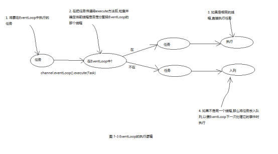
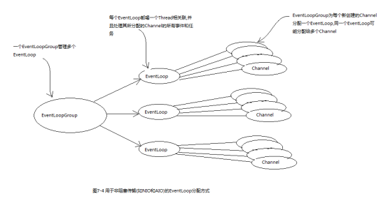
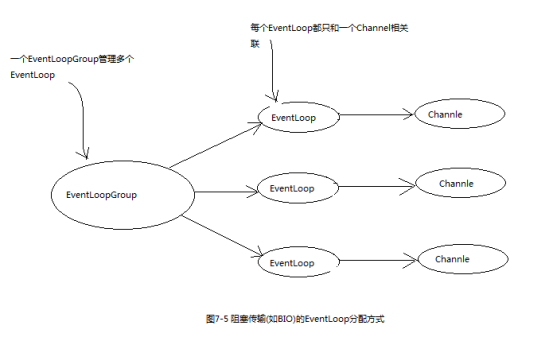

[TOC]


# 1 EventLoop接口

代码清单7-1说明了事件循环的基本思想

```
****** 代码清单7-1 在事件循环中执行任务 ******

while(!terminated){
    List<Runnable> readyEvents = blockUntilEventsReady();
    for(Runnable event:readyEvents){
        event.run();
    }
}
```

一个EcentLoop将有一个永远不会改变的Thread驱动，可以创建多个EcentLoop实例用以优化资源的使用，并且单个EcentLoop可能会被指派服务多个Channel。

事件和任务是以先进先出(FIFO)的顺序执行的。

在Netty4中，所有的I/O操作和事件都由已经被分配给了EcentLoop的那个Thread来处理。


# 2 任务调度

```
******代码清单7-3 使用EventLoop调度任务******

Channel channel = ...;
ScheduledFuture<?> future = channel.eventLoop().schedule(new Runnable() {
    public void run() {
        //...
    }
}, 60, TimeUnit.SECONDS);   //60s后执行任务
******代码清单7-4 使用EventLoop调度周期性的任务

Channel channel = ...;
ScheduledFuture<?> future = channel.eventLoop().scheduleAtFixedRate(new Runnable() {
    public void run() {
        //...
    }
}, 60, 60,TimeUnit.SECONDS);   //60s后执行任务,并且每隔60s执行一次
******代码清单7-5 使用ScheduleFuture取消任务******

Channel channel = ...;
ScheduledFuture<?> future = channel.eventLoop().scheduleAtFixedRate(...);   
// ...
boolean mayInterruptIfRunning = false;
future.cancel(mayInterruptIfRunning);
```


# 3 实现细节

## 3.1 线程管理

Netty线程模型的卓越性能取决于对于当前执行线程的身份的确认，也就是说，确定它是否是分配给当前channel以及它的EventLoop的那一个线程。

如果当前调用线程正是支撑EventLoop的线程，那么任务将直接执行。否则，EventLoop将调度该任务以便稍后执行，并将它放入到内部队列中。当EventLoop下次处理它的事件时，它会执行队列中的任务。

每个EventLoop都有它自己的任务队列，独立于其他的EventLoop。



永远不要将一个长时间运行的任务放入到执行队列中，因为它将阻塞需要在同一个线程上执行的其他任务。


## 3.2 EventLoop线程的分配

### 3.2.1 异步传输

一个EventLoop是可以被多个Channel共享的，所以Netty的异步传输只使用了少量的EventLoop便实现了目的。



因为一个EventLoop通常被用于支撑多个Channel，所以对于其所关联的所有Channel来说，ThreadLocal都将是一样的，在开发中要特别注意。


### 3.2.2 阻塞传输

