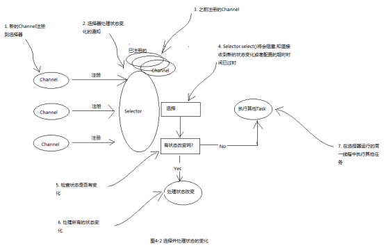
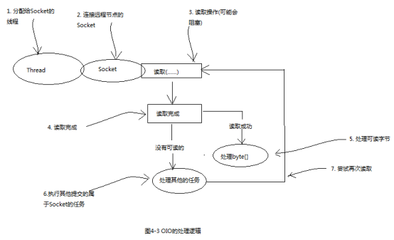

[TOC]


# 1 使用OIO和NIO 

Netty为它所有的传输实现提供了一个通用的api，使得在传输方式的转换上更加简单易用。


## 1.1 OIO传输

```
****** 代码清单4-3 使用Netty的阻塞网络处理 ******

public class NettyOioServer {
    
    public void server(int port) throws Exception{
        final ByteBuf buf = Unpooled.copiedBuffer("this is oio", CharsetUtil.UTF_8);
        // 创建OIO模式的EventLoopGroup
        EventLoopGroup group = new OioEventLoopGroup();
        try{
            ServerBootstrap b = new ServerBootstrap();
            b.group(group)
                    // 使用OIO模式的channel
                    .channel(OioServerSocketChannel.class)
                    .localAddress(new InetSocketAddress(port))
                    .childHandler(new ChannelInitializer<SocketChannel>() {
                        @Override
                        protected void initChannel(SocketChannel channel) throws Exception {
                            channel.pipeline().addLast(new ChannelInboundHandlerAdapter(){
                                @Override
                                public void channelActive(ChannelHandlerContext ctx) throws Exception {
                                    ctx.writeAndFlush(buf).addListener(ChannelFutureListener.CLOSE);
                                }
                            });
                        }
                    });
            ChannelFuture f = b.bind().sync();
            f.channel().closeFuture().sync();
        } finally {
            group.shutdownGracefully().sync();
        }
    }
    
}
```


## 1.2 NIO传输

```
****** 使用Netty的异步非阻塞网络处理 ******

public class NettyNioServer {

    public void server(int port) throws Exception{
        final ByteBuf buf = Unpooled.copiedBuffer("this is oio", CharsetUtil.UTF_8);
        // 创建NIO模式的EventLoopGroup
        EventLoopGroup group = new NioEventLoopGroup();
        try{
            ServerBootstrap b = new ServerBootstrap();
            b.group(group)
                    // 使用NIO模式的channel
                    .channel(NioServerSocketChannel.class)
                    .localAddress(new InetSocketAddress(port))
                    .childHandler(new ChannelInitializer<SocketChannel>() {
                        @Override
                        protected void initChannel(SocketChannel channel) throws Exception {
                            channel.pipeline().addLast(new ChannelInboundHandlerAdapter(){
                                @Override
                                public void channelActive(ChannelHandlerContext ctx) throws Exception {
                                    ctx.writeAndFlush(buf).addListener(ChannelFutureListener.CLOSE);
                                }
                            });
                        }
                    });
            ChannelFuture f = b.bind().sync();
            f.channel().closeFuture().sync();
        } finally {
            group.shutdownGracefully().sync();
        }
    }

}
```


# 2 传输API

传输API的核心是interface Channel，它被用于所有的I/O操作。

每个Channel都将会分配一个ChannelPipeline和ChannelConfig，ChannelConfig包含了该Channel的所有配置设置，并且支持热更新。

由于Channel是独一无二的，所以为了保证顺序将Channel声明为java.lang.Comparable的一个子接口。因此，如果两个不同的Channel实例都返回了相同的散列码，那么AbstractChannel中的compareTo方法的实现将会抛出一个Error。

ChannelPipeline持有所有将应用于入站和出站数据以及事件的ChannelHandler实例。

**ChannelHandler的典型用途包括：**

1. 将数据转换格式
2. 提供异常的通知
3. 提供Channel变为活动的或者非活动的通知
4. 提供Channel注册到EventLoop或者从EventLoop注销时的通知
5. 提供有关用户自定义事件的通知

可以根据需要通过添加或者删除ChannelHandler实例来修改ChannelPipeline，通过利用Netty的这项能力可以构建出高度灵活的应用程序。

除了访问所分配的ChannelPipeline和ChannelHandler之外，也可以利用Channel的其他方法，其中最重要的列举在下表中

|    方法名     |                             描述                             |
| :-----------: | :----------------------------------------------------------: |
|   eventLoop   |                 返回分配给Channel的EventLoop                 |
|   pipeline    |              返回分配给Channel的ChannelPipeline              |
|   isActive    |                如果Channel是活动的,则返回true                |
| localAddress  |                   返回本地的SocketAddress                    |
| remoteAddress |                   返回远程的SocketAddress                    |
|     write     | 将数据写到远程节点.这个数据将被传递给ChannelPipeline,并且排队直到它被冲刷 |
|     flush     |                将之前已写的数据冲刷到底层传输                |
| writeAndFlush |       一个简便的方法,等同于调用write()后再调用flush()        |


简单演示些数据并将其冲刷到远程节点这种常规任务。

```
****** 程序清单4-5 写出到Channel ******

Channel channel = ...;
//创建要写的数据
ByteBuf buf = Unpooled.copiedBuffer("your data", CharsetUtil.UTF_8);
//写入并冲刷
ChannelFuture future = channel.writeAndFlush(buf);
//添加动作完成后的监听器
future.addListener(new GenericFutureListener<Future<? super Void>>() {
    public void operationComplete(Future<? super Void> future) throws Exception {
        if(future.isSuccess()){
            //成功则打印
            System.out.println("write success!");
        }else{
            //失败则打印异常堆栈
            future.cause().printStackTrace();
        }
    }
});
```


Netty的Channel实现是线程安全的，因此你可以存储一个到Channel的引用，放心的在多线程环境中使用，并且消息将会被保证按顺序发送。

```
****** 代码清单4-6 从多线程使用同一个Channel ******

final Channel channel = ...;
//创建要写的数据
final ByteBuf buf = Unpooled.copiedBuffer("your data", CharsetUtil.UTF_8);
//创建写入并冲刷数据的Runnable
Runnable writer = new Runnable() {
    public void run() {
        channel.writeAndFlush(buf);
    }
};
//创建线程池
Executor executor = Executors.newCachedThreadPool();
//调用一个线程进行冲刷
executor.execute(writer);
//调用另一个线程进行冲刷
executor.execute(writer);
```


# 3 内置的传输

Netty内置了一些开箱即用的传输，下面我们将介绍5中传输方式：NIO、OIO、Epoll、Local、Embedded。


## 3.1 NIO

非阻塞IO。

NIO提供了一个所有I/O操作全异步的实现，它利用了JDK中nio系统的基于选择器的api。

选择器也就相当于一个注册表，可以请求在Channel的状态发生变化时得到通知。可能的状态变化有：

1. 新的Channel已被接受并且就绪
2. Channel连接已经完成
3. Channel有已经就绪的可供读取的数据
4. Channel可用于写数据

选择器运行在一个检查状态变化并对其作出响应的线程上，在应用程序对状态的改变做出响应之后，选择器将会被重置，并将重复这个过程。

下表列出了选择操作的位模式，这些位模式组合起来就定义了一组应用程序正在请求通知的状态变化集。

|    名称    |                       描述                        |
| :--------: | :-----------------------------------------------: |
| OP_ACCEPT  |      请求在接受新连接并创建Channel时获得通知      |
| OP_CONNECT |           请求在建立一个连接时获得通知            |
|  OP_READ   | 请求当数据已经就绪，可以从Channel中读取时获得通知 |
|  OP_WRITE  |     请求可以向Channel中写更多的数据时获得通知     |

对于所有Netty的传输实现都共有的用户级别API完全隐藏了这些NIO的实现细节，下图展示了该处理流程。




## 3.2 OIO

旧的阻塞IO。

Netty同样保留了对阻塞IO的支持。




## 3.3 Epoll

用于Linux的本地非阻塞传输。

Netty为Linux提供的一组NIO API，如果你的应用程序旨在运行与linux系统中，那么请考虑利用这个版本的传输，你将发现在高负载下它的性能要优于追JDK的NIO实现。

使用方法也很简单，使用EpollEventLoopGroup 和 EpollServerSocketChannel。


## 3.4 Local

用于JVM内部通信。

Netty提供了一个Local传输，用于在同一个JVM中运行的客户端和服务器程序之间的异步通信。

Local传输并不接受真正的网络流量，所以它不能和其他传输实现进行互操作。在同一JVM中，如果服务端或者客户端使用了Local方式，那么另一方也必须使用Local方式。


## 3.5 Embedded

Netty提供的一种额外的传输，可以将一组ChannelHandler作为帮助器类嵌入到其他的ChannelHandler内部，通过这种方式，可以扩展一个ChannelHandler的功能，同时不需要修改其内部代码。


# 4 用例

|         应用程序的需求         |          推荐的传输           |
| :----------------------------: | :---------------------------: |
| 非阻塞代码库或者一个常规的起点 | NIO（或者在Linux上使用epoll） |
|           阻塞代码库           |              OIO              |
|     在同一个JVM之间的通信      |             Local             |
|    测试ChannelHandler的实现    |           Embedded            |