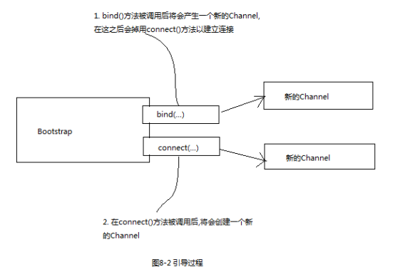
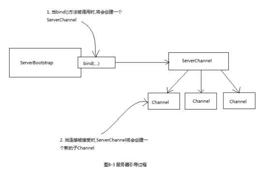
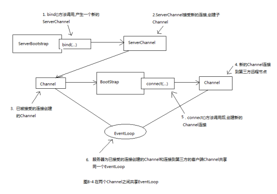

[TOC]

在一个已经配置完成的引导类实例上调用`clone()`方法将返回一个可以立即使用的引导类实例。

注意，这种方式只会创建引导类实例的EventLoopGroup的一个浅拷贝，这个EventLoopGroup将在多个Channel间共享，这是可以接受的，因为通常克隆的Channel的生命周期都很短暂，一般都只进行一次请求，如Http请求。


# 1 引导客户端



```
****** 代码清单8-1 引导一个客户端 ******

// 创建EventLoopGroup处理事件
EventLoopGroup group = new NioEventLoopGroup();
try{
    // 创建Bootstrap
    Bootstrap b = new Bootstrap();
    // 绑定EventLoopGroup
    b.group(group)
            // 指定Nio传输的Channel类型
            .channel(NioSocketChannel.class)
            // 设置服务器的地址
            .remoteAddress(new InetSocketAddress(host,port))
            // 添加事件处理类
            .handler(new HttpPipelineInitializer());
    // 连接到服务器,阻塞等待直到连接完成
    ChannelFuture future = b.connect().sync();
    // 阻塞,直到Channel关闭
    future.channel().closeFuture().sync();
} finally {
    // 释放资源
    group.shutdownGracefully().sync();
}
```


# 2 引导服务器



```
****** 代码清单8-2 引导一个服务器 ******

// 创建NioEventLoopGroup实例来进行事件的处理
EventLoopGroup group = new NioEventLoopGroup();
try{
    // 创建ServerBootstrap实例来引导和绑定服务器
    ServerBootstrap b = new ServerBootstrap();
    // 绑定EventLoopGroup
    b.group(group)
            // 指定所使用的Nio传输Channel
            .channel(NioServerSocketChannel.class)
            // 使用指定端口的套接字地址
            .localAddress(new InetSocketAddress(port))
            /** 使用EchoServerHandler的实例初始化每一个新的Channel
             * 详解: 当一个新的连接建立时,一个新的子Channel将会被创建,而ChannelInitializer会
             * 把一个你的EchoServerHandler实例添加到新Channel的ChannelPipeline中
             */
            .childHandler(new HttpPipelineInitializer());
    // 异步绑定服务器,调用sync()方法阻塞直到绑定完成
    ChannelFuture future = b.bind().sync();
    // 获取Channel的CloseFuture,并且阻塞当前线程直到它完成关闭操作
    future.channel().closeFuture().sync();
} finally {
    // 关闭EventLoopGroup,释放资源
    group.shutdownGracefully().sync();
}
```


# 3 兼容性

在Netty中，对于NIO和OIO两种传输方式，有其各自对应的EventLoopGroup和Channel实现，不可混用。


# 4 从Channel引导客户端

假如你的服务器在处理一个客户端的请求的同时，这个请求需要服务器作为第三方系统的客户端，这时，就需要在服务器引导一个新的客户端。

可以通过创建新的Bootstrap实例来实现，但是这样的话便需要创建新的EventLoop，也就会创建一个新的线程，这样在原客户端和新的客户端之间交换数据时便不可避免的发生上下文切换。

一种更好的解决方案是通过原客户端的Channel来引导新的客户端，两者共享同一个EventLoop，这样便避免了上下文切换的问题。



```
****** 代码清单8-5 从Channel引导客户端 ******

EventLoopGroup group = new NioEventLoopGroup();
try{
    ServerBootstrap b = new ServerBootstrap();
    b.group(group)
            .channel(NioServerSocketChannel.class)
            .localAddress(new InetSocketAddress(port))
            .childHandler(new ChannelInitializer<SocketChannel>() {
                protected void initChannel(SocketChannel channel) throws Exception {
                    channel.pipeline().addLast(new SimpleChannelInboundHandler<Object>() {
                        @Override
                        public void channelActive(ChannelHandlerContext ctx) throws Exception {
                            Bootstrap b = new Bootstrap();
                            b.channel(NioSocketChannel.class)
                                    .handler(new SimpleChannelInboundHandler<SocketChannel>() {
                                        protected void channelRead0(ChannelHandlerContext channelHandlerContext, SocketChannel channel) throws Exception {
                                            //处理消息
                                        }
                                    });
                            b.group(ctx.channel().eventLoop());
                            ChannelFuture future = b.connect(new InetSocketAddress("www.booklish.cn",8888)).sync();
                        }

                        protected void channelRead0(ChannelHandlerContext channelHandlerContext, Object o) throws Exception {
                            //处理消息
                        }
                    });
                }
            });
    ChannelFuture future = b.bind().sync();
    future.channel().closeFuture().sync();
} finally {
    group.shutdownGracefully().sync();
}
```

编写Netty应用的一个一般准则：尽可能的重用EventLoop，以减少线程创建带来的开销。


# 5 使用ChannelOption和属性

```
bootstrap.option(ChannelOption.CONNECT_TIMEOUT_MILLIS,30000)
 .option(ChannelOption.SO_KEEPALIVE,true);
```


# 6 引导DatagramChannel

前面的引导实例都是基于TCP协议，Bootstrap也可以被用于无连接的协议，Netty提供了各种DatagramChannel的实现。唯一的区别就是，不再调用connect方法，只调用bind方法。


```
******代码清单8-8 引导无连接协议 ******

Bootstrap b = new Bootstrap();
b.group(new OioEventLoopGroup())
        .channel(OioDatagramChannel.class)
        .handler(new SimpleChannelInboundHandler<SocketChannel>() {
            protected void channelRead0(ChannelHandlerContext channelHandlerContext, SocketChannel channel) throws Exception {
                //处理消息
            }
        });
ChannelFuture future1 = b.bind(new InetSocketAddress(0));
```