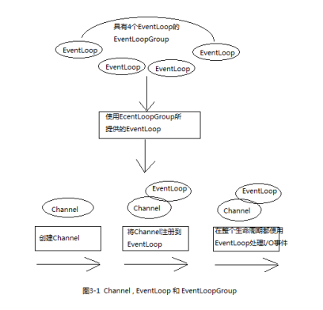
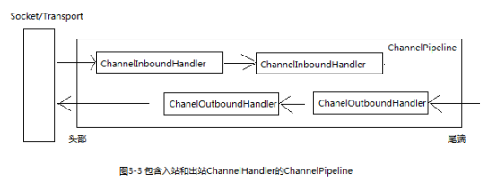
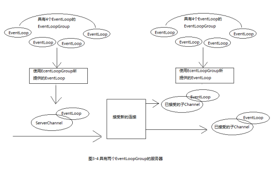

[TOC]

# 1 Channel、EventLoop、ChannelFuture 

Channel：Socket
EventLoop：控制流，多线程处理，并发
ChannelFuture：异步通知

## 1.1 Channel接口

基本的I/O操作（bind、connect、read、write）依赖于底层网络传输所提供的原语。

在基于java的网络编程中，其基本的构造是class Socket。Netty的Channel接口提供的api大大降低了直接使用socket类的复杂性。此外，Channel也有很多预定义的，专门化实现的广泛类层次结构的根，下面是一个简短的部分清单：EmbeddedChannel、LocalServerChannel、NioDatagramChannel、NioSocketChannel、NioSctpChannel。

## 1.2 EventLoop接口

EventLoop用于处理连接的生命周期中所发生的事件。

下图说明了Channel、EventLoop、Thread以及EventLoopGroup之间的关系。

这些关系描述为：

1. 一个EventLoopGroup包含一个或者多个EventLoop。
2. 一个EventLoop在它的生命周期内只和一个Thread绑定。
3. 所有由EventLoop处理的I/O事件都在它专有的Thread上被处理。
4. 一个Channel在它的生命周期内只注册一个于EventLoop（保证一个Channel上的所有操作都在一个线程中执行，消除了同步的顾虑）。
5. 一个EventLoop可能会被分配给多个Channel。

## 1.3 ChannelFuture

ChannelFuture用于在某个时间点确定结果，其`addListener()`方法可以注册一个ChannelFutureListener，以便在某个操作完成时（无论成功与否）得到通知。

# 2 ChannelHandler、ChannelPipeline

## 2.1 ChannelHandler接口

ChannelHandler充当了所有处理入站和出站数据的应用程序逻辑的容器，可专门用于几乎任何类型的动作。

例如，ChannelInboundHandler是一个会经常用到的子接口，这种类型的ChannelHandler接收入站事件和数据，这些数据随后将会被你的应用程序的业务逻辑所处理。

## 2.2 ChannelPipeline接口

ChannelPipeline提供了ChannelHandler链的容器，并定义了用于在该链上传播入站和出站事件流的API。当Channel被创建时，它会被自动地分配到它专属的ChannelPipeline。

ChannelHandler安装到ChannelPipeline中的过程如下：

1. 一个ChannelInitializer的实现被注册到了ServerBootstrap中。
2. 当`ChannelInitializer.initChannel()`方法被调用时，ChannelInitializer将在ChannelPipeline中安装一组自定义的ChannelHandler。
3. ChannelInitializer将它自己从ChannelPipeline中移除

使得事件流经ChannelPipeline是ChannelHandler的工作，它们是在应用程序初始化或者引导阶段被安装的。这些对象接收事件，执行它们所实现的处理逻辑，并将数据传递给链中的下一个ChannelHandler。它们的执行顺序是由它们被添加的顺序决定的，实际上，ChannelPipeline指的就是这些ChannelHandler的编排顺序。

下图说明了一个Netty应用程序中入站和出站数据流之间的区别。从一个客户端应用程序的角度看，如果事件的运动方向是从客户端到服务器，那么称这些事件是出站的，反之则为入站。

上图也显示了入站和出站ChannelHandler可以被安装在同一个ChannelPipeline中。如果一个消息或者任何其他的入站事件被读取，那么它会从ChannelPipeline的头部开始流动，并在ChannelInboundHandler之间传递，最终，数据到达ChannelPipeline的尾端，这时，所有的处理就都结束了。

数据的出站运动中，数据将从ChannelOutboundHandler链的尾端开始流动，直到到达链的头部位置，在这之后，数据将会到达网络传输层，然后传输出去。

在Netty中，有两种发送消息的方式，一种是直接写到Channel中，另一种是写到和ChannelHandler相关联的ChannelHandlerContext中。第一种方式将导致消息从ChannelPipeline的尾端开始流动，第二种方式将导致消息从ChannelPipeline的下一个ChannelHandler开始流动。

## 2.3 常用的ChannelHandler适配器类

ChannelHandlerAdapter、ChannelInboundHandlerAdapter、ChannelOutboundHandlerAdapter、ChannelDuplexHandler

## 2.4 编码器和解码器

所有由Netty提供的编码器/解码器适配类都实现了ChannelInboundHandler或者ChannelOutboundHandler接口。

对于每个从入站Channel读取的消息，在`channelRead()`方法被调用后，将调用由预置解码器所提供的`decode()`方法，并将已解码的字节转发给ChannelPipeline中的下一个ChannelInboundHandler。

出站消息的模式是相反方向的，编码器将消息转换为字节，并将它们转发给下一个ChannelOutboundHandler。

## 2.5 抽象类SimpleChannelInboundHandler

最常见的情况是，你的应用程序会利用一个ChannelHandler来接收解码消息，并对该数据应用业务逻辑。要创建一个这样的ChannelHandler，你只需要扩展SimpleChannelInboundHandler<T>，其中T是你想要处理的消息的java类型。

# 3 引导

Netty中有两种类型的引导：

1. 用于客户端（Bootstrap）

   引导一个客户端只需要一个EventLoopGroup。

2. 用于服务器（ServerBootstrap）
   引导一个服务器需要两个EventLoopGroup，这是因为服务器需要两组不同的Channel，第一组将只包含一个ServerChannel，代表服务器自身的已绑定到某个本地端口的正在监听的套接字；而第二组将包含所有已创建的用来处理传入客户端连接（对于每个服务器已经接受的连接都有一个）的Channel。

与ServerChannel相关联的EventLoopGroup将分配一个负责为传入连接请求创建Channel的EventLoop。一旦连接被接受，第二个EventLoopGroup就会给它的Channel分配一个EventLoop。